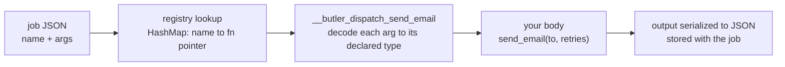
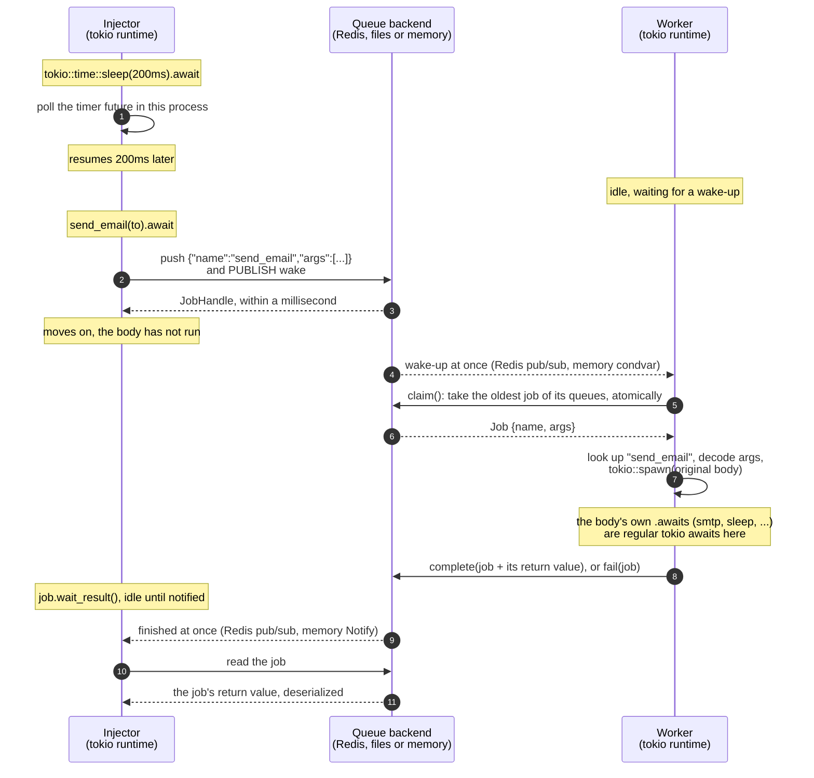
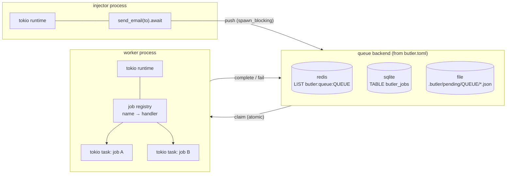
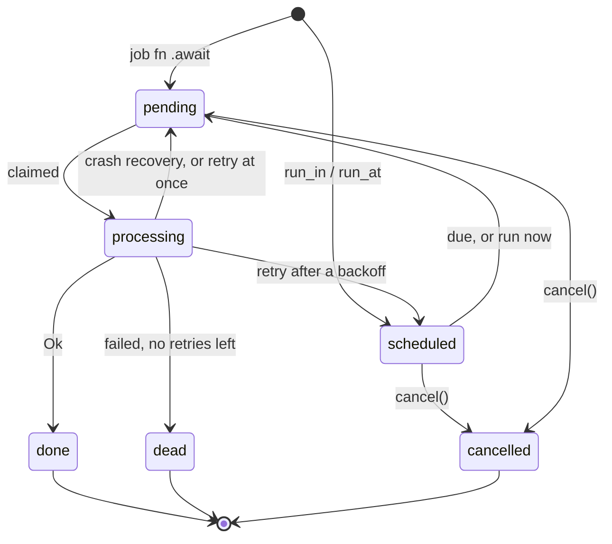

# butler

**Call it like an async function. Run it as a durable background job.**

```rust
let call: JobCall<Report> = generate_report(user_id); // nothing happened yet
let job: JobHandle<Report> = call.await?;             // saved to a queue; a worker runs it
let report: Option<Report> = job.result().await?;     // typed result, once it's done
```

**Calling a job does nothing. Awaiting it enqueues.** `#[butler::job]` makes
`generate_report` return a `JobCall<Report>`: its arguments, already
serialized. `JobCall` implements
[`IntoFuture`](https://doc.rust-lang.org/std/future/trait.IntoFuture.html), so
`.await` saves the job to a queue and returns a `JobHandle<Report>`. A worker
executes it independently—even after the calling process exits. Use Redis,
SQLite, or files to persist the work across process restarts. To run the body
here instead, `generate_report(user_id).now().await?` returns the `Report`
itself.

**Async I/O or blocking work. Same enqueue call.** Add `#[butler::job]` to
your function; its body stays ordinary Rust:

```rust
#[butler::job]
async fn generate_report(user_id: u64) -> Result<Report, ReportError> {
    reports::generate(user_id).await // async I/O: worker's Tokio task
}

#[butler::job]
fn render_report(report: Report) -> Result<Vec<u8>, RenderError> {
    reports::render(report)          // blocking work: worker's Tokio blocking pool
}
```

Both enqueue with `.await`: `generate_report(user_id).await?` and
`render_report(report).await?`. Neither runs the body in the caller. With a
Tokio worker, `async fn` jobs run as async tasks; plain `fn` jobs run through
`spawn_blocking`, keeping synchronous I/O and CPU-heavy work off the async
executor threads.

`job.result().await?` checks for a completed result; it returns `None` if there
is no successful result yet. To wait for completion and receive the report
or a job failure:

```rust
let report: Report = job.wait_result(Duration::from_millis(100)).await?;
```

The duration is a fallback check interval, not a timeout. These snippets assume
an async caller, a configured queue, and a running worker; `Report`, the error
types, and the `reports` module belong to your application. See
[Defining jobs](#defining-jobs) for serialization requirements.

[Run the demo](#running-the-demo) · [How it works](#two-kinds-of-await) ·
[Web dashboard](#web-dashboard)

## Features

- **Typed calls and results.** Ordinary Rust functions, borrow-friendly
  arguments, `Send + 'static` job calls, and `JobHandle<T>` results. Run a job
  in place with `.now()` when you need its output right away.
- **Durable queues.** Redis for workers across servers, SQLite or files for
  local processes, and an in-memory backend for tests and single-process apps.
- **Recovery and retries.** Worker heartbeats recover abandoned jobs; failed
  attempts retry with exponential, polynomial or fixed backoff and jitter, per
  job or per error, then remain visible for inspection.
- **Middleware.** Layers around every job run and every enqueue, with job
  metadata, vetoes, a tracing span per run, and an `on_dead` hook for alerts.
- **Scheduled jobs.** Run a job in five minutes or at 03:00 with
  `prepare(..)?.run_in(..)` or `.run_at(..)`, and cancel it while it waits.
- **Recurring jobs.** Cron schedules in `butler.toml` or code, in UTC or a
  named time zone, enqueued exactly once per tick however many workers run.
- **Resumable work.** Typed checkpoints let long jobs continue after a deploy,
  crash, or failed attempt.
- **Controlled concurrency.** Named queues, strict or weighted priority,
  per-queue limits per worker or across all workers, per-key limits across
  workers ("one sync per account"), unique jobs, and bulk enqueueing. Async jobs run as Tokio tasks;
  synchronous jobs use its blocking pool. A thread worker also runs without Tokio.
- **Built-in visibility.** A live web dashboard for throughput, workers,
  queues, job details, scheduled and recurring jobs, retry/cancel/discard/run-now
  actions, and pausing or resuming a queue.

Delivery is **at least once**: jobs must be safe to repeat, including work done
since the last saved checkpoint. Durable backends recover work after worker
crashes; storage durability still depends on the backend's configuration.

## Contents

- [Features](#features)
- [Why butler](#why-butler)
- [Rust at the core](#rust-at-the-core)
- [Performance](#performance)
- [Web dashboard](#web-dashboard)
- [Two kinds of `.await`](#two-kinds-of-await)
  - [How Rust tells them apart](#how-rust-tells-them-apart)
  - [How a worker finds your function](#how-a-worker-finds-your-function)
- [Architecture](#architecture)
  - [Job states are types](#job-states-are-types)
- [Running the demo](#running-the-demo)
- [Usage](#usage)
  - [Defining jobs](#defining-jobs)
  - [Working with an enqueued job](#working-with-an-enqueued-job)
  - [Running a job now](#running-a-job-now)
  - [Bulk enqueuing](#bulk-enqueuing)
  - [Scheduling jobs](#scheduling-jobs)
  - [Recurring jobs](#recurring-jobs)
  - [Retries and backoff](#retries-and-backoff)
  - [Results](#results)
  - [Keeping finished jobs](#keeping-finished-jobs)
  - [Running a worker](#running-a-worker)
  - [Middleware](#middleware)
  - [Job continuations](#job-continuations)
  - [Testing](#testing)
  - [Queues and priority](#queues-and-priority)
  - [Concurrency and cores](#concurrency-and-cores)
  - [Per-key concurrency and unique jobs](#per-key-concurrency-and-unique-jobs)
- [Configuration](#configuration)
- [Cargo features](#cargo-features)
- [Backends](#backends)
  - [Crashed workers don't lose jobs](#crashed-workers-dont-lose-jobs)
  - [File](#file)
  - [Redis](#redis)
  - [SQLite](#sqlite)
  - [Memory](#memory)
- [Limitations](#limitations)
- [Layout](#layout)
- [Development](#development)

## Why butler

Use butler when work needs to outlive a request or run in another process:
email delivery, report generation, image processing, imports, and other work
you want to retry and inspect independently of the caller.

**Separate accepting work from doing it.** A web request can enqueue an email
instead of waiting for SMTP. Workers can run on the same machine or, with
Redis, on other servers. Add workers as the queue grows and route jobs using
[named queues and priorities](#queues-and-priority).

**Recover after a worker stops.** Claims live in the backend under a worker's
identity. An independent heartbeat keeps long-running jobs from looking
abandoned; expired heartbeats let another worker requeue them. On graceful
shutdown, workers stop claiming new jobs and wait for active jobs, up to a
`shutdown_timeout`, while checkpointed jobs can yield and resume later. The test suite exercises
recovery with real worker processes that abort mid-job.

**Keep the Rust API across the queue boundary.** The macro generates argument
conversion, serialization, and dispatch. Callers use a regular function
signature; workers deserialize into the same types. Results come back through
a typed handle, and failures retain their diagnostic error chain. No job
struct or hand-built JSON payload is required.

**Control load and see failures.** Per-queue concurrency limits protect
downstream services. Bulk enqueueing reduces storage round trips. Failed jobs
retry up to `max_retries` times, then remain in the dead queue for inspection
and manual retry through the [dashboard](#web-dashboard).

If you know Sidekiq or ActiveJob, the enqueue/worker model will feel familiar.
Butler expresses it through Rust functions, typed results and progress, with a
choice of storage backends. It uses its own job format and workers.

## Rust at the core

Background jobs cross a process boundary. Butler combines compile-time checks
at the call site with typed deserialization in the worker; persisted data is
still validated at runtime.

- **The enqueue call is type-checked.** `#[butler::job]` generates a real
  function with your parameter types, so a wrong argument type or count is a
  compile error, not a runtime surprise in the worker. Parameters take
  `impl JobArg<T>`, so `&str`, `&Path` and `&[T]` work where the job wants
  `String`, `PathBuf` and `Vec<T>`, yet `3` still infers as `u32`
  ([why not `Into<T>`](#defining-jobs)).
- **Results are typed.** A job returning `Result<Sum, MathError>` enqueues as a
  `JobHandle<Sum>`, and `handle.wait_result(..).await?` gives you a `Sum` back,
  deserialized from whatever the worker stored.
- **Job states are types.** `Job<Pending>`, `Job<Processing>`, `Job<Done>`, ...
  are zero-sized-marker typestates behind a sealed trait. Only a claim creates
  a `Job<Processing>`; `complete` and `fail` take it by value, so a job can't be
  finished twice, and only a `Job<Done>` has an `.output()`. Doc tests check
  that the wrong transitions don't compile.
- **Early validation.** An invalid queue name in `#[job(queue = "...")]` or
  a job output that isn't `Serialize` fails at compile time. Duplicate job
  names are rejected when the worker is constructed.
- **Calls you can move around.** A job call is `Send + 'static` whatever you
  pass it: arguments are converted and serialized during the call, so it never
  borrows them. Store it, race it, or hand `.enqueue()` to `tokio::spawn`.
- **Errors without anyhow.** The library's errors are `thiserror` enums
  (`butler::Error`, `butler::JobError`) you can match on. Jobs return any error
  that converts into `Box<dyn Error + Send + Sync>`: your own enum, `io::Error`,
  a `String`, or `anyhow::Error` if your app uses it. The whole source chain is
  kept in the job's `last_error`.
- **Runtime-agnostic core, tokio when you want it.** Enqueueing and the thread
  worker need no runtime; the `tokio` feature adds `run_async`. Under tokio,
  waiting for a result `await`s a `tokio::sync::Notify` instead of holding a
  thread, so thousands of handles can wait at once.
- **Safe and strict.** `unsafe_code` is denied workspace-wide, and so are
  `unwrap()` and `expect()` outside tests. Clippy checks all features, no
  defaults, and each feature individually. Backends share one contract test suite.

## Performance

Queueing adds serialization and storage overhead compared with a direct call.
Workers make progress concurrently: Tokio tasks overlap I/O, and synchronous
jobs use the blocking pool for CPU-bound work.

The following measurements were recorded on a 16-CPU machine with `just bench`,
in one process using the in-memory backend. They illustrate worker concurrency,
not durable-backend throughput or a comparison with another job library:

- 2,000 async jobs that each wait 50 ms finished in 117 ms (about 17,000
  jobs/s); one at a time they would take 100 s, so **about 850× faster**.
- **100,000 async jobs that each wait 1 s, all allowed to run at once,
  finished in 1.88 s** (about 53,000 jobs/s, 430 MB peak memory); one at a
  time they would take 28 hours.
- 32 CPU-bound jobs took 2.80 s at concurrency 1 and 217 ms at concurrency 16,
  **12.9× faster**.

Async jobs are tokio tasks, so thousands can wait at once on a few threads.
CPU-bound jobs are plain `fn`s that run on tokio's blocking pool, one core
each. See [Concurrency and cores](#concurrency-and-cores) for tuning.

## Web dashboard

`butler-web` shows live counts streamed over server-sent events, throughput and
duration charts, queues with their pending and running jobs, workers, and job
details. Retry or discard failed
jobs, cancel pending work, run scheduled jobs now, pause and resume queues,
see each recurring schedule's next and last run, and inspect arguments,
results, errors, and saved progress from one place.


| Dead jobs, retry or discard | One job: arguments, error chain, actions |
|---|---|
|  |  |

```sh
just web        # or: cargo run -p butler-web   ->  http://127.0.0.1:9090
```

It reads the same `butler.toml` as the workers, so it sees whichever backend
they use. To embed it in your own axum app, behind your own authentication:
`butler_web::Dashboard::new(queue).base_path("/admin/jobs").router()`. It has
a light theme too, and history for Redis, SQLite and memory (the file backend
keeps none). See [crates/butler-web](crates/butler-web/README.md) for pages,
security, and how it's built.

## Two kinds of `.await`

In the demo injector's loop, ordinary Tokio futures and Butler enqueue
futures use the same syntax:

```rust
tokio::time::sleep(Duration::from_millis(200)).await;          // (1) async/await
let job = demo::process_tick(tick, now_ms(), pid).await?;      // (2) enqueue a job
let report: Option<demo::TickReport> = job.result().await?;   // (3) check the result
```

1. **Regular async/await.** The future runs right here, in this process, on the
   tokio runtime. The line finishes once the 200ms have passed.
2. **Enqueuing a butler job.** Calling the function converts and serializes
   its arguments into a `JobCall`; awaiting it writes the job to the queue
   and returns a typed handle. It doesn't wait for the job body to run. A
   worker picks up the job, possibly on another machine and possibly later.
3. **Reading the result.** `job.result().await?` asks the backend for the
   worker's result. It returns `Some(report)` once the job succeeds, or `None`
   while pending or running, or if it failed or was cancelled. Use
   `job.wait_result(interval).await?` to wait and distinguish success from
   failure or cancellation.

A `JobCall` turns into an ordinary Rust future when awaited (it implements
`IntoFuture`), so enqueue calls also work with `tokio::join!`; for
`tokio::spawn`, which takes a `Future`, pass `send_email(..).enqueue()`. That
composes the enqueue operations in the caller; the job bodies still execute
independently in workers. To run a body here instead, and get its output, use
[`.now()`](#running-a-job-now).

### How Rust tells them apart

It doesn't. For Rust, `.await` always means the same thing: poll this future
until it is ready. `.await` never talks to tokio directly. It only polls the
future in front of it. What happens depends entirely on which function you
called, and that is fixed at compile time.

The `#[butler::job]` macro rewrites the function you wrote. Given

```rust
#[butler::job(queue = "mailers")]
async fn send_email(to: String, retries: u32) -> Result<MessageId, MailError> {
    smtp::send(&to).await
}
```

the compiler sees roughly:

```rust
// 1. What callers get: a function that only builds the call. Each argument is
//    converted (`&str` -> `String`) and serialized right away. Awaiting the
//    `JobCall` writes the job to the queue; `.now()` runs (3) in place. Its
//    output type is computed from the job's return type: `Result<MessageId, _>`
//    gives a `JobHandle<MessageId>` when awaited, a `MessageId` from `.now()`.
pub fn send_email(to: impl JobArg<String>, retries: impl JobArg<u32>) -> JobCall<MessageId> {
    let to: String = to.into_arg();
    let retries: u32 = retries.into_arg();
    butler::__private::call(&send_email::JOB, [to_value(&to), to_value(&retries)])
}

// 2. Your original body, under a hidden name. Only the worker calls it.
async fn __butler_perform_send_email(to: String, retries: u32) -> Result<MessageId, MailError> {
    smtp::send(&to).await
}

// 3. The worker's entry point: JSON in, JSON out. Each argument is decoded
//    into exactly the type you declared; a mismatch is a JobError, not a panic.
fn __butler_dispatch_send_email(args: Vec<Value>) -> BoxFuture {
    Box::pin(async move {
        let mut args = args.into_iter();
        let to: String = butler::__private::arg(&mut args, "send_email", 0)?;
        let retries: u32 = butler::__private::arg(&mut args, "send_email", 1)?;
        butler::__private::output(__butler_perform_send_email(to, retries).await)
    })
}

// 4. The job's descriptor, and its registration: name, queue, entry point.
pub mod send_email {
    pub const JOB: butler::JobDef = butler::JobDef {
        name: "send_email",
        queue: "mailers",
        perform: super::__butler_dispatch_send_email,
    };
}
inventory::submit! { send_email::JOB }
```

So `send_email(...).await` in your app resolves to (1). The worker never calls
`send_email`: it runs (3), which decodes the arguments and runs your original
body (2). `send_email(...).now()` runs (3) too, in your process. A function and a module can share the name `send_email` because Rust
keeps values and types in separate namespaces.

The enqueue itself is `JobCall`'s `IntoFuture` implementation. `.await` calls
`into_future()` on whatever it is given; for a `JobCall`, that future writes the
job:

```rust
impl<T: DeserializeOwned + Send + 'static> IntoFuture for JobCall<T> {
    type Output = Result<JobHandle<T>, butler::Error>;
    type IntoFuture = Enqueueing<T>;

    fn into_future(self) -> Enqueueing<T> {
        self.enqueue() // push to the backend; under tokio, on the blocking pool
    }
}
```

`T` is the job's success type, taken from its return type:
`Result<Report, ReportError>` gives a `JobCall<Report>` and a
`JobHandle<Report>`, and `()` gives a `JobHandle<()>`. The error type is not
part of `T`: a failed job reports a `JobError` through the handle. Whatever
executor polls the caller drives the enqueue, whether that is tokio, another
runtime, or `butler::block_on`.

The return type also shows the difference. The enqueue returns
`Result<JobHandle<MessageId>, butler::Error>`, not your function's
`Result<MessageId, MailError>`, so code that expects the job's result won't
compile. You can't accidentally treat a queued job as work that has already
run; the result comes back through the handle (see [Results](#results)).

### How a worker finds your function

The queue holds JSON: `{"name": "send_email", "args": ["ada@example.com", 3], ...}`.
Turning that back into a call takes three steps, all of them set up at compile
time or startup, none per job:



1. **Registration, at link time.** `inventory::submit!` puts each job's `JobDef`
   in a linker section, so every `#[job]` compiled into the binary is found
   without a central list. `Worker::new` collects them into a
   `HashMap<&'static str, fn(Vec<Value>) -> BoxFuture>`, and panics if two jobs
   share a name. Jobs from a library crate can be added explicitly with
   `.register(my_crate::send_email::JOB)`.
2. **Lookup, per job.** One hash lookup by name gives a plain function pointer;
   no reflection, no string matching beyond that lookup. An unknown name (a job from a newer
   release, say) becomes `JobError::UnknownJob`, which retries and then dies
   like any failure instead of crashing the worker.
3. **Decoding, by the job's own code.** The dispatch function was generated
   next to your function, from its signature, so it decodes argument `i` into
   exactly the type of parameter `i` with serde. A payload of the wrong shape is
   `JobError::BadArgument`, naming the job and the argument.

**Why not one generated enum?** A `#[job]` macro only sees the one function it
is attached to, so no macro can see every job in a program, least of all jobs
defined in other crates, to build a single `enum Job { SendEmail(String, u32), ... }`.
It would need a separate macro listing every job by hand, and a new job
anywhere would change that enum. The name-to-function table gets the same
guarantees where they matter: arguments are checked against the real types at
compile time on the enqueue side, and decoded into the real types on the
worker side. It also degrades gracefully across versions: an enqueuer and a
worker built from different releases still agree job by job, where a
serialized enum's variants would have to match exactly.



Inside the worker, the job body is ordinary async code. Its `.await`s are
regular tokio awaits on the worker's runtime, like (1) above: timers, HTTP
clients, database pools all work. If the body calls another `#[butler::job]`
function, that call enqueues a new job.

## Architecture



Each job moves through these states:



### Job states are types

The same states exist in Rust's type system, so each one only offers what
makes sense for it. A job's type is `Job<S>`, with `S` one of
`butler::state::{Pending, Scheduled, Processing, Done, Dead, Cancelled}`. A
`Job<Scheduled>` has a `run_at()`:

```rust
// Only claim creates a Job<Processing>.
let job: Job<Processing> = queue.claim(worker, &["default"], wait)?.unwrap();

// Completing consumes it and returns a Job<Done>, the only state with an output.
let done: Job<Done> = queue.complete(worker, job, output)?;
let value: u32 = done.output()?;

// Failing a (different) claimed job consumes it too: it comes back as a
// Job<Pending> to retry at once, a Job<Scheduled> waiting out its backoff, or
// a Job<Dead> once it is out of retries.
match queue.fail(worker, other_job, error, RetryPolicy::new(3, Backoff::Exponential))? {
    Failed::Retry(pending) => println!("retrying after {:?}", pending.last_error()),
    Failed::Scheduled(waiting) => println!("next attempt at {:?}", waiting.run_at()),
    Failed::Dead(dead) => println!("gave up: {}", dead.error()),
}
```

These don't compile (the crate's doc tests check it):

```rust
queue.complete(worker, pending_job, output);  // Job<Pending>: never claimed
queue.complete(worker, job, output);          // twice: the first call took `job`
processing_job.output::<u32>();               // no output until it is Done
```

A job read back from a backend is an `AnyJob`, because its state is only known
when it is read; `match` on it to get the typed `Job`. `handle.job()` returns
one. Cancelling stays a runtime check (`handle.cancel()` returns `false` when
it is too late), because a pending job can be claimed by a worker at any
moment: a `Job<Pending>` value can't promise it is still pending.

## Running the demo

`examples/demo/` has two binaries that share one job (`demo::process_tick`). The
injector enqueues a job every second from a tokio main loop. The worker runs
the jobs in its own tokio main loop, up to 4 at a time. Each job sleeps
1.5s on the tokio timer and returns a `TickReport`, which the injector prints
when it comes back. Every 7th job fails on purpose so you can see a retry,
then a dead job, then the injector receiving the failure.

```sh
# Redis backend (what butler.toml selects):
docker run -d --rm --name butler-redis -p 6379:6379 redis:8-alpine

cargo run -p demo --bin worker      # terminal 1
cargo run -p demo --bin injector    # terminal 2

# The same, on the file backend with no Redis:
BUTLER_QUEUE__BACKEND=file cargo run -p demo --bin worker
BUTLER_QUEUE__BACKEND=file cargo run -p demo --bin injector
```

Run both from the repository root, so they read the same `butler.toml`. Press
Ctrl-C in the worker to stop it. It stops taking jobs and waits for the ones
already running to finish.

## Usage

### Installing

The crate is published as `butler-jobs` (the name `butler` was taken on
crates.io); its library is still `butler`, so code reads `butler::job`:

```toml
[dependencies]
butler = { package = "butler-jobs", version = "0.1" }
```

Plain `butler-jobs = "0.1"` works too, and is still imported as `butler`.

### Defining jobs

```rust
#[butler::job]
pub async fn resize_image(path: String, width: u32) -> Result<(), ImageError> { ... }

#[butler::job(name = "billing.charge")]      // stable name, survives renames
pub async fn charge(customer_id: u64, cents: i64) { ... }

#[butler::job(queue = "mailers")]             // route to a named queue
pub async fn send_digest(user_id: u64) { ... }

#[butler::job(retries = 10, backoff = "polynomial")]  // its own retry policy
pub async fn sync_crm(account_id: u64) -> Result<(), CrmError> { ... }

#[butler::job(max_resumptions = 10)]         // with a Progress: see "Job continuations"
pub async fn import(id: u64, progress: Progress<Step>) -> Result<(), ImportError> { ... }

#[butler::job(concurrency_key = "account_id", limit = 1)]  // one per account at a time
pub async fn sync_account(account_id: u64, full: bool) { ... }

#[butler::job(unique = "until_started")]      // one waiting at a time, per arguments
pub async fn refresh_feed(user_id: u64) { ... }

#[butler::job]                                // a plain fn: CPU-bound work
pub fn thumbnail(path: PathBuf) -> Result<Vec<u8>, ImageError> { ... }
```

- Parameters must be owned types that serde can serialize and deserialize
  (`String`, not `&str`). They are stored as JSON.
- Callers don't have to pass owned values, though. Each parameter of type `T`
  accepts anything implementing `butler::JobArg<T>`: `T` itself, `&T` for any
  `T: Clone`, plus these conversions:

  | Parameter | Also accepts |
  |---|---|
  | `String` | `&str`, `Cow<str>`, `Box<str>` |
  | `PathBuf` | `&Path`, `&str` |
  | `Vec<T>` | `&[T]` |

  So `send_email("ada@example.com", "Welcome", 3)` works for
  `send_email(to: String, subject: String, retries: u32)`. This is narrower than
  `Into<T>` on purpose: with `impl Into<u32>`, a bare `3` doesn't compile. It
  also means `"text".into()` at a call site is now ambiguous; drop the `.into()`.
- The arguments are converted and serialized when you call the function, so the
  returned `JobCall` is `Send + 'static` and never borrows them, and so are the
  futures it becomes. `tokio::spawn(send_email(..).enqueue())` works.
- The function may return `()`, or `Result<T, E>` where `T` can be serialized
  and `E` is any error: your own `thiserror` enum, `std::io::Error`, a `String`
  message, or anything else that converts into `butler::BoxError`
  (`Box<dyn Error + Send + Sync>`). butler doesn't depend on anyhow, but an app
  that uses it can return `anyhow::Result<T>` too. The worker stores `T` as the
  job's result. An `Err` or a panic counts as a failure and triggers a retry
  (see [Retries and backoff](#retries-and-backoff)).
  The error's message and its whole source chain are saved as the job's
  `last_error`, as `outer: inner: root`.
- An `async fn` job runs as its own task on the worker's tokio runtime. A plain
  `fn` job runs on tokio's blocking thread pool, so CPU-heavy or blocking work
  never stalls the async threads. Either way, the body must be `Send`.

### Working with an enqueued job

Awaiting a job function returns a `JobHandle<T>`, where `T` is what the job
returns. Its methods ask the backend for the job's current status, so they
work from any process:

```rust
let job = send_email("ada@example.com", "Welcome").await?;

job.id();                                   // store it; queue.handle(id) rebuilds the handle
job.state().await?;                         // Some(Pending | Scheduled | Processing | Done | Dead | Cancelled)
job.job().await?;                           // the stored record: args, attempts, last_error, result
job.cancel().await?;                        // true if removed before any worker claimed it
job.wait(Duration::from_millis(100)).await?; // poll until Done, Dead or Cancelled
job.result().await?;                        // Some(T) once done, None before
job.wait_result(Duration::from_millis(100)).await?; // T, or the failure
```

### Running a job now

Sometimes the caller needs the job's work done before it continues: a
command-line tool, a request that can't return without it, a job that runs
another as one of its steps. `.now()` runs the body right here, like
ActiveJob's `perform_now`, and returns its real output:

```rust
let id: MessageId = send_email("ada@example.com", "Welcome").now().await?;

// Prepared jobs too; their queue and run time are ignored.
let id = send_email::prepare("ada@example.com", "Welcome")?.now().await?;
```

- Nothing is enqueued and no worker is involved. The arguments still go
  through JSON and the job's generated code, exactly as on a worker.
- It runs once. There are no retries, no backoff and no scheduling: the
  result is `Result<T, butler::JobError>`, and a failure is
  `JobError::Failed` holding the job's own error
  (`failure.into_inner().downcast::<MailError>()`).
- A plain `fn` job runs on tokio's blocking pool inside a runtime, as on a
  worker, and in place without one: `butler::block_on(job(..).now())` works in
  a program with no runtime. A panic in it comes back as `JobError::Panicked`.
  An `async fn` job runs in your task, so a panic in it propagates, like any
  function call.
- A `Progress` starts from its default; checkpoints are neither saved nor
  interrupted. A step that calls `progress.requeue(..)` resumes at once.

### Bulk enqueuing

Build the jobs first, then enqueue them all at once. Every `#[job]` also gets
a `prepare` function, with the same type-checked arguments, that builds the
job without enqueueing it:

```rust
let emails = users
    .iter()
    .map(|user| send_email::prepare(&user.email, "Welcome"))  // not enqueued yet
    .collect::<Result<Vec<_>, _>>()?;

let handles: Vec<JobHandle<MessageId>> = butler::enqueue_all(emails).await?;
```

Jobs of different kinds can share a batch: `.untyped()` erases the output type, and
`handle.with_output::<T>()` brings it back.

```rust
let batch = vec![
    send_email::prepare("ada@example.com", "Welcome")?.untyped(),
    monthly_report::prepare(3)?.untyped(),
];
let handles = butler::enqueue_all(batch).await?;
```

Backends that can do it in one step do, which is where the gain is: 10,000
jobs, one at a time versus one `enqueue_all`:

| Backend | One by one | `enqueue_all` | How |
|---|---|---|---|
| Redis | 734 ms | 39 ms (**19×**) | one pipelined transaction, one wake-up per queue |
| SQLite | 450 ms | 21 ms (**22×**) | one transaction |
| Memory | 3.5 ms | 2.9 ms | one lock |
| File | 1.1 s | 1.2 s | one file per job either way |

Inside `perform_enqueued_jobs`, a batch runs inline, in order.

### Scheduling jobs

To run a job later, like ActiveJob's `set(wait:)` and `set(wait_until:)`,
prepare it, give it a delay or a time, then enqueue it:

```rust
use std::time::{Duration, SystemTime};

let reminder = send_reminder::prepare(user_id)?
    .run_in(Duration::from_secs(300))   // or .run_at(some_system_time)
    .enqueue()
    .await?;

reminder.state().await?;                // Some(Scheduled) until it is due
reminder.cancel().await?;               // works while it waits
```

`enqueue_all` takes scheduled jobs too, in the same single step as the rest
of the batch. A time already past enqueues the job at once.

Until its time comes, the job is `Scheduled`: no worker can claim it, and
`cancel()` removes it. Then it is promoted onto the back of its own queue and
runs like any other job. Workers promote due jobs in two ways: an idle claim
promotes them itself and, when nothing is waiting, sleeps until the next one
is due rather than a whole `poll_interval_ms`; and each worker's keeper
promotes them every 250 ms, so they move even while every worker is busy. How
each backend stores them is under [Backends](#backends). The dashboard lists
them in a Scheduled tab, with "Run now" and "Cancel".

### Recurring jobs

Jobs enqueued on a cron schedule, like Solid Queue's `recurring.yml`: a
nightly report, an hourly cleanup. Declare them in `butler.toml`:

```toml
[[recurring]]
job = "nightly_report"        # the job's name: its function, or #[job(name = "...")]
cron = "0 3 * * *"            # minute hour day-of-month month day-of-week
args = ["summary"]            # optional: its arguments, in order
queue = "reports"             # optional: default, the job's own queue
timezone = "Europe/Paris"     # optional: default, UTC
key = "nightly"               # optional: see below
```

or in code, from a prepared job:

```rust
let worker = butler::Worker::from_config(&config)?
    .recurring(nightly_report::prepare("summary")?, "0 3 * * *")?;

// With a time zone or a key of its own:
let schedule = butler::Recurring::new(cleanup::prepare()?, "*/15 * * * *")?
    .in_time_zone("America/New_York")?
    .with_key("cleanup")?;
let worker = worker.add_recurring(schedule)?;
```

- **Cron.** Five fields, as in crontab, with lists, ranges, steps and names
  (`"*/15 9-17 * * mon-fri"`). In the day of week, `0` and `7` are Sunday and
  `1` is Monday; when both day fields are restricted, either one matching is
  enough: `"0 0 1 * 1"` runs on the first of each month and every Monday.
  If either day field starts with `*` (including `*/2`), both fields must
  match. Expressions are checked when `butler.toml` loads.
- **Time zones.** UTC unless `timezone` names an IANA zone. In a zone with
  daylight saving time, a local time skipped in spring doesn't run that day,
  and one repeated in autumn runs at both instants.
- **Exactly once per tick.** Every worker with the schedule evaluates it, and
  the backend enqueues each tick once between them: the push is idempotent on
  `(schedule, tick time)`. The job then runs like any other, with its queue,
  retries and at-least-once delivery.
- **Missed ticks.** A tick that passed while no worker was running is
  enqueued once, late, when a worker starts: only the latest one, never a
  backlog. A schedule doesn't run for ticks from before it first existed.
- **Keys.** A schedule is identified by its key, derived by default from the
  job, queue, arguments, cron and time zone, so changing any of them makes a
  new schedule. Give it a `key` to keep its history across such changes, and
  so that old and new workers can't both run one tick during a rolling
  deploy.
- **The job must be known** to the worker when the schedule is read. Jobs from
  another crate need registering first:
  `Worker::new(config.connect()?).register(lib::job::JOB).with_config(&config.worker).with_recurring_config(&config.recurring)?`.

Workers register their schedules with the backend every minute. The
dashboard's Recurring page lists them with their next and last run, and marks
the ones no running worker has registered for three minutes; those can be
removed.

### Retries and backoff

A failed job is retried up to `max_retries` times, waiting longer before each
retry so a flaky API isn't hammered. Set it per worker in `[worker]`, or per
job, which wins:

```rust
#[butler::job(retries = 10, backoff = "exponential")]
async fn sync_crm(account_id: u64) -> Result<(), CrmError> { ... }
```

| Backoff | Delay before retry n | |
|---|---|---|
| `"exponential"` | 2ⁿ s | 2 s, 4 s, 8 s, 16 s, ... (the default) |
| `"polynomial"` | n⁴ + 15 s | 16 s, 31 s, 96 s, 271 s, ... (Sidekiq's) |
| `"fixed:30s"` | always the same | units `ms`, `s`, `m`, `h`, `d`; `"fixed:0s"` retries at once |

Each delay gets up to 15% more at random, so jobs that failed together don't
retry together, and none waits more than 30 days. A misspelled backoff is a
compile error in `#[job]`, and a config error in `butler.toml`.

A job waiting for its retry is `Scheduled`, like one enqueued with `run_in`:
it keeps its error and attempt count, the dashboard shows when its next
attempt is, and "Run now" retries it at once.

An error can also decide for itself, like ActiveJob's `retry_on` and
`discard_on`, by implementing `butler::Retryable` on the job's error type:

```rust
impl butler::Retryable for CrmError {
    fn retry(&self) -> butler::Retry {
        match self {
            CrmError::AccountDeleted => butler::Retry::Never,         // dead at once
            CrmError::RateLimited { retry_after } => butler::Retry::After(*retry_after),
            _ => butler::Retry::Default,                               // the job's backoff
        }
    }
}
```

`After` replaces the backoff (without jitter) but still counts as an attempt.
The `#[job]` macro reads it from the error type the function returns. When
that error arrives wrapped (the job returns `anyhow::Result` or `BoxError`, or
the `Retryable` error is the `source` of another one), register its type once:

```rust
butler::retryable!(CrmError);
```

The error and its sources are then searched, outermost first, for one of a
registered type, and its classification applies. butler does this without
depending on anyhow: an `anyhow::Error` converts into a `BoxError` whose
source chain holds your error. Errors from butler itself, such as a panic or
an argument that no longer deserializes, follow the job's backoff.

### Results

Messages go both ways through the same backend. The caller sends the
arguments to a worker; the worker stores the job's return value next to the
job (in the job file, the job's Redis hash, or memory), and the caller reads it
back:

```rust
#[derive(Debug, thiserror::Error)]
enum MathError {
    #[error("{0} + {1} overflows")]
    Overflow(i64, i64),
}

#[butler::job]
async fn add(a: i64, b: i64) -> Result<i64, MathError> {
    a.checked_add(b).ok_or(MathError::Overflow(a, b))
}

let job: JobHandle<i64> = add(2, 3).await?;                  // caller -> worker
let sum = job.wait_result(Duration::from_millis(50)).await?; // worker -> caller
assert_eq!(sum, 5);
```

- **`handle.result()`** returns `Some(value)` once the job is done, and `None`
  while it is pending or running.
- **`handle.wait_result(interval)`** waits for the value. If the job died, it
  returns **`Error::JobFailed`** carrying the job's last error (here,
  `"9223372036854775807 + 1 overflows"` for `add(i64::MAX, 1)`); if it was
  cancelled, **`Error::JobCancelled`**.

With Redis and memory, `wait_result` returns the moment the job finishes: the
backend notifies waiters (Redis over pub/sub, memory in-process), and under
tokio the wait is an `await` on a `tokio::sync::Notify`, so thousands of
handles can wait without holding a thread each. The interval you pass is only
a fallback check; the file backend can't notify, so there it is the polling
interval. The result stays readable as long as the job does: a day by
default, see [Keeping finished jobs](#keeping-finished-jobs). A handle rebuilt
from an id is untyped:
`queue.handle(id).with_output::<i64>()`.

`cancel` is atomic against workers claiming the job: either the worker gets it
or the cancel does, never both. A job that is already running is not
interrupted, and `cancel` returns `false`.

### Keeping finished jobs

Done and cancelled jobs, with their results, are kept for `keep_finished`
(default a day), and dead jobs for `keep_dead` (default forever, until you
discard or retry them from the dashboard):

```toml
[queue]
keep_finished = "7d"         # "forever", or a duration: "90m", "12h", "7d"
keep_dead = "30d"            # default "forever"
```

Running workers delete older ones, at most 1,000 per call, once a minute, or
at every keeper tick while the backend says there is more to look at (a full
batch, or a scan that ran out of budget before reaching the end). Only finished jobs are ever
deleted: nothing pending, scheduled or running, and nothing a live job
relies on (unique keys, concurrency and limit slots, recurring ticks, which
are remembered on their own). Retention is at least a minute, so a
`JobHandle` waiting on a job still finds it when it wakes; read results within
`keep_finished`, after which `JobNotFound` is returned.

Redis gives done and cancelled jobs a TTL of `keep_finished` when they
finish, so changing it applies to jobs finishing afterwards. SQLite indexes
finish times, and keeps its most recently finished job as the numbering
point for cross-process wake-ups. Existing SQLite jobs count from the database
upgrade. Dead Redis jobs without finish times share the time cleanup first
encounters a legacy job, so the entire backlog gets one grace period.
In code, pass a `butler::Retention` to the backend's
`retention` method: `SqliteQueue::open(path)?.retention(retention)`.

### Running a worker

```rust
#[tokio::main]
async fn main() -> Result<(), Box<dyn std::error::Error>> {
    let config = butler::Config::load()?;
    butler::Worker::from_config(&config)?
        .register(my_jobs::resize_image::JOB)   // see note below
        .run_async(async { let _ = tokio::signal::ctrl_c().await; })
        .await;
    Ok(())
}
```

A worker finds `#[job]` functions compiled into its own crate automatically.
Jobs defined in a separate library crate must be registered with
`.register(lib::job_name::JOB)`. If the worker binary never references
anything from that crate, the linker leaves the crate's code out, including
its automatic registration.

Without tokio, `Worker::run()` runs jobs on plain threads using butler's own
`block_on`. Job bodies then can't use tokio timers or I/O. `run_until(stop)`
runs until a flag you set, for your own signal handling.

On shutdown, both stop claiming and wait for running jobs for up to
`shutdown_timeout_secs` (25 s by default, under the usual 30 s before a
`SIGKILL`; `.shutdown_timeout(..)` in code). Jobs with a
[`Progress`](#job-continuations) stop at their next checkpoint instead.
Jobs still running past the timeout are left to be requeued once the
worker's heartbeat expires.

In tests, `worker.drain()` runs the work on its configured queues, including
retries, and returns when those queues are empty.

### Middleware

Code that runs around jobs, like ActiveJob's callbacks and Sidekiq's
middleware: for logging context, tenant or database setup, metrics, and
alerting.

**Worker layers** wrap every job a worker runs. A layer gets the job and the
next step, and can act before and after it, change its result, or
short-circuit by not calling `next` at all:

```rust
use butler::{JobContext, Next};

let worker = butler::Worker::from_config(&config)?
    .wrap(|job: JobContext, next: Next| async move {
        let tenant = job.meta().get("tenant").cloned();   // from an enqueue layer
        let started = Instant::now();
        let result = with_tenant(tenant, next.run()).await;
        metrics::record(job.name(), job.queue(), started.elapsed(), result.is_ok());
        result
    })
    .wrap(|job: JobContext, next: Next| async move {
        if maintenance(job.queue()) {
            return Ok(serde_json::Value::Null);           // skip: counts as done
        }
        next.run().await
    });
```

- Layers run in the order they are added: the first is the outermost. They
  work the same under `run_async` (in the job's task) and `run`, and wrap
  plain `fn` jobs too, around their trip to the blocking pool.
- `JobContext` has the job's `id()`, `name()`, `queue()`, `args()`,
  `attempt()` (from 1), `last_error()`, `retry_policy()`,
  `is_last_attempt()`, `scheduled_at()`, `enqueued_at()`, `meta()` and the
  whole `record()`.
- A short-circuit's `Ok` is stored as the job's output; an `Err` is a failed
  attempt like any other. A panic in a layer fails the attempt, as a panic in
  the job does. Don't hold a synchronous lock across `.await` in a layer.
- A layer can be any type implementing `butler::Layer`, too.

**Enqueue layers** see every job before it is stored, from a `#[job]` call, a
prepared job, or `enqueue_all`. They can add metadata, which is stored with the
job for worker layers to read, or veto it:

```rust
butler::configure_enqueue(|job: &mut butler::NewJob| {
    if job.queue == "mailers" && mail_paused() {
        return Err(MailPaused);                           // nothing is stored
    }
    job.meta.insert("tenant".into(), current_tenant().into());
    Ok(())
});
```

A veto makes the enqueue return `butler::Error::Vetoed`, with the layer's
error as its source. In `enqueue_all`, every job passes the layers before any
is stored, so one veto fails the whole batch. Layers are process-wide, like
`butler::configure`, and run in the order they were added, in the caller:
keep them quick. They apply in inline test mode too, but not to `.now()`,
which enqueues nothing (worker layers don't apply to it either).

**Tracing.** Every run is a `job` span with `id`, `name`, `queue`,
`attempt` and `worker`, and when it finishes, `outcome` (`done`, `retry`,
`dead` or `interrupted`) and, for a retry, `retry_at_ms`, the next attempt's
time in milliseconds since the Unix epoch. The worker's log lines about a
job, and the job's own, are inside it.

**`on_dead`** runs when a job dies, for alerting: when it used all its
retries, and when its error said never to retry (`dead.discarded()` tells
which). It runs after the job is stored as dead, inside its span:

```rust
worker.on_dead(|dead: butler::DeadJob| async move {
    pager::alert(format!("{} died: {}", dead.job().name(), dead.job().error())).await;
})
```

### Job continuations

A long job saves its progress at checkpoints and resumes from the last saved
one instead of starting over, whether it stopped because the worker was
shutting down (a deploy), crashed, or the attempt failed. Progress is a type
you define, typically an enum of steps with a cursor in each, and the compiler
checks every step:

```rust
use butler::{Interrupted, Progress};

#[derive(Default, Serialize, Deserialize)]
enum Import {
    #[default]
    Start,
    Records { after: u64 },       // each step carries its own typed cursor
    Finalize,
}

#[derive(Debug, thiserror::Error)]
enum ImportError {
    #[error("database error")]
    Db(#[from] DbError),
    #[error(transparent)]
    Interrupted(#[from] Interrupted),   // lets `?` carry an interruption
}

#[butler::job]
async fn process_import(import_id: u64, mut progress: Progress<Import>) -> Result<(), ImportError> {
    loop {
        match *progress {
            Import::Start => {
                initialize(import_id).await?;
                progress.set(Import::Records { after: 0 }).await?;          // checkpoint
            }
            Import::Records { after } => {
                for record in records_after(import_id, after).await? {
                    record.process().await?;
                    progress.set(Import::Records { after: record.id }).await?; // checkpoint
                }
                progress.set(Import::Finalize).await?;
            }
            Import::Finalize => return finalize(import_id).await,
        }
    }
}

process_import(42).await?;   // callers don't pass the Progress: the worker does
```

- **The worker provides `Progress<S>`**: `S::default()` on the first run, the
  last saved value when the job resumes. Read it with `*progress`, move on
  with `progress.set(..).await?`. `progress.is_resumed()` tells a resumed run
  from a fresh one.
- **A checkpoint** (`set`, or `checkpoint`) records the progress, saves it to
  the backend at most every `checkpoint_interval_ms` (1 s by default), and
  returns `Err(Interrupted)` if the worker is stopping. Put checkpoints where
  resuming is safe: after a unit of work is done.
- **Worker shutdown (deploys):** on Ctrl-C, a job with a `Progress` stops at
  its next checkpoint, and `?` carries the `Interrupted` out. The job goes
  back on its queue with its progress, and the next worker resumes it. It
  isn't counted as a failed attempt. Jobs without a `Progress` are still
  waited for, up to `shutdown_timeout_secs` (25 s by default). So a two-hour
  import no longer holds up a deploy for two hours.
- **Resumption limit:** each shutdown interruption counts in the job's
  `resumptions`. With `#[job(max_resumptions = 10)]` (or the worker's
  `max_resumptions`; no limit by default), the interruption after the tenth
  counts as a failed attempt (`JobError::ResumeLimit`) and goes through the
  job's retry policy, so a job interrupted at every deploy ends up dead, in
  your `on_dead` hooks, instead of cycling forever. A dashboard retry resets
  the count. Crash recovery and `requeue` don't count.
- **Isolated steps:** `progress.requeue(next)?` moves to `next` and ends the
  current execution: the job goes back on its queue, and the next
  step starts in a fresh one, possibly on another worker, like ActiveJob's
  `isolated: true`. It counts neither as an attempt nor as a resumption.
- **Crashes:** [crash recovery](#crashed-workers-dont-lose-jobs) requeues the
  job with its last persisted progress. Work since that checkpoint may repeat;
  without a saved checkpoint, it starts from the beginning. Saves happen when
  the job calls a checkpoint, subject to `checkpoint_interval_ms` throttling,
  so that interval is not a maximum age for saved progress. A real-process
  test aborts a worker and checks that the next worker resumes saved progress.
- **Shutdown timeout:** jobs still running `shutdown_timeout_secs` after the
  shutdown signal are given up on: the worker stops its heartbeat and returns
  without retiring, and once the heartbeat expires another worker requeues
  them, as after a crash. Exit the process when `run`/`run_async` returns.
  Until then, the heartbeat keeps running, so a job finishing during shutdown
  is never recovered while it runs.
- **Retries:** a job that fails at record 900,000 retries from its last
  checkpoint, not from zero.
- **Changed types:** if a deploy changes `S` so saved progress no longer
  deserializes, the job fails with a clear error (`JobError::BadProgress`)
  rather than guessing.

To test resumption, `InlineJobs::new().interrupt_at_checkpoint(n)` interrupts
each job's first run at its `n`-th checkpoint and resumes it at once from its
saved progress; `jobs.interruptions()` counts how often that happened.

### Testing

`butler::testing` provides an explicit inline mode. Inside
`perform_enqueued_jobs`, awaiting a job function runs its body before the
`.await` returns: no queue, no worker, no configuration.

```rust
use butler::testing::perform_enqueued_jobs;

#[tokio::test]
async fn it_processes_the_job_immediately() {
    perform_enqueued_jobs(async {
        process_user(user_id).await.unwrap();    // runs now inside inline mode
    })
    .await;

    assert!(user.reload().processed());
}
```

`InlineJobs` does the same and records what ran, for assertions:

```rust
let jobs = InlineJobs::new();
let handle = jobs.perform(async { signup(user_id).await.unwrap() }).await;

assert_eq!(jobs.performed_names(), ["process_user", "signup"]); // jobs that jobs enqueue run too
assert_eq!(handle.result().await?, Some(()));                   // results are there at once
```

| What to test | Helper |
|---|---|
| Run job calls immediately | `perform_enqueued_jobs(async { ... }).await` |
| Execute work already queued | `Worker::new(queue).drain()` |
| Assert which jobs ran | `jobs.perform(...)`, then `jobs.performed()` or `jobs.performed_names()` |
| Assert what was enqueued, without running it | `RecordedJobs::record(...)`, then `assert_enqueued_with(...)` |
| Inspect an enqueued job | Enqueue outside inline mode, then `handle.job().await` |

How it behaves:

- The job's own generated code runs, with the arguments serialized and
  deserialized as a worker would, so a type mismatch shows up in tests too.
- `result()` and `wait_result()` work and return at once. A failing job is
  not retried, whatever its `retries`: it is dead after one attempt, and
  `wait_result` returns `Error::JobFailed` with its error. A panic in a job
  fails the test.
- Plain `fn` jobs run inline too (on the blocking pool under tokio).
- Scheduled jobs (`run_in`, `run_at`) run at once too: the delay is ignored.
- It needs no runtime: `butler::block_on(perform_enqueued_jobs(...))` works
  in a plain `#[test]`.
- Inline mode is on while the future you pass is being polled. Work you
  `tokio::spawn` from inside is a separate task, so its jobs are enqueued
  normally.

To check what code enqueues without running anything, like ActiveJob's
`assert_enqueued_with`, record it with `RecordedJobs`:

```rust
use butler::testing::RecordedJobs;

let jobs = RecordedJobs::new();
jobs.record(async { signup("ada@example.com").await.unwrap() }).await;

// Same job, same arguments, converted as the call converts them.
let email = jobs.assert_enqueued_with(send_email("ada@example.com", "Welcome"));
assert_eq!(email.job.queue, "mailers");
assert_eq!(jobs.enqueued_names(), ["send_email"]);

// Or match on part of the arguments, decoded as the job decodes them.
jobs.assert_enqueued(&send_email::JOB, |job| {
    job.arg::<String>(0).is_ok_and(|to| to.ends_with("@example.com"))
});

jobs.clear();
jobs.assert_no_enqueued_jobs();
```

- Nothing runs and no queue is touched: each enqueue is recorded as the job
  that would be stored (`EnqueuedJob`: its handle's `id`, and `job`, a
  `NewJob` with name, queue, JSON arguments, `run_at`, meta, concurrency and
  unique keys). `jobs.enqueued()` lists them in order; `enqueued_of(&JOB)`
  filters by job.
- Every enqueue path is recorded: `.await` on a job call, `.enqueue()`,
  `prepare(..)` with `on_queue`, `run_in` or `run_at`, and `enqueue_all`, one
  entry per job. Enqueue layers run first, so their meta and queue changes
  are recorded, and a veto returns `Error::Vetoed` and records nothing.
- Each enqueue returns a real `JobHandle`, from a private in-memory store:
  it stays `Pending` (or `Scheduled`) since nothing runs it, `result()` is
  `None`, `cancel()` works, and `wait` never returns.
- Keys are recorded, not enforced: enqueueing the same unique job twice
  records it twice.
- Scopes nest and the innermost decides: `record` inside `perform` records,
  `perform` inside `record` runs inline (and the recording doesn't see those
  jobs). Recording follows the future you pass, like inline mode, so work you
  `tokio::spawn` from inside enqueues normally. It needs no runtime.

### Queues and priority

Every job goes on a named queue: `"default"` unless the job says otherwise with
`#[butler::job(queue = "...")]`. Each worker chooses which queues it serves
and how it prioritizes them:

```toml
[worker]
# Strict: always drain "critical" first, then "default", then "low".
queues = ["critical", "default", "low"]

# Weighted: each claim checks the queues in a random order in which "critical"
# comes first 6 times out of 10, "default" 3, "low" 1. All three keep moving;
# "critical" gets most of the workers.
queues = [["critical", 6], ["default", 3], ["low", 1]]
```

Or in code: `worker.queues(QueuePriority::strict(["critical", "default"]))`, or
`QueuePriority::weighted([("critical", 6), ("default", 3), ("low", 1)])`.

To override a job's queue for one call, prepare it and pick the queue:
`report::prepare(3)?.on_queue("low")?.enqueue().await?`.

- **Strict** is simplest, but a busy first queue starves the others.
- **Weighted** gives each queue a chance to be checked first, in proportion
  to its weight. It avoids strict-priority starvation, but does not guarantee
  a maximum wait time. When "critical" is empty, its turns go to the others.
- A worker never runs jobs from queues it doesn't list, and the default is
  just `"default"`. A job on a queue no worker serves waits forever, so the
  worker prints the queues it serves at startup. Dedicated workers are a
  common pattern: one worker for `["critical"]` only, another for the rest.
- Retries and crash recovery put a job back on its own queue.
- **Pausing a queue** stops every worker from claiming its jobs without
  stopping the workers: `queue.pause_queue("mailers")?`, or Pause on the
  dashboard's Queues table, then `resume_queue`. The paused set lives in the
  backend, and each worker reads it every second, so a pause takes effect
  within about a second; jobs already running finish. A paused queue still
  accepts jobs, and scheduled jobs and retries are still promoted onto it;
  they wait there until it is resumed. A worker serving only paused queues
  sits idle.
- Queue names are 1 to 64 of `A-Z a-z 0-9 _ - .` and don't start with a dot. The
  macro checks this at compile time, and the config when it loads.

### Concurrency and cores

`run_async` keeps up to `concurrency` jobs running at once (default: the number
of CPUs), each on the multi-threaded tokio runtime:

- **I/O-bound `async fn` jobs** are tokio tasks rather than one thread per job.
  A worker can keep many jobs waiting on I/O concurrently. Choose `concurrency`
  based on memory use and downstream capacity; the in-memory benchmark
  exercises up to 100,000 small waiting jobs.
- **CPU-bound plain `fn` jobs** run on tokio's blocking pool, one thread each,
  spread across cores. Keep `concurrency` near the CPU count.

```toml
[worker]
concurrency = 100_000     # jobs running at once, across all queues
claimers = 16             # claim loops side by side (default: CPU count)

[worker.queue_limits]     # optional: at most this many at once, per queue, IN EACH WORKER
mailers = 20              # e.g. 20 SMTP connections per process
reports = 2               # heavy jobs that shouldn't pile up on one machine

[worker.global_queue_limits]  # optional: at most this many at once, per queue, ACROSS ALL WORKERS
exports = 5               # e.g. an API allowing 5 concurrent requests in total
```

> **Per-process or global?** `[worker.queue_limits]` counts inside each
> worker process, so the limits add up: three workers with `mailers = 20` can
> run **60** mailer jobs at once. `[worker.global_queue_limits]` is counted by
> the backend, so three workers with `exports = 5` run **5** export jobs at
> once between them. Use the per-process limit to protect one machine (memory,
> CPU, connections from one host), and the global one to protect a shared
> resource (a rate-limited API, a database).

- **`concurrency`** caps every queue together. It is a tokio `Semaphore`: each
  running job holds a permit until it finishes.
- **`[worker.queue_limits]`** caps single queues within each worker on top of
  its global limit. Each limited queue is a lock-free counting
  semaphore. Before claiming, the worker reserves a slot in every queue it is
  about to check and skips the ones already full, so it never takes a job it
  can't start, and **a full queue never holds back the others**: in the test, a
  queue capped at 3 ran exactly 3 at a time while an uncapped one next to it
  ran all 40 of its jobs at once. A job kept waiting only by its queue's limit
  starts within about 10 ms of a slot freeing up. Code:
  `worker.queue_limit("mailers", 20)`.
- **`[worker.global_queue_limits]`** caps a queue across every worker. The
  backend keeps the count of that queue's running jobs and checks it in the
  same atomic step as the claim (a Lua script in Redis, one `UPDATE` in
  SQLite, exclusive slot files for the file backend, the lock for memory), so
  the limit holds however many workers race. A job holds its slot until it
  completes, fails (retry, backoff, dead), or is interrupted at a checkpoint,
  and a crashed worker's slots come back when recovery requeues its jobs
  (after `heartbeat_ttl_secs`, at the next `recover_interval_secs`). A full
  queue is skipped like a locally full one, and a freed slot is used within
  about 100 ms. It costs a little more per claim than the per-process limit,
  which stays the cheap default. Set the same global limit on every worker
  serving the queue: a worker without it neither takes a slot nor respects
  the limit. Both kinds can apply to one queue. Code:
  `worker.global_queue_limit("exports", 5)`.
- **`claimers`** is how many claim loops run side by side. Each takes one job
  at a time from the backend, so more of them start jobs faster; this is what
  lets a very high `concurrency` actually fill up. Raise it for Redis, where
  each claim is a network round trip.

`run()` (plain threads, no tokio) spends one OS thread per job slot, so it caps
itself at 512 threads; use `run_async` for high concurrency.

`just bench` (`cargo run --release -p demo --bin bench`) measures both; see
[Performance](#performance) for the numbers.

Rayon isn't needed for this: tokio already spreads jobs over cores. A single
job that wants to split its own work across cores can still call rayon inside
its body.

### Per-key concurrency and unique jobs

**"At most N at a time per key"**, like Solid Queue's `limits_concurrency`:
one sync per account, two exports per tenant.

```rust
#[butler::job(concurrency_key = "account_id", limit = 1)]
async fn sync_account(account_id: u64, full: bool) -> Result<(), SyncError> { ... }

#[butler::job(concurrency_key = "tenant, region", limit = 2)]   // several arguments
async fn export(tenant: String, region: String, since: u64) { ... }
```

- The key is the job's name and the named arguments' values, computed when
  the job is enqueued and stored with it: `sync_account(42, true)` has the
  key `sync_account:[42]`. The macro checks the names at compile time (a typo
  or the job's `Progress` doesn't compile), and `limit` defaults to 1.
- The limit holds **across every worker**: the backend counts the running jobs
  of each key, and a claim skips a job whose key is full and takes the next
  one, so a busy account never holds back the others. The skipped job stays
  pending, in its place, and runs as soon as a job with its key finishes.
- A job holds its key until it completes, fails (retry, backoff, dead), or
  is interrupted at a checkpoint; a crashed worker's keys come back when
  recovery requeues its jobs.

**Unique jobs**, like Sidekiq Enterprise's: don't enqueue a job if an
identical one (same name, same arguments) is already there.

```rust
#[butler::job(unique = "until_started")]
async fn refresh_feed(user_id: u64) { ... }

let a = refresh_feed(7).await?;
let b = refresh_feed(7).await?;     // the same job: b.id() == a.id()
```

- `"until_started"`: identical jobs are kept out while it waits (pending or
  scheduled); once a worker starts it, a new one can be enqueued, for
  example to pick up changes made during the run.
- `"until_finished"`: kept out until it is done, dead or cancelled, retries
  included.
- Enqueueing a duplicate stores nothing and returns a handle to the job
  that holds the key, through every enqueue path (`.await`, `prepare(..)`,
  `enqueue_all`, duplicates within one batch included). The check and the
  store are one atomic step in every backend.
- Inside `testing::perform_enqueued_jobs`, jobs run inline as before: no keys
  apply. `testing::RecordedJobs` records the keys without enforcing them.

## Configuration

`butler::Config::load()` reads `./butler.toml`, or the file named by
`$BUTLER_CONFIG`. Every key is optional. If `butler.toml` is absent, defaults
and environment overrides apply; an explicit `$BUTLER_CONFIG` path must exist.

Butler does not automatically read `config.toml`, so it can coexist with the
host application's configuration. To migrate, rename your Butler config to
`butler.toml`, or explicitly select the old file with `BUTLER_CONFIG=config.toml`.

```toml
[queue]
backend = "redis"            # "file" (default), "redis", "sqlite", or "memory"
keep_finished = "1d"         # done and cancelled jobs; "forever" or a duration
keep_dead = "forever"        # dead jobs; default until discarded or retried

[queue.file]
dir = ".butler"

[queue.sqlite]
path = "butler.db"           # shared by every process that opens it

[queue.redis]
url = "redis://127.0.0.1:6379/"
prefix = "butler"            # key namespace
max_idle_connections = 32    # idle connections each process keeps for reuse

[worker]
concurrency = 4              # jobs running at once
max_retries = 3              # unless a job sets #[job(retries = N)]
backoff = "exponential"      # before each retry: "exponential", "polynomial", or "fixed:30s"
poll_interval_ms = 100       # file: how often idle workers check; redis, memory: fallback only
heartbeat_ttl_secs = 30      # a crashed worker's jobs are requeued after this
recover_interval_secs = 10   # how often to look for crashed workers
checkpoint_interval_ms = 1000  # jobs with a Progress: how often it is saved
max_resumptions = 10         # optional: jobs with a Progress, shutdown interruptions before one counts as a failure
shutdown_timeout_secs = 25   # on shutdown, the longest to wait for running jobs
queues = ["default"]         # or ["critical", "default"], or [["critical", 6], ["default", 1]]
claimers = 16                # claim loops side by side (default: the number of CPUs)

[worker.queue_limits]        # optional: jobs running at once, per queue, in each worker process
mailers = 20

[worker.global_queue_limits] # optional: jobs running at once, per queue, across all workers
exports = 5

[[recurring]]                # optional, any number: see "Recurring jobs"
job = "nightly_report"
cron = "0 3 * * *"
args = ["summary"]           # optional
queue = "reports"            # optional: default, the job's own queue
timezone = "Europe/Paris"    # optional: default, UTC
key = "nightly"              # optional: default, derived from the fields above
```

Environment variables override any key, with `__` between levels:
`BUTLER_QUEUE__BACKEND=file`, `BUTLER_QUEUE__REDIS__URL=redis://host:6379/`,
`BUTLER_WORKER__CONCURRENCY=8`.

## Cargo features

| Feature | Default | Adds |
|---|---|---|
| `tokio` | yes | `Worker::run_async`; inside a tokio runtime, enqueue file and network I/O runs on tokio's blocking thread pool |
| `redis` | yes | `RedisQueue` and `backend = "redis"` |
| `sqlite` | yes | `SqliteQueue` and `backend = "sqlite"`, with SQLite bundled |

To build without Redis, for example to use only the file backend:

```toml
butler = { package = "butler-jobs", version = "0.1", default-features = false, features = ["tokio"] }
```

If `butler.toml` selects `redis` in a build without the feature,
`Config::connect()` returns an error saying so.

## Backends

Every backend implements `butler::Backend`, which is three focused traits:
`Store` (storage and the job lifecycle: push, claim, finish, recover),
`Monitor` (what the dashboard reads, and the actions it takes), and `Watch`
(wake-ups for callers waiting on a result). The worker and the enqueue path
only use these traits.

| Backend | A worker notices a new job | `wait_result` notices a finished job | Survives restarts |
|---|---|---|---|
| Redis | instantly: pub/sub | instantly: pub/sub | yes |
| SQLite | same process: instantly; other processes: ~2.5 ms (data-version watch) | same | yes |
| Memory | instantly: condition variable | instantly: in-process notify | no |
| File | every `poll_interval_ms` | every `fallback` interval | yes |

Pick **Redis** to spread workers over several servers, **SQLite** for several
processes on one machine without running a server, **memory** for tests and
single-process apps, and **file** when you want to see every job as a JSON file.

### Crashed workers don't lose jobs

Each worker process has an id. A claim moves the job into that worker's own
processing area, never into its memory alone, and the worker keeps a heartbeat
with an expiry (`heartbeat_ttl_secs`) alive while it runs. A background keeper
refreshes the heartbeat, independently of the jobs, so a long job never makes
its worker look dead.

If a worker is killed or hangs, its heartbeat expires. The next recovery pass
(when any worker starts, and every `recover_interval_secs`) moves that
worker's jobs back to pending, and another worker can claim them.

So delivery is **at least once**: a job interrupted by a crash runs again,
from its saved checkpoint if it has one, otherwise from the start. Write job
bodies so repeated work is safe. A worker that stalls for longer than its TTL
without crashing can also see its job run a second time elsewhere.

### File

`crates/butler/src/backend/file.rs`. One JSON file per job:

```text
pending/<queue>/  scheduled/  processing/<worker>/  workers/<worker>  done/  dead/  cancelled/
paused/<queue>
slots/<queue>/<n>
recurring/schedules/<key>.json  recurring/ticks/<key>/<tick time>
```

Each write goes to `tmp/` first and is then renamed into place, so nothing ever
reads a half-written file. Claiming, cancelling, promoting and recovering are
all a `rename`, which is atomic: when several workers race for a job, exactly
one rename succeeds. Scheduled jobs are named `<run time in ms>_<id>.json`, so
promotion reads the directory in run-time order and stops at the first one not
yet due. A heartbeat is the file `workers/<worker>` holding its expiry
time. The file backend can't block waiting for a job, so idle workers sleep
`poll_interval_ms` between checks.

A pending job with a concurrency key is named `<id>~<key hash>~<limit>.json`,
so claims skip jobs whose key is full without reading them; running keyed
jobs hold a slot file in `ckeys/<key hash>/`, taken by an exclusive hard link.
A unique job's push hard-links a lock to `unique/<key hash>`; replacing a lock
left behind by a crashed process is best effort.

A claim under a global queue limit of `max` first takes one of the slot names
`0` to `max - 1` in `slots/<queue>/` by hard-linking a file naming the worker
(a link fails if the name exists, so each slot has one holder), then claims a
job and records its id in the slot, or gives the slot back if there was none.
The holding worker frees it when the job finishes; recovery frees every slot
of a stopped worker.

A recurring tick is claimed by hard-linking a marker file, already holding the
job id, to `recurring/ticks/<key>/<tick time>`: a link fails if the name
exists, so exactly one worker creates it and enqueues the job. The job file is
written under `tmp/` first and renamed into its queue after the link; a crash
between the two loses that one tick.

A finished job's file is written when it finishes (touched before the rename,
for a cancelled one), so cleaning up deletes files in `done/`, `cancelled/`
and `dead/` whose modification time is older than their retention. Each call
examines at most 1,000 directory entries and resumes its scan on the next
call, including when a batch finds no expired jobs: until a sweep ends, the
worker comes back at its next keeper tick rather than a minute later. Queue
clones share the scan cursor; a completed sweep starts over on the next call.

### Redis

`crates/butler/src/backend/redis.rs`. Stores queued job ids in Redis lists:

| Key | Type | Purpose |
|---|---|---|
| `butler:queue:<queue>` | LIST | job ids; `LPUSH` to enqueue, taken from the right (FIFO) |
| `butler:processing:<worker>` | LIST | ids that worker claimed |
| `butler:worker:<worker>` | STRING | the worker's heartbeat; expires after `heartbeat_ttl_secs` |
| `butler:workers` | SET | worker ids that may hold jobs, checked by recovery |
| `butler:scheduled` | ZSET | ids waiting for their run time; the score is the time in ms |
| `butler:dead` | LIST | ids that exhausted their retries, newest first; cleaned up after `keep_dead` |
| `butler:wake` | pub/sub channel | a message per push, retry and recovery; wakes idle workers |
| `butler:done` | pub/sub channel | a message per job done, dead or cancelled; wakes `wait_result` |
| `butler:job:<id>` | HASH | `state`, `queue`, and `data` (job JSON); `worker`, the holder, while it runs; plus `ckey`/`climit` and `ukey`/`umode` for keyed and unique jobs, and `finished_at` once dead; done and cancelled jobs expire after `keep_finished` |
| `butler:running:<key>` | SET | ids running with a concurrency key (by the key's hash) |
| `butler:blocked:<key>` | LIST | ids skipped because their concurrency key was full |
| `butler:blocked` | HASH | per queue, how many of its ids wait in blocked lists |
| `butler:blocked_keys` | SET | concurrency keys that ever had skipped jobs |
| `butler:unique:<key>` | STRING | the id of the job holding a unique key (by the key's hash) |
| `butler:paused` | SET | paused queues, which workers leave out of their claims |
| `butler:slots:<queue>` | SET | ids running in one of the queue's global-limit slots |
| `butler:active:<queue>` | SET | ids of the queue that workers are running, for per-queue running counts |
| `butler:recurring` | SET | keys of the recurring schedules workers registered |
| `butler:recurring:<key>` | HASH | `data` (schedule JSON), `created_at`, `seen_at`, `last_tick`, `last_job` |
| `butler:recurring:tick:<key>:<ms>` | STRING | the job enqueued for that tick; expires after 24h |

A claim is one Lua script per queue the worker serves, in its priority
order: it moves the job's id from `queue:<queue>` to `processing:<worker>`
and marks it processing in one step, so only one worker gets each job. A job
whose concurrency key already has `limit` ids in `running:<key>` is parked on
`blocked:<key>` instead, and the script takes the next one; when a job with
that key completes, fails or is recovered, the oldest parked job goes back
to the claim end of its queue, in the same step. Parked jobs stay pending:
they are counted, listed and cancellable. A unique job is pushed by a script
that checks `unique:<key>` and the job it names first.

The claim also writes the worker's id into the job hash's `worker` field,
which completing, failing and recovering the job remove. A checkpoint is a
script that saves the job's progress only while that field names the saving
worker: one hash read, however many jobs the worker holds, so a worker whose
heartbeat lapsed can't overwrite the progress of the job's next run. The
claim adds the id to `active:<queue>` too, and completing, failing and
recovering the job remove it in the same step, so `stats()` counts each
queue's running jobs with one `SCARD`.

**Idle workers are woken by pub/sub, not polling.** Every push, retry and
recovery also `PUBLISH`es to `butler:wake`. Each worker process keeps one
subscriber connection; a message wakes its idle claims, which re-check their
queues at once, whichever queue the job landed on. In the demo, jobs start 1
to 3 ms after they are enqueued. Pub/sub only carries the signal, never the
job, so reliability still comes from the lists: a missed message (say, during
a reconnect) costs at most `poll_interval_ms`, after which the claim checks
again anyway.

Recovery moves each id back to its own queue with a small Lua script, which
reads the job's queue and moves the id as one atomic step, so two workers
recovering at once can't requeue a job twice. Promotion is a Lua script too:
it takes the due ids from `butler:scheduled` (`ZRANGEBYSCORE`) and `LPUSH`es
each onto its own queue, atomically, so a job moves exactly once. Cancelling a
scheduled job is a `ZREM`, tried before the queue list: ids only move from the
set to a queue, so a job can't slip past both checks. A recurring tick is a
script too: `SET recurring:tick:<key>:<ms> NX`, and the job's push only if
that succeeded. Under a global queue limit, the claim script first checks
`SCARD slots:<queue>`, claims nothing at the limit, and adds the claimed id
to the set; completing, failing and recovering a job `SREM` it. Calls use a
connection pool, so concurrent claims don't wait on each other. It keeps up
to `max_idle_connections` (32 by default) idle connections per process for
reuse; beyond that, a call that needs one opens it and closes it afterwards,
so a burst doesn't leave connections open for good. Set it to about a
worker's `concurrency` plus `claimers` to avoid reconnecting under steady
load, or with `RedisQueue::max_idle_connections`.

The job's return value goes into the job hash's `data`, next to its arguments.

Job delivery uses lists, not `PUBLISH`/`SUBSCRIBE`. Pub/sub broadcasts to every
subscriber and drops messages sent while nobody is connected, so it is used
only for wake-ups. Lists retain job ids and move each claim to one worker's
processing area atomically.

### SQLite

`crates/butler/src/backend/sqlite.rs`, feature `sqlite` (on by default; SQLite
is compiled in, nothing to install). One database file, shared by any number of
processes on the same machine:

| Table | Columns | Purpose |
|---|---|---|
| `butler_jobs` | `id, queue, state, worker, seq, data, finished_seq, run_at, slot, ckey, climit, ukey, umode, finished_at` | every job; `data` is the job JSON, `seq` the order in its queue, `finished_seq` the order jobs finished in, `run_at` a scheduled job's time in ms, `slot` set while it holds a global-limit slot, then its concurrency and unique keys, and when it finished in ms |
| `butler_workers` | `worker, expires_at_ms` | heartbeats, for crash recovery |
| `butler_paused` | `queue, paused_at_ms` | paused queues; created when an older database is opened |
| `butler_recurring` | `key, data, created_at_ms, seen_at_ms, last_tick_ms, last_job_id` | recurring schedules and their last run |
| `butler_recurring_ticks` | `key, tick_ms, job_id` | ticks enqueued; the primary key `(key, tick_ms)` makes each one run once |
| `butler_job_counts` | `queue, state, n` | jobs per queue and state, kept by triggers on `butler_jobs`; what the dashboard reads |

A claim is one `UPDATE ... RETURNING` that moves the oldest pending row of a
queue to `processing` under the claiming worker. SQLite runs it under its write
lock, so only one worker gets each job; recovery is a single `UPDATE` too. The
database runs in WAL mode, so readers don't block the writer, with a 5 second
busy timeout for concurrent processes.

A scheduled job is a `scheduled` row. Claims only take `pending` rows, and
promotion turns the due ones into `pending` rows at the back of their queue,
in one transaction. It reads `MIN(run_at)` first (indexed), so it only takes
the write lock when something is due. Databases created by earlier versions
get the `run_at` column and its index when opened.

The claim's `UPDATE` only takes a pending row whose concurrency key has fewer
than `climit` processing rows, so it skips jobs whose key is full; nothing
needs releasing, since only processing rows count. A unique job's push looks
for a job holding its key and inserts in the same immediate transaction.
Databases from before these columns get them when opened.

A claim under a global queue limit is the same single `UPDATE`, with one more
condition: fewer than the limit of the queue's `processing` rows have `slot`
set. Any move out of `processing` frees the slot, since only processing rows
count. Databases from before global limits get the `slot` column when opened.

A recurring tick is an `INSERT OR IGNORE` into `butler_recurring_ticks` and
the job's insert, in one transaction: only the worker whose tick row went in
enqueues the job. Databases from before recurring jobs get both tables when
opened.

The dashboard's counts per queue and state come from `butler_job_counts`,
not from counting `butler_jobs`. Triggers on `butler_jobs` adjust it on every
insert, delete and change of queue or state, inside the statement that makes
the change, so it stays exact whatever writes the rows, including another
version or a job deleted by hand. With 5 million jobs, `stats()` takes about
20 µs instead of 200 ms. Databases from before it get the table and its
triggers when opened, filled from their rows in the same transaction.

**Waking waiters without a server.** SQLite has no pub/sub between processes:
its hooks only see changes made through the same connection. butler combines
two things instead:

- **Same process: instant.** Every write through a `SqliteQueue` notifies its
  waiters directly, like the memory backend.
- **Other processes: about 2.5 ms.** `PRAGMA data_version` changes whenever
  another connection commits. In WAL mode it reads shared memory, not the
  table: 752 ns per check. A watcher thread checks it every 2 ms (about 0.04%
  of one core) and wakes waiters when it moves, so they only re-check the
  queues after a real commit. Measured across two connections: median 2.5 ms,
  worst 2.7 ms. In the two-process demo, jobs started 1 to 4 ms after they
  were enqueued.

The watcher only starts in processes that wait (workers, `wait_result`), not in
ones that only enqueue. Use a file path, not `:memory:`: other processes and the
watcher open their own connections.

### Memory

`crates/butler/src/backend/memory.rs`. Everything lives in the process, behind
one lock: no Redis, no files, nothing to set up. `MemoryQueue::new()` gives an
isolated queue (clones share it), and `backend = "memory"` in `butler.toml`
gives one shared queue per process. It follows the same rules as the other
backends, heartbeats and recovery included, and a waiting claim wakes as soon
as a job is pushed. Scheduled jobs wait in a `BTreeSet` ordered by run time. Use it for tests, benchmarks, and apps whose workers run
in the same process. Nothing survives a restart, and finished jobs stay in
memory for their retention, while a worker runs to clean them up.

`crates/butler/tests/backends.rs` runs the same contract checks (FIFO claims,
waking on push, cancel against claim, results, retries, recovery, scheduled
jobs: not claimable early, claimable once due, promoted to their own queue,
cancel against promotion; recurring ticks enqueued once however many workers
push them; global queue limits: never exceeded by concurrent claims, freed by
every way out of processing and by crash recovery; concurrency keys: skipped
when full, never exceeded by concurrent claims, freed by every way out of
processing and by recovery; unique jobs: stored once under concurrent pushes,
freed at the right point) against all four backends.

**Upgrading.** Scheduled jobs add a `scheduled` state, which retries waiting
out their backoff use too. Deploy this version to every worker and dashboard
before enqueueing scheduled jobs or letting jobs fail: older versions don't
promote them, and reading one fails with `Error::UnknownState`. Jobs already
queued need nothing: their records read as before. Retries now wait
(exponential backoff by default); `backoff = "fixed:0s"` in `[worker]` keeps
the old immediate retries.

**Upgrading to concurrency keys and unique jobs.** Deploy this version to
every worker and dashboard before enqueueing jobs that use them. Records
gain optional `concurrency` and `unique` fields, which older versions ignore
when reading but drop when they rewrite a job (a retry, a checkpoint), and
older workers neither respect nor release keys. Storage additions: in Redis
the `running:`, `blocked:`, `blocked`, `blocked_keys` and `unique:` keys, and
the claim is now a script (one round trip instead of two); in SQLite four
`butler_jobs` columns and two indexes, added when a database is opened; for
the file backend `ckeys/` and `unique/` directories and keyed pending file
names. Jobs without keys are stored and claimed as before.

**Upgrading to kept job counts (SQLite).** The first open by this version
creates `butler_job_counts` and its triggers, and counts the existing jobs
once, in one transaction that holds the write lock: one pass over an index,
about 0.2 s for 5 million jobs on a warm cache, longer from a cold disk. The triggers live in the database, so writes from
older versions still running keep the counts exact, and an older dashboard
keeps working (it counts `butler_jobs` itself, as before).

**Upgrading to paused queues.** Pausing adds storage only: a
`<prefix>:paused` set in Redis, a `butler_paused` table in SQLite (created
when a database is opened), and a `paused/` directory for the file backend.
Workers of an older version don't read it and keep claiming from a paused
queue, so upgrade every worker before relying on a pause.

**Upgrading to global queue limits.** They add storage only: `slots:<queue>`
sets in Redis, a `slot` column in SQLite's `butler_jobs` (added when a
database is opened), and a `slots/` directory for the file backend. Nothing
changes for queues without a global limit. Workers of an older version, or
without the limit configured, don't take slots and aren't bounded by the
limit, so deploy the new version with the limit to every worker serving the
queue before relying on it.

**Upgrading to recurring jobs.** They add storage and nothing else changes:
new Redis keys under `<prefix>:recurring`, two new SQLite tables (created
when a database is opened), and a `recurring/` directory for the file
backend. Workers without `[[recurring]]` entries never touch them. Only
workers running this version enqueue recurring jobs; while older workers run
next to them, they simply don't take part. A dashboard of an older version
lacks the Recurring page but works otherwise.

**Upgrading to hash-checked Redis checkpoints.** Nothing to migrate: jobs
claimed by an older version have no `worker` field, and their checkpoints
search the worker's processing list with `LPOS`, as before, until they finish.
While versions are mixed, an older process that recovers a newer worker's job
leaves its `worker` field behind. If an older worker then claims the job too,
and the first worker is in fact still running (its heartbeat lapsed, it didn't
crash), the first worker's checkpoints can overwrite the new run's progress
until the new run saves over them. Claims by this version rewrite the field,
so the window closes once every worker runs it.

**Upgrading to per-queue running counts.** `QueueStats` gains `running`, and
the dashboard's Queues table a Running column. SQLite, file and memory
derive it from what they already store. Redis adds `active:<queue>` sets,
which only this version maintains: jobs claimed before the upgrade aren't
counted until they finish, and jobs an older process claims or recovers
while versions are mixed can leave the count too low or too high. Each
`recover` (every `recover_interval_secs`) compares the sets with the
processing lists and, when the sets hold more, drops ids whose jobs are no
longer processing, so counts settle once every worker runs this version.

## Limitations

- **At-least-once delivery.** A job interrupted by a crash runs again (see
  "Crashed workers don't lose jobs"), so job bodies should be safe to repeat.
- **Polling on the file backend.** Idle file-backed workers check every
  `poll_interval_ms`, and `wait_result` every interval it is given. Redis,
  SQLite, and memory support wake-ups, with polling as a fallback.
- **Mostly worker-local limits.** `concurrency` and `[worker.queue_limits]`
  apply to each worker, not across a fleet; `[worker.global_queue_limits]`
  caps concurrent jobs of a queue across all workers. None of them is a rate
  limit (jobs per second).
- **Job names are the contract.** Renaming a function strands jobs already
  queued under the old name. Use `#[job(name = "...")]` for names that need to
  stay stable.

## Layout

```text
Cargo.toml                       workspace: shared metadata, lints, dependency versions
crates/butler/                   the library (published as `butler`)
  src/lib.rs                     public API, global queue, enqueue helper
  src/job.rs                     Job, JobId, JobState
  src/handle.rs                  JobHandle: state, cancel, wait
  src/prepared.rs                PreparedJob, enqueue_all (bulk enqueuing)
  src/progress.rs                Progress, Interrupted (job continuations)
  src/retry.rs                   Backoff, Retry, Retryable, RetryPolicy
  src/recurring.rs               Cron, Recurring, RecurringRecord (recurring jobs)
  src/testing.rs                 perform_enqueued_jobs, InlineJobs
  src/testing/recorded.rs        RecordedJobs (assert what was enqueued)
  src/backend/mod.rs             Backend traits (Store, Monitor, Watch), Queue handle
  src/backend/file.rs            file backend
  src/backend/redis.rs           Redis backend (feature "redis")
  src/backend/sqlite.rs          SQLite backend (feature "sqlite")
  src/backend/memory.rs          in-process backend
  src/config.rs                  butler.toml loading
  src/worker.rs                  Worker: run (threads), run_async (tokio), drain
  src/executor.rs                minimal block_on for runtime-free use
  tests/                         end-to-end tests (file, tokio, redis, retries,
                                 crash recovery with a real aborted worker)
  examples/no_tokio.rs           the same flow without tokio
crates/butler-macros/            #[job] attribute macro (published as `butler-macros`)
crates/butler-web/               web dashboard: axum + Askama + Tailwind + uPlot (published as `butler-web`)
examples/demo/                   injector + worker binaries, and bench (not published)
justfile                 format, lint, test, audit and demo tasks
deny.toml, taplo.toml    dependency policy, TOML formatting
```

## Development

The toolchain is pinned in `rust-toolchain.toml` (and `mise.toml`). Common
tasks are in the `justfile`:

```sh
just format        # cargo fmt + taplo fmt
just ci            # format check, feature-matrix clippy, workspace and no-default tests
just audit-deps    # cargo deny: advisories, bans, sources
just web           # the web dashboard on http://127.0.0.1:9090
just web-css       # rebuild its stylesheet after changing templates
just redis         # throwaway Redis for the demo and the Redis test
just worker        # demo worker
just injector      # demo injector
just bench         # multi-core benchmark, in memory
just publish-dry-run  # package and verify publishable workspace crates
```

Releases publish `butler-macros`, `butler-jobs` and `butler-web` together
from the `Publish` workflow; see [Releasing](#releasing).

Workspace lints deny `unsafe_code`, `unused_qualifications`, `unwrap_used` and
`expect_used`; tests opt out with a file-level `#![allow(...)]`. The Redis test
needs a server at `$BUTLER_TEST_REDIS_URL` or `redis://127.0.0.1:6379/`, and is
skipped when none is reachable. Code conventions are in `AGENTS.md`.

### Releasing

1. Bump `version` in the root `Cargo.toml` (and the `=` pin on
   `butler-macros` beside it), merge to `main`, and wait for CI.
2. Run `just release`. It dispatches the `Publish` workflow for `main`'s HEAD,
   which re-audits the workflows, checks that CI passed on that exact commit
   and that the tag is new, publishes `butler-macros`, `butler-jobs` and
   `butler-web`, then tags `v<version>` with a GitHub release.

Publishing uses crates.io trusted publishing: there is no stored registry
token. crates.io accepts each crate only from this repository's `publish.yml`
running in the `crates-io` environment, which only `main` can use.

## License

Licensed under either of [Apache License, Version 2.0](LICENSE-APACHE) or
[MIT license](LICENSE-MIT) at your option.
