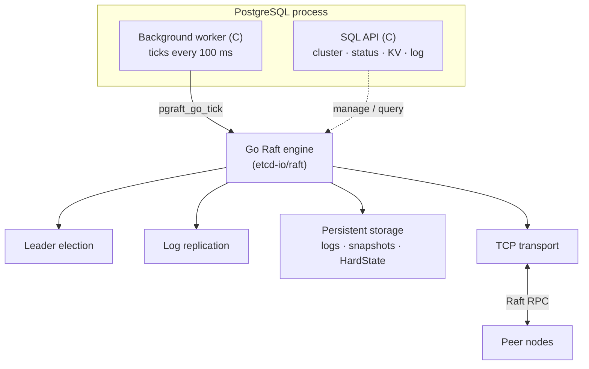

<div align="center">

# pgraft

**Raft consensus for distributed PostgreSQL clusters**

[](https://postgresql.org/)
[](https://golang.org/)
[](LICENSE)
[](https://pgelephant.github.io/pgraft/)

[Documentation](https://pgelephant.github.io/pgraft/) ·
[Quick Start](https://pgelephant.github.io/pgraft/getting-started/quick-start/) ·
[Releases](https://github.com/pgelephant/pgraft/releases) ·
[Discussions](https://github.com/pgelephant/pgraft/discussions)

</div>

---

## Overview

**pgraft** is a PostgreSQL extension that brings the [Raft consensus
algorithm](https://raft.github.io/) to distributed PostgreSQL clusters. It
provides automatic leader election, crash-safe log replication, and provable
split-brain prevention, built on the production-grade
[etcd-io/raft](https://github.com/etcd-io/raft) library and integrated through a
native background worker — no external agents or dependencies.

| | Feature | Description |
|---|---|---|
| **Consensus** | Automatic leader election | Quorum-based, deterministic, fully automated |
| **Durability** | Crash-safe replication | State changes replicated and persisted across nodes |
| **Safety** | Split-brain prevention | Guaranteed by the Raft quorum protocol |
| **Availability** | Automatic failover | Sub-second detection and recovery |
| **Integration** | Native PostgreSQL | Background-worker architecture, managed via SQL |
| **Storage** | etcd-compatible KV store | Raft-replicated key/value storage included |
| **Observability** | Status & metrics | Cluster status, replication stats, structured logging |

### Supported platforms

| Platform | PostgreSQL | Status |
|---|---|:---:|
| Linux — RHEL / Rocky / AlmaLinux | 14 – 18 | Supported |
| Linux — Ubuntu / Debian | 14 – 18 | Supported |
| macOS | 14 – 18 | Supported |

> [!NOTE]
> CI builds and smoke-tests every push against PostgreSQL 14 through 18.
> Official release packages are published for 16, 17 and 18; 14 and 15 are
> build-from-source.

---

## Installation

<details>
<summary><strong>From source</strong></summary>

```bash
# Prerequisites: PostgreSQL 14+, Go 1.23+, json-c, pkg-config
git clone https://github.com/pgelephant/pgraft.git
cd pgraft
make
sudo make install
```

Build against a specific PostgreSQL installation:

```bash
make PG_CONFIG=/usr/pgsql-17/bin/pg_config
sudo make install PG_CONFIG=/usr/pgsql-17/bin/pg_config
```

</details>

<details>
<summary><strong>Pre-built packages</strong></summary>

Download the appropriate package from the
[Releases](https://github.com/pgelephant/pgraft/releases) page.

```bash
# RHEL / Rocky / AlmaLinux
sudo dnf install pgraft_17-2.0.0-1.el9.x86_64.rpm

# Ubuntu / Debian
sudo apt install ./postgresql-17-pgraft_2.0.0-1_amd64.deb
```

</details>

<details>
<summary><strong>Build prerequisites by platform</strong></summary>

```bash
# Ubuntu / Debian
sudo apt update
sudo apt install build-essential postgresql-server-dev-17 golang-go \
                 libjson-c-dev pkg-config git

# RHEL / Rocky / AlmaLinux
sudo dnf install gcc make postgresql17-devel golang json-c-devel \
                 pkg-config git

# macOS
brew install postgresql@17 go json-c pkg-config
```

</details>

> [!TIP]
> See the [complete installation guide](https://pgelephant.github.io/pgraft/getting-started/installation/)
> for detailed, platform-specific instructions.

---

## Configuration

Add the following to `postgresql.conf` on **every** node, adjusting `pgraft.name`
and the addresses per node:

```ini
shared_preload_libraries = 'pgraft'

# Node identity (must be unique and appear in initial_cluster)
pgraft.name = 'node1'

# Cluster membership — identical on all nodes
pgraft.initial_cluster = 'node1=http://10.0.1.11:7001,node2=http://10.0.1.12:7001,node3=http://10.0.1.13:7001'
pgraft.initial_cluster_state = 'new'
pgraft.initial_cluster_token = 'pgraft-cluster-1'

# Local Raft transport endpoint
pgraft.listen_peer_urls = 'http://0.0.0.0:7001'

# Persistent storage for logs, snapshots, and HardState
pgraft.data_dir = '/var/lib/postgresql/pgraft'

# Consensus timing (optional)
pgraft.election_timeout = 1000     # milliseconds
pgraft.heartbeat_interval = 100    # milliseconds
```

> [!IMPORTANT]
> - `pgraft.name` must be unique and match a member name in `pgraft.initial_cluster`.
> - `pgraft.initial_cluster` and `pgraft.initial_cluster_token` must be **identical** on all nodes.
> - Node IDs are assigned automatically from each member's position in `initial_cluster`.
> - Changes to `shared_preload_libraries` require a PostgreSQL restart.

See the [configuration reference](https://pgelephant.github.io/pgraft/user-guide/configuration/)
for the full list of parameters.

---

## Quick start

Create the extension on each node — the cluster forms automatically from the
`initial_cluster` configuration:

```sql
CREATE EXTENSION pgraft;

-- Cluster state, leadership, and membership
SELECT * FROM pgraft.get_cluster_status();
SELECT * FROM pgraft.get_nodes();
```

> [!NOTE]
> Leader election completes within a few seconds of the cluster starting. Query
> `pgraft.get_leader()` to confirm a leader has been elected before issuing
> leader-only operations.

Follow the [quick start guide](https://pgelephant.github.io/pgraft/getting-started/quick-start/)
for a complete walkthrough.

### Upgrading from 1.0

Install the new files, then update the extension in each database and restart
the server so the C and Go libraries are reloaded together:

```sql
ALTER EXTENSION pgraft UPDATE TO '2.0.0';
```

Two things change, and both need attention before you upgrade.

**Every object moved into the `pgraft` schema and lost its `pgraft_` prefix.**
`pgraft_get_cluster_status()` is now `pgraft.get_cluster_status()`, and so on
for all 34 functions and 19 views. The upgrade drops the old unqualified
objects, so update your application first, or at least at the same time. It
does not use `CASCADE`: if something of yours depends on an old function, the
upgrade stops rather than dropping your object along with it.

**Argument lists and result columns are unchanged**, so the rename is the only
edit a caller needs.

**Privileges are stricter.** Functions that mutate cluster or key/value state
are no longer executable by `PUBLIC`. Grant them explicitly to the roles that
need them.

---

## Usage

### Cluster status and health

```sql
SELECT pgraft.is_leader();                        -- is this node the leader?
SELECT pgraft.get_leader();                        -- current leader id
SELECT * FROM pgraft.get_cluster_status();         -- full status
SELECT * FROM pgraft.get_nodes();                  -- all members

SELECT * FROM pgraft.log_get_replication_status(); -- replication progress
SELECT * FROM pgraft.log_get_stats();              -- log statistics
```

### Key/value store (etcd-compatible)

```sql
SELECT pgraft.kv_put('app/config', '{"timeout":30,"retries":3}');  -- leader only
SELECT pgraft.kv_get('app/config');                                -- any node
SELECT pgraft.kv_list_keys();
SELECT pgraft.kv_delete('app/config');                             -- leader only
```

### Dynamic membership

```sql
SELECT pgraft.add_node(4, '10.0.1.14', 7004);   -- leader only
SELECT pgraft.remove_node(4);                     -- leader only
```

> [!WARNING]
> Write operations — `pgraft.kv_put`, `pgraft.kv_delete`, `pgraft.add_node` and
> `pgraft.remove_node` — must be issued on the **leader**. Guard automated jobs
> with `pgraft.is_leader()` to avoid errors on followers.

See the [SQL function reference](https://pgelephant.github.io/pgraft/user-guide/sql-functions/)
for the complete API.

---

## Architecture



| Layer | Responsibility |
|---|---|
| **C layer** | PostgreSQL integration, SQL functions, background worker |
| **Go layer** | Raft consensus engine (etcd-io/raft) |
| **Storage** | Durable logs, snapshots, and HardState on disk |
| **Network** | TCP transport for inter-node Raft communication |

The background worker ticks the Raft state machine every 100 ms. The Go engine
handles elections, log replication, and consensus; committed entries are applied
locally on every node, and all state is persisted for crash safety. Management
and monitoring are exposed entirely through SQL.

Further reading:
[architecture](https://pgelephant.github.io/pgraft/concepts/architecture/) ·
[automatic replication](https://pgelephant.github.io/pgraft/concepts/automatic-replication/) ·
[split-brain protection](https://pgelephant.github.io/pgraft/concepts/split-brain/).

---

## Testing with Docker

The `pgraft_cluster.py` helper provisions a multi-node cluster for local testing:

```bash
cd examples

./pgraft_cluster.py --docker --init --nodes 3   # start a 3-node cluster
./pgraft_cluster.py --docker --status           # inspect status
./pgraft_cluster.py --docker --destroy          # tear down
```

See the [cluster script guide](https://pgelephant.github.io/pgraft/user-guide/pgraft-cluster-script/).

---

## Performance characteristics

| Metric | Typical value | Notes |
|---|---|---|
| Tick interval | 100 ms | Background-worker frequency |
| Election timeout | 1000 ms | Configurable (500 – 3000 ms recommended) |
| Heartbeat interval | 100 ms | Configurable (50 – 500 ms recommended) |
| Memory per node | ~50 MB | Go runtime and Raft state |
| CPU (idle) | < 1 % | Background-worker overhead |
| Failover time | 1 – 3 s | Election timeout plus detection |

---

## Production deployment

<details>
<summary><strong>System requirements</strong></summary>

| Resource | Minimum (testing) | Recommended (production) |
|---|---|---|
| CPU | 2 cores | 4+ cores |
| Memory | 2 GB / node | 8 GB+ / node |
| Disk | 10 GB | 50 GB+ SSD |
| Network | 100 Mbps | 1 Gbps+, < 10 ms latency |

</details>

Recommended practices:

- Run an **odd number of nodes** (3, 5, or 7) for a stable quorum.
- Keep inter-node latency **below 10 ms**.
- Use a **dedicated network** for Raft traffic where possible.
- **Monitor** leader changes and replication lag, and alert on them.
- Maintain regular **PostgreSQL backups** alongside Raft logs.
- **Test failover** thoroughly before going to production.

See the [best-practices guide](https://pgelephant.github.io/pgraft/operations/best-practices/).

---

## Troubleshooting

<details>
<summary><strong>Background worker not starting</strong></summary>

```sql
SHOW shared_preload_libraries;   -- must include 'pgraft'
```

`shared_preload_libraries` changes require a PostgreSQL restart.

</details>

<details>
<summary><strong>No leader elected</strong></summary>

```sql
SELECT pgraft.get_leader(), pgraft.is_leader();
```

Allow a few seconds after cluster start. Confirm that `pgraft.initial_cluster`
and `pgraft.initial_cluster_token` are identical on every node and that the peer
ports are reachable.

</details>

<details>
<summary><strong>A node cannot join</strong></summary>

```sql
SELECT name, setting FROM pg_settings WHERE name LIKE 'pgraft.%';
```

Verify that this node's `pgraft.name` appears in `pgraft.initial_cluster` and
that its `listen_peer_urls` endpoint is reachable from the other nodes.

</details>

<details>
<summary><strong>High CPU usage</strong></summary>

```sql
SELECT elections_triggered FROM pgraft.get_cluster_status();
```

Repeated elections usually indicate network instability or an
`election_timeout` that is too low for the link latency; increase it.

</details>

See the full [troubleshooting guide](https://pgelephant.github.io/pgraft/operations/troubleshooting/).

---

## Documentation

| Section | Topics |
|---|---|
| [Getting started](https://pgelephant.github.io/pgraft/getting-started/installation/) | Installation, quick start |
| [User guide](https://pgelephant.github.io/pgraft/user-guide/configuration/) | Configuration, SQL functions, cluster operations, tutorial |
| [Concepts](https://pgelephant.github.io/pgraft/concepts/architecture/) | Architecture, automatic replication, split-brain protection |
| [Operations](https://pgelephant.github.io/pgraft/operations/monitoring/) | Monitoring, troubleshooting, best practices |
| [Development](https://pgelephant.github.io/pgraft/development/building/) | Building, testing, contributing |

---

## Contributing

Contributions are welcome — bug reports, feature requests, documentation, and
code. A typical workflow:

1. Search existing [issues](https://github.com/pgelephant/pgraft/issues) and
   [discussions](https://github.com/pgelephant/pgraft/discussions).
2. Open an issue describing the problem or proposal.
3. Fork the repository and develop on a feature branch.
4. Submit a pull request with tests and documentation.

Please read the
[contributing guidelines](https://pgelephant.github.io/pgraft/development/contributing/)
before opening a pull request.

```bash
make installcheck   # regression tests
```

---

## Technology stack

| Component | Technology |
|---|---|
| Core language | C (PostgreSQL extension) |
| Consensus engine | Go — [etcd-io/raft](https://github.com/etcd-io/raft) |
| Build system | PostgreSQL PGXS, GNU Make |
| JSON parsing | json-c |
| Documentation | MkDocs (Material theme) |
| CI/CD | GitHub Actions |
| Packaging | RPM (RHEL/Rocky), DEB (Ubuntu/Debian) |

---

## License

Released under the [MIT License](LICENSE). Copyright &copy; 2024–2025 pgElephant.

---

<div align="center">

Built for the PostgreSQL community.

[Documentation](https://pgelephant.github.io/pgraft/) ·
[Issues](https://github.com/pgelephant/pgraft/issues) ·
[Discussions](https://github.com/pgelephant/pgraft/discussions)

</div>
