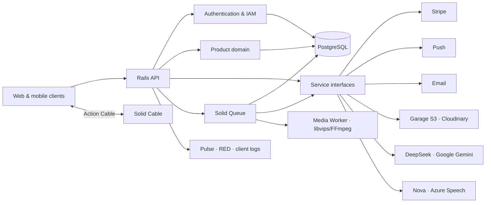

<a id="readme-top"></a>

<div align="center">

# RexOne Architecture Foundation (Core)

### Start from One. Not from Zero. A battle-hardened Rails foundation, forged so the product can wage the interesting war.

A battle-hardened, production-grade API core for modern web and mobile products. Authentication, hierarchical IAM, Stripe billing, access control, media pipelines, notifications, durable AI queues, real-time Action Cable WebSockets, background job topologies, operational administration, and glass-box observability stand ready—not as scattered trophies, but as one disciplined system.

Built under an immutable creed: **Start from One. Not from Zero. Clear in thought, exact in structure, simple in use, and strong enough to endure what comes after launch.**

[](https://www.ruby-lang.org/)
[](https://rubyonrails.org/)
[](https://www.postgresql.org/)
[](https://www.docker.com/)
[](docs/GSOC_IDEAS.md)
[](https://github.com/rex-9/rexone-core/discussions)
[](https://github.com/sponsors/rex-9)
[](https://www.producthunt.com/products/rexone)
[](https://rexone.rex9.me)
[](https://github.com/rex-9/rexone-core/actions/workflows/test.yml)

**API-first · Modular · Observable · Queue-aware · Built to grow**

[Live Demo ↗](https://rexone.rex9.me) · [Product Hunt ↗](https://www.producthunt.com/products/rexone) · [Quick Start](docs/QUICK_START.md) · [Discussions ↗](https://github.com/rex-9/rexone-core/discussions) · [Contributing](CONTRIBUTING.md) · [GSoC Roadmap](docs/GSOC_IDEAS.md) · [Ecosystem Architecture](ECOSYSTEM.md) · [Development Law](LAW.md) · [Agent Governance](AGENTS.md) · [Production Deployment](docs/DEPLOYMENT.md)

</div>

---

### 🏛️ Unified Ecosystem & Constitutional Directives

| Resource                              | Purpose & Canonical Specification                                                                                                                                       |
| :------------------------------------ | :---------------------------------------------------------------------------------------------------------------------------------------------------------------------- |
| **🏛️ Unified Ecosystem**              | Complete cross-platform architecture, feature parity matrix, and communication protocols across Core, Web, and Mobile: **[ECOSYSTEM.md](ECOSYSTEM.md)**                 |
| **📖 Interactive API Docs & Swagger** | Full OpenAPI 3.0 specification & interactive Swagger UI explorer at `/admin/api-docs`: **[swagger.yaml](swagger/v1/swagger.yaml)** (Spec: `spec/openapi/v1.rb`)               |
| **🏛️ System Architecture**            | High-level system topology, domain services, Solid Queue, and provider boundaries: **[docs/ARCHITECTURE.md](docs/ARCHITECTURE.md)**                                    |
| **🗄️ Database Schema & Models**        | Complete database schema, tables, UUID indexes, and model associations: **[docs/SCHEMA.md](docs/SCHEMA.md)**                                                             |
| **🗺️ Visual Walkthrough**             | Screenshot-driven, feature-by-feature tour of RexOne across all surfaces and operations: **[VISUAL_WALKTHROUGH.md](./docs/VISUAL_WALKTHROUGH.md)**                      |
| **🤝 Contributing & Governance**       | Contributor workflow, Code of Conduct, and BDFL/RFC governance: **[CONTRIBUTING.md](CONTRIBUTING.md)** · **[CODE_OF_CONDUCT.md](CODE_OF_CONDUCT.md)** · **[GOVERNANCE.md](GOVERNANCE.md)** |
| **🛡️ Coordinated Disclosure**         | Coordinated Vulnerability Disclosure & security response SLA: **[SECURITY.md](SECURITY.md)**                                                                             |
| **🤖 Anti-Vibe AI Policy**            | Machine-enforced coding standards for AI assistants & contributors: **[docs/AI_CONTRIBUTION_POLICY.md](docs/AI_CONTRIBUTION_POLICY.md)**                                 |
| **🎓 GSoC & Open Source Grants**       | Project ideas catalog, mentor criteria, and institutional roadmap: **[docs/GSOC_IDEAS.md](docs/GSOC_IDEAS.md)**                                                          |
| **🌐 Public Distribution**            | Curated directories, Awesome-lists, and community launch indexes: **[docs/DISTRIBUTION.md](docs/DISTRIBUTION.md)**                         |
| **💳 Universal Payments & IAP**        | Unified Stripe, Google Play, Apple App Store, coupons, and entitlement state machines: **[docs/PAYMENT.md](docs/PAYMENT.md)**                                           |
| **🚀 Production Deployment**          | Contabo VPS + Coolify deployment, zero-downtime rolling updates, and reverse proxy: **[docs/DEPLOYMENT.md](docs/DEPLOYMENT.md)**                                         |
| **🧹 Telemetry & VPS Maintenance**     | Automated log rotation, Solid Queue/Cache pruning, and VPS cleanup: **[docs/MAINTENANCE.md](docs/MAINTENANCE.md)**                                                      |
| **📜 Constitutional Law**             | Non-negotiable architecture, pure parameter contracts, zero legacy shims, and plain English laws: **[LAW.md](LAW.md)** _(Zero exceptions)_                              |
| **🤖 Operational Agent Governance**   | Immutable operational rules for AI coding assistants (secret isolation, git safety, synchronous doc sync): **[AGENTS.md](AGENTS.md)**                                   |
| **🛡️ Production Security**            | Origin isolation, Cloudflare edge defense, and rate-limiting protocols: **[Production DDoS & API Abuse Protection](docs/DDOS.md)**                                      |
| **🌐 AI Discovery & GEO**             | Generative Engine Optimization, crawler allowlists, and LLM context files: **[AI Discovery & GEO Guide](https://github.com/rex-9/rexone-web/blob/dev/docs/SEO_GEO.md)** |

---

## 🏛️ The RexOne Architecture Foundation (The RexOne Approach)

RexOne is not merely a starter kit—it is an **Architectural Foundation**. It establishes an authoritative, battle-tested engineering standard designed for founders and teams building mission-critical products.

### The Architectural Sweet Spot: Neither Extreme Monolith Nor Overrated Microservices

Modern software architecture often forces developers into two dysfunctional extremes:

```text
❌ Extreme "All-in-One" Monolith       ✅ RexOne Architecture Foundation        ❌ Overrated Microservices
(Single fragile process / runtime)       (Modular Code + Workload Isolation)      (Distributed Transaction Hell)
┌─────────────────────────────────┐      ┌───────────────────────────────────┐    ┌───────┐ ┌───────┐ ┌───────┐
│ API + HTML + DB Queries         │      │ API-First Modular Monolith        │    │ Auth  │ │Billing│ │ Media │
│ + Background Jobs + Transcoding │      │ (Single codebase, pure contracts, │    └───┬───┘ └───┬───┘ └───┬───┘
│ crammed into one node/web host  │      │ unified DB, 0 network latency)    │        │       │       │
└────────────────┬────────────────┘      └─────────────────┬─────────────────┘        ▼       ▼       ▼
                 ▼                                         ▼                      Distributed transactions,
CPU spike in transcoding freezes API     Isolated Docker runtime containers:      network lag, 15 repos,
& drops all web traffic. Sluggish        • API (Puma HTTP / WebSockets)           DevOps nightmare for a small
webview shell masquerading as app.       • Waka (I/O jobs / Fibers)               team.
                                         • Media (CPU FFmpeg / libvips)
                                         • Database (PostgreSQL 18)
                                         • Storage (Self-hosted Garage S3)
                                         + Decoupled React 19 & Flutter 3
```

1. **Why Not an Extreme Monolith?**
   Traditional extreme monoliths (and single-framework runtimes) cram API routing, database models, background queues, CPU-bound video transcoding, and frontend rendering into one single process. When an image upload or queue spike pegs CPU or leaks memory, the entire customer-facing site drops offline. Furthermore, extreme web monoliths treat mobile apps as an afterthought, wrapping web pages in sluggish webview shells. RexOne eliminates this fragility: backend workloads are container-isolated (`api`, `waka`, `media`, `db`, `garage`), while web and mobile exist as independent, first-class clients.
2. **Why Not Overrated Microservices?**
   Microservices are an organizational pattern for 500-person enterprises. For early- and growth-stage teams, microservices introduce distributed transaction hell, network latency between internal services, API version choreography across a dozen repositories, and an enormous DevOps tax. RexOne unifies all models, business workflows, database migrations, and IAM authorization into a single, cohesive, modular Rails 8 engine with zero internal network hops.
3. **The Sweet Spot — The RexOne Architectural Foundation**:
   An **API-First Modular Monolith** at the code level, deployed as **workload-isolated containers** at the infrastructure level, serving decoupled, pure **React 19 Web** and 60fps **Flutter 3 Native Mobile** clients under an unyielding engineering constitution (`LAW.md`).

---

## Why RexOne Core?

Every product eventually meets the same old enemies: accounts, permissions, billing, uploads, jobs, notifications, dashboards, audit trails, failures, and the darkness between _“it works”_ and _“we know why it works.”_ Especially, the ultimate killer of momentum: _“it works on my machine.”_

RexOne Core exists because this ground should never have to be conquered again for every product.

### ⚓ The Aircraft Carrier vs. The Speedboat

While commercial kits charge hundreds of dollars for single-framework templates, **RexOne Core is not competing with boilerplates. It is competing with entire platform teams.**

Comparing RexOne to lightweight starters (like Create T3 App or Supabase templates) is like comparing a loaded aircraft carrier to a speedboat. Speedboats (`npx create-next-app`) launch in 30 seconds, but capsize the moment you need transactional billing, background queue topologies, persistent WebSockets, native mobile sync, or S3 storage. RexOne is an aircraft carrier: one command (`./scripts/dev.sh`) boots an entire complete platform team in a box.

### The Purpose: Start from One. Not from Zero.

Software has never been easier to generate, but more code does not automatically mean better systems. Human developers and AI coding agents can move fast, but speed without disciplined architecture burns money, AI compute, and human energy—wasting thousands of expensive tokens rewriting weak abstractions, fixing hallucinatory debt, or having to rebuild the exact same foundation again and again for every product.

RexOne turns that repeated, expensive grind into a battle-tested architectural baseline.

### Discipline-Driven Development: The Unvarnished Truth

RexOne pioneers **Discipline-Driven Development**. While legacy paradigms spent decades debating Domain-Driven Design or Test-Driven Development, the AI era created a fundamentally different reality: **typing code is free**. Generating 10,000 lines of code takes 30 seconds.

90% of modern software projects never survive to master the business domain because their architecture collapses first under an avalanche of hallucinatory abstractions, conflicting shims, and zombie code. Tests cannot save a rotten architecture.

Discipline-Driven Development establishes that **architectural discipline, an unyielding foundation, and constitutional law are the primary drivers of sustainable engineering**.

> _You bring the idea. AI writes the code. RexOne keeps both of you from destroying the foundation._

#### The Brutal Realities Others Hesitate to Reveal:

1. **The Vibe-Coding Delusion**: Prompting an AI to generate code without an immutable constitution isn't velocity; it's compounding debt at 100x speed. Speed without discipline is just accelerating toward a brick wall.
2. **The BaaS Trap**: Serverless "5-minute backends" lure developers in with toys, then slap them with a $5,000/mo cloud hostage bill when they need relational integrity, background queues, or compliance audits. Real software runs self-hosted PostgreSQL, native queues (Solid Queue), and self-hosted S3 (Garage).
3. **The Full-Stack Monolith Lie**: Stuffing API controllers, database queries, background tasks, and client hydration into a single node runtime creates fragile, unmaintainable monoliths. True engineering enforces client-server separation.
4. **Deprecation Cowardice & Zombie Code**: Retaining dead code, backwards-compatibility shims, and duplicate parameter aliases is cowardice. Under Constitutional Law U14, if code is replaced, the old code is wiped out completely. No shims. No legacy bloat.
5. **100% Free & Open-Source (Apache 2.0)**: Unlike commercial boilerplates charging $300–$800 for basic auth or gating features behind "pro licenses", RexOne is 100% free and Apache 2.0 open-source. You own your code, your data, and your infrastructure.

### 💎 Why Ruby on Rails 8 for the Core? (Instead of a TypeScript/Node Monolith)

A frequent question in today’s JavaScript-heavy landscape is: *“The Node/TypeScript ecosystem is larger—why choose Ruby on Rails for the backend Core?”*

1. **Platform Concurrency & ACID Durability**: Full-stack Node monoliths struggle when managing long-lived WebSockets, multi-stage background media compression, and transactional billing ledgers. Rails 8 with **Solid Queue** (Fiber + Thread hybrid concurrency) and PostgreSQL 18 provides rock-solid durability without external Redis brokers, queue services, or 10-second serverless execution limits.
2. **Zero Cloud Hostage Fees**: BaaS solutions (Supabase, Firebase) and serverless hosts (Vercel) lure developers in with "5-minute MVPs," but quickly turn into \$500–\$5,000/mo cloud ransoms. RexOne Core runs the entire platform (API, PostgreSQL, Solid Queue, Solid Cable, self-hosted Garage S3) cleanly on a single VPS via Docker Compose.
3. **AI Agent Determinism (The Antidote to JS Churn)**: Autonomous AI coding agents (Claude, Cursor, Copilot) frequently hallucinate or break when operating in the fragmented JavaScript ecosystem with its endless package churn and conflicting patterns. Rails 8's strict convention-over-configuration—reinforced by `LAW.md` and `AGENTS.md`—gives AI coding agents deterministic rails to run on, producing clean, durable code without technical debt.

### ⏱️ The 9-Month Delusion: How Teams Waste $200,000 Rebuilding the Exact Same Wheel

Every software founder and engineering lead tells themselves the exact same comfortable lie:

> _“We just need a lightweight MVP. We’ll build our core feature in 4 weeks, and worry about infrastructure later.”_

Here is the unvarnished, brutal truth of what actually happens over the subsequent 9 months:

```text
┌────────────────────────────────────────────────────────────────────────────────────────┐
│  THE TRADITIONAL 9-MONTH ROADMAP TO TECH DEBT COLLAPSE                                 │
├────────────────────────────────────────────────────────────────────────────────────────┤
│  Month 1–2:  Auth & Identity Hell                                                      │
│              JWT tokens, refresh cycles, email confirmation codes, password resets,    │
│              and basic RBAC. The "4-week MVP" is already 100% consumed by login screens.│
│                                                                                        │
│  Month 3–4:  Stripe & Billing Agony                                                    │
│              Checkout sessions seem simple until edge cases hit: webhook reconciliation,│
│              subscription cancellations, proration races, coupon discounts, failed    │
│              invoices, and idempotent state transitions. Two months gone.               │
│                                                                                        │
│  Month 5:    Storage, Media & Async Jobs                                               │
│              S3 bucket credentials, presigned upload tickets, image/video variant      │
│              resizing, Redis broker configuration, and bloated hosting bills.          │
│                                                                                        │
│  Month 6–7:  Web Admin & Real-Time Sync                                                │
│              Operations needs an admin portal. Engineers scramble to build CRUD tables,│
│              metrics charts, and WebSocket event channels from scratch.                │
│                                                                                        │
│  Month 8:    Mobile Client Frustration                                                 │
│              Connecting Flutter or React Native exposes 50 mismatched JSON keys,       │
│              missing endpoints, and fragile auth persistence between Web and Mobile.   │
│                                                                                        │
│  Month 9:    The Tech Debt Wall & Refactoring Paralysis                                │
│              Zero automated tests. Spaghetti code. The team is terrified to touch      │
│              a single line because changing one model breaks 4 disparate screens.      │
└────────────────────────────────────────────────────────────────────────────────────────┘
```

#### 💸 The Harsh Financial Math:

- **Small Team (2–3 Engineers)**: 9 months of payroll = **$150,000 – $300,000 burned**.
- **Solo Founder / Indie Hacker**: 9 months of lost market opportunity, cognitive fatigue, and zero customer validation.
- **The Tragedy**: **85% of that code had NOTHING to do with the proprietary product idea.** It was just the generic, universal plumbing required to run any commercial software.

#### ⚡ The RexOne Day-One Reality:

```text
┌────────────────────────────────────────────────────────────────────────────────────────┐
│  STARTING FROM ONE (REXONE ARCHITECTURE FOUNDATION)                                    │
├────────────────────────────────────────────────────────────────────────────────────────┤
│  Day 1:   Spin up Docker. Rails 8 + React 19 + Flutter 3 + Garage S3 + Postgres 18.   │
│           Full Auth, 96 IAM permissions, Stripe billing, and WebSockets live.          │
│                                                                                        │
│  Week 1:  Define your proprietary domain entities and customize brand styling.         │
│                                                                                        │
│  Week 2:  Wire your business logic to existing, fully-tested controllers.              │
│                                                                                        │
│  Week 3:  Run 1,785+ passing automated tests. Deploy staging. Ship to production.      │
└────────────────────────────────────────────────────────────────────────────────────────┘
Result: 8 to 11 months of soul-crushing plumbing deleted. You launch in weeks.
```

### 📊 Architectural Comparison: RexOne vs Commercial Boilerplates

| Dimension / Capability       | 🛡️ **RexOne Architecture Foundation**                                                          | ⚡ **ShipFast & Indie Kits ($169–$299)**                                               | 🏢 **Makerkit & Supastarter ($299–$699)**                                                 | 🚂 **Jumpstart Pro & Bullet Train ($249–$749)**                                   | 🐍 **SaaS Pegasus & Larafast ($99–$795)**                                         |
| :--------------------------- | :-------------------------------------------------------------------------------------------- | :----------------------------------------------------------------------------------- | :--------------------------------------------------------------------------------------- | :-------------------------------------------------------------------------------- | :-------------------------------------------------------------------------------- |
| **Architectural Model**      | ✅ **Tri-Platform Architecture Foundation**: Rails 8 API + React 19 SPA + pure Flutter 3 client | ❌ **Node Monolith**: API, DB, jobs & DOM crammed into 1 fragile runtime             | ❌ **Client-Heavy BaaS**: Direct client DB queries + scattered edge functions     | ⚠️ **HTML Monolith**: Server-rendered HTML with Turbo/Livewire                    | ⚠️ **Monolithic Web**: Django/Laravel web-only runtimes with no mobile client     |
| **Native Mobile App**        | ✅ **Native 60fps Flutter**: Dual-app store architecture (Prod vs UAT), automated CI/CD & hardware media | ❌ **None or Webview Shell**: Sluggish Capacitor/Cordova wrapper                     | ⚠️ **Fragmented SDKs**: Direct queries with zero encapsulation                           | ⚠️ **Turbo / Webview**: Web pages wrapped in a native navigation shell            | ❌ **None**: No mobile client provided                                            |
| **Offline-First Durability** | ✅ **Drift SQLite (`rexone_offline`)**: Schema mirroring, offline subtitles & AES-256 saves   | ❌ **None**: Application breaks entirely on network disconnect                       | ⚠️ **No Relational Offline**: Unreliable offline sync across foreign keys         | ❌ **None**: Server-rendered pages require constant connectivity                  | ❌ **None**: Application breaks on disconnect                                      |
| **Database Integrity**       | ✅ **Strict Relational PostgreSQL**: Foreign keys, ACID, UUIDs, soft-deletes                  | ⚠️ **ORM Inconsistencies**: Serverless connection pool limits on Prisma/Drizzle      | ✅ **PostgreSQL**: Relational integrity via managed Postgres instance             | ✅ **PostgreSQL / MySQL**: Mature relational ORM (ActiveRecord)                   | ✅ **PostgreSQL / MySQL**: Mature relational ORM (Django ORM / Eloquent)           |
| **Background Processing**    | ✅ **Solid Queue (Fibers + Threads)**: Workload pooling, recurring cron, zero Redis costs     | ❌ **Serverless Timeouts**: Forced into third-party Inngest, QStash, or Celery ($$$) | ⚠️ **Edge Functions**: Strict 10s CPU limits, no persistent background workers    | ⚠️ **Redis Dependency**: Requires external Redis broker & extra hosting RAM       | ⚠️ **Redis Dependency**: Requires Celery/Redis daemon configuration                |
| **Real-Time Delivery**       | ✅ **Native Action Cable**: Persistent WebSockets, auto-reconnect & binary STT/TTS            | ❌ **Broken on Serverless**: Forced into expensive Pusher / Ably tiers ($$$)         | ⚠️ **Supabase Realtime**: Row-level broadcast, high connection pricing tiers      | ⚠️ **External Broker**: Requires Redis/Reverb daemon configuration                | ⚠️ **External Broker**: Requires Pusher/Reverb daemon configuration                |
| **Object Storage**           | ✅ **Self-Hosted Garage S3**: High-performance local S3, zero egress bills                    | ❌ **Vendor Cloud**: AWS S3 / Cloudflare R2 egress fees                              | ⚠️ **Proprietary Storage**: Vendor-locked BaaS pricing ladders                    | ⚠️ **ActiveStorage**: Tied to third-party cloud S3 bucket bills                   | ⚠️ **Flysystem / S3**: Tied to third-party cloud S3 bucket bills                   |
| **AI Workflows & Speech**    | ✅ **Durable Queued AI**: Chunked streaming, 16kHz live STT, binary MP3 TTS                   | ⚠️ **Edge Timeouts**: LLM streams crash on cold starts or Vercel limits              | ❌ **Client Leaks**: Client-side API keys or basic Edge Function calls            | ⚠️ **Basic Wrappers**: Simple synchronous chat endpoints                          | ⚠️ **Basic Wrappers**: Simple synchronous chat endpoints                          |
| **Anti-Vibe Governance**     | ✅ **Constitutional Law (`LAW.md`)**: Laws U14/U15 stop AI tech debt and zombie code          | ❌ **Unguided Vibe-Coding**: Fragile abstractions, dead shims & runaway debt         | ❌ **Scattered Cloud Logic**: Code fragmented across dozens of uncoordinated functions   | ⚠️ **Conventions Only**: No explicit constitutional AI agent rules                | ⚠️ **Conventions Only**: No explicit constitutional AI agent rules                |
| **Cost & Freedom**           | ✅ **100% Free & Open (Apache 2.0)**: Zero paywalls, zero "Pro" upsells, single-server VPS   | ❌ **$169–$299 Paid License**: Single-stack Next.js web MVPs (ShipFast, LaunchFast)   | ❌ **$299–$699 Paid License**: Closed-source seat paywalls (Makerkit, Supastarter) | ❌ **$249–$749 Paid License**: Proprietary paywalls (Jumpstart Pro, Bullet Train)  | ❌ **$99–$795 Paid License**: Commercial starter kit paywalls (Pegasus, Larafast)  |

### 🥊 RexOne vs The Competition (ShipFast, Makerkit, Supastarter, Jumpstart Pro, SaaS Pegasus, Bullet Train, Larafast)

- **ShipFast ($169–$299)**: Built by Marc Lou for quick indie hacker web MVPs. Excellent for launching a landing page with Stripe in 24 hours, but hits immediate architectural limits when you need real background queues, a native mobile app, enterprise RBAC, or AI agent constraints.
- **Makerkit ($299–$699)**: High-quality B2B Next.js/Remix SaaS kit with team multi-tenancy, but locked behind a commercial license, tied to expensive Supabase cloud ladders, and web-only.
- **Supastarter ($299–$599)**: Modern TypeScript/Next.js boilerplate with good i18n, but web-only, subject to 10s serverless timeouts, and lacking mobile offline sync.
- **Jumpstart Pro ($249/yr or $749)** & **Bullet Train ($995)**: Solid Rails foundations, but monolithic server-rendered HTML. For mobile, Jumpstart relies on Turbo Native (wrapping web views inside a native shell) rather than compiled 60fps Flutter UI.
- **SaaS Pegasus ($295–$795)**: The leading Django SaaS kit, but web-only, monolithic, and requires external Redis hosting for Celery.
- **RexOne (100% Free & Open)**: Forges Rails 8 API + React 19 Web + Flutter 3 Mobile into one synchronized ecosystem, eliminates Redis with Solid Queue on PostgreSQL 18, includes self-hosted Garage S3 storage, and enforces constitutional AI laws (`LAW.md`) so AI coding agents never destroy the architecture.


### The Reality: The Exponential AI Tech Debt Cycle

Without immutable architectural boundaries:

```text
Agent 1 invents Pattern A
   ↓
Agent 2 arrives on the next prompt, treats Pattern A as "legacy",
and adds a backward-compatibility shim with Pattern B
   ↓
Agent 3 arrives, bypasses both, and hardcodes an inline workaround
   ↓
Deadlines loom; human developers layer more glue code
   ↓
Context windows fill with duplicate abstractions & zombie code
   ↓
Exponential technical debt & token burn before the product even launches
```

RexOne breaks this cycle decisively:

- **Constitutional Law (`LAW.md`)**: Law U14 enforces _zero loose code, zero backward-compatibility shims, complete wipeout and replacement_. If code deviates from the law, the code is wrong—fix the code. Law U15 enforces human-readable plain English with zero esoteric syntax.
- **Operational Agent Governance (`AGENTS.md`)**: Strict guidelines for AI coding tools—never read `.env` secrets, never run destructive git operations, and synchronize documentation in the exact same turn as code changes.
- **AI Turns from an Architect into a Worker**: The architecture has already been decided. AI works cleanly inside it.

### Born from Battle-Tested Production Reality

RexOne was not born from framework fandom or an abstract weekend thought experiment. It is the hard-won distillation of years of shipping real-world production systems across:

- **Firebase & Google Ecosystem**: Battle-tested as a founding engineer at **js.eco** (a 3-person team: CEO, CTO, and Htet Naing, scaling rapidly in the US EV charging market). While one of the most systematic, high-growth Google-centric architectures, it proved that proprietary ecosystem lock-in and scattered functions still create immense friction.
- **Multi-Cloud & Polyglot Background**: Extensive real-world production engineering across AWS SAM, Microsoft Azure, FastAPI (Python), Laravel & TALL/Filament (PHP), NestJS & Next.js (Node/TypeScript), Go, Prisma, MongoDB, MySQL, and PostgreSQL.

**The Golden Architectural Rule**:
Server frameworks on the frontend create clumsy UX; client languages on the backend create loose, messy architectures. RexOne combines the strongest technologies that survived this crucible—**Rails 8 API Core + React 19 Web + Flutter 3 Mobile**—with crystal-clear boundaries, workload-separated queues, self-hosted S3 storage (Garage), full-stack observability, and constitutional laws.

The foundation is designed to **bend around the product**, never to make the product kneel before the framework.

Instead of hardcoding a rigid SaaS "Teams" hierarchy into domains where it doesn't belong (which is painful to dismantle if the product is an educational platform, clinic, or marketplace), RexOne provides rock-solid IAM primitives (roles, permissions, and 23 canonical resources), leaving domain hierarchy entirely to the business.

RexOne Core brings startup speed with battle-tested discipline—and zero final-hour whispers of _“we should probably build that before launch.”_

It is a particularly good fit when you want to:

- **Stop writing boilerplate infrastructure** and start shipping domain features on day one.
- **Keep AI generation on rails**: prevent autonomous LLM coders from inventing haphazard abstractions, sprawling directories, or unmaintainable architectural debt.
- **Have complete confidence in reviews**: clean boundaries mean reviewing code is effortless with zero garbage to wade through.
- **Rely on automated tests**: end-to-end verification across both the backend server and client applications.
- **Operate a unified ecosystem**:
  - Authentication and explicit role-based access control.
  - Stripe payments connected to durable entitlements.
  - Provider-neutral media storage and background optimization.
  - In-app, push, email, and real-time notification delivery.
  - Queued AI and speech workflows that survive client disconnection.
  - Operational dashboards, client telemetry, audit trails, and health checks.
  - Reference React and Flutter clients consuming the exact same contracts.

RexOne is not a no-code application generator or a promise that every product domain is already modeled. It supplies the disciplined platform foundation; the product remains responsible for its own domain, workflows, interface, and operating decisions.

## What you get

- **One coherent system:** identity, authorization, commerce, media, async work, notifications, and observability are designed to cooperate.
- **Real client contracts:** [RexOne Web](https://github.com/rex-9/rexone-web) and [RexOne Mobile](https://github.com/rex-9/rexone_mobile) exercise the same versioned API and real-time events.
- **Replaceable providers:** external services remain behind focused client and base contracts.
- **Inspectable operations:** queues, cache, sockets, performance, backend errors, and frontend telemetry have explicit operational surfaces.
- **A documented engineering standard:** architectural constraints, API conventions, lifecycle rules, and cross-client responsibilities are written down and tested.

The public [open-source growth roadmap](docs/OPEN_SOURCE_GROWTH_ROADMAP.md) tracks how RexOne will improve evaluation, evidence, contribution readiness, and responsible distribution.

## The philosophy

RexOne Core follows a simple doctrine:

> **Clarity before cleverness. Precision before haste. Simplicity without weakness. Strength without spectacle.**

Years of building software teach the same lesson as any long campaign: the first victory is easy to celebrate; surviving everything that follows is the true test.

The difficult part is rarely another controller or CRUD endpoint. It is preserving a system that remains understandable when the product grows, integrations multiply, failures arrive from unfamiliar directions, and the original developer is no longer the only one carrying the blade.

So the ambition was never to build the largest foundation possible.

It was to build a **clear one**—strong enough to carry ambitious products, flexible enough to surrender its shape to them, and disciplined enough that the next developer can enter the codebase without a map drawn in blood.

No prophecy. No magic. No shortcuts disguised as momentum.

Just deliberate engineering, tested boundaries, and a foundation built to remain standing.

## 🌟 RexOne Feature Showcase

### ⚡ At a Glance: The 8 Core Architectural Pillars (Quick Scan)

| Architectural Pillar | Flagship Capabilities | Differentiator vs Traditional Stacks |
| :--- | :--- | :--- |
| 🔐 **Identity & Security** | Devise + JWT, 6-digit passcode auth, Google SSO, single-session lock, self-account deletion | Complete zero-trust lifecycle; zero vendor lock-in to Auth0 or Clerk ($$$). |
| 🛡️ **IAM & Access Control** | Granular RBAC, 96+ system permissions across 23 resources, declarative `user.can?`, frontend `<AccessGate>` | Eliminates clumsy hardcoded roles; scales seamlessly from simple app to enterprise IAM. |
| 💳 **Universal Commerce** | Stripe checkout & billing, Google Play / Apple IAP contracts, discount coupons, referral ledger, durable access entitlements | Multi-provider architecture; entitlement engine divorces billing vendor from access rights. |
| ⚡ **Hybrid Queues (Solid Queue)** | Rails 8 Fiber isolation (50 I/O workers) + isolated OS threads for media & cron, zero Redis dependency | Blazing fast concurrency on PostgreSQL; zero extra server RAM or external Redis costs. |
| 📦 **S3 Storage & Media Engine** | Self-hosted Garage S3, async libvips image optimization, FFmpeg video transcoding, SRT subtitles, signed URLs | 100% self-hosted object storage with zero egress fees; dedicated media container prevents CPU lockup. |
| 🤖 **Queued AI & Speech** | DeepSeek V3/V4 + Gemini 2.5 Flash, universal TOON serialization, Telegram chunking, live 16kHz STT & binary TTS | Saves 30–60% tokens (no raw JSON); background queued inference survives client disconnects. |
| 📱 **Native Tri-Platform Synchrony** | Rails 8.1 API + React 19 SPA + Flutter 3 native app, shared OpenAPI v1 specs, Drift SQLite offline storage | Exact contract parity across Web and Mobile; true 60fps native Flutter with offline-first sync. |
| 📊 **Glass-Box Observability** | Rails Pulse metrics, Rails Error Dashboard (RED), client log ingestion, dual admin portals (internal + API) | Zero external SaaS monitoring fees (Datadog/Sentry); complete operational visibility out of the box. |

---

### 🏛️ Complete Master Feature Matrix (All Features of RexOne)

| Category & Domain | Feature & Capability | Core (Rails) | Web (React) | Mobile (Flutter) | Architectural Reference |
| :--- | :--- | :---: | :---: | :---: | :--- |
| **🔐 Identity & Auth** | Email & 6-Digit Passcode Verification | ✅ | ✅ | ✅ | [Authentication & Security](docs/FOUNDATION.md#authentication-and-security) |
| | Google SSO & Challenge Flow | ✅ | ✅ | ✅ | [Authentication & Security](docs/FOUNDATION.md#authentication-and-security) |
| | JWT JTI Revocation & Token Rotation | ✅ | ✅ | ✅ | [Authentication & Security](docs/FOUNDATION.md#authentication-and-security) |
| | Active Single-Platform Session Enforcement | ✅ | ✅ | ✅ | [Authentication & Security](docs/FOUNDATION.md#authentication-and-security) |
| | Brute-Force Password Retry Cooldown | ✅ | ✅ | ✅ | [Authentication & Security](docs/FOUNDATION.md#authentication-and-security) |
| | 6-Digit Password Reset Lifecycle | ✅ | ✅ | ✅ | [Authentication & Security](docs/FOUNDATION.md#authentication-and-security) |
| | Self-Service Account & Data Deletion (GDPR/Apple) | ✅ | ✅ | ✅ | [Authentication & Security](docs/FOUNDATION.md#authentication-and-security) |
| **🛡️ Access Control & IAM** | Hierarchical Roles & 96+ System Permissions | ✅ | ✅ | ✅ | [IAM & Access Control](docs/FOUNDATION.md#iam-and-access-control) |
| | 23 Canonical Domain Resources | ✅ | ✅ | ✅ | [IAM & Access Control](docs/FOUNDATION.md#iam-and-access-control) |
| | Declarative `user.can?(action, resource)` Engine | ✅ | ✅ | ✅ | [IAM & Access Control](docs/FOUNDATION.md#iam-and-access-control) |
| | UI Access Gates (`<AccessGate>` / `AppAccessGate`) | N/A | ✅ | ✅ | [IAM & Access Control](docs/FOUNDATION.md#iam-and-access-control) |
| | Client Admin IAM Manager (Roles & Permission Toggles) | ✅ | ✅ | N/A | [IAM & Access Control](docs/FOUNDATION.md#iam-and-access-control) |
| **💳 Commerce & Billing** | Stripe Checkout Session Creation & Handoff | ✅ | ✅ (Redirect) | ✅ (WebView) | [Universal Payments](docs/PAYMENT.md) |
| | Recurring Subscriptions (Tiers, Resumption, Cancellation) | ✅ | ✅ | ✅ | [Universal Payments](docs/PAYMENT.md) |
| | One-Time Purchases & Lifetime Products | ✅ | ✅ | ✅ | [Universal Payments](docs/PAYMENT.md) |
| | Multi-Provider In-App Purchases (Google Play & Apple App Store) | ✅ | N/A | ✅ | [Universal Payments](docs/PAYMENT.md) |
| | Percentage & Fixed Discount Coupons | ✅ | ✅ | ✅ | [Universal Payments](docs/PAYMENT.md) |
| | Automated User Referral Coupon Generation | ✅ | ✅ | ✅ | [Universal Payments](docs/PAYMENT.md) |
| | Durable Entitlement Ledger (`Access` Model) | ✅ | ✅ | ✅ | [Payments & Entitlements](docs/FOUNDATION.md#payments-and-entitlements) |
| | Idempotent Webhook Processing & Ledger Reconcile | ✅ | N/A | N/A | [Universal Payments](docs/PAYMENT.md) |
| **⚡ Background Processing** | Solid Queue Hybrid Concurrency (Fibers + Threads) | ✅ | N/A | N/A | [Background Processing](#background-processing) |
| | Fiber Worker Isolation (50 Concurrent I/O Tasks) | ✅ | N/A | N/A | [Background Processing](#background-processing) |
| | Dedicated Quarantined `media` Worker (libvips/FFmpeg) | ✅ | N/A | N/A | [Background Processing](#background-processing) |
| | Workload Elasticity & Auto-Failover Queues | ✅ | N/A | N/A | [Background Processing](#background-processing) |
| | Transactional Recurring Cron (`config/recurring.yml`) | ✅ | N/A | N/A | [Background Processing](#background-processing) |
| | Zero Redis Dependency (Pure PostgreSQL Concurrency) | ✅ | N/A | N/A | [Background Processing](#background-processing) |
| **📦 Object Storage & Media** | Self-Hosted Garage S3 (Port 3100 API / 3101 Admin) | ✅ | N/A | N/A | [Media Playback](docs/MEDIA_PLAYBACK.md) |
| | Cloudinary & Local Filesystem Fallback Adapters | ✅ | N/A | N/A | [Media Playback](docs/MEDIA_PLAYBACK.md) |
| | Universal S3 Key Addressing (`user/{id}/...`, `admin/...`) | ✅ | ✅ | ✅ | [Media Playback](docs/MEDIA_PLAYBACK.md) |
| | Async Image Optimization & WebP Conversion (libvips) | ✅ | N/A | N/A | [Media Playback](docs/MEDIA_PLAYBACK.md) |
| | Video Transcoding & CRF Tuning (FFmpeg) | ✅ | N/A | N/A | [Media Playback](docs/MEDIA_PLAYBACK.md) |
| | Synchronized SRT Subtitle & Lyric Extraction | ✅ | N/A | ✅ | [Media Playback](docs/MEDIA_PLAYBACK.md) |
| | Short-Lived Signed Playback URLs (`/playback`) | ✅ | ✅ | ✅ | [Media Playback](docs/MEDIA_PLAYBACK.md) |
| | Offline AES-GCM Encrypted Media Downloads (Drift SQLite) | N/A | N/A | ✅ | [Ecosystem Matrix](ECOSYSTEM.md#3-rexone_mobile-the-flutter-mobile-client) |
| **🤖 AI & Speech Workflows** | Multi-Provider LLM Engine (DeepSeek V3/V4 & Gemini 2.5) | ✅ | ✅ | ✅ | [AI Manual](docs/AI_MANUAL.md) |
| | Universal TOON Serialization (30–60% Token Savings) | ✅ | ✅ | ✅ | [AI Manual](docs/AI_MANUAL.md) |
| | Durable Background Queued Inference | ✅ | ✅ | ✅ | [AI Manual](docs/AI_MANUAL.md) |
| | Telegram-Style Message Chunking (2,000-char limits) | ✅ | ✅ | ✅ | [AI Manual](docs/AI_MANUAL.md) |
| | Real-Time WebSocket Completion Broadcasts | ✅ | ✅ | ✅ | [AI Manual](docs/AI_MANUAL.md) |
| | Persistent AI Run Telemetry (`Ai::Run` Tokens & Latency) | ✅ | ✅ | N/A | [AI Manual](docs/AI_MANUAL.md) |
| | Server-Owned AI Persona Profiles (`Ai::Profile`) | ✅ | ✅ | N/A | [AI Manual](docs/AI_MANUAL.md) |
| | Binary MP3 Text-to-Speech (Azure Speech / Nova) | ✅ | ✅ | ✅ | [AI & Speech](docs/FOUNDATION.md#ai-and-speech) |
| | Batch Audio Speech-to-Text Transcription | ✅ | ✅ | ✅ | [AI & Speech](docs/FOUNDATION.md#ai-and-speech) |
| | Live 16kHz Bidirectional STT Audio Streaming | ✅ | ✅ | ✅ | [AI & Speech](docs/FOUNDATION.md#ai-and-speech) |
| **🔔 Notifications & Real Time** | Tri-Channel Delivery (In-App, Push, Email) | ✅ | ✅ | ✅ | [Notifications & Real Time](docs/FOUNDATION.md#notifications-and-real-time-delivery) |
| | Mobile Push Notifications via OneSignal | ✅ | N/A | ✅ | [Notifications & Real Time](docs/FOUNDATION.md#notifications-and-real-time-delivery) |
| | Responsive Transactional Email via Brevo / SMTP | ✅ | N/A | N/A | [Notifications & Real Time](docs/FOUNDATION.md#notifications-and-real-time-delivery) |
| | Persistent In-App Notification Inbox & Pagy Pagination | ✅ | ✅ | ✅ | [Notifications & Real Time](docs/FOUNDATION.md#notifications-and-real-time-delivery) |
| | Real-Time Action Cable WebSocket Alerts | ✅ | ✅ | ✅ | [Notifications & Real Time](docs/FOUNDATION.md#notifications-and-real-time-delivery) |
| | Scheduled Notification Retention Cleanup | ✅ | N/A | N/A | [Notifications & Real Time](docs/FOUNDATION.md#notifications-and-real-time-delivery) |
| **📱 Client Experience & UI** | 100% Design System Parity (Light / Dark Theming) | N/A | ✅ | ✅ | [Visual Walkthrough](docs/VISUAL_WALKTHROUGH.md) |
| | Multi-Language Localization (`en`, `es`, `my`) | ✅ | ✅ | ✅ | [Data & API Design](docs/FOUNDATION.md#data-and-api-design) |
| | Dynamic `X-Locale` / `Accept-Language` Synchronization | ✅ | ✅ | ✅ | [Data & API Design](docs/FOUNDATION.md#data-and-api-design) |
| | Client Error Telemetry Logging (`/v1/client/logs`) | ✅ | ✅ | ✅ | [Observability](docs/FOUNDATION.md#observability-and-administration) |
| | User Feedback Engine (1–10 Rating & Auto-Triage) | ✅ | ✅ | ✅ | [Observability](docs/FOUNDATION.md#observability-and-administration) |
| | In-App Semantic Version Upgrader & Splash Check | ✅ | ✅ | ✅ | [Ecosystem](ECOSYSTEM.md) |
| | Universal Deep Linking (`rexone://`) & Continue URLs | N/A | ✅ | ✅ | [Ecosystem](ECOSYSTEM.md#9-return-after-auth-protocol--universal-deep-linking-rexone) |
| | Generative Engine Optimization (GEO & `/llms.txt`) | N/A | ✅ | N/A | [AI Discovery Guide](https://github.com/rex-9/rexone-web/blob/dev/docs/SEO_GEO.md) |
| **📊 Ops, Observability & Admin** | Rails Pulse Live Performance & Query Metrics | ✅ | N/A | N/A | [Observability](docs/FOUNDATION.md#observability-and-administration) |
| | Rails Error Dashboard (RED) In-App Exception Tracking | ✅ | N/A | N/A | [Observability](docs/FOUNDATION.md#observability-and-administration) |
| | Administrate Server-Rendered Portal (`/admin`) | ✅ | N/A | N/A | [Observability](docs/FOUNDATION.md#observability-and-administration) |
| | Client Admin Management Portal | ✅ | ✅ | N/A | [Observability](docs/FOUNDATION.md#observability-and-administration) |
| | Docker 5-Container Topology with `/up` Healthchecks | ✅ | N/A | N/A | [Deployment](docs/DEPLOYMENT.md) |
| | Automated Log Rotation & VPS Cleanup Scripts | ✅ | N/A | N/A | [Maintenance](docs/MAINTENANCE.md) |
| **🛡️ Quality, Security & Law** | Strict Constitutional Law (`LAW.md` Zero-Shim Discipline) | ✅ | ✅ | ✅ | [Constitutional Law](LAW.md) |
| | Operational AI Governance (`AGENTS.md`) | ✅ | ✅ | ✅ | [Agent Governance](AGENTS.md) |
| | 1,785+ Automated Tests (RSpec + Vitest + Flutter) | ✅ | ✅ | ✅ | [Quality Toolchain](docs/FOUNDATION.md#quality-toolchain) |
| | Security Boot Guard & Zero-Trust CORS | ✅ | N/A | N/A | [Security Architecture](docs/SECURITY.md) |
| | Pre-Commit Secret Scanning & Key Entropy Checks | ✅ | ✅ | ✅ | [Security Architecture](docs/SECURITY.md) |
| | Strict UTC Transport & Client Local Formatting (Law U10) | ✅ | ✅ | ✅ | [Constitutional Law](LAW.md) |


## Architecture

RexOne Core keeps framework concerns conventional and integrations replaceable.

Controllers own HTTP contracts, models own data rules, services own business and provider boundaries, jobs own deferred work, and serializers own response representation. Serializers standardize on 5 canonical methods (`record`, `collection`, `collection_pagy`, `record_attributes`, `collection_attributes`), ensuring uniform JSON:API representations and eliminating raw serialization logic from controllers. All collection endpoints enforce Pagy offset pagination (Law U8), returning standard pagination envelopes and defaulting to a complete single page when parameters are omitted.



External vendor and provider integrations live behind focused gateway clients (e.g., payment, storage, AI, speech, and notification clients). Swapping or extending an upstream vendor never leaks into controllers or domain logic.

For example, queued AI chat orchestrates message chunking, multi-provider execution (DeepSeek, Google Gemini), universal bidirectional TOON serialization (30-60% token savings, LLMs never eat or output raw JSON), and live WebSocket streaming through clean service boundaries with server-owned profiles and run telemetry. For deep implementation details, see the [AI Manual](docs/AI_MANUAL.md) and [Foundation Guide](docs/FOUNDATION.md).

The same principle applies to product-specific functionality: the foundation provides the structure, while the product remains free to define its own domain, workflows, and experience.

### Background processing & Concurrency Architecture

Solid Queue is part of the application architecture, not an afterthought. RexOne leverages a **hybrid Fiber + Thread concurrency model** powered by Ruby Fibers (`async`), Rails 8 fiber isolation (`config.active_support.isolation_level = :fiber`), and Solid Queue 1.7.0:

| Work                                          | Queue                   | Concurrency Engine                  | Why                                                                                                                             |
| --------------------------------------------- | ----------------------- | ----------------------------------- | ------------------------------------------------------------------------------------------------------------------------------- |
| Payment webhook processing & batch coupon sync | `payments`              | **Fibers** (50 concurrent)          | Durable ingestion, idempotency, non-blocking HTTP verification, async provider coupon generation (`Payment::SyncBatchCouponsJob`) |
| AI completions & TTS synthesis                | `ai`                    | **Fibers** (50 concurrent)          | I/O-bound LLM socket streaming; 50 in-flight requests without thread exhaustion                                                 |
| Socket, push, and email delivery              | `notifications`         | **Fibers** (50 concurrent)          | Provider latency (OneSignal, Brevo, ActionCable) must not block OS threads                                                      |
| Default application tasks                     | `default`               | **Fibers** (50 concurrent)          | Dynamic shared capacity with instant failover                                                                                   |
| System maintenance & recurring cron           | `solid_queue_recurring` | **Threads** (2 isolated OS threads) | Sequential, transactional DB table maintenance ([`config/recurring.yml`](config/recurring.yml))                                 |
| Media transcoding & image processing          | `media`                 | **Threads** (2 isolated OS threads) | Isolated in dedicated `media` worker/container; prevents CPU-heavy libvips/FFmpeg from starving I/O                             |

#### Dynamic Workload Elasticity Under All Conditions

1. **Uneven Workload Spikes** (e.g. zero AI traffic, surge in notifications):
   All I/O queues (`[ payments, ai, notifications, default ]`) are pooled under the fiber worker with deterministic priority order. When notifications surge, **all 50 fibers instantly pivot to deliver notifications**. When AI requests spike, free fibers immediately prioritize AI completions. Zero idle worker capacity is wasted.
2. **Low Workload / Idle State**:
   Fibers run on a single cooperative event reactor. When queues are empty, context switching drops to zero, CPU usage is near-zero, and Active Record releases idle database connections back to PostgreSQL.
3. **Full System Saturation**:
   Up to 50 concurrent I/O operations execute simultaneously within a single worker process without OS thread thrashing, using only 5–10 active database connections. CPU-bound media operations remain isolated in the `media` container so image/video compression never starves payment webhooks or live chat completions.
4. **Exact Development & Production Parity**:
   [`config/queue.yml`](config/queue.yml) maintains the exact same fiber + thread configuration in both `development` and `production`, allowing engineers to observe and benchmark real-world concurrent execution locally.

The API, worker (`waka`), and media processor run as separate services in Docker, keeping request handling, async I/O, and CPU-intensive operations independently scalable.

## ⚡ Quick Start

With Docker installed, you do **not** need multiple terminals. All Core services (PostgreSQL 18, Rails 8 API, Solid Queue workers, self-hosted Garage S3 storage, and media processor) run together in a single command:

```bash
git clone https://github.com/rex-9/rexone-core.git
cd rexone-core && git switch dev
cp .env.example .env
./scripts/install_pre_commit.sh
./scripts/dev.sh
```

Seed the initial IAM roles, accounts, and client version (`1.0.0`):

```bash
docker compose -f docker-compose.dev.yaml exec api bin/rails db:seed
```

Start the companion **[RexOne Web](https://github.com/rex-9/rexone-web)** client:

```bash
cd ../rexone-web && ./scripts/dev.sh
```

> [!TIP]
> Testing Stripe payments locally? Forward webhooks in an optional second terminal: `./scripts/listen_webhook.sh`.
> For granular debugging commands and manual process supervision, see the **[Ecosystem Quick Start](docs/QUICK_START.md)**.

---

## 🎛️ Operations & Glass-Box Observability

Built-in operational consoles are mounted directly into the engine, secured by administrative authorization and centralized through `AdminAuthService` (with automated attempt cooldowns, IP failure lockouts, and `Rack::Attack` rate limiting):

- **Resource Administration**: `/admin` (Administrate engine for core models, users, and credentials)
- **AI Profiles & Diagnostics**: `/admin/ai/profiles` (prompt models) & `/admin/ai/runs` (telemetry audit)
- **Application Performance Monitoring (APM)**: `/admin/pulse` (request, SQL query, and job latency metrics)
- **Error Tracking**: `/admin/red` (Rails Error Dashboard with stack traces and request parameters)
- **Queue & Real-Time Inspection**: `/admin/queue` (Solid Queue), `/admin/cache`, and `/admin/cable`
- **Interactive API Documentation**: `/admin/api-docs` (Swagger / OpenAPI 3.0 specification, HTTP Basic Auth protected)
- **System Health**: `/up` (automated zero-downtime container health probes)

Client runtime errors are accepted at `POST /v1/client/logs` and correlated with backend traces.

---

## 📚 Technical Documentation & Subsystem Architecture

To maintain high architectural discipline without cluttering the primary showcase, exhaustive technical specifications, API routes, and operational playbooks are organized in **[`docs/`](docs/)**:

| Resource                               | Scope & Canonical Specification                                                                                                                           |
| :------------------------------------- | :-------------------------------------------------------------------------------------------------------------------------------------------------------- |
| **📖 Master Documentation Hub**        | Comprehensive engineering reference and scripts catalog: **[`docs/README.md`](docs/README.md)**                                                           |
| **📑 OpenAPI & Swagger Documentation** | Interactive Swagger UI at `/admin/api-docs` and live API schema: **[`swagger/v1/swagger.yaml`](swagger/v1/swagger.yaml)** (Rake: `rake rswag:specs:swaggerize`) |
| **🚀 Ecosystem Quick Start**           | Local Docker setup, database seeding, and startup debugging: **[`docs/QUICK_START.md`](docs/QUICK_START.md)**                                             |
| **🏛️ Foundation Architecture**         | Deep dive into IAM, Devise JWT, Soft Deletion, and JSON:API: **[`docs/FOUNDATION.md`](docs/FOUNDATION.md)**                                               |
| **🗄️ Database Schema & Models**        | Complete database schema, tables, UUID indexes, and associations: **[`docs/SCHEMA.md`](docs/SCHEMA.md)**                                                  |
| **📦 Object Storage (Garage S3)**      | Self-hosted S3 Garage setup (port 3100), buckets, and Cyberduck: **[`docs/GARAGE.md`](docs/GARAGE.md)**                                                   |
| **🎬 Media Streaming & Playback**      | Progressive video/audio, FFmpeg background compression, and SRT subtitles: **[`docs/MEDIA_PLAYBACK.md`](docs/MEDIA_PLAYBACK.md)**                         |
| **🤖 AI Assistant & Speech**           | Queued chat, multi-message chunking, DeepSeek/Gemini, and TTS/STT: **[`docs/AI_MANUAL.md`](docs/AI_MANUAL.md)**                                           |
| **🛡️ Security & Boot Guard**           | Zero-trust CORS, startup secret validation, pre-commit scanners: **[`docs/SECURITY.md`](docs/SECURITY.md)**                                               |
| **🛑 DDoS & Rate Limiting**            | Rack::Attack rate-limiting ladders, IP throttling, and abuse defense: **[`docs/DDOS.md`](docs/DDOS.md)**                                                  |
| **🚀 Production Deployment**           | Multi-stage Docker, Coolify VPS maintenance, log rotation, and SSL: **[`docs/DEPLOYMENT.md`](docs/DEPLOYMENT.md)**                                        |

---

## 🚀 Production Deployment & Security

The production image is multi-stage, runs as an unprivileged non-root user, precompiles Bootsnap, and includes health-check probes.

- **Zero-Trust Boot Guard**: Refuses to boot if production keys (`RAILS_SECRET_KEY_BASE`, `PG_PASSWORD`, `S3_ADMIN_TOKEN`) match placeholders.
- **Automated VPS Maintenance**: Includes [`./scripts/vps_cleanup.sh`](scripts/vps_cleanup.sh) for recurring Coolify image pruning and builder cache recycling.

For the complete production deployment playbook, see **[`docs/DEPLOYMENT.md`](docs/DEPLOYMENT.md)**.

### 🧹 Automated Telemetry & Log Retention (At a Glance)

All logs and database monitoring tables are governed by automated retention policies to guarantee zero disk exhaustion. Complete maintenance guide: **[`docs/MAINTENANCE.md`](docs/MAINTENANCE.md)**.

| Target / Subsystem                   | Retention Window                               | Schedule / Frequency | Mechanism                                            |
| :----------------------------------- | :--------------------------------------------- | :------------------- | :--------------------------------------------------- |
| **Docker Container Logs**            | Max 30 MB / container (`10m` $\times$ 3 files) | Continuous runtime   | Docker `json-file` rotation (prod & dev)             |
| **Rails Pulse (Requests & Queries)** | **1 month** (max 50k req / 250k ops)           | Daily at 01:00 AM    | `RailsPulse::CleanupJob`                             |
| **Rails Pulse (Summary Rollups)**    | Permanent aggregated charts                    | Hourly at minute :05 | `RailsPulse::SummaryJob`                             |
| **Solid Queue (Failed Jobs)**        | **1 month** (`1.month.ago`)                    | Sundays at 03:00 AM  | `clear_solid_queue_failed_jobs`                      |
| **Solid Queue (Finished Jobs)**      | Continuous batch clean                         | Hourly at minute :12 | `clear_solid_queue_finished_jobs`                    |
| **Solid Cache (Expired Entries)**    | **24 hours** (`1.day.ago`)                     | Daily at 02:00 AM    | `clear_solid_cache_expired_entries`                  |
| **AI Telemetry (`Ai::Run`)**         | **90 days** (`90.days.ago`)                    | Sundays at 04:00 AM  | `clear_old_ai_runs`                                  |
| **Payment Webhook Records**          | **30 days**                                    | Daily at 03:30 AM    | `clear_old_payment_webhook_events`                   |
| **User Notifications**               | **30 days** (read / discarded)                 | Daily at 02:30 AM    | `notification_cleanup`                               |
| **Docker Images & Build Cache**      | **7 days** (168 hours)                         | Weekly host cron     | [`./scripts/vps_cleanup.sh`](scripts/vps_cleanup.sh) |

## 🎨 Rebranding

RexOne Core serves as the master rebranding engine for the entire ecosystem. Product creators can rebrand Core, Web, and Mobile simultaneously in a single command:

```bash
# 1. Edit brand.config.json (or use brand.single_word.json / brand.multi_word.json as a template)
# 2. Add your 1024x1024 app icon at brand/logo.png
# 3. Run the rebrand engine from rexone-core:
./scripts/rebrand.sh brand.config.json
```

For the comprehensive guide, automated synchronization matrix, and manual credential setups (Firebase, Google SSO, Keystores), see:
👉 **[Ecosystem Rebranding Guide (docs/REBRANDING.md)](docs/REBRANDING.md)** and **[Naming Conventions (docs/NAMING_CONVENTIONS.md)](docs/NAMING_CONVENTIONS.md)**.

> [!NOTE]
> The rebranding script automatically synchronizes code, package names, Docker services, databases, deep links, Dart imports, and launcher icons. In adherence to strict security standards, **local gitignored files (`.env`, keystores, Firebase configs)** and **product-specific landing/SEO assets** are left for manual developer configuration.

---

## 🏛️ Ecosystem Lineage & Attribution

This API core is built on top of the **RexOne Ecosystem** (`rex-9`). When creating derivative products or white-label backends:

- Developers and creators are warmly encouraged to preserve ecosystem credit in documentation to support the project.
- All development must strictly adhere to the constitutional engineering standards in **[LAW.md](LAW.md)** and **[ECOSYSTEM.md](ECOSYSTEM.md)**.

---

## 💖 Sponsor & Support RexOne

> _"I'm not a wealthy founder or a venture-backed company ~ I'm an independent developer and meditator who built RexOne with my own hands. I could have easily closed-sourced this enterprise foundation or charged $800+ behind a commercial paywall. Instead, out of pure loving-kindness (mettā) cultivated through my meditation journey under Theravada Buddhist teachings, I chose to gift RexOne 100% free and open-source under Apache 2.0 to empower builders, indie hackers, and learners worldwide._
>
> _If this foundation saves you months of engineering, thousands of dollars, or sparks your product journey, please consider supporting me so I can sustain my life and craft. Kindly return the loving-kindness: [Sponsor Rex on GitHub](https://github.com/sponsors/rex-9) and star the repositories. Thank you so much for your generosity and kindness. 🙏"_

RexOne is architected, forged, and maintained by Rex ([@rex-9](https://github.com/rex-9)). If RexOne saves you engineering months, AI tokens, or cloud compute costs, please consider supporting the foundation!

[](https://github.com/sponsors/rex-9)
[](https://github.com/rex-9/rexone-core)

👉 **[Sponsor Rex on GitHub](https://github.com/sponsors/rex-9)**

---

## 🕯️ The Candle Philosophy of Open Source

> _"Sharing is like lighting candles from one candle to another: sharing one's light does not make its own flame dimmer or weaker, but the world illuminates more and more with each light shared... making the world more and more beautiful... one light at a time..."_
>
> — **Htet Naing (Rex9)**, _Creator of RexOne_

## Author

Architected with Discipline-Driven Development, by **Htet Naing (Rex9)**.

A full-stack architect, product craftsman, and long-time practitioner of meditation.

I build systems the same way I approach the path itself: **with a clear mind, deliberate steps, and zero unnecessary weight.**

- **Creator**: Htet Naing ([@rex-9](https://github.com/rex-9))
- **Portfolio**: [rex9.me](https://rex9.me)
- **LinkedIn**: [Htet Naing (rex9)](https://www.linkedin.com/in/rex9/)
- **X / Twitter**: [@htetnaing0814](https://x.com/htetnaing0814)

_Built with ❤️ by Htet Naing (Rex9) on the RexOne Ecosystem_

<p align="right"><a href="#readme-top">Back to top ↑</a></p>
