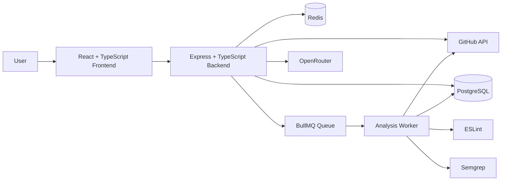

# CodeGuardian AI

CodeGuardian AI is a GitHub-integrated static code analysis platform that analyses JavaScript and TypeScript repositories using ESLint and Semgrep, presents normalized findings through a developer dashboard, and provides contextual AI explanations for individual findings.

**Repository:** [github.com/rithikamandiv-ux/codeguardian-ai](https://github.com/rithikamandiv-ux/codeguardian-ai)

---

## Overview

CodeGuardian bridges the gap between raw static-analysis output and useful developer insight.

Static-analysis tools such as ESLint and Semgrep can detect security, code-quality, bug-risk, and maintainability issues, but their raw findings are not always immediately understandable.

CodeGuardian provides a centralized workflow for connecting GitHub repositories, running asynchronous static analysis, reviewing normalized findings, tracking analysis history, filtering results, and requesting AI-assisted explanations for individual findings.

The AI component is intentionally separated from the detection pipeline.

**ESLint and Semgrep detect findings. AI only explains findings that have already been detected.**

---

## Problem

Static-analysis tools can produce large amounts of technical output containing rule identifiers, file locations, severity levels, and scanner-specific messages.

For developers who are unfamiliar with a particular rule, understanding why a finding matters and how it should be approached can require additional research.

CodeGuardian addresses this by:

- combining ESLint and Semgrep findings into a common internal format;
- presenting results through a developer-focused interface;
- preserving current and historical analysis results;
- providing filtering and repository-specific views;
- allowing users to request contextual AI explanations for individual findings.

This keeps finding detection deterministic while making the results easier to understand.

---

## Features

- **Local Authentication** — User registration and login with Redis-backed server-side sessions.
- **GitHub OAuth Integration** — Securely connect a GitHub account and access available repositories.
- **Repository Synchronization** — Work with public and private repositories available to the connected GitHub account.
- **Asynchronous Analysis Pipeline** — BullMQ and a dedicated worker process repository-analysis jobs outside normal HTTP requests.
- **ESLint Analysis** — Detect JavaScript and TypeScript code-quality and bug-risk issues.
- **Semgrep Analysis** — Perform rule-based static analysis for security-oriented patterns.
- **Normalized Findings** — Convert scanner-specific results into a common finding representation.
- **Interactive Dashboard** — View current finding metrics, severity distribution, category distribution, recent analyses, and repository information.
- **Analysis History** — Preserve historical analysis results for individual repositories.
- **Advanced Finding Filters** — Filter by repository, severity, category, scanner, and search terms.
- **Finding Details** — Inspect scanner information, rule identifiers, files, line information, and code context.
- **AI Explanations** — Generate structured explanations covering the issue, impact, possible scenario, and recommended approach.
- **Responsive Interface** — Developer-focused UI supporting desktop, tablet, and mobile layouts.
- **Reduced Motion Support** — Visual effects respect operating-system motion preferences.

---

## Architecture

CodeGuardian uses a **modular monolith architecture with a separate asynchronous analysis worker**.

It is not a microservices architecture.



### Frontend

The React frontend provides authentication screens, dashboard visualizations, repository management, analysis views, findings, filtering, and AI explanation interfaces.

### Backend

The Express backend contains the main application API and coordinates:

- authentication;
- GitHub integration;
- repository management;
- analysis creation;
- findings retrieval;
- dashboard data;
- AI explanation requests.

### Analysis Worker

Repository scanning is handled by a separate Node.js worker.

This prevents long-running repository analysis from blocking HTTP requests handled by the backend.

### PostgreSQL

PostgreSQL provides persistent storage for users, GitHub connections, repositories, analyses, findings, and AI explanations.

### Redis

Redis supports:

- authenticated sessions;
- temporary OAuth state;
- BullMQ queue infrastructure.

---

## Tech Stack

### Frontend

- React 19
- TypeScript
- Vite
- React Router
- TanStack Query
- Tailwind CSS
- shadcn/ui
- Radix UI
- ReactBits
- GSAP
- Lucide React
- Bklit chart components

### Backend

- Node.js
- Express
- TypeScript
- Argon2id

### Database

- PostgreSQL
- Prisma

### Infrastructure

- Redis
- BullMQ
- Docker
- Docker Compose

### Static Analysis

- ESLint
- Semgrep

### AI

- OpenRouter

### Integration

- GitHub OAuth
- GitHub API

---

## Project Structure

```text
codeguardian-ai/
├── frontend/              # React + TypeScript frontend
├── backend/               # Express REST API
├── worker/                # BullMQ analysis worker
├── packages/
│   └── database/          # Shared Prisma schema and database client
├── docker/                # Docker-related configuration
├── docs/                  # Project documentation
├── compose.yaml           # Local PostgreSQL / Redis infrastructure
├── package.json           # Root npm workspace configuration
└── README.md
```

The project uses npm workspaces to manage the frontend, backend, worker, and shared database package.

---

## Analysis Pipeline

1. **Request** — The user selects a GitHub repository and starts an analysis.

2. **Analysis Record** — The backend creates an analysis with `QUEUED` status.

3. **Queue** — A BullMQ job referencing the analysis is added to Redis.

4. **Worker** — The separate analysis worker receives the job and changes the analysis to `RUNNING`.

5. **Clone** — The repository is securely cloned into temporary storage.

6. **ESLint** — JavaScript/TypeScript linting and code-quality rules are executed.

7. **Semgrep** — Rule-based static analysis is performed.

8. **Normalization** — ESLint and Semgrep output is converted into CodeGuardian's common `Finding` representation.

9. **Persistence** — Findings are stored in PostgreSQL.

10. **Completion** — The analysis becomes `COMPLETED`, or `FAILED` if processing cannot finish successfully.

11. **Cleanup** — Temporary repository files and authentication helpers are removed.

12. **Frontend Update** — The dashboard, analysis pages, and findings views retrieve the updated state.

---

## AI Explanation Boundary

CodeGuardian deliberately separates **finding detection** from **AI explanation**.

### Detection

Findings are produced by deterministic tools:

- ESLint
- Semgrep

### Explanation

AI is only invoked after a finding already exists.

The AI receives bounded information related to the individual finding, including relevant metadata and a limited code-context snippet.

It generates four structured sections:

1. What is the issue?
2. Why does it matter?
3. How could this cause a problem?
4. Recommended approach

The complete repository is **not uploaded to the AI provider** as part of this feature.

AI is therefore an explanation layer, not CodeGuardian's vulnerability-detection engine.

---

## Security

Security measures implemented in CodeGuardian include:

- **Argon2id Password Hashing** — User passwords are never stored in plaintext.
- **Redis-Backed Sessions** — Authentication state is maintained server-side.
- **HttpOnly Cookies** — Session identifiers cannot normally be accessed through frontend JavaScript.
- **SameSite Cookies** — Authentication cookies use `SameSite=Lax`.
- **OAuth State Protection** — GitHub OAuth uses temporary, random, single-use state values stored in Redis.
- **Encrypted GitHub Tokens** — GitHub OAuth access tokens are encrypted at rest using AES-256-GCM.
- **Secure Repository Cloning** — Git credentials are provided through `GIT_ASKPASS` instead of embedding tokens in clone URLs or command-line arguments.
- **Temporary Repository Storage** — Cloned repositories are removed after analysis.
- **No Target Dependency Installation** — The analysis process does not intentionally install target-repository dependencies or execute project scripts.
- **Ownership Checks** — Repository, analysis, finding, and AI explanation access is scoped to the authenticated user.
- **Bounded AI Context** — AI receives limited context for an already-detected finding rather than unrestricted repository content.
- **Safe Source Rendering** — Repository code is rendered as text rather than injected as trusted HTML.

---

## Getting Started

### Prerequisites

Install:

- Node.js 20 or newer
- npm
- Git
- Docker
- Docker Compose
- Semgrep

You will also need:

- a GitHub account;
- a GitHub OAuth App;
- an OpenRouter API key if you want to use AI explanations.

---

### Clone the Repository

```bash
git clone https://github.com/rithikamandiv-ux/codeguardian-ai.git
cd codeguardian-ai
```

---

### Environment Configuration

Copy the provided environment template:

```bash
cp .env.example .env
```

Update `.env` with your own local credentials and secrets.

Never commit `.env`.

---

### Install Dependencies

From the repository root:

```bash
npm install
```

---

### Start Infrastructure

Start PostgreSQL and Redis:

```bash
docker compose up -d
```

---

### Run the Application

The application consists of three development processes:

```bash
npm run dev:frontend
npm run dev:backend
npm run dev:worker
```

Run them in separate terminal sessions if the root scripts do not run concurrently.

The frontend is available at:

```text
http://localhost:5173
```

The backend API is available at:

```text
http://localhost:3000
```

---

## Environment Variables

Refer to `.env.example` for the complete and current environment configuration.

Important categories include:

| Variable | Purpose |
|---|---|
| `DATABASE_URL` | PostgreSQL connection string |
| `REDIS_URL` | Redis connection configuration |
| `FRONTEND_ORIGIN` | Allowed frontend application origin |
| `GITHUB_CLIENT_ID` | GitHub OAuth App Client ID |
| `GITHUB_CLIENT_SECRET` | GitHub OAuth App Client Secret |
| `GITHUB_TOKEN_ENCRYPTION_KEY` | Encryption key used to protect stored GitHub access tokens |
| `OPENROUTER_API_KEY` | OpenRouter API key for AI explanations |

Never commit real credentials, access tokens, encryption keys, or database passwords.

---

## GitHub OAuth Setup

For local development:

1. Open **GitHub Settings → Developer settings → OAuth Apps**.
2. Create a new OAuth App.
3. Set the Homepage URL to:

```text
http://localhost:5173
```

4. Set the Authorization callback URL to:

```text
http://localhost:3000/api/github/callback
```

5. Copy the generated Client ID and Client Secret into your local `.env`.

The OAuth scope used by CodeGuardian allows repository access required for repository synchronization and private repository analysis.

---

## Usage

1. Register a CodeGuardian account.
2. Sign in.
3. Connect your GitHub account.
4. Authorize the configured GitHub OAuth App.
5. View repositories available through the connected GitHub account.
6. Select a repository.
7. Start an analysis.
8. Wait for the analysis to transition through `QUEUED` and `RUNNING`.
9. Review the completed findings.
10. Filter findings by repository, severity, category, scanner, or search term.
11. Open an individual finding to inspect its code context.
12. Select **Explain this finding** to request an AI-assisted explanation.

---

## API Overview

### Authentication

```text
POST /api/auth/register
POST /api/auth/login
POST /api/auth/logout
GET  /api/auth/me
```

### GitHub

```text
GET    /api/github/connect
GET    /api/github/callback
GET    /api/github/repositories
GET    /api/github/status
DELETE /api/github/disconnect
```

### Repository Analysis

```text
POST /api/repositories/:repositoryId/analyses
GET  /api/repositories/:repositoryId/analyses
```

### Analyses

```text
GET /api/analyses
GET /api/analyses/:analysisId
GET /api/analyses/:analysisId/findings
```

### Findings

```text
GET /api/findings
GET /api/findings/:findingId
```

Global findings support filters including:

```text
repositoryId
severity
category
sourceTool
search
page
limit
```

### AI Explanation

```text
POST /api/findings/:findingId/explanation
```

---

## Engineering Decisions

| Decision | Reason |
|---|---|
| Modular monolith | Keeps backend architecture structured without unnecessary microservice complexity |
| Separate analysis worker | Prevents repository scanning from blocking HTTP requests |
| BullMQ | Provides Redis-backed asynchronous job processing and worker coordination |
| Redis sessions instead of JWT | Keeps authentication state server-controlled and simplifies invalidation/logout |
| PostgreSQL | Provides relational persistence for repositories, analyses, findings, users, and AI explanations |
| Shared Prisma package | Keeps database schema and generated database access consistent across workspaces |
| ESLint + Semgrep | Combines complementary code-quality and security-oriented static analysis |
| AI explanation only | Keeps finding detection deterministic and limits generative-AI responsibility |
| AES-256-GCM token encryption | Protects GitHub access tokens stored by the application |
| Latest completed analysis for current findings | Separates current repository state from historical analysis records |
| Route-level code splitting | Reduces the amount of JavaScript required during initial frontend loading |
| Lazy-loaded WebGL background | Prevents Three.js/Dither from blocking initial application rendering |

---

## Current Scope / Limitations

CodeGuardian currently focuses on:

- JavaScript
- TypeScript
- JSX
- TSX
- GitHub-hosted repositories
- ESLint
- Semgrep
- manually triggered repository analysis
- contextual AI explanation of individual findings

The current portfolio scope intentionally does not include:

- AI-based vulnerability detection;
- automatic code fixes;
- dependency vulnerability scanning;
- webhook-triggered automatic scanning;
- pull-request bots;
- notifications;
- team or organization management;
- billing;
- automated security scoring;
- multi-language scanning beyond the current JavaScript/TypeScript scope.

---

## Quality / Testing

Final Stage 5 quality assurance verified:

- authentication and session persistence;
- GitHub OAuth connection;
- repository synchronization;
- real GitHub repository analysis;
- BullMQ worker execution;
- ESLint and Semgrep processing;
- dashboard updates after completed analyses;
- global findings and filtering;
- finding details and code context;
- AI explanation generation;
- responsive layouts from desktop to narrow mobile widths;
- reduced-motion behavior;
- route-level error handling;
- TypeScript production builds;
- frontend route-level code splitting;
- lazy loading of the Three.js/WebGL background.

The final frontend production build is split into route and vendor chunks so heavy WebGL dependencies are not required on the initial application path.

---

## License

This project is licensed under the **MIT License**.

See the [`LICENSE`](LICENSE) file for details.

---

## Author

### Rithika Mandiv

**Software Engineering Undergraduate**  
**Full-Stack Developer**

- GitHub: [@rithikamandiv-ux](https://github.com/rithikamandiv-ux)
- Portfolio: [rithikamandiv.vercel.app](https://rithikamandiv.vercel.app)
- LinkedIn: [Rithika Mandiv](https://www.linkedin.com/in/rithika-mandiv/)

---

CodeGuardian AI was developed as a software engineering portfolio project focused on static analysis, secure full-stack architecture, asynchronous processing, GitHub integration, and responsible AI-assisted developer tooling.