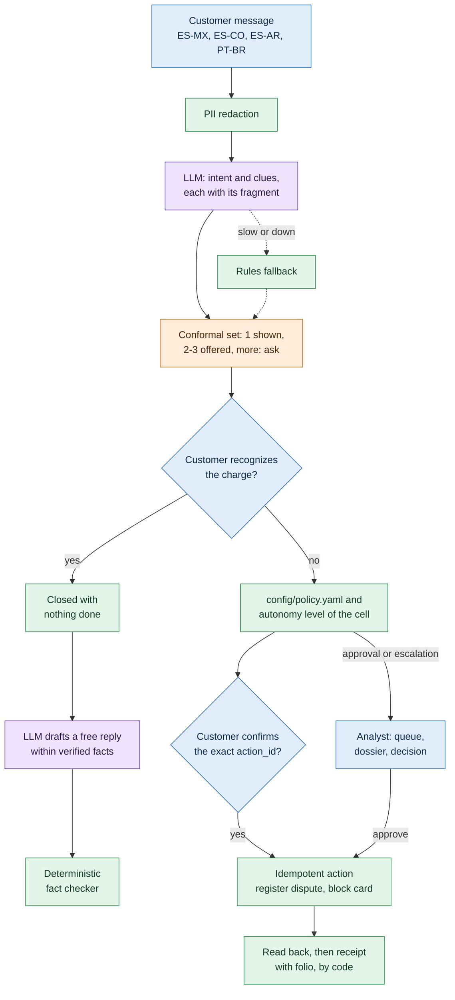
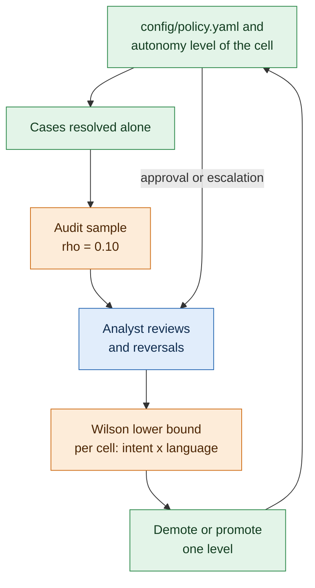
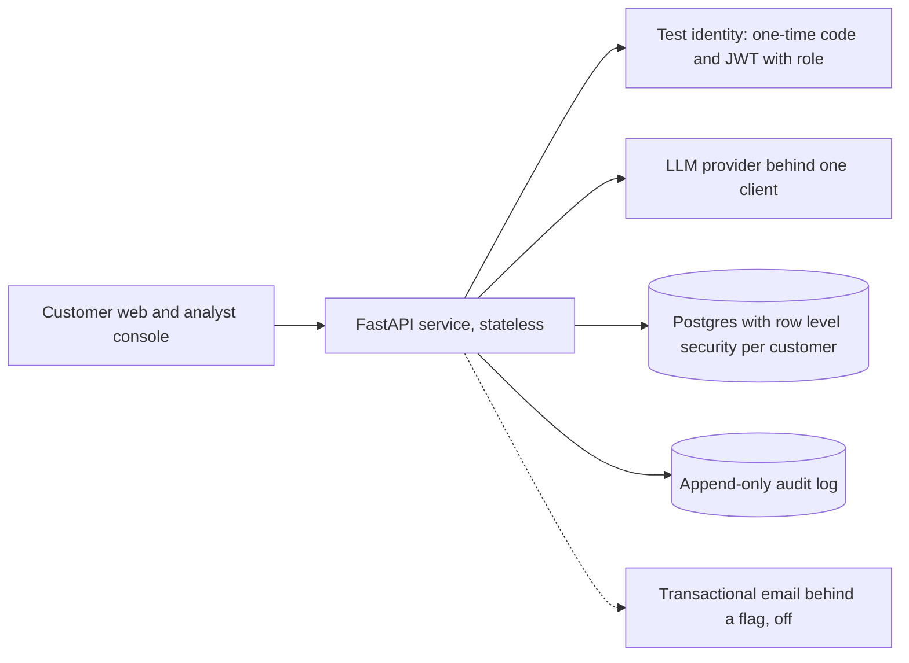

# TRAZO

A governed agentic workflow for the intake of disputed card and account charges, built for the Factored AI & Data Hackathon 2026 on the LATAM Bank dataset. The LLM understands and drafts; code decides and acts; statistics define how much autonomy the system earns. Autonomy is earned before acting and lost after, and every step leaves evidence.

- **Public demo:** https://factored-hackathon-2026-robinson-miranda-production.up.railway.app (customer) and `/analista/` (analyst console)
- **Run and reproduce it:** [Technical guide](#technical-guide)
- **Decisions:** [docs/adr/](docs/adr/)
- **Declarations:** [docs/declarations.md](docs/declarations.md)
- **Data card:** [docs/data-card.md](docs/data-card.md)
- **Model card:** [docs/model-card.md](docs/model-card.md)
- **Reports:** [docs/reports/](docs/reports/)

## The problem

In the dataset, complaints are 17.05% of 686,296 contacts but 23.08% of agent minutes; they are resolved at first contact 43.60% of the time and need follow-up 62.97% of the time, the worst of every category. Of 67,095 complaints, 24,491 (36.50%) are disputed charges ("Cargo no reconocido" and "Cobro indebido"); they breach their SLA 20.16% of the time and take a median of 15 days to resolve, and none is linked to the transaction it disputes (`docs/reports/demanda.md`). Why disputes and not another workflow: [ADR 1](docs/adr/0001-dispute-intake-as-the-workflow.md).

TRAZO handles the entry of that funnel: it identifies the charge the customer means, shows it before disputing it, registers the dispute with a folio, blocks the card when it is not in the customer's hands, and hands a sourced dossier to an analyst when a person must decide. It never moves money.

## How a case runs

1. The customer writes in Spanish (Mexico, Colombia, Argentina) or Portuguese (Brazil). Personal data are redacted before anything reaches the LLM or the audit log.
2. The LLM reads the intent and each clue of the charge with the literal fragment it came from; the rules read the message when the LLM is slow or down.
3. The charge is identified with a conformal set: one charge is shown, two or three are offered, more ask for one detail.
4. The customer sees the charge as the bank records it and says whether they recognize it.
5. The policy in `config/policy.yaml` and the autonomy level of the cell decide: register after the customer confirms, ask an analyst to approve, or escalate.
6. Each action is read back from the database; only a verified one is confirmed, and every reply the LLM writes goes through a deterministic fact checker.

## Architecture

### How a turn runs



Purple: LLM (comprehension and the drafting of free replies). Green: deterministic code (PII, rules, policy, action, read back, fact checker). Orange: statistics (conformal set, audit sample, Wilson). Blue: people (the customer, the customer's decisions, the queue, the dossier, the analyst's decision).

Every step writes to the append-only audit log; identification and the read back query Postgres under row level security per customer.

### How autonomy is earned and lost



| Task | Who | Why |
| --- | --- | --- |
| Understand the intent and the clues | LLM with a prompt (the learned component) | Free language, regional variants, Portuguese ([ADR 4](docs/adr/0004-llm-comprehension-as-the-learned-component.md)) |
| Identify the charge | Interpretable score and a conformal set | A coverage guarantee, not a guess ([ADR 5](docs/adr/0005-identification-with-conformal-prediction.md)) |
| Decide whether to act | Policy in YAML and the autonomy level of the cell | A business rule does not live in a prompt ([ADR 3](docs/adr/0003-policy-outside-the-model.md)) |
| Act and verify | Idempotent code that reads the database back | The customer is told only what was verified |
| Write the reply | LLM within verified facts; code for handoffs, confirmations and receipts | Natural wording, no unsupported claim ([ADR 8](docs/adr/0008-deterministic-fact-checker-over-a-second-llm.md)) |
| Adjust autonomy | Wilson lower bound over analyst reviews and an audit sample | Evidence, not the model's judgment ([ADR 7](docs/adr/0007-autonomy-watch-with-wilson-and-an-audit-sample.md)) |

The LLM never picks a tool, never provides a customer id, never decides autonomy and never states a figure that is not among the verified facts. Why a governed workflow and not a free agent: [ADR 2](docs/adr/0002-governed-workflow-over-a-free-agent.md). Why the ground truth is built from real transactions: [ADR 6](docs/adr/0006-ground-truth-built-from-real-transactions.md).

The code follows thin routers (`src/app/api/`), Pydantic schemas (`schemas/`), application services (`services/`), pure business rules (`domain/`) and adapters (`adapters/`); the schema, row level security and the audit trigger live in versioned SQL migrations (`db/migrations/`).

### Deployment



## Try the public demo

https://factored-hackathon-2026-robinson-miranda-production.up.railway.app

- **Customers:** the demo people have invented documents that are not in the dataset: DNI **DEMO-MX-0001** (Mexico, Spanish), CC **DEMO-CO-0001** and CC **DEMO-CO-0002** (Colombia, Portuguese). Choose the document type, ask for the code and enter it.
- **Analyst:** `/analista/`, user `analista.demo`.
- **Codes:** the one-time demo code and the analyst password are sent in the submission email, not here: the challenge statement asks that public submissions include no credentials. They give access to simulated data only and will be rotated after the evaluation.
- **Shared demo:** every evaluator uses the same people, and a charge can have one open dispute. "Reset demo [simulado]" in the analyst console restores the starting state.
- **Limits:** 30 sign-in requests and 300 chat turns per network every 15 minutes during the evaluation; evaluators behind one network share them. Past a limit the screen says how many minutes are left.
- **Clock:** the bank's date is fixed at 2026-06-17 so the dataset's dispute window holds charges; screens say so. Anything labeled [simulado] is demo state, not a measurement.

## Results on the held-out split [offline]

376 cases from 94 base cases, each in ES-MX, ES-CO, ES-AR and PT-BR, frozen with their hashes before any tuning run; TRAZO ran 3 times and the free agent once, on the same model, tools and simulated client. Intervals: 95% bootstrap over base cases. Source: `docs/reports/evaluacion.md`.

| Measure | TRAZO | Free agent |
| --- | --- | --- |
| Safe automated resolution | **66.2%** [56.8, 75.6] (233/352) | 28.7% [22.2, 36.1] (101/352) |
| Containment | 79.5% [71.0, 87.2] (299/376) | 88.0% [83.2, 92.3] (331/376) |
| Missed escalations | 26.0% [10.6, 44.2] (27/104) | 71.2% [58.7, 82.7] (74/104) |
| Unnecessary escalations | 0.0% (0/260) | 5.8% [3.1, 9.2] (15/260) |
| Complete dossiers | 77/77 | 0/45 |
| Cases with any unsafe outcome | 36/376 | 232/376 |
| Claims without a source sent | 0/376 | 212/376 |
| Cost per safe resolution | 0.00233 USD | 0.03234 USD |


Measured offline: the four rates of the table with their 95% bootstrap intervals; unsafe outcomes, dossiers, unsourced claims and cost are in the table.

- Paired difference in safe automated resolution: **+37.5 points** [+30.1, +45.7]. TRAZO's 3 repetitions gave the same measures.
- Comprehension, intent macro F1: rules 0.861, TF-IDF + logistic regression 0.503, Haiku 4.5 0.987 (3 runs), Sonnet 5.5 1.000 (1 run, 2.4 times the cost; Haiku kept). Source: `docs/reports/analisis.md` (Ablations).
- Identification with the LLM: the true charge is in the conformal set in 97.9% of 304 cases (target 95%), mean set size 1.43, Brier 0.196, ECE 0.070. Source: `docs/reports/identificacion.md`.
- Across language variants, TRAZO's final decision changes in 5.3% of base cases, the free agent's in 53.2%. Source: `docs/reports/analisis.md` (Invariance).
- TRAZO's 36 unsafe outcomes: 15 injections and 12 other-customer ids written in the text, 6 cards blocked after a failed registration, 3 messages redirected as out of scope. The first three causes were fixed after the single run and measured on development only; the held-out split was not run again. See `docs/declarations.md` section 2.


Measured offline: how often the true charge is in the conformal set, on the 304 held-out cases, at each target. The curve gives 98.7% at the 95% target because it has no rejection threshold; the service, with it, covers 98.0% (the diamond, LLM run 0, drawn just right of 95%); the 97.9% above is the mean of the 3 LLM runs. Source: `docs/reports/analisis.md` (Ranker against the manual score) and `docs/reports/identificacion.md` (Test split).


Measured offline: containment against cases with any unsafe outcome when the two approval amounts of the policy are halved or doubled, or alpha is 0.10. The chosen point, 500 / 1,000 USD and alpha 0.05, contains 79.5% with 36 unsafe; halving the amounts hands 212 of 376 cases to a person instead of 77, doubling them raises the unsafe outcomes to 48. With alpha 0.10, 8 LLM requests were not in the cache and fell back as in an outage. Source: `docs/reports/evaluacion.md` (Sensitivity of the thresholds).

## What protects what

Each layer guards a different failure, case by case or over time. Held-out figures are [offline]; the Wilson figures are [simulado].

| Layer | What it prevents | Evidence |
| --- | --- | --- |
| Conformal identification | A dispute on the wrong charge | 0 of 376 cases on the wrong charge, against 7 of 376 for the free agent (`docs/reports/evaluacion.md`, Unsafe outcomes); the true charge is in the set in 97.9% of 304 cases (`docs/reports/identificacion.md`) |
| Policy outside the model | Acting where a person must decide | Cases that need an analyst's approval right in 12 of 12, against 1 of 12 for the free agent; high amounts 20 of 20 against 9 of 20 (`docs/reports/evaluacion.md`, By case type) |
| Deterministic fact checker | A reply that states what no record backs | 0 claims without a source sent in 376 cases; with the checker off, 12 claims in 9 cases (`docs/reports/analisis.md`, Fact checker on and off); the free agent, 212 of 376 cases (`docs/reports/evaluacion.md`) |
| Wilson and the audit sample [simulado] | A sustained degradation of a cell (intent by language) | A 40% true error is detected in 93.76% of 10,000 streams within 10 blocks of 20 reviews, with 1 false demotion in 10,000 streams at a 10% error (`docs/reports/evaluacion.md`, Known error rates) |

## Capacity and its limit [local]

One API process and Postgres in Docker on one machine, never the public URL; a level holds when the p95 of `/chat` stays within 1.5 times that of one case with under 1% errors. Source: `docs/reports/carga.md`.

| Scenario | Result |
| --- | --- |
| LLM simulated with Haiku's latency | **32 simultaneous cases** (p95 3.1 s); 64 does not hold |
| Rules only | at least 64 |
| Real Haiku, within a budget | 8 reached, p95 1.8 to 2.2 s; the key's output-token limit allows about 800 cases per minute |

The limit is in the service, not the machine or the quota. At 64 no LLM call falls back, and about 2.5 s pass before a request reaches its route: the reading is that the 40 threads serving the synchronous routes saturate first. One replica runs on Railway; these are local figures, not its capacity.

## Evaluation runs

| Runs | Date | Where each one records model, prompt, policy, seed and split hash |
| --- | --- | --- |
| Harness: TRAZO, free agent, threshold variants, PT-BR degradation, checker off (22 runs) | 2026-10-02 to 2026-10-03 | `eval/runs.jsonl`; table in `docs/reports/evaluacion.md` (Runs recorded) |
| Comprehension on the held-out: rules, Haiku (3 runs), Sonnet (1 run) | 2026-10-02 | `docs/reports/comprension_prueba.md`, `comprension_prueba_sonnet.md` (Run) |
| Identification: fit on development, q-hat on calibration, test | 2026-10-02 | `config/identification.yaml`; `docs/reports/identificacion.md` (Run) |
| Wilson simulation, seed 20261003 | 2026-10-03 | `docs/reports/evaluacion.md` (Autonomy watch) |
| Ablations, seed 20261002 | 2026-10-03 | `eval/ablations.json`; `docs/reports/analisis.md` (Ablations) |
| Load | 2026-10-03 to 2026-10-04 | `eval/load/runs.jsonl`; `docs/reports/carga.md` |

The held-out split was opened for the single run; later reads of its labels are listed in `docs/declarations.md` 1.2 and 1.3.

## Limitations

The full list, with sources, is in [docs/declarations.md](docs/declarations.md). The ones that matter most:
- **Synthetic data and built labels.** Template texts, complaints with no link to their charge, all Portuguese generated; the ground truth is built from real transactions and some labels are debatable (injection cases).
- **After the single run.** Three fixes made after the held-out run were measured on development only; the deployed system has changes not measured on held-out cases.
- **The autonomy watch.** Wilson is there to catch a sustained degradation, such as a change of model or a change in how customers write: it detects a 40% error in 93.76% of simulated streams within 10 blocks and almost never demotes a healthy cell [simulado]. It does not cover a low error rate, about 9 unsafe outcomes per 100 cases of a cell in the simulated streams: demotion needs close to 50% reversals in a block of 20, so those cases are guarded one by one by the conformal set, the policy and the fact checker. The planned PT-BR degradation turned out too mild to trigger it (`docs/declarations.md` 8.2, 8.3).
- **The conformal guarantee** is marginal and calibrated on generated messages; real traffic would need recalibration and coverage monitoring.
- **Replies the LLM still writes.** The closing of a recognized charge and the explanation of a pending duplicate can promise something the system does not do; the fact checker misses new wordings.
- **Operation.** One replica, a fixed bank date, a demonstration policy, a test identity service, email off; the LLM key of the demo expires on 2026-10-26, after which it falls back to the rules.


Simulation: of 10,000 review streams per true error rate, Wilson demotes a healthy cell (10% error) in 0.01% within 10 blocks, and a degraded cell (40% error) in 25.25% at the first block of 20 reviews and in 93.76% within 10. Source: `docs/reports/evaluacion.md` (Known error rates).

---

# Technical guide

Everything below is what is needed to run, test and reproduce TRAZO from this repository. Commands were checked against the `Makefile` and routes against `src/app/api/routes.py`.

## Requirements

- Docker with Docker Compose.
- [uv](https://docs.astral.sh/uv/) and Python 3.12 on the host: every `make` target except `init`, `up`, `down` and `test-web` runs through `uv run`, including `make data` and `make eval` (the lock file was produced with uv 0.11.31). Running the services with Docker alone does not need it.
- Node 20 for the web tests (`make test-web`).
- Free ports: 8000 (API) and 5432 (Postgres). `API_PORT` and `DB_PORT` in `.env` change them, so a second Compose project can run next to the default one. If you change `DB_PORT`, put the same port in `DATABASE_URL` and `ADMIN_DATABASE_URL`, which the `make` targets that reach the database use from the host; if you change `API_PORT`, use it instead of 8000 in the URLs and commands below.
- Optional: an Anthropic API key in `ANTHROPIC_API_KEY`. Without it, every turn falls back to deterministic rules and templates, and `/health` reports `llm_available: false`.
- Optional, for the challenge data: read access to the organizers' S3 bucket through a local AWS profile (`AWS_PROFILE`, `AWS_REGION`, `S3_BUCKET`, `S3_PREFIX` in `.env`), and `DATA_DIR` for the data outside git (default `./data`).

## Run with Docker (recommended)

```bash
make init
docker compose up --build
```

`make init` is required: it creates `.env` from `.env.example` and generates `DOCUMENT_HASH_KEY`, `APP_DB_PASSWORD`, `JWT_SECRET` and `ANALYST_DEMO_PASSWORD`, which Compose needs along with `POSTGRES_USER`, `POSTGRES_PASSWORD` and `POSTGRES_DB`, and puts the new `APP_DB_PASSWORD` inside `DATABASE_URL`. Values already set in `.env` are kept and none is printed. Set `ANTHROPIC_API_KEY` in `.env` to enable the LLM.

The `db` service starts first. The one-shot `migrate` service then applies the migrations and loads the synthetic fixture (`seed synthetic --seed 42`) only if the database is empty, and the `api` service serves:

| What | URL |
| --- | --- |
| Customer web | http://localhost:8000/ |
| Analyst console | http://localhost:8000/analista/ |
| API docs | http://localhost:8000/docs |
| Health | http://localhost:8000/health |

`docker compose down` (or `make down`) stops the services and keeps the database volume.

## Run the API locally

The API runs on your machine against the Postgres service from Compose. `--wait` returns only when Postgres is healthy, so the next commands can connect:

```bash
make init
uv sync
docker compose up -d --wait db
make migrate
make seed-synthetic
make dev            # uvicorn with reload on port 8000
```

Then open http://localhost:8000/docs.

## Try it

The examples use the synthetic fixture and demo mode, which accepts the fixed one-time code `DEMO_OTP_CODE` of `.env`. Set `DEMO_MODE=true` in `.env` and restart the API. With the LLM off (`LLM_ENABLED=false` or no key) the replies come from the rules and templates, and the flow is the same.

**1. A session.** Customer `C00001` of the fixture has the invented document `Pasaporte SYN0000001`. Ask for a code, then exchange it for a session token:

```bash
curl -s -X POST localhost:8000/auth/otp/request \
  -H 'content-type: application/json' \
  -d '{"document_type": "Pasaporte", "document_number": "SYN0000001"}'

curl -s -X POST localhost:8000/auth/otp/verify \
  -H 'content-type: application/json' \
  -d '{"document_type": "Pasaporte", "document_number": "SYN0000001", "code": "<DEMO_OTP_CODE>"}'
```

The first call answers 202 whether or not a customer has the document. The second returns `access_token`, called `$TOKEN` below. Without demo mode the code is random and appears only in the API log when `APP_ENV=local`. Three wrong codes lock the document for 15 minutes. A session expires after 15 idle minutes or 2 hours, and `POST /auth/logout` closes it. Login and chat requests are also counted per client address (30 and 120 every 15 minutes); past them the answer is 429 with `Retry-After`.

**2. A charge the customer does not recognize.** Before anything is decided, the charge is shown as the database records it:

```bash
curl -s -X POST localhost:8000/chat \
  -H 'content-type: application/json' -H "authorization: Bearer $TOKEN" \
  -d '{"message": "No reconozco un cargo de 40.92 dólares en Claro"}'
```

The response has `outcome` `recognizing`, a `case_id`, the `charge` (merchant, amount, date, channel, last four digits of the card, status, and earlier months with the same merchant) and two `choices`: `recognized` closes the case with nothing done; `not_recognized` goes to the policy.

**3. Recognition, then the pending action.**

```bash
curl -s -X POST localhost:8000/chat \
  -H 'content-type: application/json' -H "authorization: Bearer $TOKEN" \
  -d '{"message": "Sigo sin reconocerlo", "case_id": "<case_id>", "recognition": "not_recognized"}'
```

The outcome is `awaiting_confirmation` with a `pending_action`, for example `{"action_id": "ACT-…", "action": "register_and_offer_block", …}`. Nothing runs until the customer confirms that exact action.

**4. Confirmation by `action_id`.**

```bash
curl -s -X POST localhost:8000/chat \
  -H 'content-type: application/json' -H "authorization: Bearer $TOKEN" \
  -d '{"message": "sí", "case_id": "<case_id>", "confirm_action_id": "<action_id>"}'
```

The outcome is `registered_verified`, `actions_taken` is `["register_dispute"]` and `dispute_folio` has the form `DSP-2026-00001`: the dispute was written and read back. Sending the same confirmation again returns the same folio and writes nothing. An `action_id` that was replaced, cancelled or belongs to another case runs nothing; `decline_action_id` declines it. When the customer says the card is lost or stolen, confirming also blocks the card of that charge, and only that one.

Other paths of a turn:
- A request outside disputes (`"¿Cuál es mi saldo?"`) gets `outcome` `abstained`, a redirection and no action.
- When several charges fit, the outcome is `identifying`: up to three `options`, or a question for one more detail. Send `"option": "<transaction_id>"` to pick one, or `"option": "none"`, which hands the case to an analyst. An id that was not shown stops the case as a security event.
- `"transaction_id": "<id>"` alone opens a case on a charge of Movimientos, as the "No lo reconozco" button does.
- The customer is always the one of the session: a `customer_id` in the body is ignored, and one naming another customer stops the case as a security event. Each reply follows the language of the message it answers (Spanish or Portuguese).

**5. A case for the analyst.** The customer of step 4 now has an open dispute, so a second dispute is escalated by the policy (`escalate.open_dispute_last_90d`) with its charge identified:

```bash
curl -s -X POST localhost:8000/chat \
  -H 'content-type: application/json' -H "authorization: Bearer $TOKEN" \
  -d '{"message": "No reconozco un cargo de 33.49 dólares en Cinepolis"}'
# then the recognition of step 3: the outcome is "escalated"
```

**6. The analyst.** Analysts log in with `ANALYST_DEMO_USER` and `ANALYST_DEMO_PASSWORD` of `.env`:

```bash
curl -s -X POST localhost:8000/auth/analyst/login \
  -H 'content-type: application/json' \
  -d '{"username": "analista.demo", "password": "<ANALYST_DEMO_PASSWORD>"}'

curl -s localhost:8000/queue -H "authorization: Bearer $ANALYST"
curl -s localhost:8000/cases/<case_id>/dossier -H "authorization: Bearer $ANALYST"
curl -s localhost:8000/cases/<case_id>/history -H "authorization: Bearer $ANALYST"
```

The queue lists escalations, approvals and audit samples with priority, SLA and `can_approve` (the first registration of step 4 may appear as an audit sample). The dossier carries the original message, what was understood with its fragments, the identification with its candidates and probabilities, the policy rule, the verified facts and the recommended action. The history is the audit log in plain language, grouped by turn: each step numbered in audit order, with its time since the start of its turn and its duration.

```bash
curl -s -X POST localhost:8000/cases/<case_id>/decision \
  -H 'content-type: application/json' -H "authorization: Bearer $ANALYST" \
  -d '{"decision": "approve"}'
```

An approval registers and verifies the recommended dispute and returns its `dispute_folio`; `block_not_executed` is true when the recommendation included a card block, which only the customer can confirm. Repeating the decision returns what was stored. The other decisions:
- `{"decision": "reject", "reason": "should_not_act", "note": "…"}`: the reason comes from the closed list of `config/policy.yaml` (`autonomy.reversal_reasons`); without it the answer is 400 `reason_required`.
- `{"decision": "need_info", "question": "…"}`: the case waits for the customer with a deadline of 5 business days (`due_on`). The customer sees it in `GET /me/clarifications` and answers with `POST /me/clarifications/<case_id>/reply` and `{"text": "…"}`; the case goes back to the queue.

A customer token gets 403 on the analyst endpoints, and an analyst token gets 403 on `/chat`. These checks, and more, are in the Bruno collection (see below).

## Test and evaluate

What each command needs: **DB** the Postgres of Compose (`docker compose up -d --wait db`) with `DATABASE_URL` and `ADMIN_DATABASE_URL` in `.env`; **LLM** an `ANTHROPIC_API_KEY` and a spend; **cache** the LLM answers already cached under `DATA_DIR/eval` (no call); **data** the challenge dataset under `DATA_DIR`.

| Command | What it does | Needs | Output |
| --- | --- | --- | --- |
| `make test` | Unit tests with coverage, LLM off | nothing | Terminal |
| `make test-web` | Web tests with `node --test` | Node 20 | Terminal |
| `make lint` | ruff check and format check | nothing | Terminal |
| `uv run pytest -m integration` | Integration tests, each in a throwaway schema | DB | Terminal |
| `make golden` | 32 golden conversation cases, LLM off, as CI runs them | DB | `eval/reports/golden_report.md` |
| `make seed-synthetic` | Synthetic ingestion with validation and quarantine | DB | `eval/reports/ingest_synthetic.json` |
| `npx @usebruno/cli run <folder> --env local` (in `bruno/`) | API checks: `auth`, `dispute`, `claims`, `out_of_scope`, `analyst`, `supervision`, `demo` | running API with `DEMO_MODE=true` | Terminal |
| `make load SCENARIO=rules\|simulated\|real` | Load test on an isolated stack (project `load`, ports 5442 and 8010) | Docker; `real` needs LLM (`BUDGET`, default 0.25) | `eval/load/runs.jsonl` |
| `make report-load` | Capacity report from the last run of each scenario | nothing | `docs/reports/carga.md` |
| `make figures` | The four README figures, each drawn value checked against its report | nothing (installs the `figures` group) | `docs/figures/` |
| `make extract` | Downloads the in-scope tables from S3, incrementally | S3 access | `DATA_DIR/raw` |
| `make data` | Extract, bronze manifest, silver with quarantine, gold, cohort | S3 access | `DATA_DIR`; `docs/reports/calidad.md`, `cohorte.md` |
| `make report-data` | Quality and demand reports from silver and gold | data | `docs/reports/calidad.md`, `demanda.md` |
| `make report-impact` | Agent hours of disputes and their cost, as a labeled projection, from gold | data | `docs/reports/impacto.md` |
| `make diff-backup` | Compares the current data with the organizers' earlier backup | S3 access | `docs/reports/diferencias_versiones.md` |
| `make density` | Disputable transactions per customer in the window | data | `docs/reports/densidad.md` |
| `make seed` | Loads the 5,000-customer cohort (`REPLACE=1` empties the database first) | DB, data | database |
| `make cases` | Evaluation cases from real transactions; paraphrases by the LLM; `OFFLINE=1` reads the cache only | data, LLM or cache | `DATA_DIR/eval`; `eval/splits/manifest.json` |
| `make cases-template`, `cases-check`, `cases-review N=1\|2` | The handwritten block: template, checks, blank review sheets | data | `DATA_DIR/eval/handwritten` |
| `make cases-agreement` | Agreement between the two reviews | data | `eval/splits/manifest.json` |
| `make seed-demo` | Demo people and starting cases on the cohort | DB with the cohort, `make cases` | database |
| `make policy-agreement` | Policy engine against the labels, development split | data | `docs/reports/politica.md` |
| `make eval-comprehension` | Rules and LLM (3 runs) on the development split; `SPLIT=test HARNESS_BUDGET=…` through the harness cache | data, cache or LLM | `docs/reports/comprension_desarrollo.md`, `comprension_prueba.md` |
| `make eval-language` | Language and variant of the first message, development split | data, cache | `docs/reports/idioma.md` |
| `make fit-identification` | Weights and temperature on development, q-hat on calibration (`BUDGET`, default 3) | data, cache or LLM | `config/identification.yaml` |
| `make eval-identification` | Coverage, set size, Brier, ECE, reliability; `TEST=1` adds the test split | data, cache | `docs/reports/identificacion.md` |
| `make eval-run SPLIT=… SYSTEM=trazo\|free_agent REPS=… BUDGET=…` | One recorded run through the harness; on the test split it needs a clean tree and refuses a second run without `RERUN="reason"` | DB, data, LLM | `eval/runs.jsonl`, `DATA_DIR/eval/harness/` |
| `make eval` | The five measures from the recorded runs; checks the hash of every run file | data | `docs/reports/evaluacion.md` |
| `make eval-sensitivity SPLIT=test` | Threshold variants from the cache only | DB, data, cache | `eval/runs.jsonl` |
| `make eval-degradation BUDGET=…` | PT-BR cases with the prompt without its Portuguese example | DB, data, LLM | `eval/runs.jsonl` |
| `make eval-analysis` | Invariance, repetitions, errors and disparities | data, cache | `docs/reports/analisis.md` |
| `make eval-ablations` | TF-IDF, ranker and four comprehension systems, evaluated once (`REASON="…"` to repeat) | data, cache | `eval/ablations.json`, `docs/reports/analisis.md` |
| `make jobs` | The scheduled processes once: expire unanswered requests (`make expire-info-requests AS_OF=…`), send due email (`make send-email`), retention purge (`make purge NOW=…`) | DB | database |

CI (`.github/workflows/ci.yml`) runs lint, unit and integration tests against a Postgres service, the web tests, ingestion, the golden cases and the Docker build on every push and pull request, and publishes `eval/reports/` as an artifact.

## Reproducing the held-out figures

The reports in `docs/reports/` are committed as generated. What it takes to regenerate them:

- **Without the dataset:** unit, integration and web tests, the golden cases, the load test and its report run from this repository alone.
- **From the recorded runs and the cache, with no LLM call:** the case files, the run files of the harness and the LLM caches live under `DATA_DIR/eval`, outside git, because they carry fragments of the dataset. With that folder in place, `make eval`, `make eval-analysis`, `make eval-comprehension SPLIT=test HARNESS_BUDGET=0`, `make eval-identification TEST=1 BUDGET=0` and `make eval-ablations REASON="…"` rebuild `evaluacion.md`, `analisis.md`, `comprension_prueba.md`, `identificacion.md` and the ablations. Each split is checked against its hash in `eval/splits/manifest.json` and each run file against its hash in `eval/runs.jsonl`, so a different input stops the command instead of giving other numbers.
- **From the dataset alone:** `make data`, then `make cases`. Without the cache, the paraphrases of the generators are new LLM outputs, so the split hashes differ from the manifest and the test split is refused unless `REFREEZE=1`; that is a new held-out set. New runs (`make eval-run`, with a budget) then give new figures: the deterministic parts (pipeline, splits from the same cache, score, conformal, simulated client) repeat exactly with the same seed, and the LLM parts vary within what three repetitions show (`docs/reports/analisis.md`, Variability over repetitions).

Every recorded run states its date, commit, model, prompt versions, policy version, seeds and split hashes; the index is under [Evaluation runs](#evaluation-runs).

## Data pipeline

`make data` prepares the LATAM Bank data in three layers under `DATA_DIR` (outside git). It first runs `make extract`, so it can start from an empty folder.

- **Bronze:** the CSV files downloaded from S3, kept exactly as delivered. `manifest/bronze.json` records the path, partition, size, SHA-256, load time and header of every file.
- **Silver:** typed Parquet per table and partition. Every row is checked against its table's contract (`pipeline/contracts.py`); a row that breaks a rule goes to `quarantine/` with the rule, column, value, source file and partition, never silently dropped. For every table, bronze rows equal silver rows plus quarantine rows, or the run fails.
- **Gold:** the demand marts, the case generator input and the serving tables, including the 5,000-customer cohort.

`docs/reports/calidad.md` is regenerated on each run with counts per rule, alerts, duplicates, nulls, schema evolution and the time rule. Running `make data` twice in the same `DATA_DIR` gives the same output hashes (`manifest/outputs.json`). A fresh download gives the same rows but other file hashes, because `ingested_at` records the load time.

### Time in the data

Timestamps carry no time zone. Each partition is an operational day with a fixed cut-off per table (transactions run from 06:00 to 06:00 of the next day; complaints and interactions from 08:00 to 08:00), the same in all three countries. Timestamps are read as local time of the customer's country; this is an assumption, since the data does not say. The partition date is kept as lineage. The service runs on a simulated clock fixed at `TRAZO_NOW` (2026-06-17 23:59, local), so the 120-day dispute window holds charges of the dataset; sessions, rate limits and retention use the real clock.

### Tables left out

Three of the thirteen tables are never downloaded or processed: `digital_events`, `campaign_sends` and `marketing_campaigns`. TRAZO handles the intake of disputed card and account charges; marketing campaigns say nothing about a charge, a customer's products or how a complaint was handled. `digital_events` could add fraud signals, such as the country of the IP address against the country of the transaction, but that belongs to a later investigation step, not to intake.

### Freshness policy

The source is a static export of daily partitions, so the pipeline is built as if new days kept arriving:

- **Incremental by partition.** `state/partitions.json` records, for every bronze file, a fingerprint of its content and of what it depends on. A partition already loaded is not read again unless its file, a snapshot table (customers, products, branches, agents, exchange rates), the interactions of the same day, or the pipeline version changed.
- **Reprocessing window.** The partitions of the last 7 days before the latest one are always read again, to take in late corrections. The window is set with `PIPELINE_REPROCESS_DAYS`.
- **Idempotent.** Reading a partition replaces its output folder, so it never duplicates rows. An id that already exists in another partition goes to quarantine as a duplicate. A full load and an incremental run over the same input produce identical files.
- **Late partitions** (an old day delivered after newer ones) are loaded on the next run because they are new, even outside the window.
- **Schema changes.** A partition whose header differs from the contract goes whole to quarantine as `schema_mismatch`, and the rest of the load continues.
- **Lineage.** Every silver and gold row carries `source_file`, `partition_date`, `batch_id`, `ingested_at` and `pipeline_version`.

Because the data never changes, `tests/fixtures/update/` (test data, not real data) simulates a late partition and a partition with a new column; `tests/integration/test_update_fixture.py` checks both.

### Commands

```bash
make extract       # S3 -> DATA_DIR/raw, read-only, AWS profile from .env; skips unchanged files
make data          # extract, then bronze manifest, silver, quarantine, gold and the quality report
make report-data   # quality and demand reports from silver and gold
make diff-backup   # partitions, row counts and shared ids against data_backup_20260831
```

On the full dataset, a full load takes 3 to 4 minutes and a run that only reads the window about 1.5 minutes. Silver and gold take about 0.75 GB next to the 1.2 GB of bronze. From an empty folder, the first run also downloads about 1.2 GB (5,490 files) and the Python dependencies; on the clean-machine test it took 37.5 minutes.

## Synthetic data

The synthetic generator (`src/app/adapters/ingest/synthetic.py`) creates customers, products and transactions, including deliberately invalid rows, to exercise validation and quarantine. It is the fixture of CI, of a fresh Compose stack and of the load test (`--customers 5000`), not the challenge dataset, which is never stored in this repository. Its Colombian customers have COP amounts on a USD scale and no exchange rate, so they cannot complete a registration; the cohort and the demo people show that path.

## API

Every error answers `{error_code, message, trace_id}`, never a stack trace; every request gets a `trace_id`. The full schema is at `/docs`.

| Method | Path | Who | Purpose |
| --- | --- | --- | --- |
| GET | `/health` | public | Status of the app, database and LLM provider |
| POST | `/auth/otp/request` | public | Ask for a one-time code; same answer for any document |
| POST | `/auth/otp/verify` | public | Exchange the code for a customer session |
| POST | `/auth/analyst/login` | public | Analyst session from the test credentials |
| POST | `/auth/logout` | any session | Close the session |
| POST | `/chat` | customer | One customer turn |
| GET | `/me`, `/me/products`, `/me/transactions` | customer | Header, products and movements |
| GET | `/me/clarifications` | customer | Disputes, cases with a person and open claims, with the analyst's questions |
| POST | `/me/clarifications/{case_id}/reply` | customer | Answer the analyst's question |
| GET | `/me/clarifications/{case_id}/trace` | customer, demo mode | An own case by turn: bank date, language and status, then each turn with its numbered, timed steps in plain language |
| GET | `/me/notifications`, POST `/me/notifications/{id}/read` | customer | In-app notices, in the language of the screen |
| GET | `/queue` | analyst | Cases waiting for a person, with priority, SLA and filters |
| GET | `/cases/{case_id}`, `/cases/{case_id}/dossier`, `/cases/{case_id}/history`, `/cases/{case_id}/trace` | analyst | State, dossier, plain-language history by turn (with `turn`, `turn_header`, `step`, `offset_ms`, `duration_ms`) and raw audit rows of a case |
| POST | `/cases/{case_id}/decision` | analyst | Approve, reject with a reason, or ask for information |
| GET, PUT | `/automation` | analyst | Global switch that sends every dispute to a person |
| GET | `/autonomy` | analyst | Autonomy level and Wilson state per intent and language |
| GET | `/metrics` | analyst | Containment, handoffs, latency, tokens and cost, from the audit log |
| GET | `/demo`, POST `/demo/reset` | analyst, demo mode | Demo state and reset to the seeded start |

## Repository layout

| Path | Contents |
| --- | --- |
| `src/app/api/` | Thin FastAPI routers and session dependencies |
| `src/app/schemas/` | Pydantic models: input, output, comprehension, dossier |
| `src/app/services/` | Application logic: agent state machine, tools, cases, decisions, auth, dossier, notifications, email outbox, retention |
| `src/app/domain/` | Pure rules: policy, identification and conformal, autonomy and Wilson, fact checker, PII, simulated clock, business days |
| `src/app/adapters/` | Database, LLM client, email, synthetic ingestion |
| `src/app/core/` | Settings, logging, errors, trace_id middleware |
| `src/app/cli/` | `init_env`, `migrate`, `seed`, `seed_demo`, `eval` (golden cases), `jobs` |
| `config/` | `policy.yaml` (the business policy; code applies it, the LLM never reads it), policy passages, prompts, `identification.yaml`, `cases.yaml`, `demo.yaml`, `holidays.yaml`, `normalization.yaml` |
| `db/migrations/` | Versioned SQL: schema, row level security, audit trigger, retention |
| `pipeline/` | Extraction, layers and contracts, cohort, case generator, evaluation harness, reports, load test, README figures |
| `eval/` | Golden cases (`cases/`), split manifest, generator prompts, recorded runs (`runs.jsonl`, `load/runs.jsonl`), `ablations.json` |
| `web/` | Customer web and analyst console (HTML, CSS and JavaScript), served by FastAPI |
| `docs/` | ADRs, data card, model card, declarations, generated reports and figures |
| `tests/` | `unit/`, `integration/` and `web/` tests; fixtures |
| `bruno/` | API collection by folder |

## License

MIT, see [LICENSE](LICENSE).
