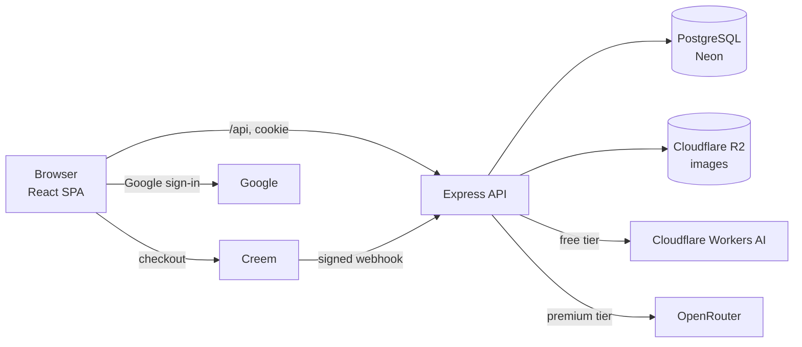

# Wallpaper AI

**Turn any photo into a work of art.** Upload a picture, pick a style — oil painting, watercolor, anime, pixel art and more — and get an AI-restyled version in seconds.

**Live demo:** https://wallpaperai.app
*(payments run in test mode — use card `4242 4242 4242 4242`, any future date, any CVC)*

<p align="center">
  
  &nbsp;
  
</p>

---

## Features

- **8 artistic styles** with short descriptions — Oil Painting, Watercolor, Impressionism, Pencil Sketch, Anime, Pixel Art, Neon Cyberpunk, Low Poly
- **Before / after slider** to compare the original and the result
- **Freemium model** — 2 free previews (smaller, watermarked, free AI model), then premium credits (full resolution, best model)
- **Credit packs** with checkout, signed webhooks and idempotent crediting (Creem, Merchant of Record)
- **Prompt moderation**: every prompt passes the Creem Moderation API before it reaches an image model (fail closed)
- **Accounts** — email + password or **Sign in with Google**
- **Personal gallery** split into Premium and Free previews
- Responsive dark UI, works on mobile

## Tech stack

| Layer | Technologies |
| --- | --- |
| Frontend | React 19, TypeScript, Vite, plain CSS (design tokens) |
| Backend | Node.js, Express 5, TypeScript, Zod |
| Database | PostgreSQL, Prisma ORM (migrations) |
| Auth | JWT in httpOnly cookies, bcrypt, Google Identity Services |
| AI | Cloudflare Workers AI (FLUX.2 klein) — free tier · OpenRouter (Gemini 3.1 Flash Image) — premium |
| Images | sharp (validation, resizing, EXIF stripping, watermark) |
| Storage | Cloudflare R2 (S3-compatible) · local folder in development |
| Payments | Creem (Merchant of Record), HMAC-SHA256 signed webhooks, Moderation API |
| Infra | Railway (app), Neon (Postgres), Docker Compose (local DB) |

## Architecture



In production a single Express service serves both the API and the built React app, so the frontend and backend share one origin (no CORS, simple cookies).

### How a generation works

1. The browser uploads the photo with the chosen style id (`multipart/form-data`).
2. `requireAuth` checks the JWT cookie; a per-user rate limit applies.
3. **sharp** opens the file to prove it is a real JPEG/PNG/WebP, rejects "pixel bombs", fixes rotation, strips EXIF (incl. GPS) and resizes to ≤ 2048 px.
4. **Billing** atomically reserves one unit: a premium credit if the user has one, otherwise a free preview (with a global daily cap for the free tier).
5. The matching **provider** restyles the image. The prompt comes from the server — users only choose a style, they can't send arbitrary prompts. Providers are wrapped in a moderation decorator, so every prompt is checked by the Creem Moderation API first; anything other than `allow` (or a moderation outage) blocks the generation and refunds the credit.
6. Free results are downscaled and watermarked. Original and result are saved to storage, and the generation is recorded.
7. If anything fails, the generation is marked `FAILED` and the credit is refunded.

### Payments

1. `POST /api/billing/checkout` creates a Creem checkout session for a credit pack (user id in `metadata`) and returns its URL.
2. After payment Creem sends a `checkout.completed` webhook.
3. The server verifies the `creem-signature` header (HMAC-SHA256 of the raw body, constant-time comparison), matches the product to a pack and, in one transaction, records the payment and adds credits.
4. `providerOrderId` is unique, so a repeated webhook never credits twice.

## Project structure

```
wallpaper-ai/
├── client/                    React app (Vite)
│   ├── public/                hero images, terms / privacy / refund pages
│   └── src/
│       ├── api.ts             all requests to the backend
│       ├── App.tsx            session check, auth vs studio
│       └── components/        AuthPage, Studio, StylePicker, BeforeAfter, Gallery, PricingModal…
├── server/                    Express API
│   ├── prisma/                schema + migrations
│   └── src/
│       ├── index.ts           app setup, middleware order, static files
│       ├── config.ts          env validation with Zod (fail fast)
│       ├── routes/            auth, generate, generations, billing
│       ├── middleware/        requireAuth, rate limits, error handler
│       ├── providers/         AI providers: cloudflare, openrouter, gemini, mock
│       ├── billing.ts         credit reservation and refunds
│       ├── images.ts          validation, resizing, watermark (sharp)
│       ├── storage.ts         local folder or Cloudflare R2
│       ├── creem.ts / packs.ts  checkout, webhook verification, prompt moderation, credit packs
│       └── styles.ts          styles and their prompts
├── docker-compose.yml         local PostgreSQL
└── package.json               build / start scripts for deployment
```

## Running locally

**Requirements:** Node.js 22+, Docker.

```bash
git clone https://github.com/rostyslav109/wallpaper-ai.git
cd wallpaper-ai

# 1. Database
docker compose up -d

# 2. Backend
cd server
npm install
cp .env.example .env        # fill in JWT_SECRET and GOOGLE_CLIENT_ID at minimum
npx prisma migrate dev
npm run dev                 # http://localhost:3000

# 3. Frontend (new terminal)
cd client
npm install
cp .env.example .env
npm run dev                 # http://localhost:5173
```

Everything else is optional: without AI keys both tiers use a **mock provider**, without R2 files go to `server/storage`, and without Creem keys the pricing shows "Coming soon" and moderation is skipped.

### Environment variables

See [`server/.env.example`](server/.env.example) and [`client/.env.example`](client/.env.example). The server validates them on startup and refuses to start if a required one is missing.

| Variable | Required | Purpose |
| --- | --- | --- |
| `DATABASE_URL` | yes | PostgreSQL connection string |
| `JWT_SECRET` | yes | Signs session tokens (≥ 32 chars) |
| `GOOGLE_CLIENT_ID` | yes | Google sign-in (also `VITE_GOOGLE_CLIENT_ID` in the client) |
| `CLOUDFLARE_ACCOUNT_ID`, `CLOUDFLARE_API_TOKEN` | no | Free-tier AI |
| `OPENROUTER_API_KEY` | no | Premium-tier AI |
| `R2_*` | no | Image storage in Cloudflare R2 |
| `CREEM_*`, `APP_URL` | no | Payments and prompt moderation |

## Deployment

The app runs on **Railway** as one service built from the repo root:

- `npm run build` — builds the React app and generates the Prisma client
- `npm start` — applies migrations (`prisma migrate deploy`) and starts the server

Database on **Neon**, images on **Cloudflare R2**. Set `NODE_ENV=production` and the variables above in Railway.

## Security notes

- Passwords hashed with **bcrypt**; sessions in **httpOnly, SameSite** cookies (not readable by JavaScript)
- **Zod** validation of every request body and of environment variables
- Ownership checks in the database query itself — users can't open other users' images (IDOR)
- Uploaded files verified by decoding them, not by the client-sent MIME type
- **Rate limiting** on login/registration (per IP) and generation (per user)
- Webhooks accepted only with a valid signature; crediting is idempotent
- Centralized error handler — internal errors never leak to the client

## Roadmap

- [ ] Background job queue for generations (BullMQ + Redis)
- [ ] Tests (Vitest + Supertest) and CI on GitHub Actions
- [ ] Handle refunds (`order.refunded`) automatically
- [ ] Email verification and password reset
- [ ] Custom domain

## Author

**Rostyslav Matsko** — backend / AI-first developer
GitHub: [@rostyslav109](https://github.com/rostyslav109) · rostik.matsko109@gmail.com
