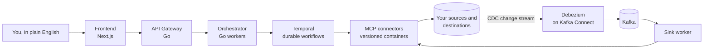

# rsync.ai — Self-hosted AI Data Pipelines, CDC, Scheduled Models, and Lineage

[](https://github.com/rsync-ai/rsync.ai/releases/latest)
[](LICENSE)
[](#docker--one-command)
[](#kubernetes)
[](docs/connectors/reference.md)
[](docs/README.md)

> **Self-hosted, source-available AI data platform for batch pipelines, CDC, scheduled
> models, and lineage.** Describe a pipeline in plain English, approve the plan, and see
> exactly what ran, failed, or became stale.


*You describe the pipeline in plain English. It resolves the plan, then stops for your
approval — batch, CDC, or changes-only — before a single row moves.*

rsync.ai moves data between databases, warehouses, object stores and APIs. You describe the
job in a sentence; an agent turns it into an explicit, staged plan, pauses for you when
something is ambiguous, and executes it on Temporal so a long sync survives restarts. Batch
and change-data-capture are both first-class. Twenty-one connectors ship in the box.

It is unrelated to [`rsync(1)`](https://rsync.samba.org/), the file-synchronisation
tool — this moves rows between systems, not files between hosts.

It is **source-available** under the [rsync.ai Source-Available License](LICENSE): run it,
modify it, and use it for your own business for free — you cannot sell it, host it for
others, or build a competing product from it. The [full summary is below](#license).

## What it does

- **Batch and CDC pipelines.** Batch loads between the connectors below, plus
  Debezium-backed change data capture from PostgreSQL, MySQL, SQL Server, Oracle and
  MongoDB. A run pauses for your decision where the request is ambiguous, and each stage
  reports what it did.
  → [PostgreSQL CDC](docs/solutions/self-hosted-postgresql-cdc-pipeline.md) ·
  [PostgreSQL to MySQL](docs/solutions/postgresql-to-mysql-data-sync.md) ·
  [Shopify to PostgreSQL](docs/solutions/shopify-to-postgresql-data-pipeline.md)
- **Scheduled, dependency-aware SQL models.** Save a query as a model and rebuild it on a
  cron, an interval, or after the pipeline or model it reads from finishes; edits to
  scheduled SQL need an admin's approval, and a freshness deadline flags a table that
  stopped moving.
  → [Scheduled SQL models](docs/solutions/scheduled-sql-models-with-dependency-triggers.md)
- **Data Explorer and lineage.** Query what you connected in English or SQL, and see which
  pipelines write which tables and which models read them. Lineage is table-level, and the
  lineage view is recent — its page states how far it has been verified.
  → [Data Explorer](docs/explorer/README.md) ·
  [Lineage and observability](docs/solutions/data-lineage-and-pipeline-observability.md)
- **Versioned MCP connectors.** Each of the 20 connectors runs as its own versioned
  container, so you can upgrade or pin one without touching the rest.
  → [Connector reference](docs/connectors/reference.md)

More guides: [all solutions](docs/solutions/README.md).


*Ask in plain English, review the SQL it wrote, run it against a connected source. Here: how
many swipes went left versus right.*


*A finished run, stage by stage: what each one did, the rows it moved, and how stale the
destination has become since. Nothing here was typed in by hand.*


*Every pipeline in a workspace on one screen: batch or CDC, source to destination, and
whether it is running right now.*


*Lineage across pipelines and scheduled SQL models: which table a model writes, which model
reads it, and which one runs after which.*

## How it compares

Managed ELT tools move data well but hand off at the warehouse door. Orchestrators and
automation tools are general-purpose and leave the data semantics to you. rsync.ai aims at
the middle: get the data moving *and* keep it modelled, on hardware you control.

| Instead of | What it does well | What rsync.ai does differently |
|---|---|---|
| **Fivetran** | Managed and reliable, hundreds of connectors, someone else is on call | Runs on your infrastructure with your keys. A connector you need is a container you can write, not a support ticket. |
| **Airbyte** | Large connector ecosystem, self-hostable, mature ELT | You describe the pipeline in a sentence and approve a plan instead of configuring each sync by hand, and batch and CDC are the same product rather than separate paths. |
| **dbt** | The standard for SQL transformation, with deep testing and a large package ecosystem | Scheduled, dependency-aware SQL models are built in, so moving and modelling data is one tool instead of two. dbt's testing and packages are considerably deeper. |
| **Debezium on its own** | Best-in-class change data capture | rsync.ai runs Debezium and adds the provisioning, sinks, retries and UI around it, so you are not assembling Kafka Connect by hand. |
| **Airflow / n8n** | General orchestration and automation, enormously flexible | A pipeline is a first-class object with row counts, lineage and CDC built in, rather than something you assemble from operators or nodes. |

**Where it is honestly weaker.** There is no managed option — every install is yours to run.
The catalogue is 20 connectors, not hundreds. Data-quality assertions are not built yet. And
the Kubernetes path is younger than the Docker one (see [Project status](#project-status)). If
you want someone else carrying the pager, use a managed tool.

## Quick start

1. **Install** with one command. Docker is the only requirement:

   ```bash
   curl -sSL https://raw.githubusercontent.com/rsync-ai/rsync.ai/main/install.sh | bash
   ```

   [Install](#install) below covers the options, Kubernetes, and what the script sets up.
2. Open `http://localhost:3000` and click **Start with sample data**. The stack bundles a
   `sample-data` source and a throwaway `demo-warehouse` PostgreSQL, so this needs no
   credential of your own.
3. In `/chat`, ask for *"sync customers and orders from sample data to the demo warehouse"*,
   pick the tables, and confirm.

That path is a batch pipeline. CDC, Shopify and your own databases need a source of your
own — see the [quickstart](docs/getting-started/quickstart.md#try-it-in-5-minutes-with-no-credentials)
and the [self-hosting guide](docs/deployment/self-hosting.md).

## How it fits together



For CDC, Debezium on Kafka Connect and a sink worker carry the change stream; they start
with the rest of the default install. [ARCHITECTURE.md](ARCHITECTURE.md) explains why each
piece was chosen, and [docs/architecture/overview.md](docs/architecture/overview.md) has the
component and data-flow diagrams.

## Contents

- [What it does](#what-it-does)
- [How it compares](#how-it-compares)
- [Quick start](#quick-start)
- [How it fits together](#how-it-fits-together)
- [Install](#install) — [Docker](#docker--one-command) · [Kubernetes](#kubernetes)
- [What you get](#what-you-get)
- [Connectors](#connectors)
- [The Data Explorer](#the-data-explorer)
- [How it works](#how-it-works)
- [Requirements](#requirements)
- [Documentation](#documentation)
- [Development](#development)
- [Project status](#project-status)
- [Community and support](#community-and-support)
- [License](#license)

---

## Install

### Docker — one command

```bash
curl -sSL https://raw.githubusercontent.com/rsync-ai/rsync.ai/main/install.sh | bash
```

Requires Docker and nothing else. The installer asks which LLM you want — your own
OpenAI key, the Ollama it bundles, or none for now — generates every other secret itself,
and starts the full stack. Choose Ollama and there is no key to find and no model to pull
by hand: the stack ships an Ollama container and a one-shot job that downloads the model
before anything that would ask for one starts. Choose none and pipelines, raw SQL and the
shipped connectors still work; the LLM features say `Set up an LLM first` until you add one
([which LLM is used](docs/deployment/self-hosting.md#which-llm-is-used)). Open
`http://localhost:3000` when it finishes. If
the stack does not come up, the installer says so and exits non-zero — it does not print a
success banner over a dead stack.

> **Which code you get.** `v0.1.8`, the current release. Both halves of the install come
> from that one tag: the compose file is fetched from `RSYNC_REF` and the images are
> pulled at a tag derived from it, so the file and the containers it starts are the same
> commit. Every image the default compose starts is published at that tag and pullable
> anonymously — a test pins that, so a release cannot ship half-built.
>
> **What it starts.** Everything needed for both sync modes, change data capture
> included — Kafka Connect, Debezium and the sink worker come up with the rest. They
> are not an add-on: pick a streaming sync without them and the run fails a pre-flight
> two minutes in rather than falling back to batch. On a machine that will only ever
> run batch syncs, `curl -sSL … | RSYNC_PROFILES= bash` leaves the JVM out and drops
> the memory floor back to 6 GB.
>
> **Settings go on the `bash` side of the pipe.** A `VAR=x` written before `curl` sets
> it for `curl`, which never reads it, and the installer runs with the default — no
> error, just the setting silently ignored. That is true of every variable here.
>
> Pass `RSYNC_REF=main` (as `curl -sSL … | RSYNC_REF=main bash`) to track the branch
> instead. That install is not reproducible: the compose file comes from the branch tip
> and changes with every commit, while `main` images track the last publish rather than
> the newest commit, so the two halves move at different rates.
>
> **A mirror, or your own build.** `RSYNC_IMAGE_REGISTRY=registry.example.com/rsync-ai`
> pulls every first-party image from there instead of `ghcr.io/rsync-ai` — the same
> variable `install-k8s.sh` reads — and is kept in `.env`, so a re-run keeps it. To
> install a checkout instead of a release (a fork, or a commit no tag carries yet), run
> `RSYNC_COMPOSE_DIR=<checkout> RSYNC_VERSION=<tag> bash <checkout>/install.sh`, where
> `<tag>` is the tag you pushed the checkout's images under. The compose files are copied
> from the checkout instead of downloaded. It refuses to run without `RSYNC_VERSION`,
> because the default would pair the checkout's compose file with the last release's
> images.

### Kubernetes

Point `kubectl` at any cluster and run:

```bash
curl -sSL https://raw.githubusercontent.com/rsync-ai/rsync.ai/main/install-k8s.sh | bash
```

That is the whole install. It generates every secret, installs the platform, the demo
warehouse and a working set of connectors, waits for the release, and prints (or, on a
terminal, opens) the two port-forwards that put the UI at `http://localhost:3000`. Edit
`~/rsync-ai-k8s/.env` and run it again to change anything — that is also the upgrade path.
Back that file up: it holds `ENCRYPTION_KEY`. The default install asks for about **8.8 GiB
of memory and 3.7 CPU** in requests, and it measures what the cluster has left before it
starts: on a smaller cluster it trims to a set that fits — first the connectors and demo
you did not choose, then the spare api-gateway and frontend replicas — instead of leaving
pods `Pending`. CPU is what runs out first: **a single 4-vCPU node is not enough for the
default** (GKE's own DaemonSets leave ~3.4 of it), and what fits there is the trimmed set
at ~3.0 CPU. Everything it accepts is listed in the
[Kubernetes guide](docs/deployment/kubernetes.md#one-command-recommended).

Prefer to run `helm` yourself? A bare `helm install` also needs `connectors.fleet` set, or no
connector pod starts and no pipeline can reach a source
([why](docs/deployment/kubernetes.md#connectors-are-pods-you-choose)):

```bash
git clone https://github.com/rsync-ai/rsync.ai.git && cd rsync.ai
helm install rsync-ai ./deploy/helm/rsync-ai \
  --namespace rsync-ai --create-namespace \
  --set secrets.jwtSecret="$(openssl rand -base64 32)" \
  --set secrets.encryptionKey="$(openssl rand -base64 32)" \
  --set secrets.internalServiceSecret="$(openssl rand -hex 24)" \
  --set secrets.postgresPassword="$(openssl rand -hex 24)" \
  --set secrets.minioAccessKey="$(openssl rand -hex 16)" \
  --set secrets.minioSecretKey="$(openssl rand -base64 32)" \
  --set frontend.publicUrl=https://app.example.com \
  --set frontend.apiUrl=https://api.example.com \
  -f my-values.yaml   # at least connectors.fleet
```

That is the **evaluation** footprint — in-chart Postgres, Redis, Kafka, MinIO and
Temporal, one replica each, no backups. The chart runs the same images as the compose
stack and can point at managed Postgres, Redis, Kafka and object storage instead;
per-provider value files ship for EKS, GKE and AKS. See the
[Kubernetes guide](docs/deployment/kubernetes.md) for a production install.

> [!IMPORTANT]
> **Save `secrets.encryptionKey`.** It encrypts every stored connection credential. Read
> it back with
> `kubectl -n rsync-ai get secret rsync-ai-secrets -o jsonpath='{.data.ENCRYPTION_KEY}' | base64 -d`
> and keep it somewhere you will still have it after the cluster is gone — reinstalling
> with a different key makes every saved connection permanently undecryptable.

> [!TIP]
> The chart is also published to the registry, so you can install without cloning:
>
> ```bash
> helm install rsync-ai oci://ghcr.io/rsync-ai/charts/rsync-ai --version 0.1.8 \
>   --namespace rsync-ai --create-namespace \
>   --set secrets.jwtSecret="$(openssl rand -base64 32)" \
>   --set secrets.encryptionKey="$(openssl rand -base64 32)" \
>   --set secrets.internalServiceSecret="$(openssl rand -hex 24)" \
>   --set secrets.postgresPassword="$(openssl rand -hex 24)" \
>   --set secrets.minioAccessKey="$(openssl rand -hex 16)" \
>   --set secrets.minioSecretKey="$(openssl rand -base64 32)" \
>   --set frontend.publicUrl=https://app.example.com \
>   --set frontend.apiUrl=https://api.example.com
> ```
>
> The two `frontend.*` flags are not optional on either path — the chart refuses to
> render without them, because the browser calls the API directly and NextAuth
> builds its callback URLs from `publicUrl`. Point them at the hostnames your
> ingress will serve. MinIO withdrew anonymous pulls from `docker.io/minio/*` and then
> from `quay.io/minio/*`. Chart **0.1.6** onward and a checkout's `values.yaml` name
> Chainguard's build instead, so neither path needs a MinIO override. Chart **0.1.5**
> and older still name the withdrawn images; to install one of those, add
> `--set objectStorage.minio.image=cgr.dev/chainguard/minio@sha256:bd014394a80898e68c149f2311fdf8d5a2c2f3bb2c33b9327ae6d02b4b065ae1`
> and the same value for `objectStorage.minio.mcImage`. Both paths pull rsync.ai's own
> images at `.Chart.AppVersion` (**0.1.8**), and every `ghcr.io/rsync-ai` image the
> chart names is published at that tag for both `amd64` and `arm64` (0.1.2 and older
> are `amd64` only, so they will not start on Apple Silicon, Graviton, Axion or Ampere
> nodes).

---

## What you get

| | |
|---|---|
| **Pipelines from a sentence** | Type *"sync MySQL orders to S3 every hour"*. An agent resolves it into named stages you can read before anything runs. |
| **Batch and CDC, both first-class** | Batch loads for anything, plus Debezium-backed change data capture on five databases — PostgreSQL, MySQL, SQL Server, Oracle and MongoDB. |
| **It asks instead of guessing** | When the source is ambiguous — which tables, which schema, which key — the run pauses on a human-in-the-loop gate rather than picking for you. |
| **Durable execution** | Stages run as Temporal workflows, so a multi-hour sync survives a restart, a redeploy, or a crashed worker. |
| **You can answer "why did it do that?"** | Every run emits domain events carrying stage state, row counts and a trace id, and the UI shows them stage by stage. |
| **A SQL and NL query surface** | The [Data Explorer](#the-data-explorer) queries the systems you connected — no second BI tool to stand up first. |
| **Your infrastructure, your keys** | One Docker command or one Helm chart. Credentials are encrypted at rest with a key you hold; point the LLM at OpenAI or at the [Ollama](docs/deployment/ollama.md) the installer bundles, or run without one. |

## Connectors

**20 connectors ship in the box** — every one is a source, 16 are also destinations, and
five support change data capture. Each runs as its own versioned container, so you can
upgrade or pin one without touching the rest.

| Category | Connectors | CDC |
|---|---|---|
| **Relational** | PostgreSQL, MySQL, SQL Server, Oracle, ClickHouse, Amazon Redshift | PostgreSQL, MySQL, SQL Server, Oracle |
| **Data warehouse** | Snowflake, Google BigQuery, Databricks | — |
| **Document** | MongoDB | MongoDB |
| **Object storage** | AWS S3, Google Cloud Storage, Azure Blob Storage | — |
| **APIs** | Stripe, Shopify, GitHub, Notion, Google Sheets | — |
| **Demo and reference** | Sample Data (credential-free demo source), Widgets-GraphQL (GraphQL example) | — |

The [connector reference](docs/connectors/reference.md) is generated from the connector
tree itself and lists exact ids, versions and per-connector source/destination support —
CI fails if it drifts, and a second guard fails if the table above stops matching it. To
add your own, start with the
[connector developer guide](docs/connectors/developer-guide.md).

## The Data Explorer

Once data has landed somewhere, you can query it without leaving rsync.ai. Ask a question in
English and get SQL back, or write the SQL yourself; browse the schema; then keep the
useful ones — as a saved query with versions and diffs, or as a **model**: a table that
rebuilds itself on a cron, an interval, or after a given pipeline finishes. Results export
to CSV, TSV and JSON. See the [Data Explorer guide](docs/explorer/README.md) and the deep
dive on [saved queries, models and schedules](docs/explorer/saved-queries-and-models.md).

## How it works

1. **Describe.** You type *"sync MySQL orders table to S3 every hour"* into `/chat`. An
   agent reads it and drafts a staged plan.
2. **Decide.** Where the request is under-specified — which tables, which schema, which
   primary key, which credentials — the plan stops at a human-in-the-loop gate and asks.
   Nothing runs until you answer. This is the single most common reason a run is waiting
   rather than broken.
3. **Provision.** Connections are validated and stored encrypted; for CDC the publication
   and replication slot are created in the required order before Debezium is told to
   stream.
4. **Run.** Each stage is a Temporal activity, so progress is checkpointed and a restart
   resumes rather than starts over.
5. **Watch.** Row counts, stage state and a trace id are emitted as domain events and
   rendered stage by stage in the UI.

## Requirements

- Docker 24+ and Docker Compose v2 — or, for the Helm path, Kubernetes 1.25+ and Helm 3.8+
- 8 GB RAM minimum, 16 GB recommended — 12 GB if you let the installer bundle an LLM,
  which it checks and warns about before starting anything
- No API key required, and no LLM required. Bring an OpenAI key if you have one (it is
  preferred when present), choose the bundled [Ollama](docs/deployment/ollama.md) and the
  installer downloads a model for you, or choose none and add one later — the features that
  need a model say `Set up an LLM first` until then
  ([which LLM is used](docs/deployment/self-hosting.md#which-llm-is-used))

## Documentation

| | |
|---|---|
| [Quick start](docs/getting-started/quickstart.md) | Local dev setup and first pipeline |
| [Solutions](docs/solutions/README.md) | PostgreSQL CDC, PostgreSQL to MySQL, Shopify to PostgreSQL, scheduled SQL models, lineage |
| [Self-hosting](docs/deployment/self-hosting.md) | Production deployment with TLS |
| [Kubernetes](docs/deployment/kubernetes.md) | Helm chart install on EKS, GKE, AKS, or any cluster |
| [Oracle Cloud (free)](docs/deployment/oracle-cloud.md) | Free 4 OCPU / 24 GB VM |
| [Connector reference](docs/connectors/reference.md) | Every shipped source and destination |
| [Connector developer guide](docs/connectors/developer-guide.md) | Build a new connector |
| [Data Explorer](docs/explorer/README.md) | SQL, natural-language queries, saved models and schedules |
| [Architecture](docs/architecture/overview.md) | System design and data flows |
| [API reference](docs/api/README.md) | REST + WebSocket endpoints |
| [Environment variables](docs/deployment/env-vars.md) | Full configuration reference |
| [Errors](docs/errors/README.md) | What each error code means and what to do about it |
| [All docs](docs/README.md) | Full documentation index |

## Development

```bash
git clone https://github.com/rsync-ai/rsync.ai.git
cd rsync.ai
cp .env.example .env           # add your OPENAI_API_KEY, if you have one
cp llm-service/.env.example llm-service/.env   # or set LLM_PROVIDER=none here
docker compose -p rsync-ai up -d
open http://localhost:3000
```

See [CONTRIBUTING.md](CONTRIBUTING.md) for building individual services, running the test
suites, and the PR process.

## Project status

rsync.ai is young and self-hosted. It runs, it has been driven end to end, and the
connector and deployment claims on this page are checked by tests rather than asserted —
but you are early. The rough edge today is Kubernetes: a managed-cluster install
(EKS, GKE or AKS against real RDS, MSK and S3) has not been run end to end, so the cloud
value files are reviewed starting points rather than verified recipes — the
[Kubernetes guide](docs/deployment/kubernetes.md) says so where you meet it. There is no
hosted offering: every install is yours.

What that means in practice: pin a tag rather than tracking `main` if you want
reproducibility, keep `ENCRYPTION_KEY` somewhere durable before you store a credential,
and read [CHANGELOG.md](CHANGELOG.md) before upgrading. Bugs and gaps are tracked as
[GitHub issues](https://github.com/rsync-ai/rsync.ai/issues) — that list is the register.

## Community and support

- **Questions and help** — [SUPPORT.md](SUPPORT.md) points at the right place for each kind of question
- **Bugs and feature requests** — [open an issue](https://github.com/rsync-ai/rsync.ai/issues)
- **Contributing** — [CONTRIBUTING.md](CONTRIBUTING.md) and the [Code of Conduct](CODE_OF_CONDUCT.md)
- **Security** — report privately, never in a public issue: [SECURITY.md](SECURITY.md)
- **Changes between versions** — [CHANGELOG.md](CHANGELOG.md)

## License

rsync.ai is **source-available** under the
[rsync.ai Source-Available License v1.0](LICENSE) — not an OSI "open source" license.

The `LICENSE` file is the binding text; the following is a plain-English summary (not
legal advice):

**You can:**
- Download, install, run, and modify rsync.ai on infrastructure you control
- Use it for your own company's data pipelines, free of charge
- Use it for personal and other non-commercial projects
- Charge for your own time installing, configuring, supporting, or teaching others to use
  it — but not for the software itself, and without running it for them as a service
- Contribute back to the project (see [CONTRIBUTING.md](CONTRIBUTING.md))

**You cannot, without a commercial license from us:**
- Sell, resell, sublicense, rent, or charge a fee for rsync.ai or a modified version
- Host or run it for other people as a hosted, managed, or cloud service, paid or free
- Embed it in, or build from it, a product or service you offer to others for money,
  including one that competes with rsync.ai
- Share copies with anyone outside your company, except free of charge, for
  non-commercial purposes, with the license attached
- Move, change, disable, or circumvent any license-key functionality
- Remove or obscure the licensing, copyright, or other notices

**Earlier versions.** Releases up to and including v0.1.7 were published under the
Elastic License 2.0 and stay under it; its text is kept in
[`LICENSES/`](LICENSES/LicenseRef-rsync.ai-ELv2-legacy.txt). This license applies from the
first release that includes it.

Need something these terms do not allow, such as reselling it, embedding it in your
product, or hosting it for others? Ask for a commercial license at
[rsync.ai](https://rsync.ai).

The rsync.ai name and logo are trademarks — see [TRADEMARK.md](TRADEMARK.md). Licenses of
bundled third-party dependencies are listed in
[THIRD_PARTY_NOTICES.md](THIRD_PARTY_NOTICES.md).
