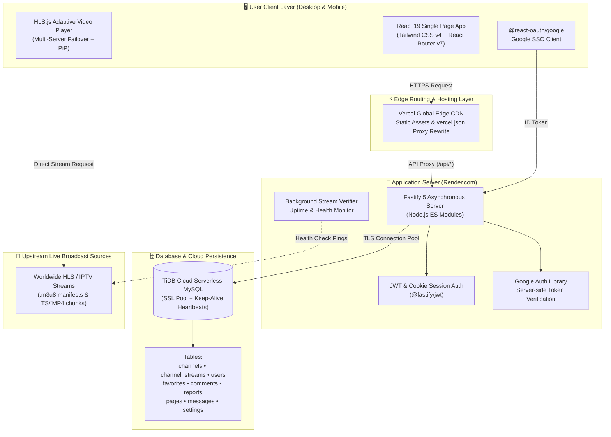

# Play

**A Modern, High-Performance Live TV & OTT Streaming Web Platform**

*Delivering seamless low-latency HLS live television streaming, multi-server auto-failover, Picture-in-Picture, Google OAuth 2.0 onboarding, community live comments, broken stream self-healing verifiers, and an enterprise-grade administration portal inside a sleek, modern dark/light web interface.*

---

[🎯 Overview](#-overview) •
[📋 Feature Index](#-complete-feature-index-at-a-glance) •
[✨ Key Features](#-key-features) •
[📸 Screenshots](#-screenshots--visual-tour) •
[🏗️ Architecture](#️-system-architecture) •
[🛡️ Reliability & Security](#️-reliability--security-engineering) •
[🧰 Tech Stack](#-tech-stack) •
[🚀 Deployment & Status](#-deployment--project-status)

---

> [!IMPORTANT]
> **🚧 Project Status — Development in Progress:**
> **Development of Play is actively ongoing. The live deployed production web application will be accessible once the public rollout begins.**
>
> *To protect proprietary streaming aggregation pipelines, scraper mechanisms, and backend security implementations, the source code is maintained in a private repository. This repository serves as an architectural showcase, visual feature tour, and system blueprint for **Play**.*

---

## 🎯 Overview

**Play** is a full-stack, cloud-native live television and OTT streaming web platform engineered for ultra-responsive, zero-buffer video delivery across desktop and mobile devices. 

Traditional web-based TV streaming sites frequently suffer from unhandled stream timeouts, broken CDN links, sluggish directory navigation, and intrusive interfaces. **Play** solves these challenges by combining a lightning-fast **React 19** and **Tailwind CSS v4** single-page architecture with an ultra-lightweight **Fastify 5** API layer, a distributed serverless **TiDB Cloud (MySQL)** cluster, and an intelligent **HLS.js adaptive player** with real-time multi-server failover.

With integrated **Google OAuth 2.0** onboarding, live channel comments, personalized favorites, self-healing background stream checkers, broken stream incident reporting, and a comprehensive administration dashboard, **Play** provides an all-in-one broadcast and media viewing solution.

---

## 📋 Complete Feature Index (At a Glance)

Below is an overview of the features engineered into **Play**:

- **📺 High-Performance Live Streaming & Media Engine**
  - **Adaptive Bitrate HLS Playback (`HLS.js`)** — Native HTTP Live Streaming (`.m3u8`) with automatic resolution switching and buffer management
  - **Intelligent Multi-Server Stream Failover** — Dynamic multi-source routing; seamlessly switches to backup broadcast servers when a stream disconnects
  - **Granular 20+ Error Diagnostic Classifier** — Identifies and diagnoses exact stream failures (`DNS`, `SSL`, `CORS`, `404`, `403`, `502`, `DEMUX`, `NETWORK`, `TIMEOUT`, `OFFLINE`)
  - **Native Picture-in-Picture (PiP) Mode** — Keep watching live broadcasts in a floating desktop window while browsing channels or managing accounts
  - **Theater Mode & Fullscreen Toggle** — Distraction-free widescreen layout with synchronized cinema lighting
  - **Volume, Scrub & Timeline Controls** — Custom-engineered player overlays with smooth pointer event dragging and mute shortcuts

- **🔍 Intelligent Channel Discovery & Faceted Filtering**
  - **Multi-Dimensional Faceted Filters** — Filter live broadcasts instantly by **Category** (News, Sports, Movies, Entertainment, Kids, Music), **Country**, and **Language**
  - **Real-Time Unicode Search Bar** — Instant search across channel names and alternative aliases (supports English and international scripts)
  - **Interactive Channel Cards** — Fluid hover states, active broadcast status badges, quick-play buttons, and fuzzy channel logo resolution
  - **Zero-FOUC Theme Engine** — Instant **Dark Theme** & **Light Theme** switching with zero Flash of Unstyled Content (FOUC)

- **🔐 Dual-Layer Authentication & User Onboarding**
  - **Google OAuth 2.0 Single Sign-On (`@react-oauth/google`)** — 1-click frictionless sign-in with Google identity verification
  - **First-Time Profile Completion Modal** — Seamless onboarding prompt to set handle, display name, and avatar upon initial OAuth sign-up
  - **Traditional Email & Password Auth** — Secure credential handling with cryptographic `bcrypt` hashing
  - **JWT Session Tokens (`@fastify/jwt`)** — Secure HTTP session tokens with `HttpOnly` and `SameSite` cookie protection
  - **Self-Service Password Recovery** — Token-based reset-password workflow with expiration handling

- **💬 Community Interaction & User Dashboard**
  - **Live Channel Discussion & Comments** — Real-time interactive comments section under every live stream
  - **One-Click Channel Favorites & Bookmarking** — Save favorite channels with immediate reactive state synchronization across tabs
  - **Personal User Activity Hub** — View comment history, submitted reports, bookmarked channels, and account security settings
  - **Integrated Two-Way Support Messaging** — Direct live ticket / chat communication between users and administrators

- **🛡️ Stream Health Monitoring & Incident Reporting**
  - **Community Broken Stream Reporting** — User-facing reporting modal with issue categorization (No Video, Audio Desync, Buffering, Geo-Blocked, Wrong Stream)
  - **Background Stream Health Verifier** — Headless periodic ping tests that monitor stream availability in real time
  - **Automated Dead Stream Scanner Scripts** — Administrative batch scanning utilities (`check-streams.js`) to audit channel uptime
  - **Administrative Report Dispute Manager** — Workflow to inspect reported stream URLs, verify playback, and resolve tickets with admin remarks

- **🎛️ Enterprise Admin Control Portal**
  - **Executive Analytics Dashboard** — Real-time metrics for total channels, live streams, registered users, unresolved stream reports, and category breakdowns
  - **Comprehensive Channel CRUD** — Add, edit, or archive channels with multi-stream URL configurations, custom networks, and country tags
  - **Fuzzy Logo Matcher & Asset Uploader** — Intelligent matching of channel logos against official media archives
  - **User & Role Management** — View user directory, manage administrative privileges, ban abusive accounts, and trigger password resets
  - **Built-in CMS Page Builder with RichTextEditor** — Create and edit static pages (*About Us*, *Terms of Service*, *Privacy Policy*, *Contact*) with live rich text formatting
  - **Site-Wide SEO & OpenGraph Suite** — Customize titles, descriptions, social media sharing cards, and robots meta tags per page
  - **Global System Configuration** — Manage site name, logo, DMCA copyright notices, and stream verification thresholds

---

## ✨ Key Features

### 📺 1. Adaptive HLS Video Engine with Intelligent Auto-Failover
- **HLS.js Adaptive Bitrate Streaming**: Delivers rock-solid HTTP Live Streaming (`.m3u8`) with adaptive bitrate switching, low latency, and memory buffer optimization.
- **Multi-Server Stream Failover**: If a primary broadcast server experiences network dropouts, CORS restrictions, or token expiration, the player's internal state machine automatically transitions to secondary and tertiary mirror feeds without requiring a manual page refresh.
- **Deep Stream Diagnostic Matrix**: When a stream fails, the player executes an in-depth diagnostic routine classifying the root cause into one of 20+ categories (`404 Not Found`, `403 Forbidden`, `502 Bad Gateway`, `SSL Error`, `CORS Blocked`, `DEMUX Decode Error`, `DNS Resolution Failed`).
- **Picture-in-Picture & Theater Mode**: Native browser Picture-in-Picture integration allows users to keep their favorite channel playing while multitasking across browser tabs.

### 🔍 2. Dynamic Channel Directory & Multilingual Search
- **Faceted Categorization**: Browse channels across multiple dimensions: **Categories** (*News*, *Sports*, *Movies*, *Music*, *Kids*), **Languages** (*English*, *Bengali*, *Hindi*, *Spanish*, *French*, etc.), and **Countries**.
- **Fuzzy Unicode Search**: Search live channels by official name, alternate network aliases, or country keywords with real-time UI filtering.
- **Smooth Hover Actions & Quick Launch**: Responsive channel cards feature animated hover states, channel logo fallbacks, quick-play buttons, and live stream indicators.

### 🔐 3. Dual-Layer Authentication & Frictionless Onboarding
- **Google OAuth 2.0 Integration**: Supports 1-click login and registration using official Google Cloud credentials via `@react-oauth/google` and server-side token validation (`google-auth-library`).
- **Complete Profile Onboarding**: Automatically detects new Google sign-ups and prompts a **Complete Profile Modal** to customize their display name, handle, and avatar before accessing community features.
- **JWT & HttpOnly Cookie Security**: Employs `@fastify/jwt` session tokens stored in secure, `HttpOnly`, `SameSite=Lax` cookies, protecting user sessions against Cross-Site Scripting (XSS) and token theft.

### 💬 4. Community Engagement & User Hub
- **Live Stream Comments**: Users can engage in live discussions on any channel's watch page, sharing thoughts, match reactions, and broadcast feedback.
- **Favorites & Instant Sync**: Save channels to a personal favorites list with instant UI synchronization via custom React context (`AuthContext`, `TVContext`).
- **User Dashboard**: A dedicated personal dashboard displaying bookmarked channels, past comment activity, submitted stream tickets, and notification settings.

### 🛠️ 5. Automated Stream Health Verifier & Reporting
- **In-Player Incident Reporting**: Users can flag broken, buffering, or geo-blocked streams with single-click error reporting.
- **Background Stream Verifier**: Background workers (`BackgroundStreamVerifier.jsx`) perform periodic non-blocking health checks on active streams.
- **Admin Resolution Workflow**: Stream error reports feed into an administrative ticket dashboard with direct playback testing, allowing admins to replace faulty URLs and notify users.

### 🎛️ 6. Enterprise-Grade Administration Suite
- **Comprehensive Management Dashboard**: Complete visibility into system health, active broadcasts, user growth, and report queues.
- **Channel & Stream CRUD**: Configure channels with multiple stream URLs, custom network tags, and automated fuzzy logo matching.
- **CMS Page Builder**: Built-in rich text editor (`RichTextEditor.jsx`) to publish and update legal, policy, and informational pages without writing code.
- **SEO & OpenGraph Configuration**: Granular control over OpenGraph preview cards, Twitter cards, meta titles, and descriptions for every page.

---

## 📸 Screenshots & Visual Tour

The complete visual tour of **Play** is documented below across **5 core domains**.

---

### 🌐 1. Public Channel Discovery & Browsing Experience

The main channel directory features a clean, responsive layout supporting **Dark** and **Light** themes. It includes dynamic category pills, language and country dropdowns, a real-time search bar, and interactive channel cards.

| 🌙 Home Page (Dark Theme) | ☀️ Home Page (Light Theme) |
| :---: | :---: |
|  |  |
| *Channel directory in Dark Mode displaying category filters, active stream status badges, and channel grid.* | *Channel directory in Light Mode showcasing clear typography, crisp channel logos, and smooth contrast.* |

| 🏷️ Multi-Dimensional Filter Bar | 🖱️ Interactive Channel Card Hover State |
| :---: | :---: |
|  |  |
| *Filter bar with category pills, country dropdowns, and language selectors for quick channel discovery.* | *Smooth hover state revealing channel metadata, stream quality indicators, and quick-launch play button.* |

---

### 📺 2. High-Definition Live Streaming Player & Live Discussion

The streaming theater delivers ultra-low latency HLS playback with dynamic server switching, picture-in-picture, community live comments, and stream reporting.

| 🎬 Live TV Streaming Theater Mode | 💬 Interactive Channel Comments & Details |
| :---: | :---: |
|  |  |
| *Full theater mode view streaming a high-definition live television broadcast with responsive timeline controls.* | *Watch view with active live broadcast, channel description, one-click Report button, and community discussion thread.* |

---

### 🔐 3. User Authentication & Seamless Google OAuth

Frictionless authentication flow featuring traditional email/password login, Google OAuth 2.0 integration, self-service password recovery, and first-time profile completion.

| 🔑 User Sign-In | 📝 New Account Registration |
| :---: | :---: |
|  |  |
| *Sign-in portal supporting email/password credentials and 1-click Google OAuth.* | *Registration page with instant client-side validation and password strength indicators.* |

| 🌐 Google OAuth Account Selection | 🤝 Google OAuth Consent & Instant Login |
| :---: | :---: |
|  |  |
| *Google OAuth 2.0 account picker for fast, single-click authentication.* | *Consent screen verifying permissions and issuing secure session tokens.* |

| ✨ First-Time Profile Completion Modal | 🔄 Forgot Password / Reset Link | 🔒 Set New Secure Password |
| :---: | :---: | :---: |
|  |  |  |
| *Onboarding modal prompting new Google sign-ups to choose a unique handle, name, and avatar.* | *Password reset request screen sending cryptographically signed recovery tokens.* | *Secure password update form with token validation and security confirmation.* |

---

### 👤 4. Personal Dashboard & Community Activity Hub

Logged-in users have access to an intuitive dashboard for managing favorite channels, comment history, submitted reports, and profile settings.

| ✏️ Edit Profile & Avatar | ⚙️ Account Security & Settings |
| :---: | :---: |
|  |  |
| *Customize display name, public bio, email preferences, and upload user avatars.* | *Manage account credentials, change password, and configure notification preferences.* |

| ❤️ Favorite Bookmarked Channels | 💬 User Comment History |
| :---: | :---: |
|  |  |
| *Curated library of favorited TV channels with 1-click instant playback launch.* | *Personal audit log of all comments and community interactions across channels.* |

| 🚩 Submitted Stream Reports & Status | 💬 Live Support & Ticket Messaging |
| :---: | :---: |
|  |  |
| *Track status of submitted broken stream reports with admin feedback notes.* | *Two-way live messaging widget communicating directly with system administrators.* |

---

### 🎛️ 5. Enterprise Admin Portal & System Administration

The administrative backend empowers moderators and administrators with full control over channels, users, stream health, CMS pages, SEO, and global platform configurations.

| 🌙 Admin Dashboard (Dark Mode) | ☀️ Admin Dashboard (Light Mode) |
| :---: | :---: |
|  |  |
| *Admin telemetry in Dark Mode displaying channel counts, online streams, active users, and report queues.* | *Admin telemetry in Light Mode featuring system KPI cards and recent platform activities.* |

| 📺 Channel Management & Stream Feeds | 👥 User Directory & Permission Controls |
| :---: | :---: |
|  |  |
| *Channel management table with logo uploader, country tags, multi-server stream URLs, and edit controls.* | *User administration table managing account roles (User / Admin), status, and session revocations.* |

| 🚨 Broken Stream Report Resolution | 📨 Support Ticket & User Inquiries |
| :---: | :---: |
|  |  |
| *Incident triage center to test reported stream URLs, mark issues resolved, and provide user feedback.* | *Inbox for managing user support tickets, general inquiries, and real-time chat responses.* |

| 📄 CMS Pages Management | ✍️ Rich Text CMS Page Editor (About Us) |
| :---: | :---: |
|  |  |
| *Overview of all public content pages (*About*, *Terms*, *Privacy*, *Contact*) with publish status.* | *WYSIWYG rich text editor with live formatting controls for updating platform documentation.* |

| 🔍 Site-Wide & Per-Page SEO Settings | ⚙️ Global Branding & System Settings |
| :---: | :---: |
|  |  |
| *Configure OpenGraph meta tags, page titles, Twitter preview cards, and search engine indexing.* | *Manage site branding, upload logos, set DMCA contact info, and configure stream verifiers.* |

---

## 🏗️ System Architecture

**Play** is built with a decoupled, high-throughput client-server architecture designed for cloud scalability and zero-downtime operations.

### Architectural Highlights
- **Vercel Edge Proxy Integration (`vercel.json`)**: All `/api/*` and `/uploads/*` requests are transparently rewritten to the backend application server, eliminating cross-origin resource sharing (CORS) complications and preflight latency.
- **Resilient Cloud Database Connection Pool**: Connected to **TiDB Cloud Serverless MySQL** via `mysql2/promise` with SSL encryption (`TLSv1.2`), `waitForConnections: true`, and automated socket keep-alive (`keepAliveInitialDelay: 10000`) to prevent dropped cloud connections.
- **Idempotent Automated Seeder**: On startup, an intelligent deduplicating database seeder automatically verifies and populates baseline channels, streams, categories, and administrative settings.
- **Memory-Efficient HLS Streaming**: Media chunks are fetched directly by client browsers via `HLS.js`, offloading heavy video bandwidth from the application server while providing low-latency playback.

---

## 🛡️ Reliability & Security Engineering

| Domain | Technical Implementation |
| :--- | :--- |
| **Stream Health & Auto-Failover** | Channels support multiple redundant stream URLs. The client player monitors buffer stalls and network errors, automatically failing over to backup mirrors when interruptions occur. |
| **Session Security & HttpOnly Cookies** | Session tokens are issued via `@fastify/jwt` and sealed into `HttpOnly`, `SameSite=Lax` cookies with strict expiration lifetimes, protecting sessions against theft. |
| **Password Cryptography** | User credentials are encrypted with `bcrypt` salted rounds, preventing rainbow-table attacks. Password reset requests require cryptographic single-use tokens. |
| **Google OAuth Verification** | Google ID tokens submitted by clients are validated on the backend via official `google-auth-library` public keys before account creation. |
| **Database Pool Resilience** | TiDB Cloud serverless pools use active keep-alive probes and automated reconnection logic to guard against cloud cluster sleep cycles. |
| **Upload Safety & Storage Sandboxing** | File uploads (channel logos, report screenshots, avatars) are processed via `@fastify/multipart` with a 5 MB file size limit and saved into isolated directories. |

---

## 🧰 Tech Stack

### Frontend
- **Core Framework**: React `19.2.6`
- **Build Tool**: Vite `8.0.12`
- **Styling & Design System**: Tailwind CSS `4.3.0`
- **Routing**: React Router DOM `7.17.0`
- **Video Playback**: `hls.js` (`1.6.16`)
- **Icons & Visuals**: Lucide React (`1.17.0`)
- **OAuth Authentication**: `@react-oauth/google` (`0.13.5`)
- **HTTP Client**: Axios (`1.17.0`)

### Backend
- **Server Framework**: Fastify `5.3.2` (Node.js ES Modules)
- **Security & CORS**: `@fastify/cors` (`11.0.1`), `@fastify/jwt` (`9.0.2`), `bcrypt` (`5.1.1`)
- **Google Authentication**: `google-auth-library` (`11.1.0`)
- **Multipart Uploads**: `@fastify/multipart` (`10.1.0`)
- **Static File Serving**: `@fastify/static` (`9.3.0`)
- **Database Driver**: `mysql2` (`3.22.5`) with connection pooling

### Database & Cloud Infrastructure
- **Database**: TiDB Cloud (Distributed Serverless MySQL Compatible) / MySQL 8.0+
- **Frontend Hosting**: Vercel Edge CDN (with proxy routing)
- **Backend Hosting**: Render.com Web Service
- **Identity Provider**: Google Cloud Console (OAuth 2.0 Client)

---

## 🚀 Deployment & Project Status

> [!NOTE]
> **Play is currently in active development. Complete deployment artifacts and production access will be published upon final release.**

The production deployment architecture has been validated across:
1. **Frontend**: Deployed on **Vercel** with automatic Git deployments and zero-config proxy rules via `vercel.json`.
2. **Backend**: Deployed on **Render.com** with Fastify containerization and environment variables.
3. **Database**: Hosted on **TiDB Cloud** Serverless MySQL with SSL encryption.
4. **Google Cloud**: Fully verified OAuth 2.0 Web Application credentials with authorized redirect origins.

---

**Crafted with ❤️ for Seamless, Buffer-Free Live Broadcast Experiences**

