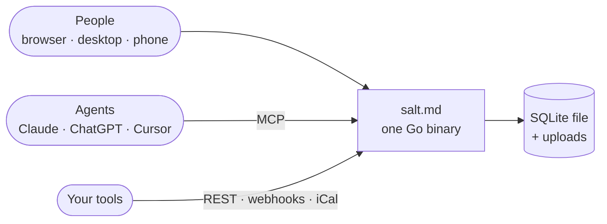

<p align="center">
  
</p>

<p align="center">
  Docs, databases and realtime editing for your team. The same workspace is open
  to Claude, ChatGPT and Cursor, on exactly the access you grant them.<br>
  One binary, on your own server.
</p>

<p align="center">
  <a href="https://salt.md"><b>Website</b></a> ·
  <a href="https://salt.md/demo/"><b>Live demo</b></a> ·
  <a href="https://salt.md/wiki/"><b>Documentation</b></a> ·
  <a href="#quickstart"><b>Quickstart</b></a>
</p>

<br>

<p align="center">
  
</p>

## Quickstart

```sh
curl -fsSL https://raw.githubusercontent.com/saltmd/salt.md/main/install.sh | sh
```

One command downloads the binary for your platform, installs it, starts it and
prints the address to open. On a Linux server it sets itself up as a systemd
service, and running it again upgrades it. No `curl` on the machine?
`wget -qO- … | sh` does the same.

Or with Docker:

```sh
docker run -d -p 8420:8420 -v salt-data:/data ghcr.io/saltmd/salt.md:latest
```

There is nothing else to install: no database server, no cache, no object
store. Reverse proxies, TLS and backups are in the
[self-hosting guide](https://salt.md/wiki/self-hosting/).

## People and agents in the same place

An agent is asked to organise the launch notes. A page appears, a database is
created, the rows fill in. A person opens the same board a second later and
carries on. Same pages, same permissions, same history.

Connect Claude, ChatGPT, Codex, Cursor, Gemini CLI or any other MCP client to
`/mcp` and it works on the workspace you use:

- **Pages**: create, edit, move, duplicate, trash and restore
- **Databases**: create them, change the schema, add and query rows, set up views
- **Search** with the same permission checks a person gets
- **Bulk imports** from any JSON source, without the content passing through the agent
- **Comments**, and an append-only note trail on every page
- **Presence**: the page shows which agent is working on it, before you start typing

**And a list it cannot touch.** No agent can create or delete accounts, issue
tokens, take or restore a backup, change instance settings or decide who is in
a workspace, and the server tells every agent that connects. A credential
carries its person's access and never more, every workspace decides what agents
may do there, and the activity log keeps their changes apart from yours.

[MCP tools](https://salt.md/wiki/mcp-tools/) · [Agent access](https://salt.md/wiki/agent-access/) · [Permissions](https://salt.md/wiki/permissions/)

## A whole workspace

<table>
  <tr>
    <td width="50%" valign="top">
      <picture>
        <source media="(prefers-color-scheme: dark)" srcset="wiki/img/workspace-overview-dark.png">
        
      </picture>
      <p><b>Write.</b> A block editor with a slash menu, checklists, code,
      tables, callouts and diagrams. Page links, backlinks, covers and icons.</p>
    </td>
    <td width="50%" valign="top">
      <picture>
        <source media="(prefers-color-scheme: dark)" srcset="wiki/img/collection-table-dark.png">
        
      </picture>
      <p><b>Organise.</b> Any page becomes a collection with typed properties:
      select, date, person, relation, rollup, formula and more.</p>
    </td>
  </tr>
  <tr>
    <td width="50%" valign="top">
      <picture>
        <source media="(prefers-color-scheme: dark)" srcset="wiki/img/collection-calendar-dark.png">
        
      </picture>
      <p><b>Plan.</b> Table, board, list, gallery, calendar, timeline or form,
      each with its own filters. Any date can be an iCal feed.</p>
    </td>
    <td width="50%" valign="top">
      <picture>
        <source media="(prefers-color-scheme: dark)" srcset="wiki/img/search-dark.png">
        
      </picture>
      <p><b>Find.</b> Full-text search over every page and the text inside
      uploaded PDFs, one shortcut away from anywhere.</p>
    </td>
  </tr>
  <tr>
    <td width="50%" valign="top">
      <picture>
        <source media="(prefers-color-scheme: dark)" srcset="wiki/img/comments-panel-dark.png">
        
      </picture>
      <p><b>Together.</b> Realtime editing with live cursors, comments, page
      history and an activity log.</p>
    </td>
    <td width="50%" valign="top">
      <picture>
        <source media="(prefers-color-scheme: dark)" srcset="wiki/img/graph-dark.png">
        
      </picture>
      <p><b>Connect.</b> The library holds every page you can open, and the
      graph shows what links where.</p>
    </td>
  </tr>
</table>

Moving in? Markdown files, CSVs and a Notion export import from the same menu.

## Under the hood



One Go process, built with `CGO_ENABLED=0`: a static binary with a pure-Go
SQLite driver and the frontend embedded. No PostgreSQL, no Redis, no object
store, no separate collaboration server.

- **Install**: one binary, `install.sh`, or the Docker image
- **Data**: one SQLite file plus an uploads directory
- **Update**: swap the binary or pull the image, restart
- **Backup**: stop, copy two paths, start
- **Platforms**: Linux and macOS on amd64 and arm64, Windows on amd64

The [desktop app](https://salt.md/wiki/desktop-app/) for macOS and Linux is a
window onto a server you run, not a second copy of the product.

## Documentation

[salt.md/wiki](https://salt.md/wiki/) covers every screen, every property type,
every tool an agent can call and every setting on the server. It is written next
to this code and checked against it on every build: a tool name that no longer
exists, an API path that is not a route or a screenshot whose screen has changed
fails the build. Every page is also plain Markdown at the same address with
`.md` on the end, indexed for agents at
[/wiki/llms.txt](https://salt.md/wiki/llms.txt).

## Contributing

Issues and pull requests are welcome. Pull requests need a signed [CLA](CLA.md);
[CONTRIBUTING.md](CONTRIBUTING.md) says what that means and why it exists.
Security reports go to **dev@salt.md**, not to a public issue: see
[SECURITY.md](SECURITY.md).

## License

[AGPL-3.0](LICENSE). Use it, run it at work, change it. If you offer it to
others over a network, publish your changes.

The components salt.md is built on, with their licences in full, are in
[THIRD-PARTY-NOTICES.md](THIRD-PARTY-NOTICES.md). A running instance serves the
same list at `/licenses`.
