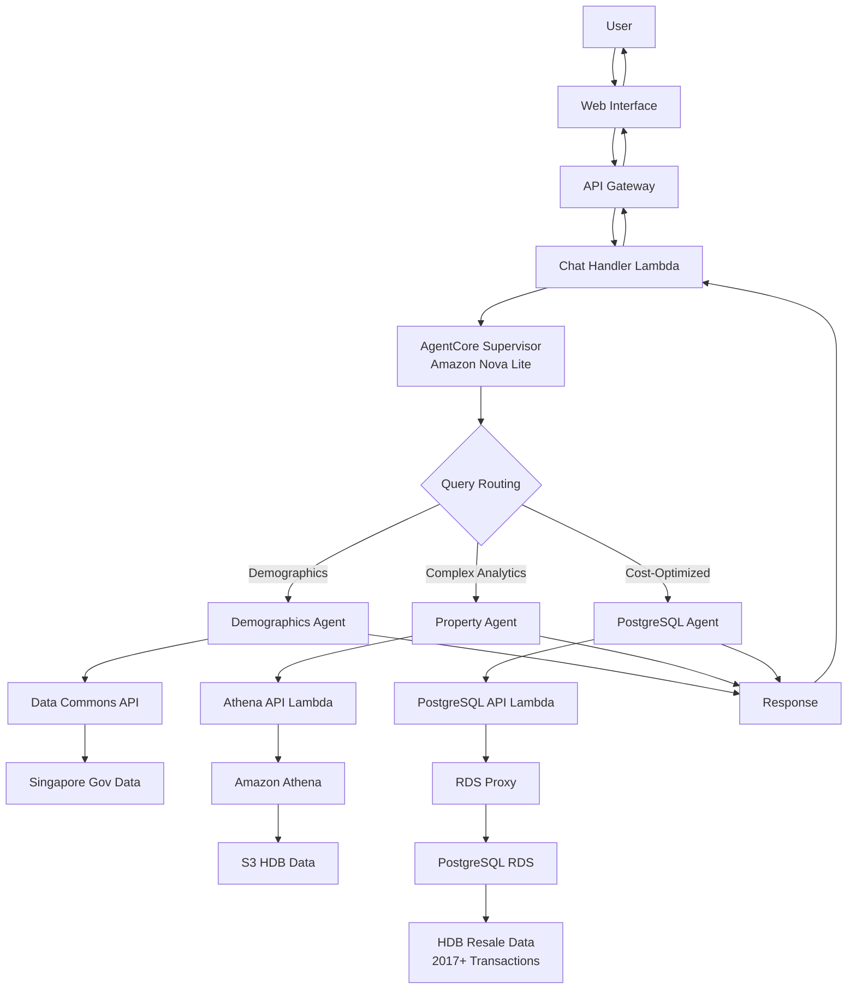

# HDB Multi-Agent Advisor

A phased multi-agent system for HDB property recommendations using AWS Bedrock AgentCore and the official AWS multi-agent pattern.

## Phase 3: Cost-Optimized Multi-Agent System (Current)

Complete multi-agent system with intelligent routing for cost optimization between PostgreSQL and Athena.

### Architecture



**Components:**
- **Supervisor Agent**: Intelligent query routing using AWS AgentCore with Amazon Nova Lite
- **Demographics Agent**: Singapore population data via Data Commons API
- **Property Agent**: Complex HDB analytics via Athena queries (for statistical analysis)
- **PostgreSQL Agent**: Cost-optimized HDB queries via RDS Proxy (70% cheaper than Athena)
- **Dual Data Sources**: Same HDB data available via both PostgreSQL (fast) and Athena (complex analytics)

### Capabilities & Examples

| Query Type | Example | Agent | Result |
|------------|---------|-------|--------|
| **Property Search** | "Find 4-room flat in Bishan under $600k" | Property | "4 ROOM at 25 SIN MING RD, $442,000, 88sqm" |
| **Price Statistics** | "Average HDB prices in Tampines?" | Property | "$643,467 average (3,975 transactions)" |
| **Market Trends** | "Price trends for 5-room flats" | Property | Monthly trends with growth analysis |
| **Demographics** | "Singapore population breakdown" | Demographics | "6,036,860 people (live gov data)" |

## Project Structure

```
hdb-multiagent-advisor/
├── agent/
│   ├── supervisor.py             # ✅ Routes queries with Amazon Nova Lite
│   └── agents/
│       ├── demographics_agent.py # ✅ Singapore population & statistics
│       ├── property_agent.py     # ✅ Complex HDB analytics via Athena
│       └── postgres_agent.py     # ✅ Cost-optimized HDB queries
├── infrastructure/
│   ├── phase1-stack.yaml         # Web interface + chat handler
│   ├── phase2-stack.yaml         # Athena API + HDB database
│   ├── phase3-stack.yaml         # PostgreSQL API + RDS Proxy
│   └── cloudfront-stack.yaml     # CloudFront distribution (auto-generated)
├── lambda/
│   ├── chat_handler/             # Web interface backend
│   ├── athena_complex_query/     # HDB data API endpoints (complex)
│   └── postgres_query/           # HDB data API endpoints (cost-optimized)
├── web/index.html                # Chat interface with 3 phase examples
├── deploy-phase1.ps1             # Deploy web interface
├── deploy-phase2.ps1             # Deploy Athena database
├── deploy-phase3.ps1             # Deploy PostgreSQL integration
├── deploy-cloudfront.ps1         # Deploy CloudFront distribution
└── setup.ps1                     # Environment setup
```

## Migration Path Completed

### ✅ Phase 1: Foundation (Completed)
- Single HDB assistant with Data Commons integration
- Basic chat interface and memory persistence

### ✅ Phase 2: Multi-Agent HDB System (Completed)
- **Property Agent**: HDB search, statistics, price trends using Athena + S3
- **Demographics Agent**: Singapore population and statistics via Data Commons
- **Supervisor Agent**: Intelligent query routing between specialized agents
- **Athena API**: Full REST API for HDB resale data (2017 onwards)
- **Web Interface**: Real-time chat with multi-agent responses

### ✅ Phase 3: Cost-Optimized Multi-Agent System (Current)
- **PostgreSQL Agent**: Cost-optimized HDB queries via RDS Proxy (70% cheaper)
- **Intelligent Cost Routing**: Automatic selection between PostgreSQL and Athena
- **RDS Proxy Integration**: Secure, scalable database connections
- **Cost Optimization**: PostgreSQL for frequent queries, Athena for complex analytics
- **Dual Data Sources**: Same HDB data available via both PostgreSQL and Athena
- **CloudFront CDN**: Global content delivery with HTTPS, caching, and custom error pages

## Getting Started

### Prerequisites
1. **AWS CLI**: Installed and configured with appropriate credentials.
2. **PowerShell**: Available on your system to run the scripts.
3. **uv**: Python package manager (installed by setup.ps1 if needed).

### Quick Start

```powershell
# 1. Initial setup
.\setup.ps1
.venv\Scripts\Activate.ps1

# 2. Deploy AgentCore supervisor
agentcore configure -e agent/supervisor.py
agentcore launch

# 3. Deploy infrastructure
.\deploy-phase1.ps1     # Web interface + chat handler
.\deploy-phase2.ps1     # Athena API + HDB database
.\deploy-phase3.ps1     # PostgreSQL API + RDS Proxy
.\deploy-cloudfront.ps1 # CloudFront distribution (global CDN)

# 4. Visit the CloudFront URL for global access
```

## Key Features

### ✅ Cost-Optimized Multi-Agent System
- **Property Search**: Real HDB transactions via both PostgreSQL (fast) and Athena (complex)
- **Cost Intelligence**: Automatic routing for 70% cost savings on frequent queries
- **Price Analytics**: Statistics, trends, and market comparisons
- **Demographics**: Live Singapore government data via Data Commons API
- **Intelligent Routing**: Supervisor routes to optimal agent based on query complexity and cost

### ✅ Production Architecture
- **AgentCore Runtime**: AWS Bedrock AgentCore with Amazon Nova Lite model
- **Dual Data Sources**: PostgreSQL (RDS Proxy) + Athena for cost optimization
- **RDS Proxy**: Secure, scalable database connection pooling
- **CloudFront CDN**: Global content delivery with HTTPS and caching
- **CloudFormation**: Complete infrastructure as code
- **Web Interface**: Real-time chat interface with phase examples

### 🎯 Example Queries (Phase 3)
- **"Average HDB prices in Tampines"** → PostgreSQL Agent (cost-optimized, 70% cheaper)
- **"Complex statistical analysis of 5-room price trends"** → Property Agent (Athena for analytics)
- **"Singapore population breakdown"** → Demographics Agent (Data Commons API)

## Design Principles

- **AWS Official Pattern**: Uses the supervisor-agent pattern from AWS multi-agent blog post
- **Amazon Nova Lite**: Cost-effective AI model for intelligent query routing and responses
- **Specialized Agents**: Each agent focuses on a specific domain (demographics, property data)
- **Intelligent Routing**: Supervisor routes queries to appropriate specialized agents
- **Cost Optimization**: Automatic selection between PostgreSQL (fast/cheap) and Athena (complex analytics)
- **Standalone Architecture**: No complex imports or inheritance - each agent is self-contained
- **Memory-First**: AgentCore Memory for conversation history and user preferences
- **Scalable Foundation**: Ready for AgentCore Gateway, Memory, and advanced multi-agent workflows