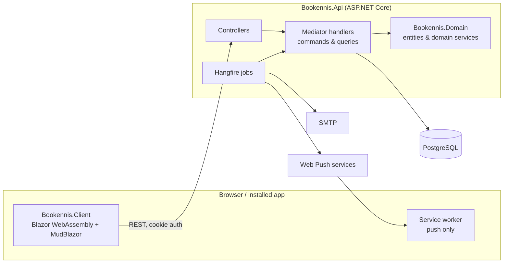

<div align="center">


# Clubnetz

**English** · [Deutsch](README.de.md)

**Open-source club management and court booking for tennis clubs.**

Members book courts in seconds. The board manages members, seasons, guests, events and news in one place.<br />
Free, self-hostable, installable on any phone, in English and German.

*Kostenlose Open-Source-Vereinsverwaltung und Platzbuchung für Tennisvereine.*

**Already hosted and free for clubs at [clubnetz.app](https://clubnetz.app)**

[](https://github.com/sleepwalkerffs/Clubnetz/actions/workflows/review_bookennis.yaml)


[](LICENSE)

[Features](#-features) · [Tech stack](#-tech-stack) · [Getting started](#-getting-started) · [Hosting](#-hosting-it-yourself) · [Project structure](#-project-structure) · [Contributing](#-contributing)

</div>

---

## 🎾 What is Clubnetz?

Clubnetz is a free and open-source web app for tennis clubs, and for any other sports club with courts to book. It started as a court booking system for a tennis club and grew into a full club management platform: court reservations, membership, guests, a club calendar, news, statistics and a bit of friendly competition.

There are two ways to use it:

- **Use the hosted version.** Clubnetz already runs at **[clubnetz.app](https://clubnetz.app)**, free for clubs and members. Write to [hello@clubnetz.app](mailto:hello@clubnetz.app) and your club gets its own area, with nothing to install or maintain.
- **Host it yourself** with Docker ([see below](#-hosting-it-yourself)).

The code is licensed under the AGPL-3.0.

One installation serves many clubs. Every club is its own tenant with its own courts, seasons, members, roles and email texts.

> **A note on names:** the product is called **Clubnetz**. The code still uses its former name **Bookennis** in namespaces, project names and scripts. That is intentional for now, so don't be surprised when you open the solution.

## ✨ Features

### For members

| | |
|---|---|
| 🎾 **Court booking** | Book a court in a few taps, with play modes, opening hours, prime time rules and per-season quotas. |
| 🔁 **Recurring bookings** | Reserve the same slot every week or every few weeks. Edit or cancel a single date, or this and all following ones. |
| 👨‍👩‍👧 **Families** | Parents book and manage on behalf of their children. |
| 📅 **Club calendar** | Work efforts, parties, tournaments and meetings, with registration, head counts and the organizer's questions ("2x Schnitzel, please"). Share an event via link or WhatsApp. |
| 📰 **Club news** | Announcements with attachments, pinned posts and expiry dates. |
| 📊 **Statistics & leaderboards** | Who plays the most, with whom, and when. |
| 🏆 **Badges & trophy case** | Seasonal tier badges earned by playing, plus one-time badges for special achievements. |
| 🗓️ **Subscription planner** | Plans a fair schedule for shared winter court subscriptions and exports it to Excel. |
| 🔔 **Notifications** | Booking added or cancelled, reminders before a match, new events, news and badges. By push, by email, or not at all. |
| 📱 **Installable app** | Add it to the home screen on iOS, Android and desktop. Light and dark mode included. |

### For the board

| | |
|---|---|
| 👥 **Members & seasons** | Members, roles (admin, sports director, treasurer, trainer, …) and season enrollment. |
| 🎟️ **Guest cards** | Let guests book with a link or code and a fixed number of bookings. |
| 🏟️ **Courts & play modes** | Courts, opening hours, prime time, booking rules and who may book what. |
| 🚧 **Court blockings** | Block courts for tournaments, maintenance, weather or weekly training. Affected players are informed. |
| ✉️ **Email templates** | Customize every club email per language with Markdown and variables, with live preview and test send. |
| 📣 **Announcements by email** | Send news to all members, the active season, the youth or selected roles. |
| 📈 **Club statistics** | Court utilization and activity over the season. |

### Built in

- **Multi-tenant** – a global query filter scopes every club's data to its tenant.
- **English and German** – every screen, email and notification.
- **Privacy first** – GDPR self-service (data export, leave club, delete account), imprint and privacy pages.
- **Hardened** – account lockout, rate limiting, strict Content Security Policy and security headers.

## 🧱 Tech stack

| Layer | Technology |
|---|---|
| Frontend | [Blazor WebAssembly](https://learn.microsoft.com/aspnet/core/blazor/) with [MudBlazor](https://mudblazor.com/), installable as a PWA |
| Backend | ASP.NET Core Web API on .NET 10, mediator pattern ([Fusonic.Extensions](https://github.com/fusonic/dotnet-extensions)), [SimpleInjector](https://simpleinjector.org/) |
| Data | PostgreSQL 16 with Entity Framework Core |
| Background jobs | [Hangfire](https://www.hangfire.io/) |
| Email | MailKit, Liquid ([Fluid](https://github.com/sebastienros/fluid)) and Markdown ([Markdig](https://github.com/xoofx/markdig)) templates |
| Push | Web Push (VAPID) |
| Tests | xUnit v3, NSubstitute and FluentAssertions against a real PostgreSQL database |



The API hosts the Blazor client, so a single process serves the whole app.

## 🚀 Getting started

### Prerequisites

- [.NET SDK 10](https://dotnet.microsoft.com/download) (the exact version is pinned in [global.json](global.json))
- [Docker](https://www.docker.com/)
- [PowerShell 7+](https://learn.microsoft.com/powershell/) for the helper scripts

### Run it locally

1. **Start the developer services** (PostgreSQL, a test database, pgAdmin, Adminer and Mailpit). Keep this terminal open.

   ```bash
   pwsh ./Start-DeveloperServices.ps1
   ```

2. **Start the app** from your IDE, or from the command line:

   ```bash
   dotnet workload restore src/backend/Bookennis.Api/Bookennis.Api.csproj
   ```

   ```bash
   dotnet run --project src/backend/Bookennis.Api/Bookennis.Api.csproj
   ```

3. Open **https://localhost:5000** and register a user. The confirmation email lands in Mailpit (http://localhost:5180).

Database migrations are applied automatically on startup. The repository contains no test data: database dumps can hold personal data and are never committed (`dump/` is ignored). If you have a dump of your own, put it at `dump/test/testdata.dump` and restore it with `pwsh ./scripts/testdata/import-appdata.ps1`.

### Developer services

| Service | URL | Notes |
|---|---|---|
| App | https://localhost:5000 | API and client |
| Swagger | https://localhost:5000/swagger | Development only |
| Mailpit | http://localhost:5180 | Catches every email the app sends locally |
| pgAdmin | http://localhost:5480 | `developer@bookennis.com` / `developer` |
| Adminer | http://localhost:8080 | |
| PostgreSQL | `localhost:8432` | Database `bookennis`, user `postgres`, password `password` |

### Run the tests

The tests use the `postgres_test` container from the developer services (`localhost:5432`).

```bash
dotnet test src/Bookennis.sln
```

After adding a migration, drop the `bookennis_test` template database once, otherwise the tests fail with "relation does not exist". See [the project guidelines](src/.github/copilot-instructions.md) for the details.

### Push notifications (optional)

Push is switched off until VAPID keys are configured. Create a key pair with [scripts/New-VapidKeys.ps1](scripts/New-VapidKeys.ps1) and put it into the `Push` section of the API settings. Don't commit the keys.

## 🐳 Hosting it yourself

The [Dockerfile](Dockerfile) builds one image that runs the whole app. It needs a PostgreSQL 16 database (the database has to exist, the tables are created on startup) and an SMTP server.

```bash
docker build -t clubnetz --build-arg SOURCE_REVISION_ID=$(git rev-parse HEAD) .
```

The app listens on port `8080` (HTTP) and expects a reverse proxy in front of it that terminates HTTPS. `/health` answers with 200 when the app and the database are up.

**Mount a volume at `/home/app/.aspnet/DataProtection-Keys`.** It holds the keys that protect the login cookies and the links in emails. Without it every deployment signs all users out.

Settings are passed as environment variables:

| Variable | Meaning |
|---|---|
| `ConnectionString` | `Server=...;Port=5432;Database=...;User Id=...;Password=...` |
| `AppUrl` | Public address of the app, e.g. `https://clubnetz.example.org`. Used for the links in emails. |
| `Email__SenderAddress`, `Email__SenderName` | Sender of all emails |
| `Email__SmtpServer`, `Email__SmtpPort`, `Email__SmtpUsername`, `Email__SmtpPassword`, `Email__EnableSsl` | SMTP server |
| `Legal__OperatorName`, `Legal__Street`, `Legal__ZipCode`, `Legal__City`, `Legal__Country`, `Legal__Email`, `Legal__Phone` | Your details for the imprint and privacy policy pages |
| `Legal__HostingProvider`, `Legal__EmailProvider` | Named as data processors in the privacy policy |
| `Push__PublicKey`, `Push__PrivateKey`, `Push__Subject` | Optional: VAPID keys for push notifications (see above). Never change them on a running installation. |
| `BccRecipient` | Optional: address that gets a blind copy of every email |

[.github/workflows/deploy.yml](.github/workflows/deploy.yml) shows how the image is built and rolled out with [Coolify](https://coolify.io/) on every push to `stage` and `production`.

## 🗂️ Project structure

```text
├── src
│   ├── backend
│   │   ├── Bookennis.Api            ASP.NET Core API: controllers, handlers, EF Core, emails, jobs
│   │   ├── Bookennis.Domain         Entities, domain services and business rules
│   │   ├── Bookennis.Api.Tests      Handler tests against PostgreSQL
│   │   └── Bookennis.Domain.Tests   Domain logic tests
│   ├── frontend                     Bookennis.Client: Blazor WebAssembly pages, components, stores
│   ├── shared                       Bookennis.Shared: DTOs and enums used by client and API
│   └── global                       Bookennis.Global: cross-cutting utilities
├── docker                           Compose files for local development
├── scripts                          Database dump import/export, VAPID keys
├── Dockerfile                       The image that runs the app
└── .github/workflows                CI (build and tests) and deployment
```

A few conventions that shape the code:

- **Mediator everywhere.** Controllers only dispatch commands and queries. Each handler lives next to its feature in `Business/<Feature>`.
- **Domain-driven.** Business rules live in `Bookennis.Domain`, not in handlers or controllers.
- **Stores in the client.** Components never call the API directly. They use stores, which own loading and saving state.
- **Tenant-aware by default.** Club routes are `api/Clubs/{clubId}/...` and a global query filter scopes every tenant entity.

The full set of conventions and the domain rules for each feature are documented in [src/.github/copilot-instructions.md](src/.github/copilot-instructions.md).

## 🤝 Contributing

Contributions are welcome, whether it is a bug report, an idea, a translation fix or a pull request. [CONTRIBUTING.md](CONTRIBUTING.md) explains how to report issues and how pull requests are handled.

Found a security issue? Please don't open a public issue. Report it privately as described in [SECURITY.md](SECURITY.md).

## 📄 License

Clubnetz is free software, licensed under the [GNU Affero General Public License v3.0](LICENSE).

In short: you may use, change and host it, also commercially. If you distribute it or let others use a modified version over a network, you have to make the source code of your version available under the same license.

---

<div align="center">

Made with 🎾 for clubs that would rather play than do paperwork.

</div>
