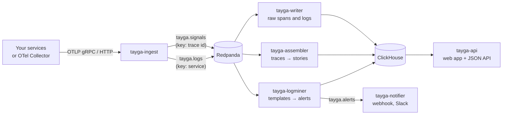

<a href="https://softberries.github.io/tayga/">
  <picture>
    <source media="(prefers-color-scheme: dark)" srcset="docs/assets/hero-dark.png">
    <source media="(prefers-color-scheme: light)" srcset="docs/assets/hero-light.png">
    
  </picture>
</a>

<p align="center">
  <a href="LICENSE"></a>
  <a href="https://github.com/softberries/tayga/actions/workflows/ci.yml"></a>
  <a href="https://softberries.github.io/tayga/"></a>
  <a href="https://github.com/softberries/tayga/releases/latest"></a>
</p>

<p align="center">
  <a href="https://softberries.github.io/tayga/getting-started/quickstart/"><b>Quickstart</b></a> ·
  <a href="https://softberries.github.io/tayga/"><b>Documentation</b></a> ·
  <a href="https://softberries.github.io/tayga/#tour"><b>Watch the narrated tour</b></a> ·
  <a href="https://softberries.github.io/tayga/comparison/"><b>Comparison</b></a> ·
  <a href="https://softberries.github.io/tayga/enterprise/"><b>Enterprise</b></a>
</p>

**Tayga turns OpenTelemetry traces and logs into error stories.** For each failing or slow request it shows the root-cause span, the request path across services, the critical path, a diff against the endpoint's normal baseline, and the logs that matter. It analyses traces as they stream in, so by the time you open it the failing requests are already explained, and repeats of one problem fold into one story group instead of hundreds of traces. It mines your logs into templates and alerts on new, spiking and silent ones. Tayga is written in Rust, reads standard OTLP, stores in ClickHouse, streams through Redpanda, and is self-hosted under the AGPLv3.

<p align="center">
  <a href="https://softberries.github.io/tayga/#tour"></a>
</p>

## Why Tayga?

> Tayga, properly spelled *Tajga*, is my hunting dog. Tajga can trace anything, anywhere, in the harshest conditions. I love that dog as much as I love writing software, so the name was obvious. The "y" is for English speakers, who wouldn't read *Tajga* the way it's meant ;)
>
> — Krzysztof Grajek, author of Tayga

## Features

- **[Error and slow stories](https://softberries.github.io/tayga/concepts/error-stories/).** Every assembled trace is checked. A failing request, or one slower than max(p99 × 1.5, p99 + 100 ms) of its endpoint's baseline, becomes a story.
- **[Deterministic root cause and critical path](https://softberries.github.io/tayga/concepts/root-cause-critical-path/).** Fixed rules over the span tree, no LLM: the same input gives the same answer, in a sentence such as "`checkout` could not reach `payment`".
- **[Comparison with normal](https://softberries.github.io/tayga/concepts/baselines/).** Operations that are new, missing or slower than in the endpoint's baseline from the last hour.
- **[Story groups](https://softberries.github.io/tayga/concepts/story-groups/).** A fingerprint of the kind, endpoint, root-cause span and masked message folds repeats into one group with a trend.
- **[Log templates](https://softberries.github.io/tayga/concepts/log-templates/) and [log alerts](https://softberries.github.io/tayga/concepts/log-alerts/).** Drain mines each service's logs at ingest. New templates, rate spikes and, when you ask for it, silence raise alerts, delivered to [webhooks and Slack](https://softberries.github.io/tayga/alerting/notifier/).
- **[Service map](https://softberries.github.io/tayga/guide/service-map/) and [trace explorer](https://softberries.github.io/tayga/guide/traces/).** Rate, error ratio and p99 per service against its 24-hour baseline; a duration scatter, waterfall and span drawer for any trace.
- **[Pipeline health](https://softberries.github.io/tayga/guide/pipeline/) built in.** The API records every service's metrics itself, so you see throughput and consumer lag without Prometheus.
- **Easy to run.** A [one-line installer](https://softberries.github.io/tayga/getting-started/quickstart/) for Docker Compose, a [Helm chart](https://softberries.github.io/tayga/install/helm/) for Kubernetes, and [optional login](https://softberries.github.io/tayga/operations/authentication/). Any OpenTelemetry Collector [connects](https://softberries.github.io/tayga/install/collector/) with one exporter.

## Quickstart

**Docker Compose.** Tayga, ClickHouse and Redpanda on one host; the installer checks the ports, waits for health, and prints the URLs:

```sh
curl -fsSL https://raw.githubusercontent.com/softberries/tayga/master/scripts/install.sh | sh
```

Open http://localhost:8090 and send OTLP to `localhost:4317` (gRPC) or `localhost:4318` (HTTP). [Quickstart →](https://softberries.github.io/tayga/getting-started/quickstart/)

**Kubernetes.** Bundled single-node ClickHouse and Redpanda for evaluation, or your own for production:

```sh
helm install tayga oci://ghcr.io/softberries/charts/tayga --version 0.1.0 \
  --namespace tayga --create-namespace --wait
```

[Helm and Kubernetes →](https://softberries.github.io/tayga/install/helm/)

**See it break on purpose.** Run Tayga next to the [OpenTelemetry demo](https://github.com/open-telemetry/opentelemetry-demo) shop, make every payment fail, and watch the story appear:

```sh
git clone --recurse-submodules https://github.com/softberries/tayga.git && cd tayga
make up                                      # the shop and Tayga: http://localhost:8090
make flag NAME=paymentFailure VARIANT=100%   # every payment now fails
make flags-reset                             # put the flags back
```

[Demo with the OTel demo →](https://softberries.github.io/tayga/getting-started/otel-demo/)

## Screenshots

<p align="center">
<a href="https://softberries.github.io/tayga/guide/stories/"><picture>
  <source media="(prefers-color-scheme: dark)" srcset="site/src/assets/screens/stories-home-dark.webp">
  
</picture></a>
</p>

<table>
  <tr>
    <td width="50%">
<a href="https://softberries.github.io/tayga/guide/service-map/"><picture>
  <source media="(prefers-color-scheme: dark)" srcset="site/src/assets/screens/map-overview-dark.webp">
  
</picture></a>
    </td>
    <td width="50%">
<a href="https://softberries.github.io/tayga/guide/logs/"><picture>
  <source media="(prefers-color-scheme: dark)" srcset="site/src/assets/screens/logs-templates-dark.webp">
  
</picture></a>
    </td>
  </tr>
  <tr>
    <td align="center"><b>Service map</b>: health against each service's baseline</td>
    <td align="center"><b>Log templates</b>: mined at ingest, with alerts</td>
  </tr>
</table>

Top: <b>Stories</b>, one group per problem with its trend and inspector. All three were captured from a running stack with the OpenTelemetry demo, 2026-10-07. Every page is explained in the [user guide](https://softberries.github.io/tayga/guide/tour/).

## How it works



1. **Ingest.** `tayga-ingest` receives OTLP and publishes one record per trace id per export request to Redpanda, keyed by trace id, so every span of a trace lands on the same partition. Logs also go to a second topic, keyed by service.
2. **Assemble and analyse.** The assembler closes a trace after 10 s without new spans (60 s at most), builds the span tree, and turns failing and slow requests into stories with a root cause, a critical path and a baseline diff.
3. **Explain and alert.** The logminer mines templates per service and raises new, spike and silence alerts; the notifier delivers them. `tayga-api` serves the web app and the JSON API from ClickHouse.

[Architecture →](https://softberries.github.io/tayga/concepts/architecture/)

## Benchmarks

Measured on an Apple M3 Max (14 cores, 96 GiB; Docker Desktop VM with 14 CPUs and 31.5 GiB), Rust 1.98.1, ClickHouse 26.8, on 2026-10-06 and 2026-10-07. Micro-benchmarks are criterion runs of a release build; live numbers come from the OpenTelemetry demo stack on the same machine. One machine and one workload, not a guarantee.

| Measure | Result | How |
|---|---|---|
| Drain, per log line | **2.818 µs** | criterion `stages/drain_add`, 50,000-line corpus, one thread |
| Fingerprint cache vs Drain alone | **6.98×** faster (144.29 ms → 20.678 ms per 50,000 lines) | criterion `cached` benches; identical templates by a differential test |
| Cache hits on the live stack | **99.70 %** (69,359 of 69,569 lines) | first 30 minutes after deploy, 2026-10-07 |
| Logminer CPU at live load | **1.07 %** of one core at about 40 lines/s | `docker stats`, 2026-10-06 |
| Service map, ClickHouse CPU per refresh | **291.5 → 40.0 ms** (7.3×) | live `system.query_log`, 2026-10-07 |
| Baseline queries, bytes read per run | **27.7×** and **17.0×** less | live `system.query_log`, 2026-10-07 |
| GPU fingerprinting | **slower than CPU `parallel` at every size**, so not shipped | criterion, 2026-10-07 |

Method, raw tables and the corpus: [Performance →](https://softberries.github.io/tayga/performance/) (source: [`docs/perf/sp4-performance.md`](docs/perf/sp4-performance.md)).

## How Tayga compares

Tayga is a focused tool, and for many teams a broader product is the better choice. Every competitor fact below comes from the vendor's own docs, pricing page or repository, **accessed on 2026-10-07**; the [full comparison](https://softberries.github.io/tayga/comparison/) links a source for every cell and lists what could not be verified.

| Product | Pick it over Tayga when | Tayga differs by |
|---|---|---|
| **Jaeger** (Apache-2.0) | You want a CNCF graduated tracing platform with proven scale, taking OTel, Jaeger and Zipkin data | Per-request error stories and log templates; Jaeger is traces only and documents no RCA beyond a critical-path view |
| **Grafana LGTM** (AGPL-3.0) | You need metrics and dashboards, or a hosted service (Grafana Cloud, with Sift and the LLM-based Assistant) | Stories and log-template alerts in the self-hosted core; Loki's pattern ingester is off by default |
| **SigNoz** (MIT + `ee/`) | You want traces, metrics and logs in one product, self-hosted or in SigNoz Cloud | A deterministic root cause with no LLM (SigNoz's Noz is an AI teammate); log templates, which the current SigNoz docs do not offer |
| **Coroot** (Apache-2.0) | You cannot add SDKs (eBPF agent), or your root causes are in the infrastructure | Per-request stories built at ingest in the open-source core, with no LLM; Coroot's AI RCA (Enterprise, or through Coroot Cloud) ends in an LLM summary |
| **OpenObserve** (AGPL-3.0) | You want traces, metrics and logs in one product, or a hosted service | Log patterns and root causes in the open-source core; OpenObserve's Log Patterns and SRE Agent are Enterprise |
| **ClickStack / HyperDX** (MIT, Apache-2.0) | You want traces, metrics and logs on ClickHouse in one product, or a managed service | Templates mined at ingest from every line, with alerts; ClickStack mines patterns at query time over a sample |
| **Datadog, Dynatrace, New Relic** (proprietary) | You want a hosted platform with its own agents (Dynatrace OneAgent), RCA across infrastructure, log anomaly alerts with no rules to write (Datadog Watchdog detects new and spiking warning and error patterns at intake; New Relic alerts on log patterns), and everything else besides | Self-hosted and open source, with stories and log alerts in the core; priced per cluster or node for Enterprise rather than per GB; rules instead of AI agents (Bits AI, Autopilot) |

**Where another product is the better choice, in general:** you need metrics and dashboards (Tayga has neither), you cannot add OpenTelemetry instrumentation, your root causes are in the infrastructure (Tayga's root cause is always a span), or you want a hosted service or proven scale (Tayga is young and has been tested against the OpenTelemetry demo).

Tayga can also sit next to any of them: it takes OTLP from the same Collector, and its trace view links out to Jaeger.

## Enterprise

**Tayga Enterprise is available on request**, under a commercial license, priced per cluster or node rather than per GB. It adds:

- **Identity and access:** SSO / SAML, SCIM provisioning, fine-grained RBAC, audit logs.
- **Multi-tenancy** and **multi-cluster federation**.
- **High availability**, scale-out deployment and upgrade tooling.
- **Privacy and compliance:** PII redaction policies and data-residency controls.
- **Long-term baselines:** compare a release with previous deploys.
- **Integrations:** ServiceNow, Jira and PagerDuty.
- **LLM incident summaries** with bring-your-own model.
- **Support** with an SLA, onboarding and training.

Contact **[hello@softberries.dev](mailto:hello@softberries.dev)** or visit **[softberries.dev](https://softberries.dev)**. [Enterprise →](https://softberries.github.io/tayga/enterprise/)

## Documentation

| Topic | Pages |
|---|---|
| Getting started | [What is Tayga](https://softberries.github.io/tayga/getting-started/what-is-tayga/) · [Quickstart](https://softberries.github.io/tayga/getting-started/quickstart/) · [Demo with the OTel demo](https://softberries.github.io/tayga/getting-started/otel-demo/) |
| Install | [Docker Compose](https://softberries.github.io/tayga/install/docker-compose/) · [Helm and Kubernetes](https://softberries.github.io/tayga/install/helm/) · [From source](https://softberries.github.io/tayga/install/from-source/) · [Connect your Collector](https://softberries.github.io/tayga/install/collector/) · [Upgrading](https://softberries.github.io/tayga/install/upgrading/) · [Uninstalling](https://softberries.github.io/tayga/install/uninstalling/) |
| Concepts | [Architecture](https://softberries.github.io/tayga/concepts/architecture/) · [Error stories](https://softberries.github.io/tayga/concepts/error-stories/) · [Root cause and critical path](https://softberries.github.io/tayga/concepts/root-cause-critical-path/) · [Baselines](https://softberries.github.io/tayga/concepts/baselines/) · [Story groups](https://softberries.github.io/tayga/concepts/story-groups/) · [Service map](https://softberries.github.io/tayga/concepts/service-map/) · [Log templates](https://softberries.github.io/tayga/concepts/log-templates/) · [Log alerts](https://softberries.github.io/tayga/concepts/log-alerts/) · [Replicas](https://softberries.github.io/tayga/concepts/replicas/) · [The data clock](https://softberries.github.io/tayga/concepts/data-clock/) |
| User guide | [Tour of the app](https://softberries.github.io/tayga/guide/tour/) · [Stories](https://softberries.github.io/tayga/guide/stories/) · [Story detail](https://softberries.github.io/tayga/guide/story-detail/) · [Traces](https://softberries.github.io/tayga/guide/traces/) · [Service map](https://softberries.github.io/tayga/guide/service-map/) · [Logs](https://softberries.github.io/tayga/guide/logs/) · [Alerts](https://softberries.github.io/tayga/guide/alerts/) · [Pipeline](https://softberries.github.io/tayga/guide/pipeline/) · [Command palette](https://softberries.github.io/tayga/guide/command-palette/) |
| Alerting | [The notifier](https://softberries.github.io/tayga/alerting/notifier/) · [Webhook and Slack formats](https://softberries.github.io/tayga/alerting/formats/) · [Delivery semantics](https://softberries.github.io/tayga/alerting/delivery/) |
| Operations | [Configuration](https://softberries.github.io/tayga/operations/configuration/) · [Authentication](https://softberries.github.io/tayga/operations/authentication/) · [Scaling the logminer](https://softberries.github.io/tayga/operations/scaling-logminer/) · [Retention and disk](https://softberries.github.io/tayga/operations/retention/) · [Re-mining templates](https://softberries.github.io/tayga/operations/remine/) · [Metrics and Grafana](https://softberries.github.io/tayga/operations/metrics-grafana/) · [Performance tuning](https://softberries.github.io/tayga/operations/performance-tuning/) · [Upgrades and migrations](https://softberries.github.io/tayga/operations/upgrades/) · [Troubleshooting](https://softberries.github.io/tayga/operations/troubleshooting/) |
| Reference | [HTTP API](https://softberries.github.io/tayga/reference/api/) · [Performance](https://softberries.github.io/tayga/performance/) · [Comparison](https://softberries.github.io/tayga/comparison/) · [FAQ](https://softberries.github.io/tayga/faq/) · [Changelog](https://softberries.github.io/tayga/changelog/) · [Verified claims](https://softberries.github.io/tayga/verified/) |

## Contributing

Issues and pull requests are welcome on [GitHub](https://github.com/softberries/tayga). Before a larger change, open an issue to discuss it.

- Build and test with the commands in [From source](https://softberries.github.io/tayga/install/from-source/#developer-commands): `cargo test --workspace` for the unit tests, `make it` for the integration tests, and `make up` plus `make e2e` for the end-to-end scenarios against the OpenTelemetry demo.
- CI runs `cargo fmt --check`, `cargo clippy -D warnings`, the tests, and the web app's lint, typecheck and unit tests on every pull request.
- **Releases.** The go-live and release checklist is in [`.github/RELEASING.md`](.github/RELEASING.md).
- **Contributor License Agreement.** Because Tayga is offered under the AGPLv3 and under a commercial license, contributors sign a CLA on their first pull request. See [CONTRIBUTING.md](CONTRIBUTING.md) and [LICENSING.md](LICENSING.md).

## License

The core is licensed under the [GNU Affero General Public License v3.0](LICENSE) (`AGPL-3.0-only`). Tayga Enterprise is available under a commercial license, which also removes the AGPL obligations; see [LICENSING.md](LICENSING.md) and the [License page](https://softberries.github.io/tayga/license/). This summary is not legal advice.

## Verified claims

Every number and behaviour in this README was checked; the rule is that a claim that cannot be checked is left out. Live timings are single observations on the machine above, not guarantees. The full table, with every claim in the docs, is on [Verified claims](https://softberries.github.io/tayga/verified/).

| Claim in this README | Evidence | Checked |
|---|---|---|
| OTLP over gRPC and HTTP; traces and logs only, no metrics | code: `crates/tayga-ingest` (`main.rs`, `http.rs`) | 2026-10-07 |
| Slow rule max(p99 × 1.5, p99 + 100 ms); baseline from the last hour | code: `Thresholds::default`, `baseline_window_minutes` in `crates/tayga-analysis` | 2026-10-07 |
| Root cause from fixed rules, no LLM | code: `find_root_cause`, `explain` in `crates/tayga-analysis`; unit tests | 2026-10-07 |
| Fingerprint of kind, endpoint, root-cause span and masked message | code: `build_story`, `fingerprint` in `crates/tayga-analysis` | 2026-10-07 |
| One record per trace id per export request, keyed by trace id; logs keyed by service | code: `crates/tayga-ingest/src/records.rs` | 2026-10-07 |
| A trace closes 10 s after its last span, 60 s at most | code: `AssemblerSettings::default` (`gap_ms`, `max_age_ms`) | 2026-10-07 |
| New, spike and opt-in silence alerts, delivered to webhook and Slack | code: `crates/tayga-drain/src/detect.rs`, `crates/tayga-notifier`; live `make e2e-notifier` | 2026-10-06 |
| Service map against a 24-hour baseline | code: `HEALTH_BASELINE_SECS` in `crates/tayga-api/src/params.rs` | 2026-10-07 |
| The installer and the Compose bundle start a healthy stack that turns telemetry into stories and templates | live: `install.sh --local`, telemetrygen traces (gRPC and HTTP) and logs, then the API | 2026-10-07 |
| The Helm chart installs and works | `helm lint --strict`, kubeconform, and a kind install with telemetrygen data checked through the API | 2026-10-07 |
| The `paymentFailure` flag becomes payment stories | live `make e2e`, `payment_failure_blames_payment` | 2026-10-06 |
| Benchmark rows | [`docs/perf/sp4-performance.md`](docs/perf/sp4-performance.md), criterion and live `system.query_log` | 2026-10-06/07 |
| Competitor cells | vendor docs, pricing pages and repositories, in [`docs/research/competition.md`](docs/research/competition.md) | accessed 2026-10-07 |
| AGPLv3 core | `LICENSE`, `license = "AGPL-3.0-only"` in `Cargo.toml` | 2026-10-07 |
| Enterprise features and pricing model | owner | commercial offering (owner), not in the open-source code |
| The name note | owner | the owner's words |
