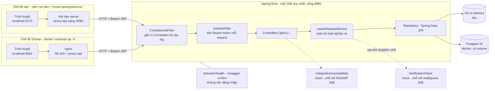
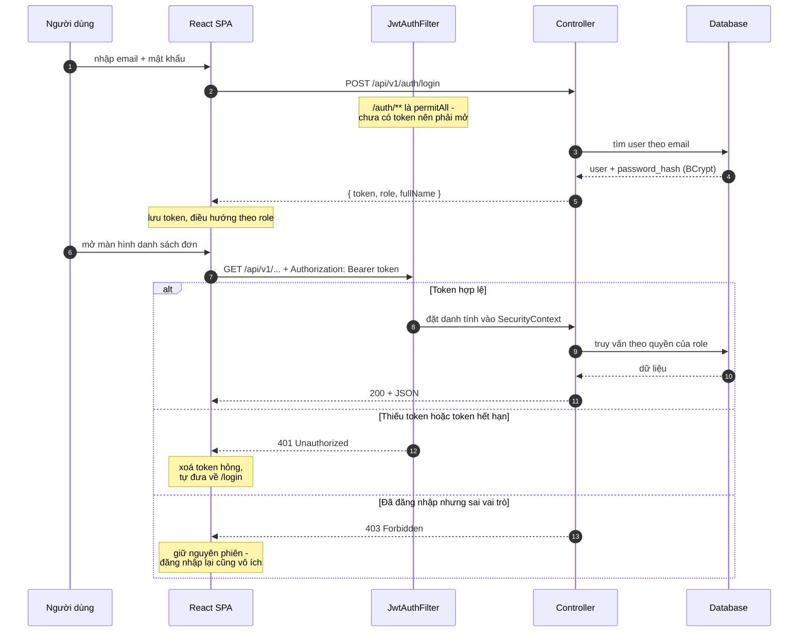
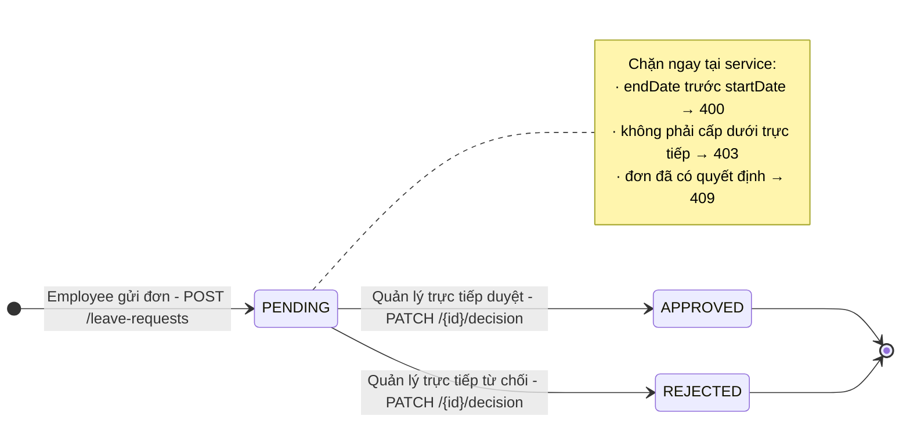
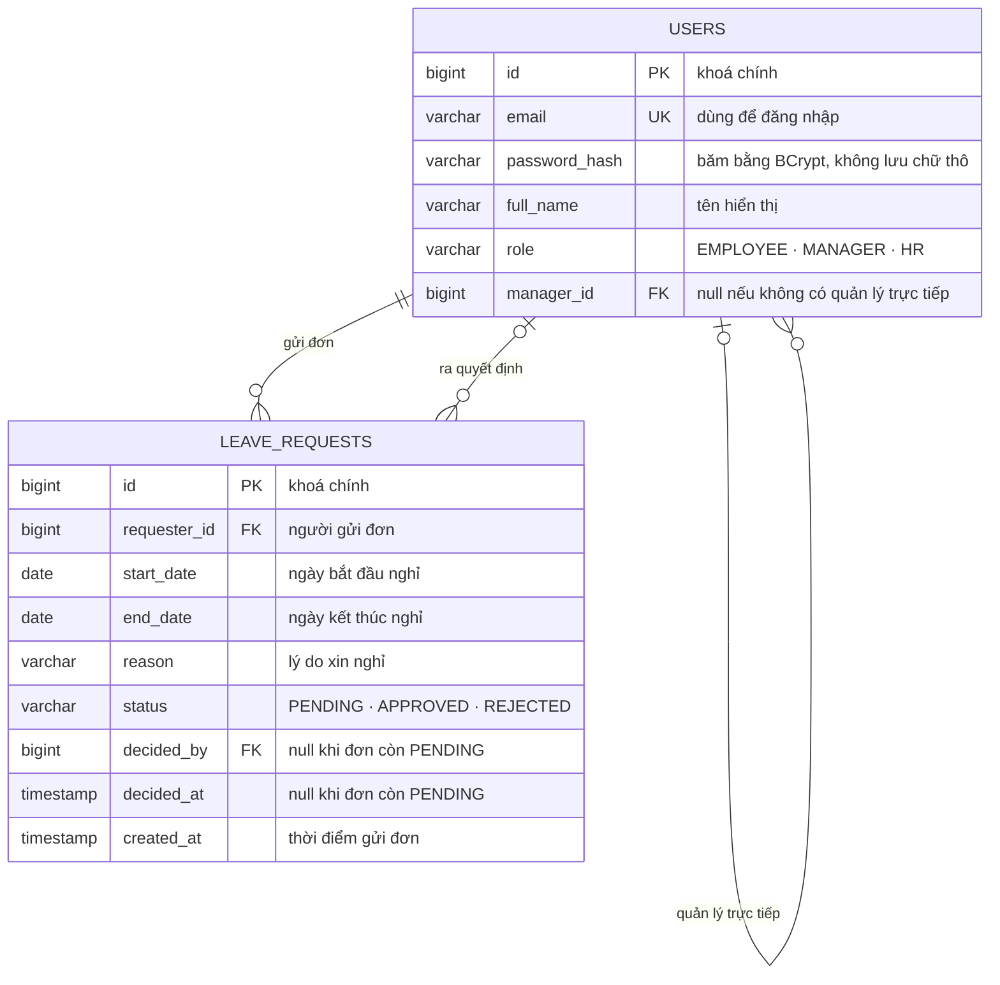

# Leave Approval System - Mini SE Project

Một hệ thống duyệt nghỉ phép nội bộ (**Leave Approval System**), xây theo đúng cách một team thật sẽ làm - nhỏ gọn, nhưng đủ chuẩn để cắm vào một hệ thống doanh nghiệp lớn hơn. Đây là project mini dành cho sinh viên → junior dev, đi kèm series 4 video giải thích tư duy đằng sau từng quyết định kỹ thuật.

Tác giả: **[taovietducofficial](https://github.com/taovietducofficial)** · Mã nguồn tại
[github.com/taovietducofficial/Minise-Leave-Approval](https://github.com/taovietducofficial/Minise-Leave-Approval)

## Bài toán

- **Employee** gửi đơn xin nghỉ (ngày bắt đầu, ngày kết thúc, lý do).
- **Manager** duyệt/từ chối đơn của những người báo cáo trực tiếp cho mình.
- **HR** xem toàn bộ đơn trong công ty.

Giống hệt việc học sinh xin nghỉ học và giáo viên chủ nhiệm duyệt - chỉ khác là có thêm vai trò, quyền hạn, và phải chạy được trong môi trường doanh nghiệp thật.

## 4 giai đoạn (khớp 4 video)

| Stage | Nội dung | Thư mục | Video |
|---|---|---|---|
| 1 | Thiết kế: yêu cầu, ERD, kiến trúc | `docs/` | Video 1 |
| 2 | Backend & API (Spring Boot, JWT auth) | `backend/` | Video 2 |
| 3 | Frontend & tích hợp (React) | `frontend/` | Video 3 |
| 4 | Test, Docker, CI/CD, tích hợp doanh nghiệp mô phỏng | `backend/.../integration/`, `docker/`, `.github/` | Video 4 |

## Công nghệ sử dụng

Danh sách dưới đây không có gì lạ, và đó là chủ ý. Toàn bộ đều là thứ một team Java đi làm
gặp trong tuần đầu tiên - học xong project này bạn không phải quên đi cái gì để đi làm.

**Backend - Java 21, Spring Boot 3.5.16, đóng gói thành một JAR duy nhất.**

| Thư viện | Có mặt để làm gì |
|---|---|
| `spring-boot-starter-web` | Spring MVC + Tomcat nhúng - dựng REST API |
| `spring-boot-starter-security` | Chặn request theo quyền, băm mật khẩu bằng BCrypt |
| `spring-boot-starter-data-jpa` | Hibernate, ánh xạ 2 bảng thành entity |
| `spring-boot-starter-validation` | Chặn dữ liệu sai ngay ở biên bằng `@Valid`, không để lọt xuống service |
| `spring-boot-starter-actuator` | `/actuator/health` cho load balancer và Kubernetes |
| `jjwt` 0.12.7 | Tự ký và verify JWT |
| `springdoc-openapi` 2.8.17 | Sinh Swagger UI từ chính code - phiên bản 2.8.x bắt buộc đi cùng Boot 3.5 |
| H2 | Database in-memory cho dev, chạy được ngay không cần cài gì |
| PostgreSQL 16 | Database thật khi chạy Docker, dữ liệu nằm trong volume |

**Frontend - React 19 dựng bằng Vite 8.** Chỉ có ba dependency: `react`, `react-dom` và
`react-router-dom` để điều hướng theo role sau khi đăng nhập. Lint bằng `oxlint` (viết bằng
Rust, nhanh hơn ESLint đáng kể trên project nhỏ vì gần như không có thời gian khởi động).

**Test - JUnit 5, Mockito và AssertJ**, tất cả nằm sẵn trong `spring-boot-starter-test`.
Maven Failsafe tách integration test (`*IT`, chạy ở `verify`) khỏi unit test (chạy ở `test`).
Có thêm Apache HttpClient 5 trong scope test vì một lý do rất cụ thể: `HttpURLConnection` của
JDK không hỗ trợ method `PATCH`, mà endpoint duyệt đơn lại dùng đúng method đó.

**Hạ tầng - Docker multi-stage** (`maven:3.9-temurin-21` để build, `temurin-21-jre-alpine`
để chạy; image cuối chạy bằng user không phải root), **Docker Compose** ba service có
healthcheck xếp thứ tự khởi động, **nginx** phục vụ file tĩnh và proxy `/api`, và
**GitHub Actions** chạy hai job song song cho backend và frontend.

### Những thứ cố tình không dùng

Phần này đáng đọc hơn phần trên. Mỗi dòng đều có ghi chú `GIOI HAN:` tương ứng trong code:

| Không dùng | Dùng gì thay thế | Khi nào thì nên thêm vào |
|---|---|---|
| Flyway / Liquibase | `schema.sql` + `data.sql` | Ngay lần đổi schema đầu tiên sau khi đã deploy |
| Keycloak / OAuth2 | Tự ký JWT | Khi có từ 2 hệ thống trở lên cần chung một nơi đăng nhập |
| Redux / Zustand | `useState` và `useEffect` | Khi state phải chia sẻ giữa các trang không liên quan |
| MapStruct | Viết tay 4 DTO | Khi số DTO lên hàng chục |
| Lombok | Java `record` | Gần như không cần - `record` đã giải quyết phần lớn lý do người ta dùng Lombok |
| Microservices | Một JAR duy nhất | Khi nhiều team làm độc lập, hoặc cần scale riêng từng phần |

Khác biệt giữa "chưa biết nên không dùng" và "biết rõ nên chưa dùng" nằm ở cột cuối cùng.

## Yêu cầu môi trường

| Cần gì | Phiên bản | Ghi chú |
|---|---|---|
| JDK | 21 | Không cần cài Maven - repo có sẵn Maven Wrapper (`./mvnw`) |
| Node.js | ≥ 22.12 (hoặc ≥ 20.19) | Vite 8 yêu cầu; Node 20 đã hết hạn hỗ trợ từ 04/2026 |
| Docker | bản mới | Chỉ cần cho Stage 4 |

## Cách chạy từng stage

**Stage 2 - chỉ backend (không cần Docker):**
```bash
cd backend
./mvnw spring-boot:run     # Windows: mvnw.cmd spring-boot:run
```
- API: `http://localhost:8080/api/v1/...`
- Swagger UI (tài liệu API - cũng là "hợp đồng" để hệ thống khác tích hợp vào): `http://localhost:8080/swagger-ui.html`
- Health check (để load balancer/k8s biết app còn sống): `http://localhost:8080/actuator/health`
- Tài khoản demo (xem `backend/src/main/resources/data.sql`): `manager@co.com` / `employee1@co.com` / `hr@co.com`, mật khẩu `password123`

**Stage 3 - full stack:**
```bash
# terminal 1
cd backend && ./mvnw spring-boot:run
# terminal 2
cd frontend && npm install && npm run dev
```
Mở `http://localhost:5173`, đăng nhập bằng 1 trong 3 tài khoản demo ở trên.

**Stage 4 - chạy toàn bộ qua Docker (giống môi trường thật hơn, dùng Postgres thay vì H2):**
```bash
cp .env.example .env       # đổi giá trị thật nếu không phải chạy demo local
docker compose up --build
```
Frontend: `http://localhost:8081` · Backend: `http://localhost:8080`. Compose đợi Postgres
và backend *thật sự* sẵn sàng (healthcheck) rồi mới khởi động lớp sau, nên lần chạy đầu
không bị 502.

**Chạy test:**
```bash
cd backend && ./mvnw verify   # 3 unit test + 2 integration test
cd frontend && npm run build  # frontend chưa có test tự động (xem "Tính ứng dụng thực tế")
```

## Sơ đồ hệ thống

Năm sơ đồ mô tả: hệ thống chạy ở đâu, một request đi qua những lớp nào, đơn nghỉ chuyển
trạng thái ra sao, dữ liệu nằm ở đâu, và ai được làm gì.

### 1. Kiến trúc runtime - hai chế độ chạy

Cùng một mã nguồn, hai cách chạy. Khác nhau đúng hai chỗ: ai phục vụ file tĩnh và chuyển
tiếp `/api`, và dùng H2 trong bộ nhớ hay Postgres thật.



Nét đứt là hai điểm nối còn mock, chưa cắm vào hệ thống thật.

**Vì sao cả hai chế độ đều proxy `/api`?** Để frontend luôn gọi đường dẫn tương đối
`/api/v1/...` - trình duyệt thấy cùng một origin nên không phát sinh CORS, và backend không
phải cấu hình CORS chỉ để phục vụ môi trường dev.

### 2. Luồng xác thực - đăng nhập rồi gọi API

Server không lưu session. Mỗi request tự chứng minh danh tính bằng JWT trong header, nên
bất kỳ instance backend nào cũng xử lý được - đây là điều kiện để scale ngang.



**401 khác 403 ở chỗ nào?** Mặc định Spring Security trả 403 cho cả hai. Hệ thống này tách
ra: `401` = *chưa có danh tính hợp lệ* → frontend xoá token và đưa về màn đăng nhập.
`403` = *đúng người nhưng không đủ quyền* → giữ nguyên phiên, vì đăng nhập lại vô ích.

### 3. Vòng đời một đơn nghỉ phép

Ba trạng thái, quyết định một chiều - đã duyệt hoặc đã từ chối thì không quay lại được.



Ba phép kiểm tra trên nằm ở `LeaveRequestService.decide()`, không nằm ở controller.

**Vì sao kiểm tra "cấp dưới trực tiếp" không đặt ở `@PreAuthorize`?** Annotation chỉ biết
vai trò của người gọi, không biết dữ liệu của đơn cụ thể. Muốn biết đơn số 3 có phải của
cấp dưới mình hay không thì phải đọc database - nên phép kiểm tra này thuộc tầng service.

### 4. Mô hình dữ liệu



Đọc ký hiệu chân quạ ở đầu mỗi đường nối: `||` là bắt buộc đúng một, `|o` là không hoặc
một, `o{` là không hoặc nhiều. Nên hai đường `|o` ở trên mang thông tin thật chứ không phải
trang trí - chúng nói rằng **user có thể không có quản lý nào** (HR và Manager trong
`data.sql` đều để `manager_id` NULL), và **đơn có thể chưa ai quyết định** (`decided_by`
còn NULL khi đơn ở trạng thái PENDING).

Không có bảng `roles` vì role là enum ba giá trị, gần như không đổi - chi tiết ở
`docs/erd.md`.

### 5. Ma trận phân quyền

| Endpoint | Employee | Manager | HR | Trả về gì |
|---|---|---|---|---|
| `POST /api/v1/auth/login` | mở | mở | mở | token, role, fullName |
| `POST /api/v1/leave-requests` | **201** | 403 | 403 | Đơn vừa tạo, trạng thái PENDING |
| `GET /api/v1/leave-requests/mine` | **200** | 403 | 403 | Đơn của chính mình |
| `GET /api/v1/leave-requests/team` | 403 | **200** | 403 | Đơn của cấp dưới trực tiếp |
| `PATCH /api/v1/leave-requests/{id}/decision` | 403 | **200** | 403 | Đơn sau quyết định - kèm kiểm tra cấp dưới trực tiếp |
| `GET /api/v1/leave-requests` | 403 | 403 | **200** | Toàn bộ đơn công ty, lọc được theo `?status=` |
| `GET /actuator/health` | mở | mở | mở | Cho load balancer / Kubernetes |

**Manager gọi `GET /leave-requests` bị 403 là đúng thiết kế** - endpoint đó dành riêng cho
HR xem toàn công ty; quản lý dùng `/team` để chỉ thấy cấp dưới của mình.

### Kiểm chứng nhanh toàn bộ luồng

Gọi qua cổng 8081 (tức đi đúng đường trình duyệt đi, không gọi tắt vào backend):

```bash
login() { curl -s -X POST http://localhost:8081/api/v1/auth/login \
  -H "Content-Type: application/json" \
  -d "{\"email\":\"$1\",\"password\":\"password123\"}" | grep -o '"token":"[^"]*"'; }

EMP=$(login employee1@co.com); MGR=$(login manager@co.com); HR=$(login hr@co.com)
# 1. employee tạo đơn -> 201 PENDING
# 2. manager GET /team -> thấy đơn đó
# 3. manager PATCH /{id}/decision -> APPROVED, ghi decidedBy
# 4. HR GET /leave-requests -> thấy toàn bộ
# 5. employee PATCH /{id}/decision -> 403
# 6. gọi không kèm token -> 401
```

## Vì sao dự án nhỏ nhưng không phải "code demo"

Mọi lựa chọn đơn giản hóa trong project này (VD: `schema.sql` thay vì Flyway, JWT không có refresh-token, không có màn đăng ký user) là quyết định có chủ đích ở quy mô nhỏ - không phải thiếu sót. Từng điểm được ghi chú `GIOI HAN:` ngay trong code, kèm lý do và "nếu lớn hơn thì nâng cấp thế nào". Đọc file `docs/architecture.md` để biết chi tiết.

## Tính ứng dụng thực tế

Nói thẳng: kiến thức trong project này chuyển gần như nguyên vẹn sang việc thật, còn bản
thân phần mềm thì chưa dùng được cho một công ty thật. Khoảng cách giữa hai điều đó mới là
phần đáng học nhất, nên phần này ghi rõ cả hai phía.

### Những chỗ giống hệt code doanh nghiệp

Không phải pattern dạy học rồi ra ngoài phải bỏ đi:

- **Phép kiểm tra "cấp dưới trực tiếp" nằm ở service, không nằm ở `@PreAuthorize`.** Lý do
  ở `LeaveRequestService.decide()`: annotation chỉ biết vai trò của người gọi, không biết dữ
  liệu của đơn cụ thể. Đây là ranh giới mà không ít người đi làm vài năm vẫn đặt nhầm chỗ.
- **`open-in-view: false`.** Spring Boot mặc định bật; tắt đi rồi tự khoanh transaction
  trong service là việc team có kinh nghiệm nào cũng làm.
- **Tách 401 khỏi 403.** Ảnh hưởng trực tiếp tới trải nghiệm người dùng: client biết lúc nào
  cần đăng nhập lại, lúc nào đăng nhập lại cũng vô ích.
- **Ép UTF-8 khi lấy bytes của JWT secret.** Không ép thì máy dev Windows và server Linux
  sinh ra hai khoá khác nhau, token ký ở máy này không verify được ở máy kia. Loại lỗi chỉ
  nổ trên production.
- **Healthcheck xếp thứ tự khởi động trong Compose.** "Container đã chạy" không có nghĩa là
  "app sẵn sàng" - bài học người ta thường học bằng cách bị 502 trên môi trường thật.

### Chỗ hỏng lớn nhất: quản lý không xin nghỉ được

Đây là lỗi thiết kế, không phải thiếu tính năng, và nên thử ngay để thấy: `POST /leave-requests`
yêu cầu role `EMPLOYEE`, trong khi `manager@co.com` mang role `MANAGER`. Thêm nữa `manager_id`
của tài khoản đó là `NULL` nên cũng không ai duyệt cho họ.

Ở công ty thật, gần như mọi quản lý đều đồng thời là nhân viên của một người khác. Mô hình
"mỗi user đúng một role" vỡ ngay tại đây. Đây là ví dụ rõ nhất cho chuyện mô hình hoá sai
domain thì code có sạch đến mấy cũng không cứu được - và là lý do bước thiết kế ở Stage 1
đáng giá hơn vẻ ngoài của nó.

### Còn thiếu gì nữa trước khi dùng thật

| Thiếu | Hậu quả cụ thể |
|---|---|
| Không thu hồi được token | Nhân viên nghỉ việc lúc 9h sáng vẫn thao tác được tới 5h chiều |
| `schema.sql` thay vì migration | Lần đổi schema đầu tiên sau khi deploy là mất dữ liệu hoặc phải sửa tay |
| Không có màn tạo user | Nhân sự mới vào phải chờ ai đó chạy `INSERT` |
| Email chỉ mock | Người xin nghỉ không biết đơn đã được duyệt hay chưa |
| API list chưa phân trang | HR ở công ty 300 người tải toàn bộ đơn trong một response |
| Chưa rate limit `/auth/login` | Dò mật khẩu thoải mái |
| Frontend chưa có test tự động | Sửa giao diện không có gì cảnh báo khi làm hỏng luồng cũ |
| Mật khẩu seed dùng chung | Chỉ hợp lệ cho demo, không được mang lên môi trường thật |

### Phần khó thật mà project cố tình bỏ qua

Điều này ít người nói: **phần lớn độ khó của một hệ thống nghỉ phép thật không nằm ở luồng
duyệt đơn.** Luồng duyệt là phần dễ. Phần khó nằm ở những thứ `docs/requirements.md` ghi là
ngoài phạm vi - phép năm cộng dồn theo tháng, người vào giữa năm tính pro-rata, phép tồn từ
năm cũ hết hạn vào tháng mấy, nghỉ nửa ngày, nghỉ không lương, ngày lễ theo từng quốc gia,
trùng lịch trong đội, quản lý đi vắng thì uỷ quyền cho ai duyệt.

Toàn bộ đều là luật nghiệp vụ chứ không phải vấn đề kỹ thuật, và khác nhau ở mỗi công ty.
Project này dựng đúng bộ khung để cắm chúng vào: tầng service đã tách sạch nên thêm luật vào
là có chỗ đứng rõ ràng, không phải rải rác khắp controller.

### Tóm lại dùng được vào việc gì

| Mục đích | Đánh giá |
|---|---|
| Portfolio xin việc fresher / junior | Mạnh. Phần lớn portfolio là CRUD không test, không Docker, không CI - cái này có đủ, và quan trọng hơn là có lý do cho từng lựa chọn |
| Chuẩn bị phỏng vấn | Mạnh. Trả lời "vì sao không dùng Flyway" kèm mốc *khi nào thì dùng* ăn điểm hơn hẳn "em chưa học tới" |
| Nền để xây hệ thống nội bộ thật | Về kỹ thuật thì được, nhưng phải làm thêm: migration, tạo user, thu hồi token, email thật, và mô hình lại chuyện role. Về giấy phép thì cần xin phép trước, xem mục "Giấy phép" |
| Deploy nguyên trạng cho công ty | Không. Riêng chuyện quản lý không xin nghỉ được đã đủ chặn |

## Hướng phát triển thêm

Nếu bạn clone repo này về để luyện tay, phần dưới là danh sách việc xếp theo độ khó tăng
dần. Mỗi bài đều ghi rõ sửa ở file nào và thế nào là xong, để bạn không mất thời gian mò
xem nên bắt đầu từ đâu. Cứ làm từ trên xuống, vì các bài sau giả định bạn đã quen codebase
qua các bài trước.

### Mức 1 - làm quen, mỗi bài khoảng một hai tiếng

| Việc cần làm | Sửa ở đâu | Xong là khi |
|---|---|---|
| Hiện số ngày nghỉ trên mỗi dòng bảng | `LeaveRequestViewDto` hoặc `LeaveRequestTable.jsx` | Đơn 01/09 đến 03/09 hiện "3 ngày", không phải 2 |
| Cho HR lọc đơn theo trạng thái | `ManagerDashboard.jsx` | Backend đã có sẵn `?status=PENDING`, frontend chưa hề gọi tới. Chọn xong lọc là bảng đổi ngay |
| Đặt lại route cho HR | `App.jsx` | HR đang phải vào đường dẫn tên `/manager` dù họ không phải quản lý. Tách route riêng mà vẫn dùng chung một component |
| Chặn chọn ngày trong quá khứ | `LeaveRequestForm.jsx` và `LeaveRequestService.createRequest()` | Chặn ở cả hai nơi. Chặn mỗi frontend là chưa đủ vì gọi thẳng API vẫn lọt |

Bài cuối đáng làm nhất trong nhóm này: nó dạy đúng một nguyên tắc là **dữ liệu vào phải
kiểm tra ở phía server**, còn kiểm tra ở giao diện chỉ để người dùng đỡ khó chịu.

### Mức 2 - chạm vào kiến trúc

**Cho phép huỷ đơn khi còn PENDING.** Thêm giá trị `CANCELLED` vào `LeaveStatus`, một
endpoint mới, và luật "chỉ người gửi mới huỷ được đơn của chính mình". Chỗ khó không phải
code mà là câu hỏi: đơn đã duyệt rồi thì có huỷ được không, và nếu có thì ai duyệt việc huỷ.
Trả lời được câu đó trước khi gõ dòng nào.

**Viết test cho frontend.** Hiện tại chưa có gì cả, `npm run build` chỉ đảm bảo code dịch
được chứ không đảm bảo chạy đúng. Cài Vitest với React Testing Library, bắt đầu bằng
`ProtectedRoute` (dễ nhất, thuần logic) rồi tới luồng đăng nhập ở `LoginPage.jsx`. Xong là
khi thêm được job frontend test vào `.github/workflows/ci.yml`.

**Phân trang cho danh sách đơn.** `LeaveRequestService.listAll()` đang trả `findAll()`, tức
công ty 300 người thì HR tải toàn bộ trong một response. Spring Data đã hỗ trợ sẵn qua
`Pageable`, nên phần backend khá nhanh. Phần khó là frontend và việc response đổi hình dạng
sẽ làm hỏng client cũ - đây đúng là lúc `/api/v1/` chứng minh nó có ích.

**Gửi email thật.** `NotificationClient` là interface, `MockNotificationClient` chỉ ghi log.
Viết thêm một implementation dùng `spring-boot-starter-mail` là xong, **không phải sửa một
dòng nào trong `LeaveRequestService`**. Nếu bạn thấy mình buộc phải sửa service thì nghĩa là
interface đang thiết kế sai - đó mới là bài học của bài này.

**Thay `schema.sql` bằng Flyway.** Điều kiện kích hoạt đã ghi ở mục "Những thứ cố tình không
dùng": lần đổi schema đầu tiên sau khi đã deploy. Muốn thấy vì sao nó cần thiết, hãy làm bài
"huỷ đơn" ở trên trước, rồi thử thêm cột mới trong khi Postgres đang có dữ liệu thật.

### Mức 3 - đụng vào domain thật

Ba bài này không có đáp án đúng duy nhất, và đó là điểm mấu chốt. Chúng khó vì phải quyết
định nghiệp vụ chứ không phải vì kỹ thuật.

**Sửa lỗi quản lý không xin nghỉ được.** Đọc lại mục "Chỗ hỏng lớn nhất" ở trên. Có ít nhất
ba hướng: bỏ hẳn khái niệm role một-một mà tách thành bảng phân quyền riêng; hoặc giữ role
nhưng cho `MANAGER` gửi đơn được và gán `manager_id` cho họ; hoặc mô hình lại theo kiểu ai
cũng là nhân viên, còn "quản lý" chỉ là một quan hệ chứ không phải một chức danh. Hướng thứ
ba gần với thực tế nhất và cũng phá vỡ nhiều code nhất. Chọn hướng nào cũng được, miễn viết
được lý do vào `docs/architecture.md`.

**Tính số ngày phép còn lại.** Đây là phần chiếm phần lớn công sức của một hệ thống nghỉ
phép thật: phép cộng dồn theo tháng, người vào giữa năm tính theo tỷ lệ, phép tồn năm cũ hết
hạn vào tháng mấy, nghỉ nửa ngày, ngày lễ không trừ phép. Bắt đầu bằng phiên bản đơn giản
nhất là mỗi người 12 ngày một năm, rồi thêm dần từng luật một.

**Duyệt nhiều cấp và uỷ quyền khi quản lý đi vắng.** Nghỉ trên 5 ngày phải qua cả trưởng
phòng, quản lý đi công tác thì ai duyệt thay. Đến bài này bạn sẽ thấy `status` kiểu chuỗi
đơn lẻ không còn đủ, và sẽ cần một bảng lịch sử duyệt riêng.

### Nếu bạn muốn gửi pull request về repo này

Giữ đúng vài quy ước có sẵn, không phải vì hình thức mà vì chúng là lý do repo còn đọc được:

- **Mỗi chỗ đơn giản hoá có chủ ý phải kèm ghi chú `GIOI HAN:`** nêu rõ giới hạn và cách nâng
  cấp khi cần. Đây là thứ phân biệt "chưa biết nên không làm" với "biết rõ nên chưa làm".
- **Chạy `./mvnw verify` trước khi mở PR.** CI cũng chạy đúng lệnh đó, nên hỏng ở máy bạn thì
  cũng hỏng ở CI.
- **Luật nghiệp vụ đặt ở service, đừng đặt ở controller.** Controller chỉ nhận request, gọi
  service, trả response. Nhìn `LeaveRequestService.decide()` để thấy mẫu.
- **Viết comment giải thích *vì sao*, không phải *cái gì*.** Code đã nói nó làm gì rồi. Cái
  người đọc sau cần biết là vì sao bạn chọn cách đó thay vì cách hiển nhiên hơn.

## Tác giả

Project này do **[taovietducofficial](https://github.com/taovietducofficial)** viết, kèm
series 4 video giải thích tư duy đằng sau từng quyết định kỹ thuật.

- Mã nguồn gốc: [github.com/taovietducofficial/Minise-Leave-Approval](https://github.com/taovietducofficial/Minise-Leave-Approval)
- Báo lỗi hoặc góp ý: mở [issue](https://github.com/taovietducofficial/Minise-Leave-Approval/issues) trên repo

Nếu bạn fork về để học, cứ tự nhiên. Chỉ mong bạn giữ lại dòng ghi nguồn và để lại một ngôi
sao nếu thấy nó có ích - đó là cách duy nhất mình biết project này có đang giúp được ai không.

## Giấy phép

Project này phát hành theo giấy phép
[Creative Commons Attribution-NonCommercial 4.0 International](https://creativecommons.org/licenses/by-nc/4.0/)
(CC BY-NC 4.0). Toàn văn nằm trong file [`LICENSE`](LICENSE).

Bản quyền © 2026 [taovietducofficial](https://github.com/taovietducofficial).

Nói gọn bằng tiếng người:

| Bạn được | Bạn phải | Bạn không được |
|---|---|---|
| Clone, đọc, chạy, sửa | Ghi rõ nguồn và tên tác giả | Dùng cho mục đích thương mại |
| Học theo và dựng lại từ đầu | Nói rõ nếu bạn có sửa đổi | Bán lại code hoặc bán khoá học dựa trên nó |
| Đăng lại bản đã sửa cho mục đích phi thương mại | Kèm link tới giấy phép | Gỡ dòng ghi nguồn ra |

"Phi thương mại" ở đây hiểu theo nghĩa rộng: dùng để học, làm bài tập, đưa vào portfolio cá
nhân, dạy miễn phí thì đều được. Còn dùng trong sản phẩm của công ty - kể cả hệ thống nội bộ
không bán ra ngoài - thì cần xin phép riêng. Cứ mở issue hoặc liên hệ qua GitHub.

Riêng phần đóng góp ngược lại repo này qua pull request thì không vướng gì cả, cứ gửi bình
thường.
