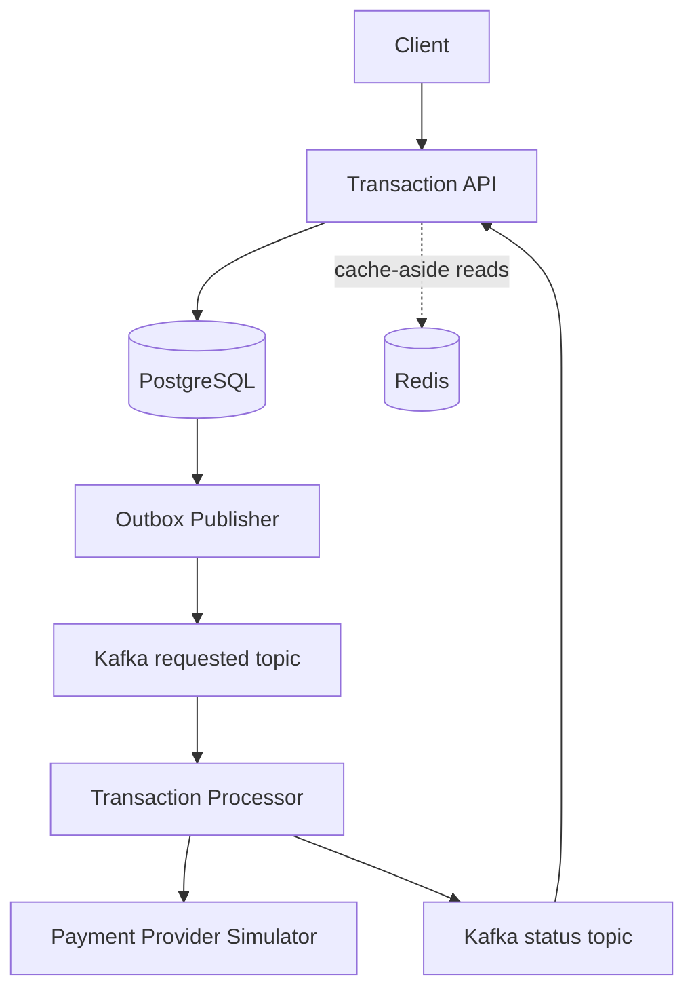
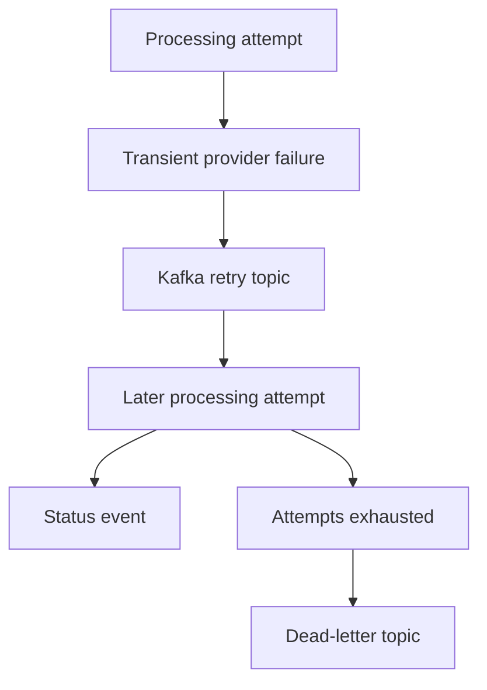
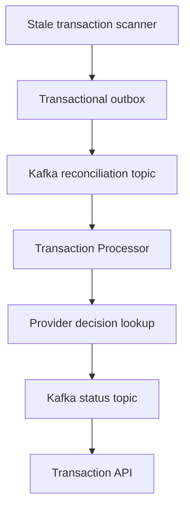
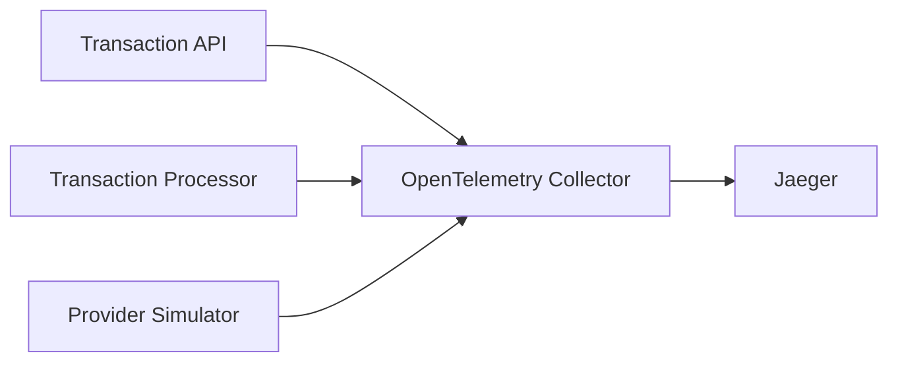

# LedgerFlow

LedgerFlow is a production-minded transaction-processing platform built to demonstrate reliable asynchronous backend design with Java 21, Spring Boot, Kafka, PostgreSQL, Redis, and OpenTelemetry.

## What exists in this skeleton

- `transaction-api`: accepts idempotent transaction requests, owns authoritative state, records status history, operates its publication backlog, and queues stale transactions for reconciliation.
- `transaction-processor`: consumes processing and reconciliation requests, protects provider calls with retries and a circuit breaker, and emits processing/result events.
- `payment-provider-simulator`: deterministic idempotent stand-in for an unreliable downstream provider.
- `transaction-contracts`: versioned event and provider DTOs shared during the first development phase.
- `ledgerflow-e2e-tests`: boots the three applications against ephemeral PostgreSQL, Kafka, Redis, and Jaeger containers and verifies the complete lifecycle, failure handling, reconciliation, caching, and cross-service trace propagation.
- `docs`: technical specification, architecture, and ADRs.

## Architecture



Failure handling is asynchronous and bounded:



Stuck transactions follow the same outbox and status-event boundaries:



Trace export is vendor-neutral and asynchronous:



PostgreSQL is the source of record. Redis accelerates repeated transaction-status reads but is never consulted for creation, idempotency, state transitions, or event publication. Cache failures fall back to PostgreSQL.

The transactional outbox prevents lost events across the database/Kafka boundary, while idempotency, retry topics, circuit breaking, and dead-letter handling make at-least-once processing safe.

W3C trace context is persisted with each outbox event so delayed Kafka publication remains connected to the originating HTTP trace.

## Local prerequisites

- Java 21
- Maven 3.9+
- Docker with Compose

## Run

```bash
docker compose up --build
```

Create a transaction:

```bash
curl -i http://localhost:8080/transactions \
  -H 'Content-Type: application/json' \
  -H 'Idempotency-Key: abc-123' \
  -d '{"accountId":"acct-42","amount":125.50,"currency":"USD","type":"PAYMENT"}'
```

The API returns `202 Accepted` and a transaction ID. Retrieve it with:

```bash
curl http://localhost:8080/transactions/{transactionId}
```

Health endpoints are available at `/actuator/health` on ports 8080, 8081, and 8082.

Open [Jaeger at localhost:16686](http://localhost:16686), select `transaction-api`, and run a search to inspect a transaction across the API, Kafka, processor, and provider. The response’s `X-Trace-Id` header can be pasted into Jaeger’s trace-ID search.

Operational metrics are available through the transaction API's Actuator metrics and Prometheus endpoints:

- `ledgerflow.outbox.pending`
- `ledgerflow.outbox.oldest.pending.age`
- `ledgerflow.outbox.publish.success`
- `ledgerflow.outbox.publish.failure`
- `ledgerflow.outbox.cleanup.deleted`
- `ledgerflow.outbox.metrics.refresh.failure`
- `ledgerflow.reconciliation.scan`
- `ledgerflow.reconciliation.requested`
- `ledgerflow.reconciliation.resolved`
- `ledgerflow.reconciliation.unresolved`
- `ledgerflow.reconciliation.failure`
- `ledgerflow.cache.transaction.hit`
- `ledgerflow.cache.transaction.miss`
- `ledgerflow.cache.transaction.write`
- `ledgerflow.cache.transaction.eviction`
- `ledgerflow.cache.transaction.failure`

Published outbox events are retained for seven days by default and then removed in bounded, concurrency-safe batches. Unpublished events are never eligible for cleanup.

See [the operations guide](docs/operations.md) for signal interpretation and configuration.

## Build

Linux/macOS:

```bash
./mvnw clean verify
```

Windows PowerShell:

```powershell
.\mvnw.cmd clean verify
```

`verify` requires a running Docker engine because the Failsafe integration-test phase starts isolated PostgreSQL, Kafka, Redis, and Jaeger containers. Unit tests alone can be run without Docker:

```bash
./mvnw test
```

See [the testing guide](docs/testing.md) for the end-to-end topology and debugging commands.

## Delivery roadmap

1. Add Prometheus and Grafana dashboards for metrics and exemplars.
2. Add Kubernetes manifests, IaC, and measured load tests.

See [the technical specification](docs/technical-specification.md) for the precise contracts and invariants.
