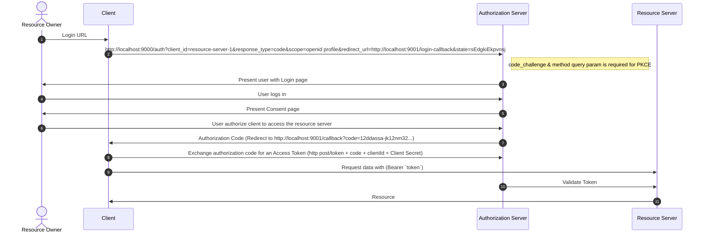

# OAuth 2.1 / OpenID Connect Authorization Server with Spring Boot

## Features:

- **Multi-Factor Authentication (MFA)**: Support for Authentication App, Text message (SMS), Security Key, and Recovery Codes.
- **Passkey Login (Fingerprint / Biometrics)**: Passwordless authentication using WebAuthn passkeys.
- **Mobile Passkey**: Support for cross-device mobile passkeys.
- **My Profile Features**: User profile management and settings.
- **Customize Token Content**: Fully customizable access and refresh tokens.
- **OAuth 2.1 Authorization Server**
- **OpenID Connect (OIDC)**


This repository full documentation can be found at [m-thirumal.github.io/oauth-authorization-server/](https://m-thirumal.github.io/oauth-authorization-server/)

## Full Implementation

The below diagram shows the full implementation of the OAuth2 Authorization Server:

* [API Gateway + BFF](https://github.com/thirumalx/spring-cloud-gateway)
* [Authorization Server](https://github.com/thirumalx/oauth-authorization-server)
* [Resource Server](https://github.com/thirumalx/oauth-resource-server)
* [Resource Server UI](https://github.com/thirumalx/resource-server-ui)
* [Eureka Server](https://github.com/thirumalx/eureka-server)
  
  

BFF Implementation on oAuth2.1


## Prerequisites

Run [Eureka Server](https://github.com/m-thirumal/eureka-server)

## Quick Start

git clone ...
docker compose up
mvn spring-boot:run

#### What is Authentication and Authorization?

`Authentication` - "Who you are?", is the process of ascertaining that somebody really is who they claim to be.

`Authorization` refers to rules that determine who is allowed to do what. E.g. Thirumal may be authorized to create and delete databases, while Jesicca is only authorized to read.


#### There are many ways of authentication, few of which are worth discussing here:

   1. `Knowledge-based authentication`: The username password combination is a type of knowledge-based authentication. The idea is to verify the user based on the knowledge of the user for example answer to security questions, passwords, something which only the user should know.
   
   
   2. `Possession based authentication`: This type of authentication is based on verifying something which a user possesses. For example, when an application sends you One Time Passwords (OTPs) or a text message.

   Modern authentication practices use a combination of both types, also known as `Multi-Factor authentication`.

## OAuth2 grant types

OAuth2 supports several grant types for different use cases. The most common grant types are:


| Grant Type                           |    Usage                                                                                                    |
|--------------------------------------|-------------------------------------------------------------------------------------------------------------|
| Authorization Code                   | Used for web applications that run on a server and need to access resources on behalf of a user.            |
| Implicit                             | Used for single-page applications that run in a web browser and need access to resources without the need for a server.|
| Resource Owner Password Credentials  | Used for trusted applications that require direct access to a user’s resources.                             |
| Client Credentials                   |  Used for applications that need to access their own resources.                                             |

### Configuration Parameters & Endpoints

| Configuration Parameter                                                                     | EndPoints                               | 
|---------------------------------------------------------------------------------------------|-----------------------------------------|
| issuer (Base URL)                                                                           | http://localhost:9000                   |
| authorization_endpoint                                                                      | http://localhost:9000/oauth2/authorize  |
| [Access Token](https://m-thirumal.github.io/oauth-authorization-server/Access%20Token/)     | http://localhost:9000/oauth2/token      |
| [Refresh Token](https://m-thirumal.github.io/oauth-authorization-server/Refresh%20Token/)   | http://localhost:9000/oauth2/token      |
| [Revoke Token](https://m-thirumal.github.io/oauth-authorization-server/Revoke%20Token/)     | http://localhost:9000/oauth2/revoke     |
| jwks_uri                                                                                    | http://localhost:9000/oauth2/jwks       |
| userinfo_endpoint                                                                           | http://localhost:9000/userinfo          |
| [Introspect Token](https://m-thirumal.github.io/oauth-authorization-server/Introspect/)     | http://localhost:9000/oauth2/introspect |
| [EndPoints](https://m-thirumal.github.io/oauth-authorization-server/EndPoints/)             | http://localhost:9000/.well-known/openid-configuration|
| [Customize Token Content](https://m-thirumal.github.io/oauth-authorization-server/Customize%20Access%20Token%20Content/)|    -      |
| [DDL SQL for PostgreSQL](./docs/authorization.sql)                                          | DDL for PostgreSQL                      |
| [Data Dictionary of Model](./docs/data%20dictionary.html)                                   | [DB](./docs/data%20dictionary.html)     |


## Prerequisites:

1. [Eureka](https://github.com/m-thirumal/eureka-server) (Optional)
2. PostgreSQL 
3. Java 25
4. Redis

### Architecture/Flow:

     

```
React (Browser)
      |
      |-- 1. GET /auth/login ------------------------------> API Gateway
      |                                                     |
      |                                                     |-- 2. Forward to BFF /auth/login -----> BFF
      |                                                     |                                         |
      |                                                     |                                         |-- 3. Redirect to SAS /authorize ------------------> SAS
      |                                                     |                                         |                                                      |
      |<-- 4. Redirect to SAS ------------------------------|                                         |                                                      |
      |                                                                                               |                                                      |
      |-- 5. User submits login --------------------------------------------------------------------------------------->|-- 5a. Validate user --> PostgreSQL
      |                                                                                                                 |<-- 5b. OK --------------------------|
      |                                                                                                                 |
      |<-- 6. Redirect back with ?code=XYZ <-----------------------------------------------------------------------------|
      |
      |-- 7. GET /auth/callback?code=XYZ ------------------> API Gateway
      |                                                     |
      |                                                     |-- 8. Forward to BFF /auth/callback ---> BFF
      |                                                     |                                         |
      |                                                     |                                         |-- 9. Exchange code for tokens ---------------------> SAS
      |                                                     |                                         |                                                     |
      |                                                     |                                         |<-- 10. Access + Refresh Tokens ---------------------|
      |                                                     |                                         |
      |                                                     |                                         |-- 11. Store tokens in Redis -----------------------> Redis
      |                                                     |                                         |<-- 11a. OK ----------------------------------------|
      |                                                     |                                         |
      |<-- 12. Set Secure HttpOnly session cookie ----------|                                         |
      |
      |                                                                                               |
      |-- 13. GET /api/user --------------------------------> API Gateway
      |                                                     |
      |                                                     |-- 14. Forward to BFF /api/user --------> BFF
      |                                                     |                                         |
      |                                                     |                                         |-- 15. Load session from Redis ---------------------> Redis
      |                                                     |                                         |<-- 15a. Tokens OK ---------------------------------|
      |                                                     |                                         |
      |                                                     |                                         |-- 16. Call Resource Server with Access Token ------------------> Resource Server
      |                                                     |                                         |                                                     |
      |                                                     |                                         |<-- 17. Protected Resource Response -----------------------------|
      |                                                     |                                         |
      |<-- 18. JSON Payload --------------------------------|                                         |
      |
```


## Setup

Documentation to set up can be [found here](docs/Set%20up.md)

* [Definition](docs/Definitions.md)



## Database model


## [FAQ](https://m-thirumal.github.io/oauth-authorization-server/FAQ)

1. Where do I find all end points. Invoke [http://localhost:9000/.well-known/openid-configuration](http://localhost:9000/.well-known/openid-configuration)

```
{
    "issuer": "http://localhost:9000",
    "authorization_endpoint": "http://localhost:9000/oauth2/authorize",
    "token_endpoint": "http://localhost:9000/oauth2/token",
    "token_endpoint_auth_methods_supported": [
        "client_secret_basic",
        "client_secret_post",
        "client_secret_jwt",
        "private_key_jwt"
    ],
    "jwks_uri": "http://localhost:9000/oauth2/jwks",
    "userinfo_endpoint": "http://localhost:9000/userinfo",
    "response_types_supported": [
        "code"
    ],
    "grant_types_supported": [
        "authorization_code",
        "client_credentials",
        "refresh_token"
    ],
    "revocation_endpoint": "http://localhost:9000/oauth2/revoke",
    "revocation_endpoint_auth_methods_supported": [
        "client_secret_basic",
        "client_secret_post",
        "client_secret_jwt",
        "private_key_jwt"
    ],
    "introspection_endpoint": "http://localhost:9000/oauth2/introspect",
    "introspection_endpoint_auth_methods_supported": [
        "client_secret_basic",
        "client_secret_post",
        "client_secret_jwt",
        "private_key_jwt"
    ],
    "subject_types_supported": [
        "public"
    ],
    "id_token_signing_alg_values_supported": [
        "RS256"
    ],
    "scopes_supported": [
        "openid"
    ]
}

```


### OAuth2 Authorization Testing URLs

You can test the OAuth2 Authorization Code flow (which triggers the Custom React Consent Page) by navigating to the following URLs in your browser.

**1. Test `bff-client-id-001` Client**
```text
http://localhost:9000/oauth2/authorize?response_type=code&client_id=bff-client-id-001&redirect_uri=http://localhost:2223/login/oauth2/code/bff-client-oidc&scope=openid profile message.read message.write
```

**2. Test `Thirumal` Client**
```text
http://localhost:9000/oauth2/authorize?response_type=code&client_id=Thirumal&redirect_uri=http://127.0.0.1:8000/authorized&scope=openid profile read
```

## Recovery Code


<!-- GitAds-Verify: 6BKQQV7NW224BW6GKSIPWEI4VIK49CUI -->

## UI development

Technical Architecture
The migration supports two modes of operation:

1. Integrated Mode (Production)

Deployment: Single executable JAR.
Serving: Spring Boot serves the pre-built React static files from src/main/resources/static.
Origin: Same-origin (e.g., http://localhost:8080). No CORS issues.
2. Proxied Mode (Development)

Deployment: React runs on Vite Dev Server (port 5173), Spring Boot runs on port 8080.
Communication: Vite proxies all /api, /login, and /signup requests to Spring Boot.
Experience: Fast Hot Module Replacement (HMR) for the frontend while interacting with the real backend.
