# A Practical Guide to Building a Cost-Based Query Planner

## Introduction

A query planner sits at the heart of every database management system. Given a query written by the user, its job is to
decide *how* that query should be answered — which tables to read, in what order to join them, and which physical
algorithms to use. A good plan returns results quickly; a bad plan can turn a one-second query into a one-hour one.

Query planners have a reputation for being one of the most intricate parts of a DBMS, and for good reason: they blend
relational algebra, search algorithms, cost modeling, and a pile of heuristics. This guide cuts through that complexity
by walking you through the construction of a working cost-based query planner from scratch, introducing just enough
theory to make the code make sense.

> Written by AI, edited by human

## Targeted audiences

This guide is written for:

- who used to work with query engines
- who curious, want to make their own stuffs
- who wants to learn DB stuffs but hate math

Goals:

- Able to understand the basic of query planning
- Able to write your own query planner

## Basic architecture of a query engine

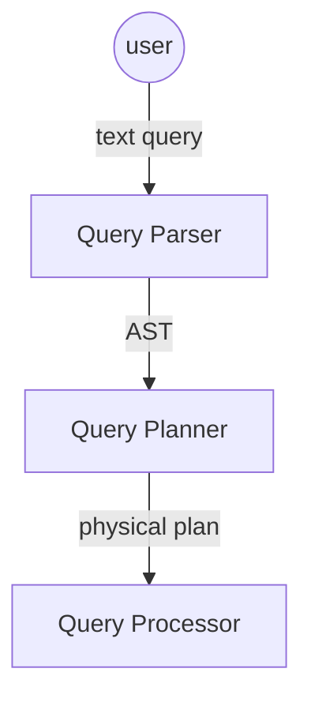

At a high level, a query engine is built from three cooperating components:

- **Query parser:** turns the raw text the user wrote (typically SQL) into a structured representation — an Abstract
  Syntax Tree (AST) — that the rest of the engine can reason about.
- **Query planner:** takes the AST and produces an execution strategy. When several strategies are possible, the planner
  is responsible for picking the one it believes will run fastest.
- **Query processor:** takes the physical plan emitted by the planner and actually runs it, pulling rows from storage
  and producing the final result set.

## Types of query planners

Query planners generally fall into one of two camps:

- heuristic planner
- cost-based planner

A **heuristic planner** applies a fixed set of rewrite rules in a predefined order. Each rule encodes a belief — for
example, *"pushing filters down is almost always a good idea"* — and is applied blindly whenever it matches.

A **cost-based planner** takes a different approach: instead of trusting rules of thumb, it enumerates multiple
equivalent forms of the query, estimates a numerical cost for each, and picks the cheapest one.

Put more concretely: a heuristic planner greedily *rewrites* its way toward what it hopes is a better plan, while a
cost-based planner *searches* a space of equivalent plans and lets the cost model be the tiebreaker.

### Cost based query planner

A cost-based planner is typically organized into two phases:

- Plan Enumerations
- Query Optimization

The **Plan Enumerations** phase generates the universe of candidate plans — every form of the query the planner is
willing to consider.

The **Query Optimization** phase then sifts through those candidates and picks the one with the lowest cost according
to whatever cost model has been chosen.

Since logical plans are naturally tree-shaped, optimization is really a tree-search problem. Any tree-search algorithm
is fair game:

- Exhaustive search, such as deterministic dynamic programming. The algorithm will perform searching for best plan until
  search termination conditions
- Randomized search, such as randomized tree search. The algorithm will perform searching for best plan until
  search termination conditions

**notes:** in theory any tree-search algorithm will work. In practice, however, the search space is enormous and the
time budget is short — complex algorithms that look elegant on paper often prove too slow for real workloads.

**notes:** the search termination conditions usually are:

- search exhaustion (when no more plans to visit)
- cost threshold (when found a plan that cost is lower than a specified cost threshold)
- time (when the search phase is running for too long)

### Volcano query planner

The Volcano query planner (also called the Volcano optimizer generator) is one of the foundational cost-based planners
in the literature, and its ideas show up in many modern database systems.

At its core, Volcano uses dynamic programming to efficiently find the best plan among the enumerated candidates, reusing
work across subproblems that appear in multiple plans.

details: https://ieeexplore.ieee.org/document/344061 (I'm too lazy to explain the paper here)

Here is a great explanation: https://15721.courses.cs.cmu.edu/spring2017/slides/15-optimizer2.pdf#page=9

## Drafting our cost-based query planner

The planner we'll build in this guide is cost-based and broadly follows the Volcano design.
Its lifecycle is split into two phases:

- exploration/search phase
- implementation/optimization phase

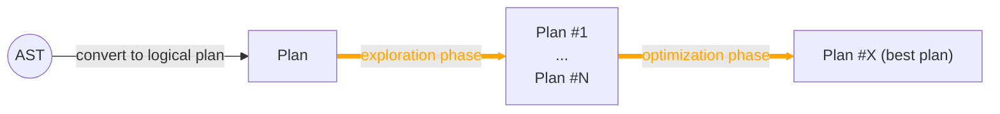

#### Glossary

Before diving into the code, it helps to nail down the vocabulary. The following terms will come up again and again.

##### Logical plan

A logical plan is a tree-shaped data structure that describes *what* the query needs to do, independent of *how* it will
be executed. Each node represents a relational transformation — a scan, a join, a projection — without committing to a
specific algorithm.

Here is an example of a logical plan:

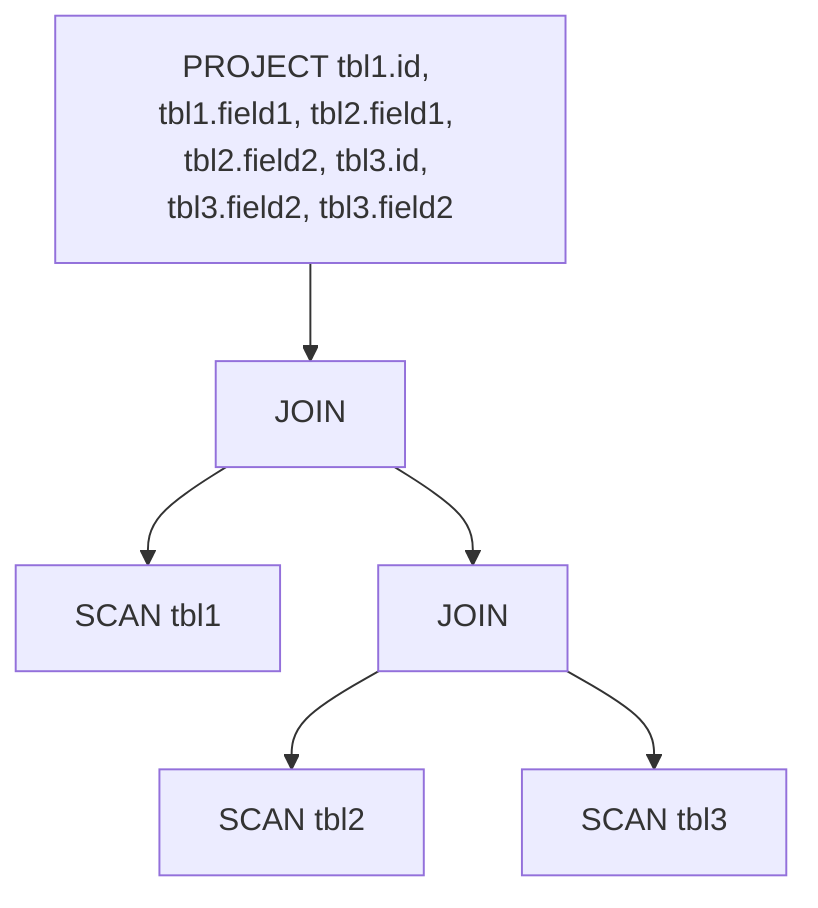

##### Physical plan

Where the logical plan says *what*, the physical plan says *how*. Each logical node can be realized by one of several
physical implementations — for example, a logical JOIN might be executed as a HASH JOIN, a MERGE JOIN, or a BROADCAST
JOIN, each with very different cost characteristics.

##### Equivalent Group

An equivalent group bundles together logical plans that compute the same result — different shapes, same meaning. The
planner uses these groups to share work: any cost computation done for one member of the group can be reused when
considering the others.

e.g.

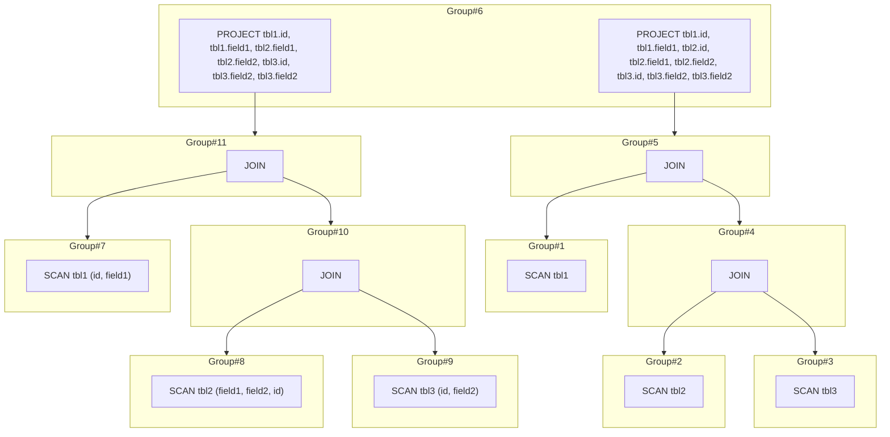

Notice how `Group#6` contains two equivalent expressions: they describe the same query — one scans then projects, the
other pushes the projection down into the scan — but produce identical output.

##### Transformation rule

A transformation rule rewrites one logical plan into another, logically equivalent, logical plan. Transformation rules
are how new members get added to an equivalent group during exploration.

For example, the plan:


after a projection-pushdown rule fires, becomes:

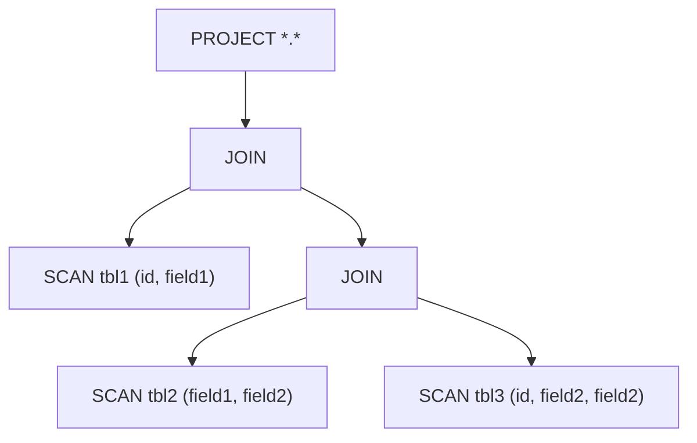

Transformation rules can consult logical traits — table schemas, data statistics, and so on — when deciding whether and
how to fire.

##### Implementation rule

An implementation rule converts a logical plan node into one or more physical plan nodes. Whereas transformation rules
swap one logical shape for another, implementation rules bridge the gap from *logical* to *physical*.

Implementation rules can be influenced by physical traits such as the sort order of the underlying data — MERGE JOIN,
for instance, is only applicable when both inputs are already sorted on the join key.

#### Exploration phase

During the exploration phase, the planner repeatedly fires transformation rules to grow each equivalent group with new
logically equivalent expressions.

For example, the plan:

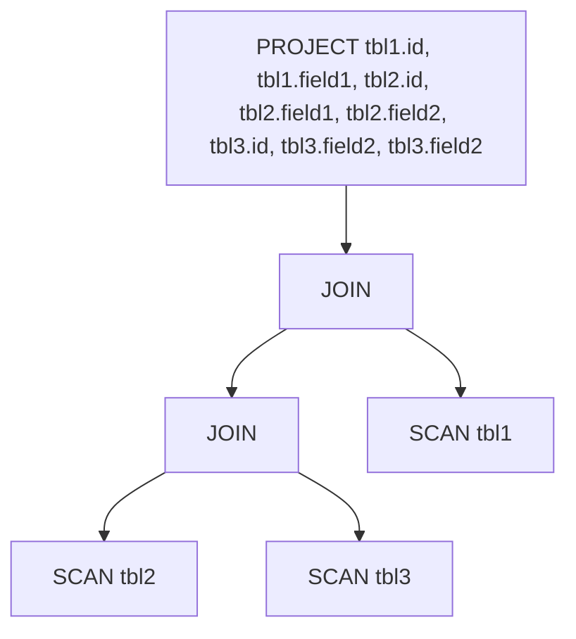

after the exploration phase expands the space with transformation rules, results in the following graph:

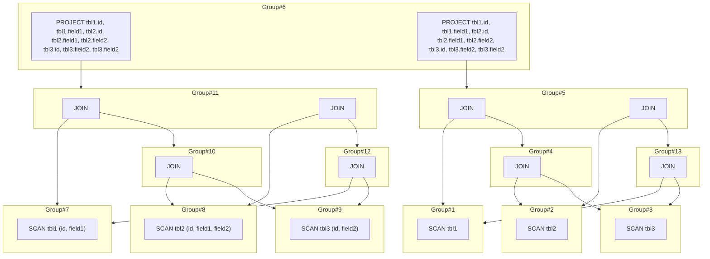

In this expanded graph you can see two rules at work: projection pushdown has produced the new SCAN variants with
explicit field lists, and join reorder has produced alternative join orderings.

#### Optimization phase

With the search space now populated, the optimization phase's job is to walk the expanded memo and select the cheapest
physical realization for every group.

Because the memo is a graph of groups linked by expressions, this is a tree-search problem in disguise — any correct
search algorithm will do, though the algorithm you pick directly influences how much of the search space you actually
visit.

Here is the example of generated physical plan after optimization phase:

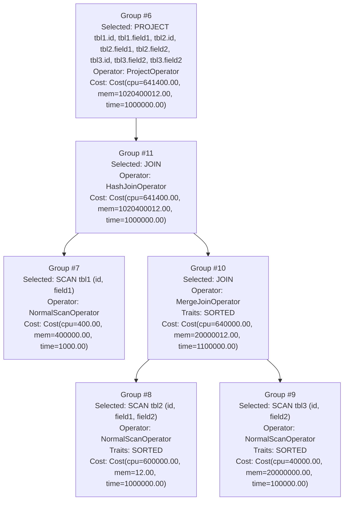

Each node in the final plan shows the logical operation selected, the physical operator chosen to execute it, and the
estimated cost the planner attributed to the subtree rooted there.

#### Optimize/search termination

For the sake of simplicity, our planner performs an exhaustive search — it keeps going until every candidate has been
considered. In production systems this is usually impractical, which is why the termination conditions from the
previous section (search exhaustion, cost threshold, time budget) exist.

## Diving into the codes

The planner is too large to walk through line-by-line, so instead I'll zoom into each component in turn and explain how
it fits into the whole.

### The query language

To keep the focus on the planner, we'll implement a deliberately tiny SQL-like language that we'll use throughout the
guide.

```sql
SELECT emp.id,
       emp.code,
       dept.dept_name,
       emp_info.name,
       emp_info.origin
FROM emp
         JOIN dept ON emp.id = dept.emp_id
         JOIN emp_info ON dept.emp_id = emp_info.id
```

Our dialect supports a small subset of SQL — enough to exercise the interesting parts of the planner, but nothing more.

Queries always have the shape:

```sql
SELECT tbl.field, [...]
FROM tbl JOIN [...]
```

Two restrictions apply: only `SELECT` and `JOIN` are supported, and every projected field must be fully qualified as
`table.field`. No aggregates, no filters, no subqueries anywhere except as join sources — this keeps the parser small
and the planner easy to follow.

#### The AST

The first building block is the AST. An
[Abstract Syntax Tree](https://en.wikipedia.org/wiki/Abstract_syntax_tree) is a structured representation of the source
text — a tree whose nodes correspond to constructs in the grammar.

For a language this small, the AST fits in just a handful of case classes:

```scala
sealed trait Identifier

case class TableID(id: String) extends Identifier

case class FieldID(table: TableID, id: String) extends Identifier

sealed trait Statement

case class Table(table: TableID) extends Statement

case class Join(left: Statement, right: Statement, on: Seq[(FieldID, FieldID)]) extends Statement

case class Select(fields: Seq[FieldID], from: Statement) extends Statement

```

For example, a query

```sql
SELECT tbl1.id,
       tbl1.field1,
       tbl2.id,
       tbl2.field1,
       tbl2.field2,
       tbl3.id,
       tbl3.field2,
       tbl3.field2
FROM tbl1
         JOIN tbl2 ON tbl1.id = tbl2.id
         JOIN tbl3 ON tbl2.id = tbl3.id
```

can be represented as

```scala
Select(
  Seq(
    FieldID(TableID("tbl1"), "id"),
    FieldID(TableID("tbl1"), "field1"),
    FieldID(TableID("tbl2"), "id"),
    FieldID(TableID("tbl2"), "field1"),
    FieldID(TableID("tbl2"), "field2"),
    FieldID(TableID("tbl3"), "id"),
    FieldID(TableID("tbl3"), "field2"),
    FieldID(TableID("tbl3"), "field2")
  ),
  Join(
    Table(TableID("tbl1")),
    Join(
      Table(TableID("tbl2")),
      Table(TableID("tbl3")),
      Seq(
        FieldID(TableID("tbl2"), "id") -> FieldID(TableID("tbl3"), "id")
      )
    ),
    Seq(
      FieldID(TableID("tbl1"), "id") -> FieldID(TableID("tbl2"), "id")
    )
  )
)
```

#### A simple query parser

With the AST in place, the next step is a parser — the piece that converts the raw query text into an AST.

This guide uses Scala, so we'll reach for
[scala-parser-combinators](https://github.com/scala/scala-parser-combinators), which lets us describe the grammar
declaratively and compose small parsers into larger ones.

Query parser class:

```scala
object QueryParser extends ParserWithCtx[QueryExecutionContext, Statement] with RegexParsers {

  override def parse(in: String)(implicit ctx: QueryExecutionContext): Either[Throwable, Statement] = {
    Try(parseAll(statement, in) match {
      case Success(result, _) => Right(result)
      case NoSuccess(msg, _) => Left(new Exception(msg))
    }) match {
      case util.Failure(ex) => Left(ex)
      case util.Success(value) => value
    }
  }

  private def select: Parser[Select] = ??? // we will implement it in later section

  private def statement: Parser[Statement] = select
}

```

Then define some parse rules:

```scala
// common
private def str: Parser[String] = """[a-zA-Z0-9_]+""".r
private def fqdnStr: Parser[String] = """[a-zA-Z0-9_]+\.[a-zA-Z0-9_]+""".r

// identifier
private def tableId: Parser[TableID] = str ^^ (s => TableID(s))

private def fieldId: Parser[FieldID] = fqdnStr ^^ { s =>
  val identifiers = s.split('.')
  if (identifiers.length != 2) {
    throw new Exception("should never happen")
  } else {
    val table = identifiers.head
    val field = identifiers(1)
    FieldID(TableID(table), field)
  }
}
```

These two rules cover the two kinds of identifiers our language knows about: table names and qualified field names.

A table identifier is just an alphanumeric-plus-underscore word, so the regex `[a-zA-Z0-9_]+` is sufficient to pick one
out of the input.

A field identifier, on the other hand, must always be fully qualified — `table.field`. Both halves follow the same
identifier rules, so the regex `[a-zA-Z0-9_]+\.[a-zA-Z0-9_]+` matches the whole thing; the parser then splits on the
dot to extract the two components.

With identifiers handled, we can move on to statement-level parsing:

```scala
// statement
private def table: Parser[Table] = tableId ^^ (t => Table(t))
private def subQuery: Parser[Statement] = "(" ~> select <~ ")"
```

The `table` rule is trivial: wrap a parsed `TableID` inside a `Table` AST node.

The `subQuery` rule handles nested queries. SQL lets us write things like:

```sql
SELECT a
FROM (SELECT b FROM c) d
```

where `SELECT b FROM c` is a subquery acting as a table source. In our miniature language we signal a subquery by
wrapping a `SELECT` in parentheses. Because `SELECT` is our only statement form, the rule reduces to:

```scala
def subQuery: Parser[Statement] = "(" ~> select <~ ")"
```

With the pieces in place, here is the rule for the `SELECT` statement itself:

```scala
private def fromSource: Parser[Statement] = table ||| subQuery

private def select: Parser[Select] =
  "SELECT" ~ rep1sep(fieldId, ",") ~ "FROM" ~ fromSource ~ rep(
    "JOIN" ~ fromSource ~ "ON" ~ rep1(fieldId ~ "=" ~ fieldId)
  ) ^^ {
    case _ ~ fields ~ _ ~ src ~ joins =>
      val p = if (joins.nonEmpty) {
        def chain(left: Statement, right: Seq[(Statement, Seq[(FieldID, FieldID)])]): Join = {
          if (right.isEmpty) {
            throw new Exception("should never happen")
          } else if (right.length == 1) {
            val next = right.head
            Join(left, next._1, next._2)
          } else {
            val next = right.head
            Join(left, chain(next._1, right.tail), next._2)
          }
        }

        val temp = joins.map { join =>
          val statement = join._1._1._2
          val joinOn = join._2.map(on => on._1._1 -> on._2)
          statement -> joinOn
        }
        chain(src, temp)
      } else {
        src
      }
      Select(fields, p)
  }
```

Notice that a JOIN source is itself a `fromSource`, so subqueries are allowed on either side of a JOIN. For example:

```sql
SELECT *.*
FROM tbl1
    JOIN (SELECT *.* FROM tbl2)
    JOIN tbl3
```

That flexibility is exactly why `fromSource` — rather than `table` — appears in the JOIN part of the rule:

```scala
"SELECT" ~ rep1sep(fieldId, ",") ~ "FROM" ~ fromSource ~ rep("JOIN" ~ fromSource ~ "ON" ~ rep1(fieldId ~ "=" ~ fieldId)
```

See [QueryParser.scala](core%2Fsrc%2Fmain%2Fscala%2Fcore%2Fql%2FQueryParser.scala) for full implementation

#### Testing our query parser

See [QueryParserSpec.scala](core%2Fsrc%2Ftest%2Fscala%2Fcore%2Fql%2FQueryParserSpec.scala)

### Logical plan

Once the parser has produced an AST, converting it into a logical plan is straightforward.

We start by defining the shared interface for every logical node:

```scala
sealed trait LogicalPlan {
  def children(): Seq[LogicalPlan]
}

```

The `children` method returns the node's direct child nodes — the planner walks the plan tree via this relation. For
example:


Here the `PROJECT` node's single child is the outer `JOIN`. That `JOIN` has two children — the inner `JOIN` on the right
and `SCAN tbl1` on the left — and so on down the tree.

Our tiny language only needs three kinds of logical node:

- PROJECT: represent the projection operator in relation algebra
- JOIN: represent the logical join
- SCAN: represent the table scan

```scala
case class Scan(table: ql.TableID, projection: Seq[String]) extends LogicalPlan {
  override def children(): Seq[LogicalPlan] = Seq.empty
}

case class Project(fields: Seq[ql.FieldID], child: LogicalPlan) extends LogicalPlan {
  override def children(): Seq[LogicalPlan] = Seq(child)
}

case class Join(left: LogicalPlan, right: LogicalPlan, on: Seq[(ql.FieldID, ql.FieldID)]) extends LogicalPlan {
  override def children(): Seq[LogicalPlan] = Seq(left, right)
}

```

Converting the AST into this representation is a one-pass recursive rewrite:

```scala
def toPlan(node: ql.Statement): LogicalPlan = {
  node match {
    case ql.Table(table) => Scan(table, Seq.empty)
    case ql.Join(left, right, on) => Join(toPlan(left), toPlan(right), on)
    case ql.Select(fields, from) => Project(fields, toPlan(from))
  }
}
```

See [LogicalPlan.scala](core%2Fsrc%2Fmain%2Fscala%2Fcore%2Fplanner%2Fvolcano%2Flogicalplan%2FLogicalPlan.scala) for full
implementation

### The equivalent groups

#### Group

Next we'll model the equivalent-group structure — the data structure that holds everything the planner has discovered
about a query so far.

```scala
case class Group(
                  id: Long,
                  equivalents: mutable.HashSet[GroupExpression]
                ) {
  val explorationMark: ExplorationMark = new ExplorationMark
  var implementation: Option[GroupImplementation] = None
}

case class GroupExpression(
                            id: Long,
                            plan: LogicalPlan,
                            children: mutable.MutableList[Group]
                          ) {
  val explorationMark: ExplorationMark = new ExplorationMark
  val appliedTransformations: mutable.HashSet[TransformationRule] = mutable.HashSet()
}

```

A `Group` is a set of plans that are all logically equivalent.

A `GroupExpression` represents a single logical plan node within that group. Since logical-plan nodes have children (see
the previous section) and each child could itself be produced in multiple equivalent ways, a `GroupExpression`'s
children are `Group`s — not concrete plan nodes. This layer of indirection is what lets the planner share work across
equivalent subtrees.

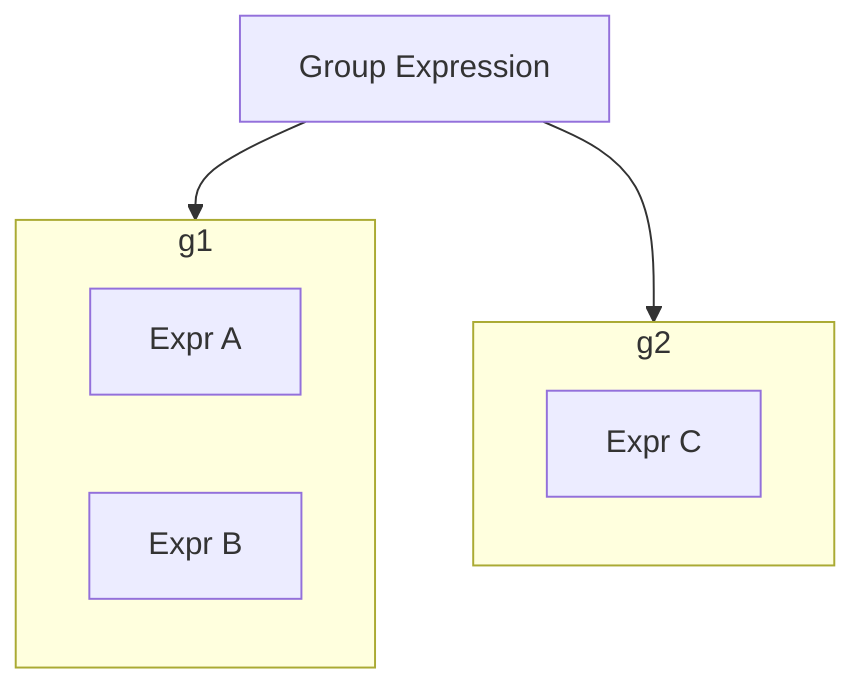

e.g.

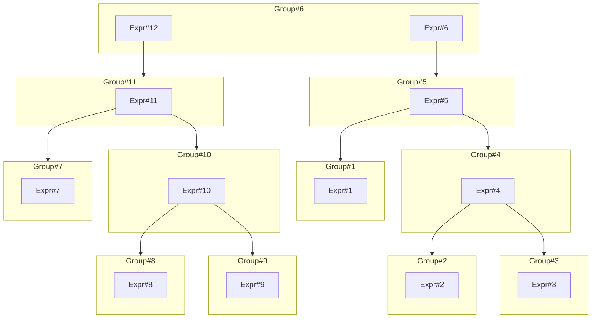

Take `Group#6`: it holds two equivalent expressions, `Expr#12` and `Expr#6`. The former has `Group#11` as its child,
which itself contains further alternatives — so a single `Group#6` implicitly represents many distinct plans.

**notes:** Exploration runs in multiple rounds, and we need to know which groups and expressions have already been
processed in each round. That bookkeeping lives in an `ExplorationMark`:

```scala
class ExplorationMark {
  private var bits: Long = 0

  def get: Long = bits

  def isExplored(round: Int): Boolean = BitUtils.getBit(bits, round)

  def markExplored(round: Int): Unit = bits = BitUtils.setBit(bits, round, on = true)

  def markUnexplored(round: Int): Unit = bits = BitUtils.setBit(bits, round, on = false)
}

```

`ExplorationMark` is essentially a thin wrapper around a bitset: bit `i` is set when round `i` has been explored, and
cleared otherwise.

It's also handy for visualization — being able to replay the state after each round makes it easy to see exactly what
changed. See [visualization](core%2Fsrc%2Fmain%2Fscala%2Fcore%2Futils%2Fvisualization) for details.

#### Memo

The memo is the bookkeeping layer on top of groups and group expressions. It stores everything the planner has seen so
far, keyed for quick lookup, and provides helpers for registering new logical plans.

```scala
class Memo(
            groupIdGenerator: Generator[Long] = new LongGenerator,
            groupExpressionIdGenerator: Generator[Long] = new LongGenerator
          ) {
  val groups: mutable.HashMap[Long, Group] = mutable.HashMap[Long, Group]()
  val parents: mutable.HashMap[Long, Group] = mutable.HashMap[Long, Group]() // lookup group from group expression ID
  val groupExpressions: mutable.HashMap[LogicalPlan, GroupExpression] = mutable.HashMap[LogicalPlan, GroupExpression]()

  def getOrCreateGroupExpression(plan: LogicalPlan): GroupExpression = {
    val children = plan.children()
    val childGroups = children.map(child => getOrCreateGroup(child))
    groupExpressions.get(plan) match {
      case Some(found) => found
      case None =>
        val id = groupExpressionIdGenerator.generate()
        val children = mutable.MutableList() ++ childGroups
        val expression = GroupExpression(
          id = id,
          plan = plan,
          children = children
        )
        groupExpressions += plan -> expression
        expression
    }
  }

  def getOrCreateGroup(plan: LogicalPlan): Group = {
    val exprGroup = getOrCreateGroupExpression(plan)
    val group = parents.get(exprGroup.id) match {
      case Some(group) =>
        group.equivalents += exprGroup
        group
      case None =>
        val id = groupIdGenerator.generate()
        val equivalents = mutable.HashSet() + exprGroup
        val group = Group(
          id = id,
          equivalents = equivalents
        )
        groups.put(id, group)
        group
    }
    parents += exprGroup.id -> group
    group
  }
}

```

See [Memo.scala](core%2Fsrc%2Fmain%2Fscala%2Fcore%2Fplanner%2Fvolcano%2Fmemo%2FMemo.scala) for full implementation

### Initialization

The planner's first job, before any rules fire, is to wire up the initial state.

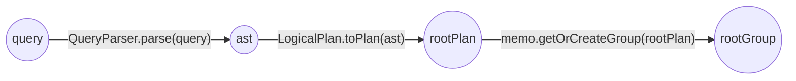

The query text goes through the parser to become an AST, the AST is converted into a logical plan — the *root plan* —
and finally the root plan is registered with the memo, producing the *root group* that represents the entire query.

```scala
def initialize(query: Statement)(implicit ctx: VolcanoPlannerContext): Unit = {
  ctx.query = query
  ctx.rootPlan = LogicalPlan.toPlan(ctx.query)
  ctx.rootGroup = ctx.memo.getOrCreateGroup(ctx.rootPlan)
  // assuming this is first the exploration round,
  // by marking the initialRound(0) as explored,
  // it will be easier to visualize the different between rounds (added nodes, add connections)
  ctx.memo.groups.values.foreach(_.explorationMark.markExplored(initialRound))
  ctx.memo.groupExpressions.values.foreach(_.explorationMark.markExplored(initialRound))
}
```

See [VolcanoPlanner.scala](core%2Fsrc%2Fmain%2Fscala%2Fcore%2Fplanner%2Fvolcano%2FVolcanoPlanner.scala) for more details

For example, given the query:

```sql
SELECT tbl1.id,
       tbl1.field1,
       tbl2.id,
       tbl2.field1,
       tbl2.field2,
       tbl3.id,
       tbl3.field2,
       tbl3.field2
FROM tbl1
         JOIN tbl2 ON tbl1.id = tbl2.id
         JOIN tbl3 ON tbl2.id = tbl3.id
```

initialization produces a memo that looks like this:

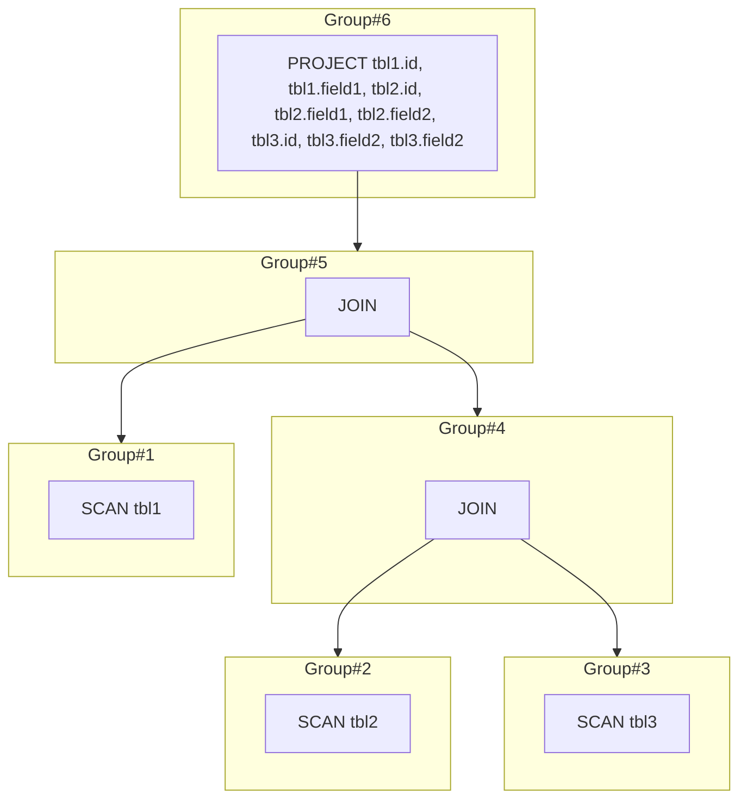

At this point every group contains exactly one expression — the original plan, untransformed. Exploration will add more.

### Exploration phase

With the memo initialized, exploration can start. Its goal is to populate each equivalent group with every logically
equivalent plan the rules can produce.

The exploration loop has a simple shape:

- For each group, apply transformation rules to find all equivalent group expression and add to equivalent set until we
  couldn't find any new equivalent plan
- For each group expression, explore all child groups

#### Transformation rule

Before looking at the exploration loop itself, let's look at a transformation rule in detail.

A transformation rule encapsulates two things: a *match* predicate that decides whether the rule is applicable, and a
*transform* function that produces the new equivalent plan.

Here is the interface of transformation rule:

```scala
trait TransformationRule {
  def `match`(expression: GroupExpression)(implicit ctx: VolcanoPlannerContext): Boolean

  def transform(expression: GroupExpression)(implicit ctx: VolcanoPlannerContext): GroupExpression
}

```

Because logical plans are trees, the `match` implementation is nothing more than pattern matching over those trees.

For instance, this `match` accepts any PROJECT node whose descendants contain only JOIN and SCAN nodes:

```scala
override def `match`(expression: GroupExpression)(implicit ctx: VolcanoPlannerContext): Boolean = {
  val plan = expression.plan
  plan match {
    case Project(_, child) => check(child)
    case _ => false
  }
}

// check if the tree only contains SCAN and JOIN nodes
private def check(node: LogicalPlan): Boolean = {
  node match {
    case Scan(_, _) => true
    case Join(left, right, _) => check(left) && check(right)
    case _ => false
  }
}
```

This plan matches:

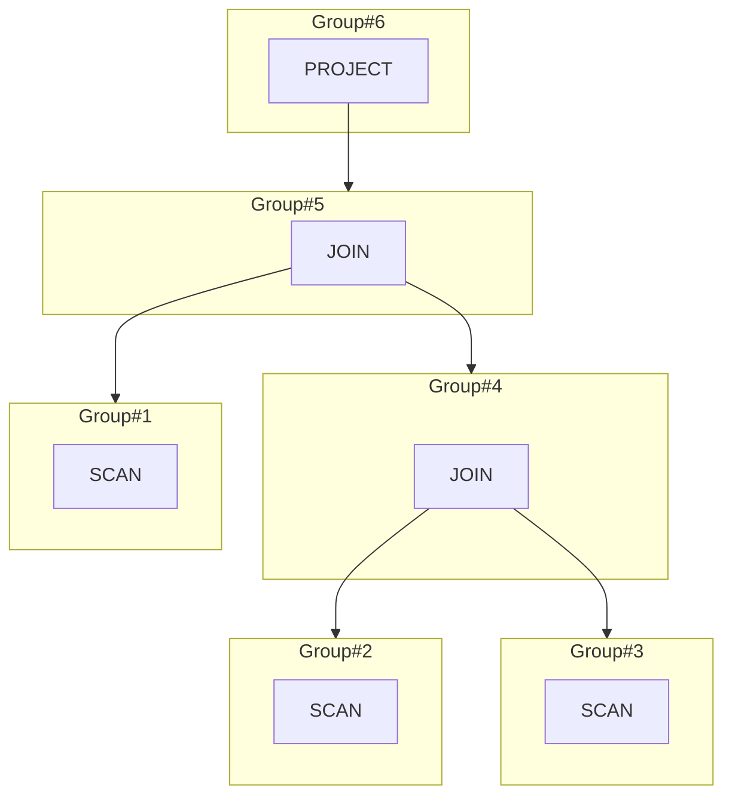

This one does not, because a PROJECT sits beneath a JOIN rather than at the top:

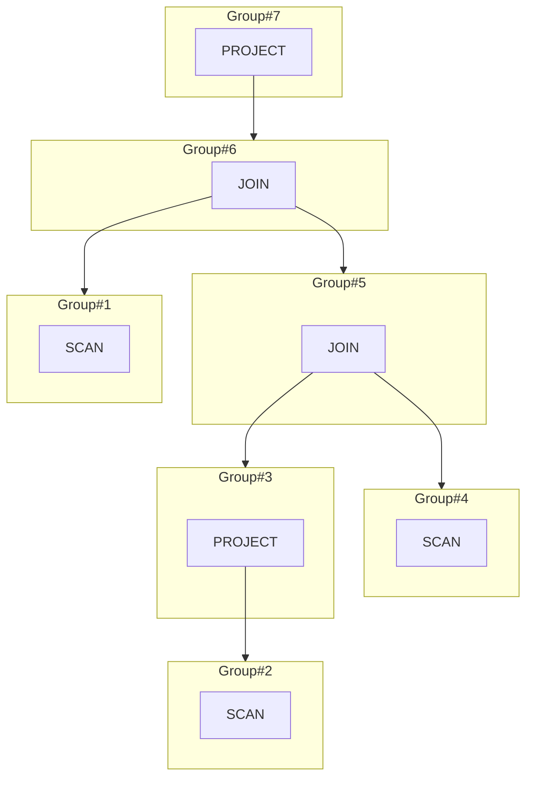

#### Plan enumerations

Recall the exploration loop:

- For each group, apply transformation rules to find all equivalent group expression and add to equivalent set until we
  couldn't find any new equivalent plan
- For each group expression, explore all child groups

Translated to code (spoiler: it's short):

```scala
private def exploreGroup(
                          group: Group,
                          rules: Seq[TransformationRule],
                          round: Int
                        )(implicit ctx: VolcanoPlannerContext): Unit = {
  while (!group.explorationMark.isExplored(round)) {
    group.explorationMark.markExplored(round)
    // explore all child groups
    group.equivalents.foreach { equivalent =>
      if (!equivalent.explorationMark.isExplored(round)) {
        equivalent.explorationMark.markExplored(round)
        equivalent.children.foreach { child =>
          exploreGroup(child, rules, round)
          if (equivalent.explorationMark.isExplored(round) && child.explorationMark.isExplored(round)) {
            equivalent.explorationMark.markExplored(round)
          } else {
            equivalent.explorationMark.markUnexplored(round)
          }
        }
      }
      // fire transformation rules to explore all the possible transformations
      rules.foreach { rule =>
        if (!equivalent.appliedTransformations.contains(rule) && rule.`match`(equivalent)) {
          val transformed = rule.transform(equivalent)
          if (!group.equivalents.contains(transformed)) {
            group.equivalents += transformed
            transformed.explorationMark.markUnexplored(round)
            group.explorationMark.markUnexplored(round)
          }
        }
      }
      if (group.explorationMark.isExplored(round) && equivalent.explorationMark.isExplored(round)) {
        group.explorationMark.markExplored(round)
      } else {
        group.explorationMark.markUnexplored(round)
      }
    }
  }
}
```

See [VolcanoPlanner.scala](core%2Fsrc%2Fmain%2Fscala%2Fcore%2Fplanner%2Fvolcano%2FVolcanoPlanner.scala) for more details

#### Implement some transformation rules

Time to see the machinery in action. We'll implement two representative rules: projection pushdown and join reorder.

##### Projection pushdown

Projection pushdown is about asking the storage layer for only the columns we actually need, rather than reading full
rows and throwing away most of them later.

For example, the query

```sql
SELECT field1, field2
from tbl
```

has the plan

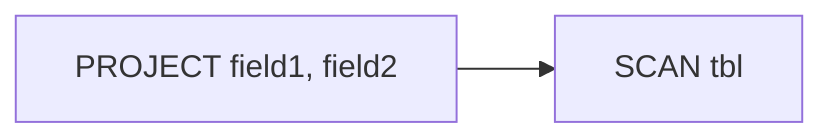

As written, the SCAN returns every column of `tbl`, and the PROJECT then discards everything except `field1` and
`field2`. All those unused columns have to travel from storage up to the PROJECT just to be thrown away — pure waste.

If we push the projection all the way into the scan, the storage layer only has to materialize the two columns we care
about:

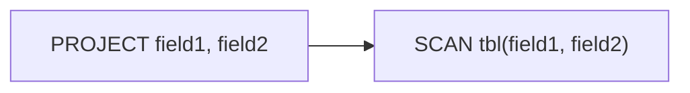

Let's go into the code:

```scala
override def `match`(expression: GroupExpression)(implicit ctx: VolcanoPlannerContext): Boolean = {
  val plan = expression.plan
  plan match {
    case Project(_, child) => check(child)
    case _ => false
  }
}

// check if the tree only contains SCAN and JOIN nodes
private def check(node: LogicalPlan): Boolean = {
  node match {
    case Scan(_, _) => true
    case Join(left, right, _) => check(left) && check(right)
    case _ => false
  }
}
```

The rule matches any PROJECT whose entire subtree is made up of SCANs and JOINs — the cases where pushdown is trivially
safe.

**notes:** A real projection-pushdown rule is a fair bit more nuanced (aggregations, filters, non-deterministic
functions, etc.). We're sticking to the simple case on purpose.

And here is the transform code:

```scala
override def transform(expression: GroupExpression)(implicit ctx: VolcanoPlannerContext): GroupExpression = {
  val plan = expression.plan.asInstanceOf[Project]
  val pushDownProjection = mutable.ListBuffer[FieldID]()
  extractProjections(plan, pushDownProjection)
  val newPlan = Project(plan.fields, pushDown(pushDownProjection.distinct, plan.child))
  ctx.memo.getOrCreateGroupExpression(newPlan)
}

private def extractProjections(node: LogicalPlan, buffer: mutable.ListBuffer[FieldID]): Unit = {
  node match {
    case Scan(_, _) => (): Unit
    case Project(fields, parent) =>
      buffer ++= fields
      extractProjections(parent, buffer)
    case Join(left, right, on) =>
      buffer ++= on.map(_._1) ++ on.map(_._2)
      extractProjections(left, buffer)
      extractProjections(right, buffer)
  }
}

private def pushDown(pushDownProjection: Seq[FieldID], node: LogicalPlan): LogicalPlan = {
  node match {
    case Scan(table, tableProjection) =>
      val filteredPushDownProjection = pushDownProjection.filter(_.table == table).map(_.id)
      val updatedProjection =
        if (filteredPushDownProjection.contains("*") || filteredPushDownProjection.contains("*.*")) {
          Seq.empty
        } else {
          (tableProjection ++ filteredPushDownProjection).distinct
        }
      Scan(table, updatedProjection)
    case Join(left, right, on) => Join(pushDown(pushDownProjection, left), pushDown(pushDownProjection, right), on)
    case _ => throw new Exception("should never happen")
  }
}
```

The transform first walks the subtree to collect every field that's actually referenced — both the top-level projection
and any join keys — then walks the tree again, attaching the relevant subset of fields to each SCAN.

To see the rule in action, start from this plan:


Applying projection pushdown produces a new equivalent plan where each SCAN carries the list of columns it needs. The
newly added nodes and edges are highlighted in orange.

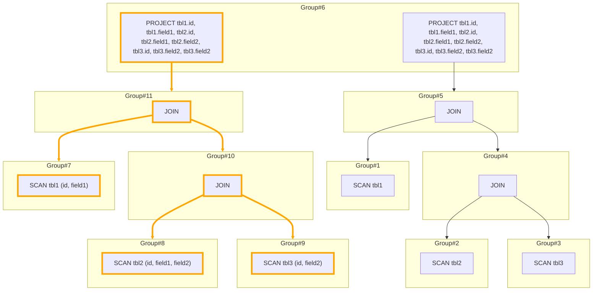

See [ProjectionPushDown.scala](core%2Fsrc%2Fmain%2Fscala%2Fcore%2Fplanner%2Fvolcano%2Frules%2Ftransform%2FProjectionPushDown.scala)
for full implementation

##### Join reorder

Join reorder is one of the most impactful transformations a cost-based planner can do — the order in which tables are
joined can change execution time by orders of magnitude.

Industrial-grade join reorder is a substantial piece of engineering. To keep this guide approachable, we'll implement a
deliberately stripped-down version that only handles a narrow case.

First, the rule `match`:

```scala
// check if the tree only contains SCAN and JOIN nodes, and also extract all SCAN nodes and JOIN conditions
private def checkAndExtract(
                             node: LogicalPlan,
                             buffer: mutable.ListBuffer[Scan],
                             joinCondBuffer: mutable.ListBuffer[(ql.FieldID, ql.FieldID)]
                           ): Boolean = {
  node match {
    case node@Scan(_, _) =>
      buffer += node
      true
    case Join(left, right, on) =>
      joinCondBuffer ++= on
      checkAndExtract(left, buffer, joinCondBuffer) && checkAndExtract(right, buffer, joinCondBuffer)
    case _ => false
  }
}

private def buildInterchangeableJoinCond(conditions: Seq[(ql.FieldID, ql.FieldID)]): Seq[Seq[ql.FieldID]] = {
  val buffer = mutable.ListBuffer[mutable.Set[ql.FieldID]]()
  conditions.foreach { cond =>
    val set = buffer.find { set =>
      set.contains(cond._1) || set.contains(cond._2)
    } match {
      case Some(set) => set
      case None =>
        val set = mutable.Set[ql.FieldID]()
        buffer += set
        set
    }
    set += cond._1
    set += cond._2
  }
  buffer.map(_.toSeq)
}

override def `match`(expression: GroupExpression)(implicit ctx: VolcanoPlannerContext): Boolean = {
  val plan = expression.plan
  plan match {
    case node@Join(_, _, _) =>
      val buffer = mutable.ListBuffer[Scan]()
      val joinCondBuffer = mutable.ListBuffer[(ql.FieldID, ql.FieldID)]()
      if (checkAndExtract(node, buffer, joinCondBuffer)) {
        // only match if the join is 3 tables join
        if (buffer.size == 3) {
          var check = true
          val interChangeableCond = buildInterchangeableJoinCond(joinCondBuffer)
          interChangeableCond.foreach { c =>
            check &= c.size == 3
          }
          check
        } else {
          false
        }
      } else {
        false
      }
    case _ => false
  }
}
```

The rule only fires on a three-way JOIN whose join conditions form a fully interchangeable chain — i.e. exactly three
tables joined on a single transitive equality.

For example,

```sql
tbl1
    JOIN tbl2 ON tbl1.field1 = tbl2.field2
    JOIN tbl3 ON tbl1.field1 = tbl3.field3
```

matches: three tables (`tbl1`, `tbl2`, `tbl3`) connected through the single equality class
`tbl1.field1 = tbl2.field2 = tbl3.field3`.

Next, is the transform code:

```scala
override def transform(expression: GroupExpression)(implicit ctx: VolcanoPlannerContext): GroupExpression = {
  val plan = expression.plan.asInstanceOf[Join]
  val buffer = mutable.ListBuffer[Scan]()
  val joinCondBuffer = mutable.ListBuffer[(ql.FieldID, ql.FieldID)]()
  checkAndExtract(plan, buffer, joinCondBuffer)
  val interChangeableCond = buildInterchangeableJoinCond(joinCondBuffer)
  //
  val scans = buffer.toList
  implicit val ord: Ordering[Scan] = new Ordering[Scan] {
    override def compare(x: Scan, y: Scan): Int = {
      val xStats = ctx.statsProvider.tableStats(x.table.id)
      val yStats = ctx.statsProvider.tableStats(y.table.id)
      xStats.estimatedTableSize.compareTo(yStats.estimatedTableSize)
    }
  }

  def getJoinCond(left: Scan, right: Scan): Seq[(ql.FieldID, ql.FieldID)] = {
    val leftFields = interChangeableCond.flatMap { c =>
      c.filter(p => p.table == left.table)
    }
    val rightFields = interChangeableCond.flatMap { c =>
      c.filter(p => p.table == right.table)
    }
    if (leftFields.length != rightFields.length) {
      throw new Exception(s"leftFields.length(${leftFields.length}) != rightFields.length(${rightFields.length})")
    } else {
      leftFields zip rightFields
    }
  }

  val sorted = scans.sorted
  val newPlan = Join(
    sorted(0),
    Join(
      sorted(1),
      sorted(2),
      getJoinCond(sorted(1), sorted(2))
    ),
    getJoinCond(sorted(0), sorted(1))
  )
  ctx.memo.getOrCreateGroupExpression(newPlan)
}
```

The transform reorders the three tables by estimated size, putting the smallest on the outside — a cheap but often
effective heuristic.

For instance, if tables A, B, C have estimated sizes 300b, 100b, 200b and the original statement is `A JOIN B JOIN C`,
the rewritten plan becomes `B JOIN C JOIN A`.

**notes:** This rule already touches table statistics. Real planners lean on them heavily — table size is just the
beginning; row width, null counts, distinct-value counts, histograms, and index availability all feed into better
decisions.

To visualize: starting from this plan,

```mermaid
graph TD
    subgraph Group#2
        Expr#2["SCAN tbl2"]
    end
    subgraph Group#5
        Expr#5["JOIN"]
    end
    Expr#5 --> Group#1
    Expr#5 --> Group#4
    subgraph Group#4
        Expr#4["JOIN"]
    end
    Expr#4 --> Group#2
    Expr#4 --> Group#3
    subgraph Group#1
        Expr#1["SCAN tbl1"]
    end
    subgraph Group#3
        Expr#3["SCAN tbl3"]
    end
    subgraph Group#6
        Expr#6["PROJECT tbl1.id, tbl1.field1, tbl2.id, tbl2.field1, tbl2.field2, tbl3.id, tbl3.field2, tbl3.field2"]
    end
    Expr#6 --> Group#5
```

applying join reorder yields:

```mermaid
graph TD
    subgraph Group#2
        Expr#2["SCAN tbl2"]
    end
    subgraph Group#5
        Expr#5["JOIN"]
        Expr#8["JOIN"]
    end
    Expr#5 --> Group#1
    Expr#5 --> Group#4
    Expr#8 --> Group#2
    Expr#8 --> Group#7
    subgraph Group#4
        Expr#4["JOIN"]
    end
    Expr#4 --> Group#2
    Expr#4 --> Group#3
    subgraph Group#7
        Expr#7["JOIN"]
    end
    Expr#7 --> Group#1
    Expr#7 --> Group#3
    subgraph Group#1
        Expr#1["SCAN tbl1"]
    end
    subgraph Group#3
        Expr#3["SCAN tbl3"]
    end
    subgraph Group#6
        Expr#6["PROJECT tbl1.id, tbl1.field1, tbl2.id, tbl2.field1, tbl2.field2, tbl3.id, tbl3.field2, tbl3.field2"]
    end
    Expr#6 --> Group#5
    style Expr#8 stroke-width: 4px, stroke: orange
    style Expr#7 stroke-width: 4px, stroke: orange
    linkStyle 2 stroke-width: 4px, stroke: orange
    linkStyle 6 stroke-width: 4px, stroke: orange
    linkStyle 3 stroke-width: 4px, stroke: orange
    linkStyle 7 stroke-width: 4px, stroke: orange
```

The rule has produced `tbl2 JOIN tbl1 JOIN tbl3` alongside the original `tbl1 JOIN tbl2 JOIN tbl3`; the newly added
expressions and edges are shown in orange.

See [X3TableJoinReorderBySize.scala](core%2Fsrc%2Fmain%2Fscala%2Fcore%2Fplanner%2Fvolcano%2Frules%2Ftransform%2FX3TableJoinReorderBySize.scala)
for full implementation

##### Putting all transformations together

Finally, we can register every rule in one place:

```scala
private val transformationRules: Seq[Seq[TransformationRule]] = Seq(
  Seq(new ProjectionPushDown),
  Seq(new X3TableJoinReorderBySize)
)
```

and kick off an exploration round for each group:

```scala
for (r <- transformationRules.indices) {
  exploreGroup(ctx.rootGroup, transformationRules(r), r + 1)
}
```

For example, the plan

```mermaid
graph TD
    subgraph Group#2
        Expr#2["SCAN tbl2"]
    end
    subgraph Group#5
        Expr#5["JOIN"]
    end
    Expr#5 --> Group#1
    Expr#5 --> Group#4
    subgraph Group#4
        Expr#4["JOIN"]
    end
    Expr#4 --> Group#2
    Expr#4 --> Group#3
    subgraph Group#1
        Expr#1["SCAN tbl1"]
    end
    subgraph Group#3
        Expr#3["SCAN tbl3"]
    end
    subgraph Group#6
        Expr#6["PROJECT tbl1.id, tbl1.field1, tbl2.id, tbl2.field1, tbl2.field2, tbl3.id, tbl3.field2, tbl3.field2"]
    end
    Expr#6 --> Group#5
```

after exploration, expands to:

```mermaid
graph TD
    subgraph Group#8
        Expr#8["SCAN tbl2 (id, field1, field2)"]
    end
    subgraph Group#11
        Expr#11["JOIN"]
        Expr#14["JOIN"]
    end
    Expr#11 --> Group#7
    Expr#11 --> Group#10
    Expr#14 --> Group#8
    Expr#14 --> Group#12
    subgraph Group#2
        Expr#2["SCAN tbl2"]
    end
    subgraph Group#5
        Expr#5["JOIN"]
        Expr#16["JOIN"]
    end
    Expr#5 --> Group#1
    Expr#5 --> Group#4
    Expr#16 --> Group#2
    Expr#16 --> Group#13
    subgraph Group#4
        Expr#4["JOIN"]
    end
    Expr#4 --> Group#2
    Expr#4 --> Group#3
    subgraph Group#13
        Expr#15["JOIN"]
    end
    Expr#15 --> Group#1
    Expr#15 --> Group#3
    subgraph Group#7
        Expr#7["SCAN tbl1 (id, field1)"]
    end
    subgraph Group#1
        Expr#1["SCAN tbl1"]
    end
    subgraph Group#10
        Expr#10["JOIN"]
    end
    Expr#10 --> Group#8
    Expr#10 --> Group#9
    subgraph Group#9
        Expr#9["SCAN tbl3 (id, field2)"]
    end
    subgraph Group#3
        Expr#3["SCAN tbl3"]
    end
    subgraph Group#12
        Expr#13["JOIN"]
    end
    Expr#13 --> Group#7
    Expr#13 --> Group#9
    subgraph Group#6
        Expr#12["PROJECT tbl1.id, tbl1.field1, tbl2.id, tbl2.field1, tbl2.field2, tbl3.id, tbl3.field2, tbl3.field2"]
        Expr#6["PROJECT tbl1.id, tbl1.field1, tbl2.id, tbl2.field1, tbl2.field2, tbl3.id, tbl3.field2, tbl3.field2"]
    end
    Expr#12 --> Group#11
    Expr#6 --> Group#5
    style Expr#12 stroke-width: 4px, stroke: orange
    style Expr#8 stroke-width: 4px, stroke: orange
    style Expr#10 stroke-width: 4px, stroke: orange
    style Expr#13 stroke-width: 4px, stroke: orange
    style Expr#14 stroke-width: 4px, stroke: orange
    style Expr#11 stroke-width: 4px, stroke: orange
    style Expr#9 stroke-width: 4px, stroke: orange
    style Expr#15 stroke-width: 4px, stroke: orange
    style Expr#7 stroke-width: 4px, stroke: orange
    style Expr#16 stroke-width: 4px, stroke: orange
    linkStyle 0 stroke-width: 4px, stroke: orange
    linkStyle 15 stroke-width: 4px, stroke: orange
    linkStyle 12 stroke-width: 4px, stroke: orange
    linkStyle 1 stroke-width: 4px, stroke: orange
    linkStyle 16 stroke-width: 4px, stroke: orange
    linkStyle 13 stroke-width: 4px, stroke: orange
    linkStyle 2 stroke-width: 4px, stroke: orange
    linkStyle 6 stroke-width: 4px, stroke: orange
    linkStyle 3 stroke-width: 4px, stroke: orange
    linkStyle 10 stroke-width: 4px, stroke: orange
    linkStyle 7 stroke-width: 4px, stroke: orange
    linkStyle 14 stroke-width: 4px, stroke: orange
    linkStyle 11 stroke-width: 4px, stroke: orange
```

See [VolcanoPlanner.scala](core%2Fsrc%2Fmain%2Fscala%2Fcore%2Fplanner%2Fvolcano%2FVolcanoPlanner.scala) for more details

### Optimization phase

With exploration complete, the memo now holds every candidate plan. The optimization phase's job is to walk that memo
and pick the winner.

The walk is recursive and bottom-up:

- For each group, we will find the best implementation by choosing the group expressing with the lowest cost
- For each group expression, first we will enumerate the physical implementations from the logical plan. Then for each
  physical implementation, we will calculate its cost using its child group costs.

Costs compose from the bottom: a node's cost is some function of its own work plus the costs of its children. Here is
an example

```mermaid
graph TD
    subgraph Group#2["Group#2(cost=1)"]
        Expr#2["Expr#2(cost=1)"]
    end
    subgraph Group#5["Group#5(cost=3)"]
        Expr#5["Expr#5(cost=max(3,2)=3"]
    end
    Expr#5 --> Group#1
    Expr#5 --> Group#4
    subgraph Group#4["Group#4(cost=2)"]
        Expr#4["Expr#4(cost=max(1,2)=2)"]
        Expr#7["Expr#7(cost=1+2=3)"]
    end
    Expr#4 --> Group#2
    Expr#4 --> Group#3
    subgraph Group#1["Group#1(cost=3)"]
        Expr#1["Expr#1(cost=3)"]
    end
    subgraph Group#3["Group#3(cost=2)"]
        Expr#3["Expr#3(cost=2)"]
    end
    subgraph Group#6["Group#6(cost=4.5)"]
        Expr#6["Expr#6(cost=3*1.5=4.5)"]
    end
    Expr#6 --> Group#5
    subgraph Group#8["Group#8(cost=1)"]
        Expr#8["Expr#8(cost=1)"]
    end
    subgraph Group#9["Group#9(cost=2)"]
        Expr#9["Expr#9(cost=2)"]
    end
    Expr#7 --> Group#8
    Expr#7 --> Group#9
```

Two things to notice here. `Expr#4`'s cost is computed from its children (`Group#2` and `Group#3`) via a `max` function
— that's the per-expression composition rule. Meanwhile, `Group#4`'s cost is the minimum across its equivalent
expressions — because within a group we pick the cheapest realization.

#### Physical plan

The goal of optimization is to produce the best physical plan for the root group, so we need a physical plan data
structure to hold it in:

```scala
sealed trait PhysicalPlan {
  def operator(): Operator

  def children(): Seq[PhysicalPlan]

  def cost(): Cost

  def estimations(): Estimations

  def traits(): Set[String]
}

```

Each field earns its keep:

- `operator` is the runtime executor for this node — we'll cover operators in the execution section.
- `children` are the subplans whose outputs feed this node; they participate in cost composition.
- `cost` bundles per-dimension cost estimates (CPU, memory, time, and so on).
- `estimations` carries statistical estimates (row count, row size, etc.) that downstream nodes use in their own cost
  calculations.
- `traits` is a set of physical properties (like `SORTED`) that implementation rules can inspect when deciding whether
  they apply.

Next, we can implement the physical node classes:

```scala
case class Scan(
                 operator: Operator,
                 cost: Cost,
                 estimations: Estimations,
                 traits: Set[String] = Set.empty
               ) extends PhysicalPlan {
  override def children(): Seq[PhysicalPlan] = Seq.empty // scan do not receive any child
}

case class Project(
                    operator: Operator,
                    child: PhysicalPlan,
                    cost: Cost,
                    estimations: Estimations,
                    traits: Set[String] = Set.empty
                  ) extends PhysicalPlan {
  override def children(): Seq[PhysicalPlan] = Seq(child)
}

case class Join(
                 operator: Operator,
                 leftChild: PhysicalPlan,
                 rightChild: PhysicalPlan,
                 cost: Cost,
                 estimations: Estimations,
                 traits: Set[String] = Set.empty
               ) extends PhysicalPlan {
  override def children(): Seq[PhysicalPlan] = Seq(leftChild, rightChild)
}

```

See [PhysicalPlan.scala](core%2Fsrc%2Fmain%2Fscala%2Fcore%2Fplanner%2Fvolcano%2Fphysicalplan%2FPhysicalPlan.scala) for
full implementation

#### Implementation rule

Optimization relies on implementation rules — the rules that convert a logical plan node into one or more physical
plan nodes.

A subtle but important detail: the planner doesn't *execute* anything during optimization, it just compares costs. So
instead of returning finished physical plans, implementation rules return *physical plan builders* — small objects that
know how to assemble a physical node given the already-costed child plans. This gives each rule the freedom to shape
cost differently per implementation.

Here is the interface of implementation rule:

```scala
trait PhysicalPlanBuilder {
  def build(children: Seq[PhysicalPlan]): Option[PhysicalPlan]
}

trait ImplementationRule {
  def physicalPlanBuilders(expression: GroupExpression)(implicit ctx: VolcanoPlannerContext): Seq[PhysicalPlanBuilder]
}

```

A `PhysicalPlanBuilder` is simply a factory: give it the child physical plans, it hands back a physical plan for the
current node.

Consider a logical JOIN with two physical realizations, HASH JOIN and MERGE JOIN:

```mermaid
graph TD
    child#1["child#1"]
    child#2["child#2"]
    child#3["child#3"]
    child#4["child#4"]
    hash_join["`HASH JOIN 
    cost=f(cost(child#1),cost(child#2))
    `"]
    merge_join["`MERGE JOIN
    cost=g(cost(child#3),cost(child#4))
    `"]
    hash_join --> child#1
    hash_join --> child#2
    merge_join --> child#3
    merge_join --> child#4
```

HASH JOIN computes its cost via function `f()` and MERGE JOIN via function `g()`, each of which takes its children as
inputs. Returning builders rather than pre-built physical plans lets each algorithm own its own cost math cleanly.

#### Finding the best plan

Back to the optimization walk:

- For each group, we will find the best implementation by choosing the group expressing with the lowest cost
- For each group expression, first we will enumerate the physical implementations from the logical plan. Then for each
  physical implementation, we will calculate its cost using its child group costs.

And here is the code:

```scala
private def implementGroup(group: Group, combinedRule: ImplementationRule)(
  implicit ctx: VolcanoPlannerContext
): GroupImplementation = {
  group.implementation match {
    case Some(implementation) => implementation
    case None =>
      var bestImplementation = Option.empty[GroupImplementation]
      group.equivalents.foreach { equivalent =>
        val physicalPlanBuilders = combinedRule.physicalPlanBuilders(equivalent)
        val childPhysicalPlans = equivalent.children.map { child =>
          val childImplementation = implementGroup(child, combinedRule)
          child.implementation = Option(childImplementation)
          childImplementation.physicalPlan
        }
        // calculate the implementation, and update the best cost for group
        physicalPlanBuilders.flatMap(_.build(childPhysicalPlans)).foreach { physicalPlan =>
          val cost = physicalPlan.cost()
          bestImplementation match {
            case Some(currentBest) =>
              if (ctx.costModel.isBetter(currentBest.cost, cost)) {
                bestImplementation = Option(
                  GroupImplementation(
                    physicalPlan = physicalPlan,
                    cost = cost,
                    selectedEquivalentExpression = equivalent
                  )
                )
              }
            case None =>
              bestImplementation = Option(
                GroupImplementation(
                  physicalPlan = physicalPlan,
                  cost = cost,
                  selectedEquivalentExpression = equivalent
                )
              )
          }
        }
      }
      bestImplementation.get
  }
}
```

This is an exhaustive recursive walk: every group is visited, every equivalent expression is considered, every
applicable implementation builder is tried. The `implementation` field on each group caches the winner so we don't
revisit it.

The best plan for the query as a whole is simply the best plan for the root group:

```scala
val implementationRules = new ImplementationRule {

  override def physicalPlanBuilders(
                                     expression: GroupExpression
                                   )(implicit ctx: VolcanoPlannerContext): Seq[PhysicalPlanBuilder] = {
    expression.plan match {
      case node@Scan(_, _) => implement.Scan(node)
      case node@Project(_, _) => implement.Project(node)
      case node@Join(_, _, _) => implement.Join(node)
    }
  }
}

ctx.rootGroup.implementation = Option(implementGroup(ctx.rootGroup, implementationRules))
```

See [VolcanoPlanner.scala](core%2Fsrc%2Fmain%2Fscala%2Fcore%2Fplanner%2Fvolcano%2FVolcanoPlanner.scala) for full
implementation

The resulting plan shows, for each group, the logical expression the planner picked, the physical operator chosen to
execute it, and the subtree's estimated cost:

```mermaid

graph TD
    Group#6["
    Group #6
Selected: PROJECT tbl1.id, tbl1.field1, tbl2.id, tbl2.field1, tbl2.field2, tbl3.id, tbl3.field2, tbl3.field2
Operator: ProjectOperator
Cost: Cost(cpu=641400.00, mem=1020400012.00, time=1000000.00)
"]
Group#6 --> Group#11
Group#11["
Group #11
Selected: JOIN
Operator: HashJoinOperator
Cost: Cost(cpu=641400.00, mem=1020400012.00, time=1000000.00)
"]
Group#11 --> Group#7
Group#11 --> Group#10
Group#7["
Group #7
Selected: SCAN tbl1 (id, field1)
Operator: NormalScanOperator
Cost: Cost(cpu=400.00, mem=400000.00, time=1000.00)
"]
Group#10["
Group #10
Selected: JOIN
Operator: MergeJoinOperator
Traits: SORTED
Cost: Cost(cpu=640000.00, mem=20000012.00, time=1100000.00)
"]
Group#10 --> Group#8
Group#10 --> Group#9
Group#8["
Group #8
Selected: SCAN tbl2 (id, field1, field2)
Operator: NormalScanOperator
Traits: SORTED
Cost: Cost(cpu=600000.00, mem=12.00, time=1000000.00)
"]
Group#9["
Group #9
Selected: SCAN tbl3 (id, field2)
Operator: NormalScanOperator
Traits: SORTED
Cost: Cost(cpu=40000.00, mem=20000000.00, time=100000.00)
"]
```

#### Implement the implementation rules

With the machinery in place, let's flesh out a few concrete rules.

##### PROJECT

PROJECT is the easiest case — no algorithmic alternatives, just a straightforward wrapper around the child plan.

```scala
object Project {

  def apply(node: logicalplan.Project)(implicit ctx: VolcanoPlannerContext): Seq[PhysicalPlanBuilder] = {
    Seq(
      new ProjectionImpl(node.fields)
    )
  }
}

class ProjectionImpl(projection: Seq[ql.FieldID]) extends PhysicalPlanBuilder {

  override def build(children: Seq[PhysicalPlan]): Option[PhysicalPlan] = {
    val child = children.head
    val selfCost = Cost(
      estimatedCpuCost = 0,
      estimatedMemoryCost = 0,
      estimatedTimeCost = 0
    ) // assuming the cost of projection is 0
    val cost = Cost(
      estimatedCpuCost = selfCost.estimatedCpuCost + child.cost().estimatedCpuCost,
      estimatedMemoryCost = selfCost.estimatedMemoryCost + child.cost().estimatedMemoryCost,
      estimatedTimeCost = selfCost.estimatedTimeCost + child.cost().estimatedTimeCost
    )
    val estimations = Estimations(
      estimatedLoopIterations = child.estimations().estimatedLoopIterations,
      estimatedRowSize = child.estimations().estimatedRowSize // just guessing the value
    )
    Some(
      Project(
        operator = ProjectOperator(projection, child.operator()),
        child = child,
        cost = cost,
        estimations = estimations,
        traits = child.traits()
      )
    )
  }
}

```

There is exactly one builder, `ProjectionImpl`. Its cost is essentially a passthrough — we treat projection as free —
and its row-count/row-size estimates are inherited from the child. In a more realistic model, projection would shrink
row size (and thus downstream memory cost); keeping it trivial here is fine for illustration.

See [Project.scala](core%2Fsrc%2Fmain%2Fscala%2Fcore%2Fplanner%2Fvolcano%2Frules%2Fimplement%2FProject.scala) for full
implementation

##### JOIN

JOIN is where implementation rules earn their keep.

The first reason it's harder is variety: a single logical JOIN can be realized by HASH JOIN, MERGE JOIN, BROADCAST JOIN,
nested-loop join, and several others, each with its own algorithm and cost profile.

The second reason is cost estimation itself: a physical join's cost depends on row counts, row widths, data
distributions, indexes, sort orders, memory availability, and more — any one of which can shift the winner.

To stay focused, we'll implement only HASH JOIN and MERGE JOIN, the cost functions are intentionally simplified (they
illustrate the shape of the calculation, not the rigor you'd want in production), and MERGE JOIN assumes its inputs are
already sorted on the join key.

Here is the code:

```scala
object Join {

  def apply(node: logicalplan.Join)(implicit ctx: VolcanoPlannerContext): Seq[PhysicalPlanBuilder] = {
    val leftFields = node.on.map(_._1).map(f => s"${f.table.id}.${f.id}")
    val rightFields = node.on.map(_._2).map(f => s"${f.table.id}.${f.id}")
    Seq(
      new HashJoinImpl(leftFields, rightFields),
      new MergeJoinImpl(leftFields, rightFields)
    )
  }
}

```

The HASH JOIN:

```scala
class HashJoinImpl(leftFields: Seq[String], rightFields: Seq[String]) extends PhysicalPlanBuilder {

  private def viewSize(plan: PhysicalPlan): Long = {
    plan.estimations().estimatedLoopIterations * plan.estimations().estimatedRowSize
  }

  //noinspection ZeroIndexToHead,DuplicatedCode
  override def build(children: Seq[PhysicalPlan]): Option[PhysicalPlan] = {
    // reorder the child nodes, the left child is the child with smaller view size (smaller than the right child if we're store all of them in memory)
    val (leftChild, rightChild) = if (viewSize(children(0)) < viewSize(children(1))) {
      (children(0), children(1))
    } else {
      (children(1), children(0))
    }
    val estimatedLoopIterations = Math.max(
      leftChild.estimations().estimatedLoopIterations,
      rightChild.estimations().estimatedLoopIterations
    ) // just guessing the value
    val estimatedOutRowSize = leftChild.estimations().estimatedRowSize + rightChild.estimations().estimatedRowSize
    val selfCost = Cost(
      estimatedCpuCost = leftChild.estimations().estimatedLoopIterations, // cost to hash all record from the smaller view
      estimatedMemoryCost = viewSize(leftChild), // hash the smaller view, we need to hold the hash table in memory
      estimatedTimeCost = rightChild.estimations().estimatedLoopIterations
    )
    val childCosts = Cost(
      estimatedCpuCost = leftChild.cost().estimatedCpuCost + rightChild.cost().estimatedCpuCost,
      estimatedMemoryCost = leftChild.cost().estimatedMemoryCost + rightChild.cost().estimatedMemoryCost,
      estimatedTimeCost = 0
    )
    val estimations = Estimations(
      estimatedLoopIterations = estimatedLoopIterations,
      estimatedRowSize = estimatedOutRowSize
    )
    val cost = Cost(
      estimatedCpuCost = selfCost.estimatedCpuCost + childCosts.estimatedCpuCost,
      estimatedMemoryCost = selfCost.estimatedMemoryCost + childCosts.estimatedMemoryCost,
      estimatedTimeCost = selfCost.estimatedTimeCost + childCosts.estimatedTimeCost
    )
    Some(
      Join(
        operator = HashJoinOperator(
          leftChild.operator(),
          rightChild.operator(),
          leftFields,
          rightFields
        ),
        leftChild = leftChild,
        rightChild = rightChild,
        cost = cost,
        estimations = estimations,
        traits = Set.empty // don't inherit trait from children since we're hash join
      )
    )
  }
}

```

HASH JOIN's cost is built from two contributions — the work it adds on top of its children, and the costs propagated
up from those children:

```scala
val selfCost = Cost(
  estimatedCpuCost = leftChild.estimations().estimatedLoopIterations, // cost to hash all record from the smaller view
  estimatedMemoryCost = viewSize(leftChild), // hash the smaller view, we need to hold the hash table in memory
  estimatedTimeCost = rightChild.estimations().estimatedLoopIterations
)

val childCosts = Cost(
  estimatedCpuCost = leftChild.cost().estimatedCpuCost + rightChild.cost().estimatedCpuCost,
  estimatedMemoryCost = leftChild.cost().estimatedMemoryCost + rightChild.cost().estimatedMemoryCost,
  estimatedTimeCost = 0
)

val estimations = Estimations(
  estimatedLoopIterations = estimatedLoopIterations,
  estimatedRowSize = estimatedOutRowSize
)

val cost = Cost(
  estimatedCpuCost = selfCost.estimatedCpuCost + childCosts.estimatedCpuCost,
  estimatedMemoryCost = selfCost.estimatedMemoryCost + childCosts.estimatedMemoryCost,
  estimatedTimeCost = selfCost.estimatedTimeCost + childCosts.estimatedTimeCost
)
```

Next, the MERGE JOIN:

```scala
class MergeJoinImpl(leftFields: Seq[String], rightFields: Seq[String]) extends PhysicalPlanBuilder {

  //noinspection ZeroIndexToHead,DuplicatedCode
  override def build(children: Seq[PhysicalPlan]): Option[PhysicalPlan] = {
    val (leftChild, rightChild) = (children(0), children(1))
    if (leftChild.traits().contains("SORTED") && rightChild.traits().contains("SORTED")) {
      val estimatedTotalRowCount =
        leftChild.estimations().estimatedLoopIterations +
          rightChild.estimations().estimatedLoopIterations
      val estimatedLoopIterations = Math.max(
        leftChild.estimations().estimatedLoopIterations,
        rightChild.estimations().estimatedLoopIterations
      ) // just guessing the value
      val estimatedOutRowSize = leftChild.estimations().estimatedRowSize + rightChild.estimations().estimatedRowSize
      val selfCost = Cost(
        estimatedCpuCost = 0, // no additional cpu cost, just scan from child iterator
        estimatedMemoryCost = 0, // no additional memory cost
        estimatedTimeCost = estimatedTotalRowCount
      )
      val childCosts = Cost(
        estimatedCpuCost = leftChild.cost().estimatedCpuCost + rightChild.cost().estimatedCpuCost,
        estimatedMemoryCost = leftChild.cost().estimatedMemoryCost + rightChild.cost().estimatedMemoryCost,
        estimatedTimeCost = 0
      )
      val estimations = Estimations(
        estimatedLoopIterations = estimatedLoopIterations,
        estimatedRowSize = estimatedOutRowSize
      )
      val cost = Cost(
        estimatedCpuCost = selfCost.estimatedCpuCost + childCosts.estimatedCpuCost,
        estimatedMemoryCost = selfCost.estimatedMemoryCost + childCosts.estimatedMemoryCost,
        estimatedTimeCost = selfCost.estimatedTimeCost + childCosts.estimatedTimeCost
      )
      Some(
        Join(
          operator = MergeJoinOperator(
            leftChild.operator(),
            rightChild.operator(),
            leftFields,
            rightFields
          ),
          leftChild = leftChild,
          rightChild = rightChild,
          cost = cost,
          estimations = estimations,
          traits = leftChild.traits() ++ rightChild.traits()
        )
      )
    } else {
      None
    }
  }
}

```

MERGE JOIN follows the same self-plus-children pattern, but with noticeably cheaper per-node work — since both inputs
are already sorted, there's no hash table to build and no memory overhead, just a linear walk:

```scala
val selfCost = Cost(
  estimatedCpuCost = 0, // no additional cpu cost, just scan from child iterator
  estimatedMemoryCost = 0, // no additional memory cost
  estimatedTimeCost = estimatedTotalRowCount
)

val childCosts = Cost(
  estimatedCpuCost = leftChild.cost().estimatedCpuCost + rightChild.cost().estimatedCpuCost,
  estimatedMemoryCost = leftChild.cost().estimatedMemoryCost + rightChild.cost().estimatedMemoryCost,
  estimatedTimeCost = 0
)

val estimations = Estimations(
  estimatedLoopIterations = estimatedLoopIterations,
  estimatedRowSize = estimatedOutRowSize
)

val cost = Cost(
  estimatedCpuCost = selfCost.estimatedCpuCost + childCosts.estimatedCpuCost,
  estimatedMemoryCost = selfCost.estimatedMemoryCost + childCosts.estimatedMemoryCost,
  estimatedTimeCost = selfCost.estimatedTimeCost + childCosts.estimatedTimeCost
)
```

See [HashJoinImpl.scala](core%2Fsrc%2Fmain%2Fscala%2Fcore%2Fplanner%2Fvolcano%2Fphysicalplan%2Fbuilder%2FHashJoinImpl.scala)
and [MergeJoinImpl.scala](core%2Fsrc%2Fmain%2Fscala%2Fcore%2Fplanner%2Fvolcano%2Fphysicalplan%2Fbuilder%2FMergeJoinImpl.scala)
for full implementation

##### Others

The rest of the rules and builders follow the same pattern; browse them here:

- [implement](core%2Fsrc%2Fmain%2Fscala%2Fcore%2Fplanner%2Fvolcano%2Frules%2Fimplement)
- [builder](core%2Fsrc%2Fmain%2Fscala%2Fcore%2Fplanner%2Fvolcano%2Fphysicalplan%2Fbuilder)

#### Putting all pieces together

With the implementation rules written, we have everything we need to plan an end-to-end query. Let's trace one from
query text to final physical plan.

```sql
SELECT tbl1.id,
       tbl1.field1,
       tbl2.id,
       tbl2.field1,
       tbl2.field2,
       tbl3.id,
       tbl3.field2,
       tbl3.field2
FROM tbl1
         JOIN tbl2 ON tbl1.id = tbl2.id
         JOIN tbl3 ON tbl2.id = tbl3.id
```

first, parsing and AST-to-plan conversion produce the initial logical plan:

```mermaid
graph TD
    1326583549["PROJECT tbl1.id, tbl1.field1, tbl2.id, tbl2.field1, tbl2.field2, tbl3.id, tbl3.field2, tbl3.field2"];
    -425111028["JOIN"];
    -349388609["SCAN tbl1"];
    1343755644["JOIN"];
    -1043437086["SCAN tbl2"];
    -1402686787["SCAN tbl3"];
    1326583549 --> -425111028;
    -425111028 --> -349388609;
    -425111028 --> 1343755644;
    1343755644 --> -1043437086;
    1343755644 --> -1402686787;
```

next, exploration fires the transformation rules and fills out the memo with equivalent alternatives:

```mermaid
graph TD
    subgraph Group#8
        Expr#8["SCAN tbl2 (id, field1, field2)"]
    end
    subgraph Group#11
        Expr#11["JOIN"]
        Expr#14["JOIN"]
    end
    Expr#11 --> Group#7
    Expr#11 --> Group#10
    Expr#14 --> Group#8
    Expr#14 --> Group#12
    subgraph Group#2
        Expr#2["SCAN tbl2"]
    end
    subgraph Group#5
        Expr#5["JOIN"]
        Expr#16["JOIN"]
    end
    Expr#5 --> Group#1
    Expr#5 --> Group#4
    Expr#16 --> Group#2
    Expr#16 --> Group#13
    subgraph Group#4
        Expr#4["JOIN"]
    end
    Expr#4 --> Group#2
    Expr#4 --> Group#3
    subgraph Group#13
        Expr#15["JOIN"]
    end
    Expr#15 --> Group#1
    Expr#15 --> Group#3
    subgraph Group#7
        Expr#7["SCAN tbl1 (id, field1)"]
    end
    subgraph Group#1
        Expr#1["SCAN tbl1"]
    end
    subgraph Group#10
        Expr#10["JOIN"]
    end
    Expr#10 --> Group#8
    Expr#10 --> Group#9
    subgraph Group#9
        Expr#9["SCAN tbl3 (id, field2)"]
    end
    subgraph Group#3
        Expr#3["SCAN tbl3"]
    end
    subgraph Group#12
        Expr#13["JOIN"]
    end
    Expr#13 --> Group#7
    Expr#13 --> Group#9
    subgraph Group#6
        Expr#12["PROJECT tbl1.id, tbl1.field1, tbl2.id, tbl2.field1, tbl2.field2, tbl3.id, tbl3.field2, tbl3.field2"]
        Expr#6["PROJECT tbl1.id, tbl1.field1, tbl2.id, tbl2.field1, tbl2.field2, tbl3.id, tbl3.field2, tbl3.field2"]
    end
    Expr#12 --> Group#11
    Expr#6 --> Group#5
    style Expr#12 stroke-width: 4px, stroke: orange
    style Expr#8 stroke-width: 4px, stroke: orange
    style Expr#10 stroke-width: 4px, stroke: orange
    style Expr#13 stroke-width: 4px, stroke: orange
    style Expr#14 stroke-width: 4px, stroke: orange
    style Expr#11 stroke-width: 4px, stroke: orange
    style Expr#9 stroke-width: 4px, stroke: orange
    style Expr#15 stroke-width: 4px, stroke: orange
    style Expr#7 stroke-width: 4px, stroke: orange
    style Expr#16 stroke-width: 4px, stroke: orange
    linkStyle 0 stroke-width: 4px, stroke: orange
    linkStyle 15 stroke-width: 4px, stroke: orange
    linkStyle 12 stroke-width: 4px, stroke: orange
    linkStyle 1 stroke-width: 4px, stroke: orange
    linkStyle 16 stroke-width: 4px, stroke: orange
    linkStyle 13 stroke-width: 4px, stroke: orange
    linkStyle 2 stroke-width: 4px, stroke: orange
    linkStyle 6 stroke-width: 4px, stroke: orange
    linkStyle 3 stroke-width: 4px, stroke: orange
    linkStyle 10 stroke-width: 4px, stroke: orange
    linkStyle 7 stroke-width: 4px, stroke: orange
    linkStyle 14 stroke-width: 4px, stroke: orange
    linkStyle 11 stroke-width: 4px, stroke: orange
```

finally, optimization selects the cheapest physical realization end-to-end:

```mermaid
graph TD
    Group#6["
    Group #6
Selected: PROJECT tbl1.id, tbl1.field1, tbl2.id, tbl2.field1, tbl2.field2, tbl3.id, tbl3.field2, tbl3.field2
Operator: ProjectOperator
Cost: Cost(cpu=641400.00, mem=1020400012.00, time=1000000.00)
"]
Group#6 --> Group#11
Group#11["
Group #11
Selected: JOIN
Operator: HashJoinOperator
Cost: Cost(cpu=641400.00, mem=1020400012.00, time=1000000.00)
"]
Group#11 --> Group#7
Group#11 --> Group#10
Group#7["
Group #7
Selected: SCAN tbl1 (id, field1)
Operator: NormalScanOperator
Cost: Cost(cpu=400.00, mem=400000.00, time=1000.00)
"]
Group#10["
Group #10
Selected: JOIN
Operator: MergeJoinOperator
Traits: SORTED
Cost: Cost(cpu=640000.00, mem=20000012.00, time=1100000.00)
"]
Group#10 --> Group#8
Group#10 --> Group#9
Group#8["
Group #8
Selected: SCAN tbl2 (id, field1, field2)
Operator: NormalScanOperator
Traits: SORTED
Cost: Cost(cpu=600000.00, mem=12.00, time=1000000.00)
"]
Group#9["
Group #9
Selected: SCAN tbl3 (id, field2)
Operator: NormalScanOperator
Traits: SORTED
Cost: Cost(cpu=40000.00, mem=20000000.00, time=100000.00)
"]
```

### Bonus: query execution

At this point the planner produces optimized plans, but those plans don't run on their own. To close the loop, we'll
tack on a small query processor so we can watch an end-to-end query produce actual rows.

A query processor consumes the physical plan from the planner, reads data from the storage layer, and emits rows to the
caller.

```mermaid
graph LR
    plan(("Physical Plan"))
    storage[("Storage Layer")]
    processor["Query Processor"]
    plan -- execute --> processor
    storage -- fetch --> processor
```

#### Volcano/Iterator model

The Volcano (or iterator) model is the execution model most textbooks introduce first, and it's still the starting point
in many real DBMSes. It's a pull-based pipeline: each operator exposes a `next()` method, and calling it on the root
pulls exactly one row through the entire plan.

Each operator in the pipeline performs a specific transformation — scanning, filtering, projecting, joining — and
passes results up to its parent one row at a time.

Typically, there's a one-to-one mapping between plan nodes and operators. For example, the query

```sql
SELECT field_1
FROM tbl
WHERE field = 1
```

will have the plan

```mermaid
graph TD
  project["PROJECT: field_1"]
  scan["SCAN: tbl"]
  filter["FILTER: field = 1"]
  project --> scan
  filter --> project
```

compiles to this chain of iterator operators:

```text
scan = {
    next() // fetch next row from table "tbl"
}

project = {
    next() = {
        next_row = scan.next() // fetch next row from scan operator
        projected = next_row["field_1"]
        return projected
    }
}

filter = {
    next() = {
        next_row = {}
        do {
            next_row = project.next() // fetch next row from project operator
        } while (next_row["field"] != 1)
        return next_row
    }
}

results = []
while (row = filter.next()) {
    results.append(row)
}
```

**notes**: this pseudo code did not handle for end of result stream

#### The operators

The operator interface really is this small:

```scala
trait Operator {
  def next(): Option[Seq[Any]]
}

```

See [Operator.scala](core%2Fsrc%2Fmain%2Fscala%2Fcore%2Fexecution%2FOperator.scala) for full implementation of all
operators

#### Testing a simple query

To tie everything together, let's run a real query through the whole pipeline.

```sql
SELECT emp.id,
       emp.code,
       dept.dept_name,
       emp_info.name,
       emp_info.origin
FROM emp
         JOIN dept ON emp.id = dept.emp_id
         JOIN emp_info ON dept.emp_id = emp_info.id
```

Against these in-memory datasources (including row counts, sort metadata, and basic column statistics):

```scala
val table1: Datasource = Datasource(
  table = "emp",
  catalog = TableCatalog(
    Seq(
      "id" -> classOf[String],
      "code" -> classOf[String]
    ),
    metadata = Map("sorted" -> "true") // assumes rows are already sorted by id
  ),
  rows = Seq(
    Seq("1", "Emp A"),
    Seq("2", "Emp B"),
    Seq("3", "Emp C")
  ),
  stats = TableStats(
    estimatedRowCount = 3,
    avgColumnSize = Map("id" -> 10, "code" -> 32)
  )
)

val table2: Datasource = Datasource(
  table = "dept",
  catalog = TableCatalog(
    Seq(
      "emp_id" -> classOf[String],
      "dept_name" -> classOf[String]
    ),
    metadata = Map("sorted" -> "true") // assumes rows are already sorted by emp_id (this is just a fake trait to demonstrate how trait works)
  ),
  rows = Seq(
    Seq("1", "Dept 1"),
    Seq("1", "Dept 2"),
    Seq("2", "Dept 3"),
    Seq("3", "Dept 3")
  ),
  stats = TableStats(
    estimatedRowCount = 4,
    avgColumnSize = Map("emp_id" -> 10, "dept_name" -> 255)
  )
)

val table3: Datasource = Datasource(
  table = "emp_info",
  catalog = TableCatalog(
    Seq(
      "id" -> classOf[String],
      "name" -> classOf[String],
      "origin" -> classOf[String]
    ),
    metadata = Map("sorted" -> "true") // assumes rows are already sorted by id (this is just a fake trait to demonstrate how trait works)
  ),
  rows = Seq(
    Seq("1", "AAAAA", "Country A"),
    Seq("2", "BBBBB", "Country A"),
    Seq("3", "CCCCC", "Country B")
  ),
  stats = TableStats(
    estimatedRowCount = 3,
    avgColumnSize = Map("id" -> 10, "name" -> 255, "origin" -> 255)
  )
)
```

Configure the cost model to minimize CPU cost:

```scala
val costModel: CostModel = (currentCost: Cost, newCost: Cost) => {
  currentCost.estimatedCpuCost > newCost.estimatedCpuCost
}
```

And wire it all up — parse, plan, execute, print:

```scala
val planner = new VolcanoPlanner
QueryParser.parse(query) match {
  case Left(err) => throw err
  case Right(parsed) =>
    val operator = planner.getPlan(parsed)
    val result = Utils.execute(operator)
    // print result
    println(result._1.mkString(","))
    result._2.foreach(row => println(row.mkString(",")))
}
```

Running it prints:

```text
emp.id,emp.code,dept.dept_name,emp_info.name,emp_info.origin
1,Emp A,Dept 1,AAAAA,Country A
1,Emp A,Dept 2,AAAAA,Country A
2,Emp B,Dept 3,BBBBB,Country A
3,Emp C,Dept 3,CCCCC,Country B
```

And that's it — a working cost-based planner plus an execution engine, end to end. From here you have all the pieces
you need to start extending it or writing your own. Good luck :)

See [Demo.scala](demo%2Fsrc%2Fmain%2Fscala%2Fdemo%2FDemo.scala) for full demo code

# Thanks

Thanks for sticking with this to the end. The guide is long and not everything is fully rigorous, but I've done my best
to make the moving parts visible and the ideas easy to hold in your head :beers:
