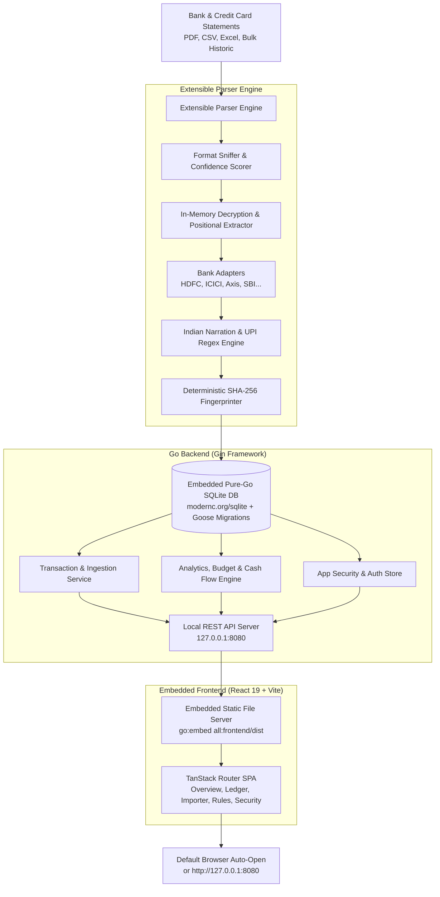

# 🇮🇳 LocalFinance

[](https://github.com/usmslm102/local-finance/actions/workflows/ci.yml)
[](LICENSE)
[](https://usamaansari.com/local-finance/)
[](https://github.com/usmslm102/local-finance/releases)
[](https://github.com/usmslm102/local-finance)

> **A privacy-first, 100% offline personal finance intelligence app tailored for the Indian banking & credit card ecosystem.**  
> Distributed as a **single standalone executable binary** with an embedded React frontend and an embedded pure-Go SQLite database.

> [!IMPORTANT]
> ### ⚖️ Disclaimer & Notice of Liability (Use at Your Own Risk)
> **LocalFinance is an independent open-source software project distributed under the terms of the [MIT License](LICENSE).**
>
> - **"AS IS" & Use at Your Own Risk**: This software is provided **"AS IS"**, without warranty of any kind, express or implied, including but not limited to the warranties of merchantability, fitness for a particular purpose, and non-infringement. You use this application entirely at your own discretion and risk.
> - **No Financial, Tax, or Legal Advice**: LocalFinance is an offline analytical and record-keeping tool. It does not provide financial planning, accounting, investment, tax, or legal advice.
> - **No Banking Affiliation**: LocalFinance is completely independent and is not affiliated with, endorsed by, sponsored by, or connected to HDFC Bank, ICICI Bank, Axis Bank, State Bank of India (SBI), the Reserve Bank of India (RBI), or any other financial institution. All bank names, brand trademarks, and logos are property of their respective owners and are referenced solely for identification and parser compatibility.
> - **Zero Liability**: To the maximum extent permitted by applicable law, in no event shall the authors, maintainers, copyright holders, or contributors be held liable for any claim, damages, losses, or legal liabilities—whether in contract, tort (including negligence), or otherwise—arising from, out of, or in connection with the software, its calculations, parser extractions, categorization rules, data loss, miscalculated figures, financial decisions, tax assessments, or any consequences resulting from its use.
> - **User Responsibility**: Users are solely responsible for reviewing and verifying the accuracy of all imported transactions, balances, and calculations against their original official bank and credit card statements before taking any financial action.

---

## 🌟 Key Highlights

- **100% Offline & Private**: Zero cloud sync, zero telemetry, no SMS scraping, and no third-party account aggregators. All your financial data stays strictly on your local machine in an open SQLite database file (`local_finance.db` or `~/.localfinance/local_finance.db`).
- **Single-Binary Portability**: Built in **Go (Golang)** with the React 19 single-page app bundled directly into the executable via `go:embed`. Cross-compiles across Windows (`.exe`), macOS, and Linux with zero CGO dependencies (`CGO_ENABLED=0`).
- **Zero-Config Database Migrations**: Schema migrations managed automatically via embedded Goose (`github.com/pressly/goose/v3`) on startup—no external migration CLI needed.
- **Generic & Extensible Parser Engine**: Pluggable architecture that **auto-detects** bank formats, account types (Savings, Current, Credit Cards), and file structures (PDF, CSV, Excel/XLS/XLSX).
- **Native Password-Protected PDF Support**: Upload encrypted bank statements directly through the UI; LocalFinance decrypts and parses them in-memory without altering original file formatting.
- **Multi-Account & Multi-Year Bulk Statements**: Handles 10+ year bulk historic statements without missing records, correctly distinguishing multiple accounts (e.g. separate HDFC Savings and Current accounts).
- **Indian Narration Intelligence**: Native regex cleaning engine for:
  - **UPI Transfers**: Extracts Payee names, VPAs (e.g., `merchant@icici`, `user@okaxis`), Reference/UTR numbers, and apps used (GPay, PhonePe, Paytm).
  - **Card Swipes / POS**: Cleans raw terminal dumps (e.g., `POS 40124300 SWIGGY BANGALORE IN` &rarr; `Swiggy`).
  - **IMPS / NEFT / RTGS**: Resolves beneficiary names and 12-to-16 digit UTR numbers.
  - **ATM Withdrawals & Bank Charges**: Distinguishes cash withdrawals, SMS alert fees, AMC charges, and GST.
- **Credit Card Billing Intelligence**:
  - Automatically captures billing cycles, statement dates, payment due dates, minimum due, total due, finance charges, reward points, and cashback.
- **Duplicate Detection & Smart Upsert**:
  - Deterministic `SHA-256` transaction hashing prevents duplicates when uploading overlapping statement periods.
  - Idempotent SQLite upserts (`ON CONFLICT`) safely update balances while **strictly preserving** your custom category overrides, notes, and tags.
- **Optional Local Security / Password Protection**:
  - Protect local database access with an optional PIN/password stored with PBKDF2/argon2 hashing, complete with automatic lock timeout.
- **Built-in Release Checks & Updates**:
  - Checks public GitHub Releases automatically on launch (cached for four hours). Disable **Automatic Update Checks** in Settings to opt out; **Check for Updates** remains available on demand.
  - Standalone executables support **Update & Restart** when writable. macOS `.app` installations offer the complete DMG instead: quit LocalFinance and replace the app in Applications to preserve its signature. Financial data remains in the separate local database.
  - macOS releases use local ad-hoc code signatures; they are not Developer ID signed or notarized.
- **Modern Interactive Dashboard**:
  - Built with **React 19**, **TypeScript**, **Tailwind CSS v4**, **TanStack Router**, **TanStack Table**, and **Recharts**.

---

## 🏦 Supported Banks & Statements Matrix

LocalFinance features dedicated parsers for major Indian banks, with native extraction of statements in PDF (including password-encrypted files decrypted losslessly in memory), CSV, and Excel formats.

### Compatibility Matrix

| Bank | Savings Account | Current Account | Core / Premium CC | Swiggy HDFC | Amazon Pay ICICI | Flipkart Axis | RuPay UPI CC | Supported Formats |
| :--- | :---: | :---: | :---: | :---: | :---: | :---: | :---: | :--- |
| **HDFC Bank** | ✅ Supported | ✅ Supported | ✅ Supported <br><sub>*(Regalia, Millennia, Infinia)*</sub> | ✅ Supported | ➖ *(N/A)* | ➖ *(N/A)* | ✅ Supported <br><sub>*(Tata Neu, RuPay)*</sub> | PDF, CSV, Excel (`.xls`, `.xlsx`) |
| **ICICI Bank** | ✅ Supported | ⏳ Planned | ✅ Supported <br><sub>*(Coral, Rubyx, Sapphiro)*</sub> | ➖ *(N/A)* | ✅ Supported | ➖ *(N/A)* | ⏳ Planned | PDF (Savings, Credit Card) |
| **Union Bank of India** | ✅ Supported | ⏳ Planned | ⏳ Planned | ➖ *(N/A)* | ➖ *(N/A)* | ➖ *(N/A)* | ⏳ Planned | PDF (Savings) |
| **Axis Bank** | ⏳ Planned <sup>*</sup> | ⏳ Planned | ✅ Supported <br><sub>*(ACE, Magnus, Atlas, Neo)*</sub> | ➖ *(N/A)* | ➖ *(N/A)* | ✅ Supported | ⏳ Planned | PDF (Credit Card) |
| **State Bank of India (SBI)** | ⏳ Planned <sup>*</sup> | ⏳ Planned | ⏳ Planned | ➖ *(N/A)* | ➖ *(N/A)* | ➖ *(N/A)* | ⏳ Planned | Generic CSV |
| **Kotak Mahindra Bank** | ⏳ Planned <sup>*</sup> | ⏳ Planned | ⏳ Planned | ➖ *(N/A)* | ➖ *(N/A)* | ➖ *(N/A)* | ⏳ Planned | Generic CSV |

> <sup>*</sup> **Universal CSV Support**: Any bank statement exported as CSV (including SBI, Kotak, ICICI Savings, etc.) can be parsed and ingested using LocalFinance's built-in delimiter-sniffing generic CSV engine.

Synthetic ICICI and Union Bank savings PDFs in `samples/savings/` exercise parser detection and full PDF extraction in the test suite. They contain only fabricated names, descriptions, dates, and amounts.

Sample statements are embedded in the application binary. The sample buttons on **Import Statements** work offline without a separate `samples/` directory.

### Investment Statements and Samples

Import portfolio holdings through **Import Statements → Investments**. Attach a supported workbook, review its preview, and import it. The **Investments** page shows dated holdings, provider fields, and original worksheets.

| Provider | Format | Ready-to-import fictional sample | Expected values |
| :--- | :--- | :--- | :--- |
| Zerodha | Holdings export (`.xlsx`) | [zerodha-fictional.xlsx](samples/investments/zerodha-fictional.xlsx) | Invested ₹800; current value ₹900; unrealized return ₹100 (12.5%) |
| INDmoney | US stock holdings export (`.xls`) | [indmoney-fictional.xls](samples/investments/indmoney-fictional.xls) | Current value $62.345679; acquisition cost and returns unavailable |

Both samples contain only fictional accounts and holdings dated April 1, 2026. Download and import them directly; Python and sample-generation scripts are not required. Use a separate demo database to keep them apart from your own portfolio.

Portfolio totals use the latest statement per provider, account, and currency. INR and USD totals remain separate, with no currency conversion or live price lookup. Re-importing the same workbook does not create a duplicate snapshot. Investment holdings stay separate from bank transactions and do not affect income, expenses, cash flow, or budgets.

Zerodha statements provide cost and closing valuations. INDmoney's **Total Value** is current valuation; its export does not supply acquisition cost, so invested value and returns remain unavailable. A holdings snapshot cannot provide annualized returns or XIRR.

### Credit Card Variants Breakdown

| Bank | Card Variant / Series | Network | Supported Formats | Extracted Intelligence | Status |
| :--- | :--- | :---: | :--- | :--- | :---: |
| **HDFC Bank** | **Regalia / Regalia Gold** | VISA | PDF, CSV | Billing period, due date, reward points, credit limit | ✅ Supported |
| **HDFC Bank** | **Millennia** | VISA / MC | PDF, CSV | Billing period, due date, cashback, reward points | ✅ Supported |
| **HDFC Bank** | **Infinia** | VISA | PDF, CSV | Billing period, due date, reward points, credit limit | ✅ Supported |
| **HDFC Bank** | **Swiggy HDFC** | Mastercard | PDF, CSV | Cashback earned & credited, billing period, due date | ✅ Supported |
| **HDFC Bank** | **Tata Neu / RuPay UPI** | RuPay | PDF, CSV | UPI merchant transactions, NeuCoins/rewards, due date | ✅ Supported |
| **ICICI Bank** | **Amazon Pay ICICI** | VISA | PDF | 5%/2%/1% cashback calculation, due dates, reward tracking | ✅ Supported |
| **ICICI Bank** | **Coral / Rubyx / Sapphiro** | VISA / MC | PDF | Purchases/charges, reward points, limits, due dates | ✅ Supported |
| **Axis Bank** | **Flipkart Axis** | Mastercard / VISA | PDF | Cashback earned & credited, merchant categories, due dates | ✅ Supported |
| **Axis Bank** | **ACE / Magnus / Atlas / Neo** | VISA / MC | PDF | Itemized spends, reward points, credit limits, due dates | ✅ Supported |

---

## 🏗️ Architecture



---

## 🛠️ Technology Stack

| Layer | Component | Description |
| :--- | :--- | :--- |
| **Backend Core** | **Go 1.27.2+** | High-performance, low-memory footprint, single-binary compilation with `CGO_ENABLED=0`. |
| **API Framework** | **Gin (`gin-gonic/gin`)** | High-speed HTTP router, multipart file upload handling, CORS, and embedded static asset serving. |
| **Database Engine** | **SQLite (`modernc.org/sqlite`)** | Pure Go SQLite engine (zero CGO required), WAL mode enabled with busy timeout pragmas. |
| **Schema Migrations** | **Goose (`pressly/goose/v3`)** | Embedded SQL migrations executed automatically on startup via `embed.FS`. |
| **Asset Embedding** | **Go `embed`** | Packages the compiled React production bundle directly into the Go binary. |
| **Frontend Framework**| **React 19 + TypeScript + Vite** | High-speed modern UI with type-safety and hot module replacement. |
| **Package Manager** | **`pnpm`** | Strict dependency resolution (use `pnpm` exclusively for all frontend tasks). |
| **UI Components** | **shadcn/ui + Radix UI** | Accessible, headless UI components styled with Tailwind CSS. |
| **Routing** | **TanStack Router** | Client-side routing for `/`, `/transactions`, `/import`, `/categories`, `/settings`. |
| **Table & Ledger** | **TanStack Table v8** | Virtualized transaction table with multi-column sorting, filtering, and pagination. |
| **State & Fetching** | **TanStack Query v5** | Server-state caching and automatic cache invalidation on imports. |
| **Styling** | **Tailwind CSS v4** | Modern design tokens and dark financial aesthetic. |
| **Visualizations** | **Recharts** | Interactive donut spending breakdown and cash flow bar charts. |

---

## 🚀 Running & Developing LocalFinance

### ⚡ Quick Start: Pre-built Standalone Releases
You don't need Go or Node.js installed to use LocalFinance. Download the pre-compiled package for your operating system from **[GitHub Releases](https://github.com/usmslm102/local-finance/releases)**.

#### 🍏 macOS (Universal: Apple Silicon M1/M2/M3/M4 & Intel)
1. Download **`LocalFinance.dmg`** directly from Releases.
2. Open the `.dmg` and drag **LocalFinance** into your **Applications** folder.
3. Launch **LocalFinance** from Applications or Spotlight.
   - *Note on Gatekeeper*: Because LocalFinance is open-source and distributed without an Apple Developer ID certificate, macOS may show a prompt:
     > *"LocalFinance" cannot be opened because Apple cannot check it for malicious software.*
   - To open: **Right-click** (or Control-click) `LocalFinance.app` in Finder, choose **Open**, and click **Open** on the prompt. Alternatively, go to **System Settings** → **Privacy & Security**, scroll down to **Security**, and click **Open Anyway**.
   - *(CLI Alternative)*: A universal command-line binary archive is also available as `local-finance-darwin-universal.tar.gz`.

#### 🪟 Windows
1. Download **`LocalFinance.exe`** directly from Releases (no unzipping required).
2. Double-click `LocalFinance.exe` to launch.
   - If Windows SmartScreen appears (*"Windows protected your PC"*), click **More info** → **Run anyway**.

#### 🐧 Linux
1. Download `local-finance-linux-amd64.tar.gz` (or `local-finance-linux-arm64.tar.gz`).
2. Extract and run:
   ```bash
   tar -xzf local-finance-linux-amd64.tar.gz
   ./local-finance
   ```

---

### Prerequisites (For Building from Source)
- **Go 1.27.2+**
- **Node.js 20+**
- **pnpm** (install via `npm install -g pnpm` or `brew install pnpm`)

---

### Development Workflows

#### 1. Quick Unified Run (`make dev` or `make serve`)
Compiles the React frontend and boots up the Go server with auto-browser opening:
```bash
make dev
```

#### 2. Live Development Mode (Dual Process with Hot Reload)
When actively building React UI components or making backend changes:

* **Terminal 1: Go Backend Server**
  ```bash
  make dev-backend
  # Or manually:
  go run ./cmd/server/main.go -port 8080 -db ./local_finance.db -open=false
  ```
  *(Optional: Use [`air`](https://github.com/air-verse/air) for live Go auto-recompilation: `air -c .air.toml`)*

* **Terminal 2: Frontend Vite Dev Server**
  ```bash
  make dev-frontend
  # Or manually:
  cd frontend && pnpm dev
  ```
  Open **`http://localhost:5173`** in your browser. All UI edits reflect instantly via Hot Module Replacement (HMR), and API requests (`/api/*`) are automatically proxied to the Go backend on port `8080`.

#### 3. Production Build (Single Standalone Binary)
Builds the production React bundle, embeds it into Go, and outputs the standalone executable:
```bash
make build
# Or manually:
cd frontend && pnpm build && cd .. && go build -o local-finance ./cmd/server/main.go
```

#### 4. Run the Production Binary
```bash
./local-finance -port 8080 -open
```

#### Available CLI Flags:
| Flag | Default | Description |
| :--- | :--- | :--- |
| `-port` | `8080` | Port for the local HTTP server. |
| `-db` | `~/.localfinance/local_finance.db` | Path to the SQLite database file. |
| `-open` | `true` | Automatically opens the application in your default web browser on startup (`-open=false` to disable). |

#### 5. Clean Build Artifacts
```bash
make clean
# Deletes frontend/dist, compiled binary, and test databases
```

#### 6. Run Automated Tests
```bash
make test
# Or:
go test -v ./...
```

---

### Cross-Compiling for Other Operating Systems

Because LocalFinance uses pure Go SQLite (`modernc.org/sqlite`), cross-compilation requires **zero CGO** (`CGO_ENABLED=0`):

```bash
# 1. Build frontend assets
cd frontend && pnpm build && cd ..

# 2. Compile for macOS (Apple Silicon M1/M2/M3/M4)
GOOS=darwin GOARCH=arm64 go build -o local-finance-darwin-arm64 ./cmd/server/main.go

# 3. Compile for macOS (Intel x86_64)
GOOS=darwin GOARCH=amd64 go build -o local-finance-darwin-amd64 ./cmd/server/main.go

# 4. Compile for Windows 64-bit (.exe)
GOOS=windows GOARCH=amd64 go build -o local-finance-windows-amd64.exe ./cmd/server/main.go

# 5. Compile for Linux 64-bit
GOOS=linux GOARCH=amd64 go build -o local-finance-linux-amd64 ./cmd/server/main.go
```

---

## 🔒 Password-Protected PDF Statements & Optional Decryption

### Native Decryption (Recommended)
You do **not** need to decrypt or remove passwords from your statements before uploading!
- LocalFinance natively decrypts protected PDF statements in memory using the password input in the upload modal.
- It parses the full multi-page document in its native layout without touching your filesystem or saving decrypted files to disk.

---

### ⚠️ Avoid macOS Preview "Print to PDF"
When removing passwords from bank statements, **do not** use **File &rarr; Print &rarr; Save as PDF** in macOS Preview:
1. **Canvas Rescaling**: Preview's virtual printer often downsizes wide/landscape bank statements (e.g. from 730 pt landscape down to 245 pt portrait), which can break column alignments in standard parsers.
2. **Missing Pages**: The print dialog frequently defaults to printing **only Page 1**, accidentally truncating multi-page statements (e.g. losing 13 out of 14 pages).

---

### 💡 How to Safely Remove Passwords via `qpdf` (Lossless)

If you wish to remove passwords from bank statements for local archival or inspection, the safest and cleanest utility is **`qpdf`**.

`qpdf` performs a **pure cryptographic decryption** on the PDF binary stream without re-rendering, rescaling, or rasterizing vector coordinates:

#### 1. Install `qpdf`
* **macOS** (Homebrew):
  ```bash
  brew install qpdf
  ```
* **Ubuntu / Debian**:
  ```bash
  sudo apt install qpdf
  ```
* **Windows** (Chocolatey or Scoop):
  ```bash
  choco install qpdf
  # Or: scoop install qpdf
  ```

#### 2. Decrypt Statement
```bash
qpdf --decrypt --password="YOUR_PASSWORD" "protected_statement.pdf" "unlocked_statement.pdf"
```

#### 3. Batch Decrypt All Statements in a Folder (macOS/Linux)
```bash
for f in *.pdf; do
    qpdf --decrypt --password="YOUR_PASSWORD" "$f" "unlocked_${f}"
done
```

> **Why `qpdf`?** It preserves 100% of the original PDF layout, font streams, page counts, and coordinate dimensions with zero data loss.

---

#### Alternative GUI Method: macOS Preview "Export" (Not Print)
If you prefer not to use the terminal:
1. Open the protected PDF in **Preview** and enter your password.
2. Click **File &rarr; Export...** (do **NOT** use *Export as PDF* or *Print*).
3. In the export dialog, ensure the **Encrypt** checkbox is **unchecked**.
4. Save the file. This preserves all pages and canvas dimensions.

---

## 📁 Repository Structure

```
local-finance/
├── cmd/
│   └── server/
│       └── main.go                 # Application entry point: CLI flags, DB bootstrap, auto-browser
├── embed.go                        # go:embed directives bundling frontend/dist into Go binary
├── frontend/                       # React 19 + TypeScript + Vite frontend
│   ├── dist/                       # Production frontend build output (embedded into Go binary)
│   ├── src/
│   │   ├── components/
│   │   │   ├── dashboard/          # KPI Cards, Spend Breakdown Donut, Cash Flow Bar Chart
│   │   │   ├── import/             # Statement upload dropzone & upsert audit summary
│   │   │   ├── layout/             # Top Navbar with active navigation links
│   │   │   ├── rules/              # Categories & auto-categorization rule inspector
│   │   │   ├── settings/           # Local Auth & database lock settings
│   │   │   └── transactions/       # TanStack Table ledger with filtering & pagination
│   │   ├── lib/
│   │   │   ├── api.ts              # Typed API client for Go backend endpoints
│   │   │   └── utils.ts            # Formatting helpers (INR currency, dates, class merging)
│   │   ├── types/                  # TypeScript interfaces (Transaction, Account, Analytics)
│   │   ├── index.css               # Tailwind CSS v4 design tokens & theme
│   │   ├── main.tsx                # QueryClientProvider & root mount
│   │   └── router.tsx              # TanStack Router configuration
│   ├── package.json                # Frontend dependencies (ALWAYS managed with pnpm)
│   └── vite.config.ts              # Vite configuration (port 5173 with proxy to backend :8080)
├── go.mod                          # Go module dependencies
├── go.sum                          # Go checksums
├── internal/
│   ├── api/
│   │   ├── handlers.go             # Gin HTTP route handlers
│   │   └── routes.go               # Router setup, CORS, static SPA fallback handler
│   ├── db/
│   │   ├── db.go                   # SQLite connection, Goose migration runner, queries, seeders
│   │   ├── db_test.go              # Database & migration unit tests
│   │   └── migrations/             # Embedded Goose SQL migration files
│   │       ├── 00001_initial_schema.sql
│   │       ├── ...
│   │       └── 00010_add_account_number.sql
│   ├── models/
│   │   └── models.go               # Shared domain structs & enums
│   ├── parser/
│   │   ├── cleaner.go              # Indian UPI, POS terminal, IMPS/NEFT narration regex engine
│   │   ├── extractor/              # Generic format extractors (Excel, PDF, CSV, normalizers)
│   │   │   ├── csv.go              # Auto-delimiter & BOM stripping CSV extractor
│   │   │   ├── excel.go            # OpenXML (.xlsx) & legacy BIFF8 (.xls) / HTML extractor
│   │   │   ├── helper.go           # Indian currency & date normalizers, ColumnSpec finder
│   │   │   └── pdf.go              # Decryption & positional text token extractor
│   │   ├── hdfc_cc_csv.go          # HDFC Credit Card CSV parser plugin
│   │   ├── hdfc_cc_pdf.go          # HDFC Credit Card PDF parser plugin
│   │   ├── hdfc_savings_csv.go     # HDFC Savings/Current Account CSV parser plugin
│   │   ├── hdfc_savings_pdf.go     # HDFC Savings/Current Account PDF parser plugin (bulk & standard)
│   │   ├── hdfc_savings_xls.go     # HDFC Savings/Current Account Excel parser plugin
│   │   ├── icici_cc_pdf.go         # ICICI Bank Credit Card PDF parser plugin
│   │   ├── axis_cc_pdf.go          # Axis Bank Credit Card PDF parser plugin
│   │   └── parser.go               # Generic StatementParser interface & auto-detection Registry
│   └── service/
│       └── transaction_service.go  # Ingestion pipeline, SHA-256 fingerprinting & smart upserts
├── Makefile                        # Build and development automation targets
├── ROADMAP.md                      # Product specifications, completed ledger & future roadmap
└── README.md                       # Comprehensive user and developer manual
```

---

## 🧩 Adding a New Bank Parser (Extensibility)

Adding support for a new bank or format (e.g. SBI, Kotak, Axis, Amex) is completely modular:

1. Create a new file in `internal/parser/<bank>_<account_type>_<format>.go` (e.g. `internal/parser/sbi_savings_csv.go`).
2. Implement the `StatementParser` interface:

```go
package parser

import (
	"io"
	"strings"
	"local-finance/internal/models"
)

type SBISavingsCSVParser struct{}

func init() {
	// Automatically registers parser with the global registry
	DefaultRegistry.Register(&SBISavingsCSVParser{})
}

func (p *SBISavingsCSVParser) ID() string {
	return "sbi_savings_csv_v1"
}

func (p *SBISavingsCSVParser) Name() string {
	return "State Bank of India Savings CSV"
}

func (p *SBISavingsCSVParser) SupportedTypes() []StatementType {
	return []StatementType{TypeSavingsCSV}
}

func (p *SBISavingsCSVParser) CanParse(filename string, sample []byte) (float64, string, models.AccountType) {
	content := strings.ToUpper(string(sample))
	confidence := 0.0
	if strings.Contains(content, "STATE BANK OF INDIA") || strings.Contains(content, "SBI") {
		confidence += 0.5
	}
	if strings.Contains(content, "TXN DATE") && strings.Contains(content, "DESCRIPTION") {
		confidence += 0.4
	}
	return confidence, "State Bank of India", models.AccountTypeSavings
}

func (p *SBISavingsCSVParser) Parse(r io.Reader, opts ParseOptions) ([]ParsedTransaction, StatementMeta, error) {
	// 1. Read rows using extractor.ExtractCSV
	// 2. Normalize dates using extractor.NormalizeIndianDate
	// 3. Clean narrations using CleanNarration(raw)
	// 4. Return []ParsedTransaction and StatementMeta
}
```

---

## Adding an Investment Parser

Investment imports follow the same adapter-and-registry pattern as bank statements. Each provider implements `investment.Parser` in `internal/investment/<provider>_<format>.go` and registers itself locally:

```go
func init() {
	DefaultRegistry.Register(ExampleHoldingsParser{})
}
```

Implement `ID()` with a stable, versioned format ID; `Info()` with the provider name, format label, and supported extensions; `CanParse(filename, data)` to identify the export from its contents; and `Parse(data)` to return the common `models.InvestmentSnapshot`. Supply provider, account reference, statement date (`YYYY-MM-DD`), currency, and holdings. Keep unavailable cost or return values nil, preserve provider-specific fields in `Fields`, and retain original worksheets in `Sheets` when applicable. Use the shared workbook helpers rather than depending on another provider's adapter.

The registry rejects unsupported files and files recognized by multiple adapters. Its metadata drives `/api/investments/formats` and the upload UI, while the shared service handles preview, import, file limits, and deduplication. Adding a provider requires no provider-specific changes to routes, storage, or frontend lists. Add a fictional fixture under `samples/investments/` and tests for detection, values, preview, and repeat imports; never check in personal statements.

## Monthly Review

Overview now includes a compact review of the latest month with imported data. Choose **Understand what changed** to open the detailed review in Cash Flow, or use **Review month** there to inspect another month.

- Expand statement coverage to see how many days each tracked account's reported statement ranges cover in both periods. Overlaps count once; gaps remain visible. This is a date-coverage check, not a balance audit.
- Inspect the largest category changes and the merchants contributing to them. **View transactions** shows the exact recorded debits for either period, with pagination.
- Use **Plan next month** to open the existing budget editor for the following month and category. Nothing is saved automatically.

Historical months compare full calendar months. The current month compares elapsed days, capped at the previous month's last day when it is shorter. Transfers and excluded transactions do not count as spending; credits and refunds are not deducted. Missing statement coverage can distort comparisons, so the review flags it explicitly.

The review is read-only, runs offline, and uses the app's existing authentication and discreet mode.

## 🔌 REST API Reference

The server listens on `127.0.0.1` and accepts trusted local browser origins. Local scripts that call the API without browser origin headers must include `X-LocalFinance-Request: 1`, including for reads, for example `curl -H 'X-LocalFinance-Request: 1' http://127.0.0.1:8080/api/health`. This header prevents cross-site browser requests; it does not replace the session token required when app lock is enabled. The frontend sends the header automatically. External links may open the app's pages, but cross-site requests to API endpoints are rejected.

| Endpoint | Method | Description |
| :--- | :--- | :--- |
| `/api/health` | `GET` | Server health check and version info |
| `/api/accounts` | `GET` | List all discovered bank accounts and credit cards with current balances |
| `/api/transactions` | `GET` | List transactions with filters (`account_id`, `category_id`, `tx_type`, `search`, `start_date`, `end_date`, `page`, `page_size`) |
| `/api/statements/upload` | `POST` | Ingest statement file (multipart `file`, optional `password`, `account_id`, `parser_id`) |
| `/api/statements/preview` | `POST` | Dry-run statement parse without saving to DB (shows detected metadata and transactions) |
| `/api/statements` | `GET` | List history of uploaded statements with checksums and date ranges |
| `/api/categories` | `GET` | List spending categories with icons and color tokens |
| `/api/rules` | `GET` | List active auto-categorization keyword & regex rules |
| `/api/analytics/overview`| `GET` | Get total income, total expense, net savings, category breakdown, and monthly cash flow |
| `/api/analytics/monthly-review` | `GET` | Spending comparison and statement coverage; optional `month=YYYY-MM`, defaulting to the latest month with imported data |
| `/api/analytics/monthly-review/transactions` | `GET` | Supporting debits for `month`, `category` (empty means uncategorized), `period=current\|previous`, and `page`; 50 rows per page |
| `/api/parsers` | `GET` | List all registered bank parser plugins |

---

## 🛡️ Privacy & Local Security

- **100% Offline**: LocalFinance does not make external network requests, send telemetry, or connect to third-party servers.
- **Local SQLite Storage**: Your data lives entirely in `local_finance.db` (or `~/.localfinance/local_finance.db`). Backups can be made simply by copying this single file.
- **Local App Lock**: An optional PIN/Password can be enabled in settings to restrict local access to the dashboard.

---

## 📄 License
MIT License. Free and open source for local personal finance intelligence.

## AI tools and MCP (opt-in)

LocalFinance can serve finance data to AI tools through a local
Streamable HTTP MCP endpoint. MCP is disabled by default, and LocalFinance must
remain running. It does not call an AI provider itself. Your connected AI tool
may send returned transactions, notes, payees, balances, and reports to its model
provider. Review that tool's data policy before connecting. Access is **read-only
by default**, with an optional permission for custom category and rule writes.

1. Open **Settings → AI / MCP** and click **Create token & enable MCP**.
   New tokens are filled into setup commands automatically. LocalFinance stores
   only the token's SHA-256 hash; the settings screen keeps the token in memory
   until you leave the tab. Save it privately if you want to connect more clients later.
2. Choose the **Codex**, **Claude Code**, or **Ollama** tab. For Ollama,
   install OpenCode and use a local model that supports tool calls.
3. Select **Shell · macOS / Linux** or **PowerShell · Windows**, click
   **Copy command**, and run it on the computer running LocalFinance.
   Your chosen client CLI must already be installed and available on PATH.
   Ollama setup checks for a recent OpenCode CLI supporting `mcp add --url`
   and `--header`. Ollama can run separately as an app or service; its CLI is
   only needed for the optional launch command below. No additional Node.js
   installation is needed.
4. Restart your AI client and check its MCP tools. For Ollama, run
   `ollama launch opencode` after setup and choose your local model. Ask your client:
   “Use LocalFinance to summarize my spending last month.”

The commands include your token and use the installed client's MCP setup command
instead of a separate configuration installer. Existing connections are preserved;
only the LocalFinance entry is replaced when you rerun setup after a port change
or token rotation. Claude Code uses user scope. Codex registers the URL through
its CLI, then appends the authorization header to `CODEX_HOME/config.toml`
(or `~/.codex/config.toml`), since its CLI does not have a static-header flag.
The Codex command restricts that file to your user before saving the token
(Windows ACLs or POSIX permissions).
OpenCode uses its CLI to save the connection in user configuration, including JSONC.
Keep client configuration and copied commands private and out of repositories
and shared terminal logs. Setup does not install clients or download scripts.

If you already have a token, paste it into **Access token**. You can copy and run
setup while MCP is disabled; enable MCP when you are ready to connect.
Commands stop with an error if a required client is missing from PATH. If the CLI
rejects an option, update the client or use **Manual configuration**. Codex desktop
users without the CLI can use manual configuration instead.
If you lost the token, rotate it and reconnect every client. **Advanced settings**
contains the local port (default `8081`) and listener retry controls.

Each provider tab also offers **Manual configuration**. Use it for clients without
the supported CLI, or to merge the connection into a custom configuration.
Project settings may override user settings in your AI client. After Ollama setup,
`ollama launch opencode` lets you choose a local model; the first launch may
need to download the model or client dependencies.

For another MCP client, choose **Other clients**, select **Streamable HTTP**, use
`http://127.0.0.1:8081/mcp` (or your configured port), and set the header
`Authorization: Bearer YOUR_TOKEN`. Clients running only in the cloud cannot reach
this computer's loopback address. There is no stdio transport, remote hosting,
or automatic LocalFinance startup. Client configuration references:
[Codex MCP](https://learn.chatgpt.com/docs/extend/mcp?surface=cli),
[Claude Code MCP](https://code.claude.com/docs/en/mcp),
[OpenCode MCP](https://opencode.ai/docs/mcp-servers/), and
[Ollama with OpenCode](https://docs.ollama.com/integrations/opencode).

### Access and revocation

- The token grants finance reads and any enabled category/rule write permission,
  and **remains usable while the UI is
  locked**. It cannot authenticate against LocalFinance's REST API or settings.
- Disable MCP to close the listener and cancel active requests. Re-enabling uses
  the same token. Rotate the token to invalidate it and update every client.
- Restoring or resetting the database disables MCP and clears its credentials,
  including credentials present in a restored backup, and revokes write permission.
- If the port is occupied, the app keeps running and Settings shows the failure.
  Choose another port and save, then update your clients' endpoint URLs.
- Returned data cannot be recalled from an AI client after disabling access.

### Available data

Tools cover accounts, transaction search and calendar ranges, categories and rules,
overview, monthly review and its evidence, cash flow, salary, yearly Wrapped,
credit-card portfolio/bills/reward rules and hypothetical card comparisons,
budgets, existing subscriptions, reconciliation summaries, merchants, investments, statement
import history, parser capabilities, and the local app version. Optional write
permissions below expose rule saves, verified CSV imports and upload deletion.
No tool reads arbitrary files, executes SQL, exports the database, manages security,
or checks/applies software updates.

### Investment views and upload requirements

`list_investments` returns dated portfolio summaries. Use `get_investment_snapshot`
with a snapshot `id` for paginated normalized holdings. Missing costs/returns stay
null; currencies remain separate. Use only the latest snapshot per `portfolio_key`
for totals. The key uses the earliest stored snapshot ID and changes if that
anchor is deleted in the app. Account references are masked; original worksheets and arbitrary
provider fields remain available in the app and are omitted from MCP responses.
`list_investment_formats` describes upload formats, provider layout requirements
and the size limit; these three tools are available with read-only MCP access.

### Optional category and rule writes

Enable **Settings → AI / MCP → Allow category and rule writes** to expose two
additional tools to all clients sharing the token. Existing installations remain
read-only until this permission is enabled. Refresh tool discovery after changing it.

- `save_category`: create a custom category with `name`, or update one by supplying
  its `id` and `name`. Optional `color_hex` (`#RRGGBB`) and `icon` default to
  `#64748B` and `tag` on creation; omitted fields are preserved on updates.
  Built-in system categories cannot be edited. Identity and parent are preserved.
- `save_categorization_rule`: provide `match_pattern` and `target_category_id`
  from `list_categories`; omit `id` to create or provide an existing rule id to
  update. Optional matcher fields are `match_field`, `match_type`, `tx_type`,
  `exclude_pattern`, `priority`, `assign_tags`, and `is_active`. Creation defaults
  match the app: `cleaned_payee`, `CONTAINS`, `ALL`, priority 50, active true.
  Omitted optional fields are preserved on updates, including inactive rules.

Saving a rule automatically reapplies all active rules to the whole ledger in
the same database transaction. Manual categories, tags and notes are preserved.
Unmatched automatic entries become Others; transfers retain their transfer category.
The response adds `ledger_updated_count`.
Creation generates an id, so retrying without that id can create another record.
Use the returned id for updates. Disable write permission to remove both tools;
finance reads remain available while MCP is enabled.

### Optional statement and investment uploads

Enable **Settings → AI / MCP → Allow statement and investment uploads** separately
from category/rule writes. It is off by default. Refresh client tool discovery.

- `import_statement_csv`: ask the agent to parse and verify a statement, save the
  transaction CSV on the machine running LocalFinance, then pass its absolute
  local `path`. The tool description specifies the complete CSV v1 format.
  Optional `account_id` selects an existing account; otherwise CSV metadata
  resolves or creates the account. Imports use existing deduplication and preserve
  manual categories, notes and tags. Only regular local .csv files up to 20 MiB
  are supported; network paths and symlinks are rejected.
- `import_investment_statement`: pass the absolute local `path` of an original
  provider export (up to 10 MiB). Call `list_investment_formats` for supported
  formats and provider requirements: Zerodha `.xlsx` and INDmoney `.xls`.
  Returns a masked snapshot summary and duplicate status; identical files retain
  the same snapshot ID. Investment snapshots never create bank transactions.
- `delete_statement_import`: pass the exact `statement_import_id` returned by
  import or listed in `list_statement_imports`. Permanently removes transactions
  and bills currently associated with that upload, including their manual edits,
  clears surviving transfer links, reapplies rules to their automatic categories,
  and updates the account balance. Duplicate rows
  belong to their latest upload: deleting an older overlapping upload preserves
  them, while deleting the latest removes them. Accounts and rules remain.

Required CSV columns: `bank_name,account_type,account_number_mask,date,narration,amount,tx_type`.
Optional: `account_number,reference_number,value_date,running_balance,cleaned_payee`.
Repeat identical account metadata on every row. Dates are `YYYY-MM-DD`; amounts
are positive plain decimals with at most two fractional digits; type is `DEBIT`
or `CREDIT`. Quote narration containing commas or newlines. Unknown columns,
mixed accounts, malformed values and any invalid row reject the whole import.
See [CSV v1 contract and design](docs/mcp-ledger-imports.md) for an example and
account types. Credit-card billing amounts/due dates are not inferred from rows.
Revocation, reset and restore clear this write permission alongside credentials.

Account numbers are represented by their existing masked identifiers; full
account-number fields, customer IDs, and account-holder fields are omitted,
including in nested reports. Narration and user notes are included and may contain
sensitive information. The UI's privacy blur is a display preference, not an MCP
access control.

Tool results include `data` and `pagination`. Collections default to 50 items,
with a maximum `page_size` of 200. Nested collections use JSON-pointer paths in
`pagination`; `page` applies independently to each collection, and `has_more`
indicates additional results. Transaction search uses database pagination.
Monthly review evidence retains the app's fixed page size of 50.
