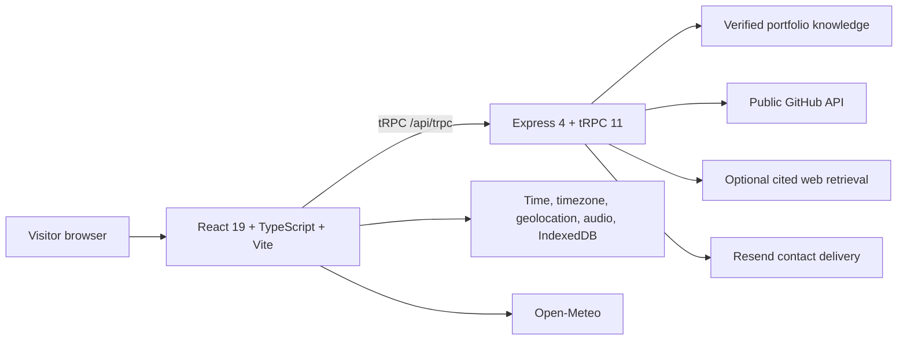

# Developer OS

> A Windows 11-inspired developer portfolio that turns Bharani Kumar S’s verified work, projects, skills, and public developer presence into an interactive desktop experience for the web.

[](https://github.com/vincenzo-afk/Developer-OS/actions/workflows/ci.yml)
[](LICENSE)
[](https://www.typescriptlang.org/)
[](https://nodejs.org/)

[Repository](https://github.com/vincenzo-afk/Developer-OS) · [Demo](https://github.com/vincenzo-afk/Developer-OS) · [Report a bug](https://github.com/vincenzo-afk/Developer-OS/issues/new?template=bug_report.yml) · [Request a feature](https://github.com/vincenzo-afk/Developer-OS/issues/new?template=feature_request.yml) · [Contributing](CONTRIBUTING.md)

## Contents

- [About the project](#about-the-project)
- [Showcase video](#showcase-video)
- [Tech stack](#tech-stack)
- [Getting started](#getting-started)
- [Usage](#usage)
- [API reference](#api-reference)
- [Project structure](#project-structure)
- [Features and roadmap](#features-and-roadmap)
- [Testing](#testing)
- [Deployment](#deployment)
- [Contributing](#contributing)
- [Security](#security)
- [License](#license)
- [Acknowledgments](#acknowledgments)

---

## <a name="about-the-project"></a>About the project

Developer OS is a public portfolio application for **Bharani Kumar S** ([`vincenzo-afk`](https://github.com/vincenzo-afk)). It replaces a conventional portfolio page with familiar desktop conventions: an unlock screen, taskbar, Start menu, windows, Explorer, Settings, and an Edge-inspired browser workspace.

The project is a web application inspired by Windows desktop interaction patterns. It is **not an operating system** and is not affiliated with Microsoft. Portfolio claims are deliberately tied to the verified local record and public retrieval sources; when an external source cannot be reached, the interface shows an honest loading, unavailable, or fallback state instead of fabricating a result.

### Key capabilities

- Interactive desktop shell with draggable, minimizable, maximizable, and keyboard-accessible windows.
- Verified portfolio workspace for repositories, technologies, achievements, social links, and project navigation.
- Windows Search opened with **Ctrl/Cmd + K**, with results for installed applications and verified repositories.
- Explorer workspace with sortable list, grid, and detail views, local pins, bounded recent projects, and reset behavior.
- Edge-inspired browser workspace with direct URL/search entry, supported YouTube navigation, local bookmarks, and restorable tabs.
- Safe terminal aliases that route to verified projects without executing visitor-supplied shell commands.
- Browser-local personalization for wallpaper, accent, theme, taskbar, icon size, text size, sound, and motion preferences.
- Live GitHub and weather states with explicit opt-in geolocation and unavailable states.
- Fact-grounded Portfolio Assistant with local evidence, public GitHub retrieval, cited responses, and resilient fallbacks.
- Validated, rate-limited contact delivery through Resend with the visitor address used only as `Reply-To`.

### Visual overview


The application’s verified portfolio record is maintained in [`client/src/lib/portfolioData.ts`](client/src/lib/portfolioData.ts). The assistant knowledge boundary is maintained in [`server/portfolioKnowledge.ts`](server/portfolioKnowledge.ts).

### Architecture



The local development runtime starts through `server/_core/index.ts`. The Vercel integration reuses the Express application through `api/index.ts` and `api/[...path].ts`, keeping serverless API routing separate from the Vite client build.

---

## <a name="showcase-video"></a>Showcase video

The repository includes a silent, 16-second HTML-authored showcase rendered to MP4. GitHub may vary in how it previews repository-hosted video, so the poster and direct file link are included as reliable fallbacks.

<video controls muted playsinline preload="metadata" poster="videos/developer-os-showcase/poster.jpg" width="100%">
  <source src="videos/developer-os-showcase/renders/developer-os-showcase.mp4" type="video/mp4">
  <a href="videos/developer-os-showcase/renders/developer-os-showcase.mp4">Download or open the Developer OS showcase video.</a>
</video>

[Open the MP4 directly](videos/developer-os-showcase/renders/developer-os-showcase.mp4) · [Edit the HyperFrames source](videos/developer-os-showcase/index.html) · [Read the storyboard](videos/developer-os-showcase/STORYBOARD.md)

The editable composition uses a local GSAP runtime at [`videos/developer-os-showcase/vendor/gsap.min.js`](videos/developer-os-showcase/vendor/gsap.min.js), a HyperFrames motion contract at [`index.motion.json`](videos/developer-os-showcase/index.motion.json), and a reproducibility manifest at [`package.json`](videos/developer-os-showcase/package.json). To validate or rerender it:

```bash
cd videos/developer-os-showcase
npm install
npm run check
npm run render
```

---

## <a name="tech-stack"></a>Tech stack

| Layer | Verified technologies and purpose |
|---|---|
| Frontend | React 19, TypeScript 5.9, Vite 7, Tailwind CSS 4, Radix UI, Wouter, TanStack Query, Framer Motion. |
| Backend | Node.js, Express 4, tRPC 11, Zod, and SuperJSON. |
| Data and persistence | Drizzle ORM, MySQL-compatible database support, browser `localStorage`, and IndexedDB for visitor personalization. |
| Integrations | GitHub public API, Open-Meteo, Resend, optional cited web retrieval, and managed runtime services when available. |
| Tooling | pnpm 10, Vitest 2, jsdom, TypeScript, esbuild, Prettier, and HyperFrames for the repository showcase video. |
| Deployment | Vercel configuration for Vite output plus Express-backed API functions. |

---

## <a name="getting-started"></a>Getting started

### Prerequisites

Install **Node.js 22 or newer** and **pnpm 10 or newer**. A Resend account and verified sending domain are needed only when enabling production contact delivery. Database, retrieval, authentication, and generative assistant credentials are optional and depend on the features enabled by the deployment target.

### Installation and local development

```bash
git clone https://github.com/vincenzo-afk/Developer-OS.git
cd Developer-OS
pnpm install
pnpm dev
```

The development server prints the local URL after startup.

### Environment configuration

Do not commit `.env`, `.env.local`, service tokens, database URLs, or sender credentials. Configure secrets in the host’s encrypted environment-variable settings.

| Variable | Purpose | Exposure |
|---|---|---|
| `RESEND_API_KEY` | Authenticates server-side contact delivery. | Server only |
| `RESEND_FROM_EMAIL` | Resend-verified sender identity. | Server only |
| `RESEND_TO_EMAIL` | Destination inbox for contact messages. | Server only |
| `TINYFISH_API_KEY` | Enables optional cited live-web retrieval. | Server only |
| `DATABASE_URL` | Enables database-backed template features. | Server only |
| `JWT_SECRET` | Supports session and authentication infrastructure. | Server only |
| `VITE_APP_ID` | Identifies the managed OAuth application when enabled. | Client-visible identifier |
| `OAUTH_SERVER_URL` | OAuth server endpoint when managed authentication is enabled. | Host-specific |
| `VITE_OAUTH_PORTAL_URL` | Browser URL for the OAuth portal when enabled. | Client-visible URL |
| `BUILT_IN_FORGE_API_URL` and `BUILT_IN_FORGE_API_KEY` | Platform-managed generative runtime values when supplied by the deployment environment. | Managed/server-side |

### Validation commands

```bash
pnpm check
pnpm test
pnpm build
```

`pnpm check` runs TypeScript without emitting files. `pnpm test` runs the Vitest suite. `pnpm build` produces the Vite client build and bundles the Node server entry.

---

## <a name="usage"></a>Usage

Unlock the desktop, open an application from the Start menu or desktop, and use the taskbar or task view to move between workspaces. The interface is designed to make the portfolio record feel explorable while keeping public claims bounded by the verified data model.

| Action | Result |
|---|---|
| **Ctrl/Cmd + K** | Opens Windows Search for installed apps and verified repositories. |
| Search result: application | Opens or focuses the selected desktop application. |
| Search result: repository | Sends the verified project record to the Edge-style browser workspace. |
| `open <project>` in Terminal | Opens the verified project in the browser workspace. |
| `explore <project>` in Terminal | Selects the verified project in Explorer. |
| Explorer **Reset workspace** | Removes browser-local recent and pinned project references. |

Local personalization and workspace history remain in the visitor’s browser. They do not change the public portfolio dataset or write visitor wallpaper files to the repository.

---

## <a name="api-reference"></a>API reference

The server exposes typed tRPC procedures through the `/api/trpc` route. The authoritative procedure definitions are in [`server/routers.ts`](server/routers.ts), while shared contracts are in [`shared/`](shared/). The Vercel entries at [`api/index.ts`](api/index.ts) and [`api/[...path].ts`](api/[...path].ts) reuse the same Express application.

| Surface | Location | Purpose |
|---|---|---|
| tRPC transport | `/api/trpc` | Typed client-server procedures used by the application. |
| Express application | `server/app.ts` | Shared local and serverless HTTP application factory. |
| Procedure definitions | `server/routers.ts` | Server-side portfolio, assistant, retrieval, contact, and related procedures. |
| Serverless entries | `api/index.ts`, `api/[...path].ts` | Vercel-compatible function exports without calling `listen()`. |

Provider credentials remain server-side. Contact delivery is validated and rate-limited; assistant messages are size-limited and fall back to verified local evidence when optional providers are unavailable.

---

## <a name="project-structure"></a>Project structure

```text
Developer-OS/
├── api/                         # Vercel serverless entry points
├── client/src/
│   ├── components/              # Portfolio, system, and UI components
│   ├── lib/                     # Data, desktop state, personalization, and helpers
│   └── pages/Home.tsx            # Main desktop shell
├── drizzle/                     # Database schema and migrations
├── server/
│   ├── app.ts                   # Shared Express application factory
│   ├── routers.ts               # tRPC procedures
│   ├── assistantRetrieval.ts    # GitHub and optional web evidence retrieval
│   └── portfolioKnowledge.ts     # Verified assistant knowledge corpus
├── shared/                      # Shared tRPC contracts and types
├── videos/developer-os-showcase/ # Editable showcase source and rendered MP4
├── .github/                     # CI, issue forms, and pull-request template
├── VERCEL_DEPLOYMENT.md         # Hosting configuration notes
├── vercel.json                  # Vercel routing and build configuration
└── package.json                 # Scripts and dependency manifest
```

---

## <a name="features-and-roadmap"></a>Features and roadmap

### Current capabilities

| Status | Capability |
|---|---|
| ✅ | Desktop shell, Start menu, taskbar, task view, snap layouts, system tray, and context menu. |
| ✅ | Verified portfolio data, repository records, technology stack, achievements, social links, and project navigation. |
| ✅ | Search, Explorer, browser workspace, terminal routing aliases, Settings, calculator, weather, and personalization. |
| ✅ | Public GitHub retrieval, cited evidence, honest unavailable states, and assistant fallback behavior. |
| ✅ | Resend contact delivery with validation, rate limiting, and server-only credentials. |
| ✅ | Vercel-compatible serverless API entries and a read-only GitHub Actions quality workflow. |
| ✅ | Editable HTML showcase source, motion assertions, local GSAP runtime, poster, and MP4 render. |

### Known limitations

The repository does not claim a permanent production URL until a deployment is completed and verified. External destinations that prevent embedding are handed off honestly rather than simulated inside the browser workspace. Generative assistant responses require an available provider; verified local answers and retrieval-based fallbacks remain available when one is not configured.

---

## <a name="testing"></a>Testing

The Vitest suite covers desktop workspace persistence, search and routing behavior, window interactions, data fallbacks, assistant retrieval and fallback behavior, contact configuration, and other deterministic helpers.

Run the same checks used by the repository’s CI workflow:

```bash
pnpm check
pnpm test
pnpm build
```

GitHub Actions runs on pushes and pull requests targeting `main`. The workflow installs dependencies with `pnpm install --frozen-lockfile`, performs the TypeScript check, runs Vitest, and builds the production bundle with read-only repository permissions.

For the video artifact, run `npm run check` and `npm run render` from `videos/developer-os-showcase/` after installing its local HyperFrames development dependency.

---

## <a name="deployment"></a>Deployment

Developer OS includes Vercel configuration for a Vite client build and Express-backed API functions. A static-only host can render the desktop interface, but it cannot safely deliver Resend email or protect server-side provider credentials.

1. Import `vincenzo-afk/Developer-OS` into a Node-compatible host such as Vercel.
2. Configure the encrypted environment variables required by the features you intend to enable.
3. Use `pnpm build` as the build command.
4. Confirm that `/api/trpc` is reachable before advertising assistant or contact capabilities.

See [`VERCEL_DEPLOYMENT.md`](VERCEL_DEPLOYMENT.md) for serverless routing and environment-scoping notes.

---

## <a name="contributing"></a>Contributing

Contributions are welcome when they preserve factual accuracy, the project’s truthful-data boundary, accessible desktop interaction patterns, and the existing technology choices. Read [`CONTRIBUTING.md`](CONTRIBUTING.md) before opening an issue or pull request.

Use focused branches such as `fix/explorer-selection` or `feat/desktop-search-filter`. Before requesting review, run `pnpm check`, `pnpm test`, and `pnpm build`, then document user-visible changes, test coverage, documentation changes, breaking changes, and security or privacy impact.

---

## <a name="security"></a>Security

For a private vulnerability report, follow [`SECURITY.md`](SECURITY.md). Do not post credentials, access tokens, email keys, private URLs, or security-sensitive reproduction details in public issues. Provider credentials are kept server-side, tRPC inputs are validated, assistant messages are bounded, contact delivery is rate-limited, and environment files are excluded from version control.

---

## <a name="license"></a>License

Developer OS is released under the [MIT License](LICENSE). Copyright (c) 2026 BHARANI KUMAR S.

---

## <a name="acknowledgments"></a>Acknowledgments

Developer OS is maintained by [Bharani Kumar S (`vincenzo-afk`)](https://github.com/vincenzo-afk). The project builds on React, Vite, Tailwind CSS, Radix UI, Express, tRPC, Drizzle ORM, Vitest, Vercel, and the other dependencies recorded in [`package.json`](package.json).

The showcase video is authored as editable HTML with HyperFrames and GSAP. Its source, storyboard, motion assertions, poster, and rendered MP4 are kept together under [`videos/developer-os-showcase/`](videos/developer-os-showcase/).

[Back to top](#developer-os)
