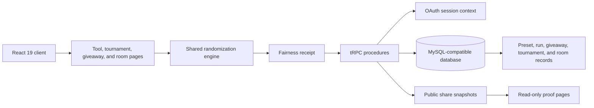

# FortunoGen

> **Transparent randomization tools for decisions, draws, tournaments, and shared rooms—each outcome carries a receipt.**

[](https://github.com/vincenzo-afk/FortunoGen/actions/workflows/ci.yml)
[](./LICENSE)
[](https://react.dev/)
[](https://www.typescriptlang.org/)

[Explore the app](#usage) · [Report a bug](https://github.com/vincenzo-afk/FortunoGen/issues) · [Request a feature](https://github.com/vincenzo-afk/FortunoGen/issues) · [Contribute](./CONTRIBUTING.md)

---

## Table of contents

- [About](#about)
- [Capabilities](#capabilities)
- [Architecture](#architecture)
- [Technology](#technology)
- [Getting started](#getting-started)
- [Usage](#usage)
- [Project structure](#project-structure)
- [Testing and quality checks](#testing-and-quality-checks)
- [Deployment](#deployment)
- [Roadmap and limitations](#roadmap-and-limitations)
- [Contributing](#contributing)
- [Security](#security)
- [License](#license)

---

## About

FortunoGen is a full-stack web application for making random decisions without hiding how they were made. It combines a responsive, Memphis-inspired interface with a shared randomization engine, authenticated persistence, immutable audit records, and read-only public proof pages.

Every completed draw records its algorithm, entropy or seed reference, timestamp, weighting model, replacement rule, eligible probabilities, and replay guidance. Fresh-entropy outcomes remain distinct events; seeded configurations can be reproduced with the same input and seed.

### Capabilities

| Area | Included behavior |
|---|---|
| Decision tools | Lucky Wheel, Number Studio, Coin Toss, Dice Lab, Card Drawer, List & Teams, and compact password, color, date, and prompt utilities. |
| Fairness receipts | Equal or weighted selection, secure fresh entropy, seeded replay, replacement rules, exclusions, shuffling, and normalized probability metadata. |
| Private workspace | Authenticated presets, pinned and duplicated configurations, JSON import/export, outcome history, and one-click setup reopening. |
| Giveaways | Participant parsing, configurable rules, privacy-aware winner display, append-only audit events, and published proof records. |
| Tournament Studio | Seeded single-elimination brackets, recorded automatic byes, fair match resolution, champion tracking, and public bracket proofs. |
| Live Room Studio | Authenticated invitation rooms, participant membership, host-only equal-odds draws, append-only event feeds, and labeled five-second periodic refresh on the free hosting model. |

## Architecture



The browser uses React and Wouter for the interface. Express hosts typed tRPC procedures, while Drizzle ORM persists user-owned records to a MySQL-compatible database. Shared domain modules keep randomization, giveaway, tournament, and live-room proof behavior testable outside the browser.

## Technology

| Layer | Verified implementation |
|---|---|
| Client | React 19, Vite 7, TypeScript 5.9, Tailwind CSS 4, Wouter 3, TanStack Query 5, Lucide React. |
| Server | Express 4, tRPC 11, Zod 4, SuperJSON. |
| Persistence | Drizzle ORM 0.44, MySQL2, generated Drizzle migrations. |
| Authentication | Manus OAuth integration supplied through the starter runtime. |
| Testing | Vitest 2, Testing Library React, JSDOM. |
| Tooling | pnpm, tsx, esbuild, Prettier, Drizzle Kit. |

## Getting started

### Prerequisites

Install Node.js and pnpm. The repository declares pnpm 10 in `package.json`. A MySQL-compatible database and the OAuth/runtime environment variables listed below are required for authenticated and persisted flows.

### Install and run

```bash
git clone https://github.com/vincenzo-afk/FortunoGen.git
cd FortunoGen
pnpm install
pnpm dev
```

The development script runs `NODE_ENV=development tsx watch server/_core/index.ts`.

### Configuration

Do not commit `.env` files. The application runtime reads the following variables directly or through its core environment layer.

| Variable | Purpose |
|---|---|
| `DATABASE_URL` | MySQL-compatible connection string used by Drizzle. |
| `JWT_SECRET` | Session-signing secret. |
| `OAUTH_SERVER_URL` | OAuth server base URL. |
| `VITE_APP_ID` | Client OAuth application identifier. |
| `OWNER_OPEN_ID` | Owner identity used for the built-in admin role assignment. |
| `BUILT_IN_FORGE_API_URL` | Base URL for configured runtime services. |
| `BUILT_IN_FORGE_API_KEY` | Server-side credential for configured runtime services. |

### Database changes

Update `drizzle/schema.ts`, generate the migration, review the SQL, and apply it through the database workflow appropriate to the deployment environment.

```bash
pnpm drizzle-kit generate
pnpm db:push
```

## Usage

FortunoGen does not require an account for the core tools. Open a generator from the landing page, configure its inputs, run the draw, and inspect the receipt beneath the result.

| Workflow | Starting route | Result |
|---|---|---|
| Make a decision | `/tools/wheel`, `/tools/numbers`, `/tools/coin`, `/tools/dice`, `/tools/cards`, `/tools/teams`, or `/tools/utilities` | A result with fairness metadata and replay guidance. |
| Reuse a setup | `/library` | Authenticated users can save, import, export, pin, duplicate, and reopen tool configurations. |
| Run a giveaway | `/giveaways/new` | A private participant list, audited selection, privacy-aware winner display, and optional public proof. |
| Run a tournament | `/tournaments` | A seeded bracket with recorded byes, fair match decisions, advancement, and optional published bracket proof. |
| Host a room | `/rooms` | An authenticated invitation room whose state refreshes every five seconds on the free hosting model. |

### Fairness model

Fresh draws use `globalThis.crypto.getRandomValues` when available and record a non-secret entropy reference. Seeded replay uses a deterministic Mulberry32 sequence derived from a stable string hash. A receipt exposes the configuration needed to understand the selection, not a cryptographic random stream.

## Project structure

```text
FortunoGen/
├── client/                  # React application, pages, components, styles, and client helpers
├── server/                  # Express/tRPC procedures, database helpers, and OAuth runtime integration
│   └── routers/             # Preset, giveaway, tournament, and live-room procedures
├── shared/                  # Testable randomization and domain modules
├── drizzle/                 # Drizzle schema, snapshots, and generated SQL migrations
├── .github/                 # Continuous integration and contribution templates
├── package.json             # Verified scripts and dependency manifest
└── README.md                # Project documentation
```

## Testing and quality checks

Run all quality checks before opening a pull request or publishing a deployment.

```bash
pnpm check
pnpm test
pnpm build
```

The Vitest suite covers randomization edge cases, deterministic replay, ownership and public-share rules, giveaway privacy, tournament advancement, live-room event shaping, browser workflows, accessibility focus behavior, and reduced-motion animation safeguards.

GitHub Actions runs the same type check, test suite, and production build on pushes and pull requests targeting `main`.

## Deployment

The production build emits browser assets and the Express entry point into `dist/`.

```bash
pnpm build
pnpm start
```

Provide the required database, OAuth, session, and runtime variables in the deployment environment. This repository does not include a Dockerfile or provider-specific deployment configuration.

## Roadmap and limitations

### Shipped

- [x] Transparent randomization tools and fairness receipts.
- [x] Authenticated presets and replayable history.
- [x] Giveaway, tournament, public-proof, and free periodic-refresh live-room workflows.
- [x] Responsive light, dark, and system themes with reduced-motion safeguards.

### Current constraints

The current tournament workflow is single-elimination, with automatic byes recorded in the bracket audit. Live rooms are designed for periodic five-second refresh rather than a persistent push transport, and the repository does not provide a Dockerfile or a provider-specific deployment manifest.

## Contributing

Contributions are welcome. Read [CONTRIBUTING.md](./CONTRIBUTING.md) for local setup, validation commands, database migration expectations, branch naming, and pull-request guidance.

## Security

Do not publish credentials, participant data, database exports, or active room invitation codes in issues or pull requests. Report a potential vulnerability through [private vulnerability reporting](https://github.com/vincenzo-afk/FortunoGen/security/advisories/new) before opening a public issue. The application uses authenticated server procedures for user-owned data and keeps giveaway participant payloads out of public proof snapshots. See [SECURITY.md](./SECURITY.md) for the disclosure policy.

## License

FortunoGen is licensed under the [MIT License](./LICENSE). Copyright © 2026 vincenzo-afk.

---

Built and maintained by [vincenzo-afk](https://github.com/vincenzo-afk). [Back to top](#fortunogen)
