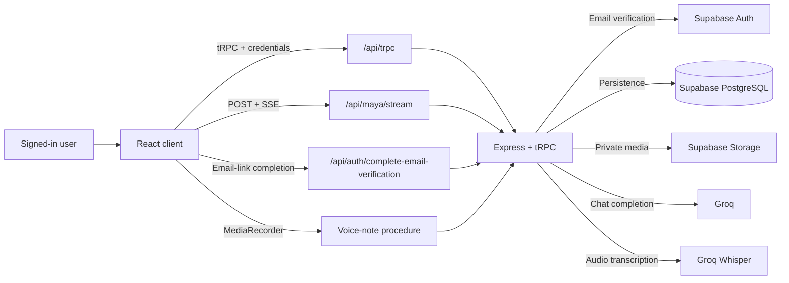

# MAYA

> A private AI companion web app for emotionally aware conversation, voice notes, memories, shared activities, and gentle continuity.

[](https://github.com/vincenzo-afk/MAYA/actions/workflows/ci.yml)
[](https://react.dev/)
[](https://www.typescriptlang.org/)
[](./package.json)

[Live demo: not configured](#deployment) · [Getting started](#getting-started) · [Report a bug](https://github.com/vincenzo-afk/MAYA/issues) · [Request a feature](https://github.com/vincenzo-afk/MAYA/issues/new)

---

## <a name="table-of-contents"></a>Table of Contents

- [About the Project](#about-the-project)
- [Tech Stack](#tech-stack)
- [Getting Started](#getting-started)
- [Usage](#usage)
- [API Reference](#api-reference)
- [Project Structure](#project-structure)
- [Features and Roadmap](#features-and-roadmap)
- [Testing](#testing)
- [Deployment](#deployment)
- [Contributing](#contributing)
- [Security](#security)
- [License](#license)
- [Acknowledgments](#acknowledgments)
- [Support](#support)

---

## <a name="about-the-project"></a>About the Project

MAYA is a full-stack companion web application designed for private, ongoing conversations. A signed-in user can chat with Maya in English or Hinglish, receive streamed replies, record voice notes for server-side transcription, use browser voice-call mode, play activities, co-watch a YouTube video, and preserve relevant personal context over time. The application presents Maya as an artificial-intelligence companion rather than a human, a conscious being, or a substitute for professional care. [1] [2]

The experience is user-scoped. Messages, memories, mood entries, daily check-ins, preferences, relationship context, game sessions, and YouTube co-watch sessions are persisted against the authenticated user record. [3] [4]

### Key capabilities

| Area            | Capability                                                                                                                                |
| --------------- | ----------------------------------------------------------------------------------------------------------------------------------------- |
| Conversation    | Streamed text responses over Server-Sent Events (SSE), emotion labeling, English/Hinglish-friendly prompting, and persisted history.      |
| Continuity      | Durable memory candidates for personal facts, relationship context, recurring mood, and meaningful topics.                                |
| Voice           | Voice-note recording and server-side transcription, browser speech synthesis, and browser speech-recognition call mode where supported.   |
| Expression      | Emoji reactions, GIFs, and stickers inside the private conversation.                                                                      |
| Activities      | Chess, Sudoku, tic-tac-toe, Ludo, Snakes & Ladders, Connect Four, 2048, Would You Rather, brainteasers, math, calendar, and a voice game. |
| Co-watching     | YouTube URL sessions with optional titles and notes, embedded through the `youtube-nocookie` domain.                                      |
| Account privacy | Passwordless Supabase email verification, a first-party signed session cookie, and user-scoped server procedures.                         |

> **Companion boundary:** Maya’s prompt discloses that she is AI when asked, avoids claims of physical life or consciousness, and directs crisis content toward local emergency support and trusted people. [2]

### Architecture overview

The React client communicates with the Express server through the tRPC transport at `/api/trpc`. Text chat uses the authenticated `POST /api/maya/stream` endpoint, which sends incremental SSE events and persists the completed response. Email verification is handled by Supabase, while the server maintains a first-party signed session cookie. Runtime persistence and private media storage use Supabase; Groq supplies chat completion and voice-note transcription. [1] [4] [5]



### Conversation lifecycle

1. The client submits a message to the authenticated stream endpoint.
2. The server authenticates the signed session, stores the user message, and assembles context from recent messages, memories, and relationship state.
3. Groq response deltas are relayed to the browser as SSE `delta` events.
4. The server stores Maya’s completed reply, records emotion and mood context, updates relationship state, and saves eligible memory candidates. [2] [4]

---

## <a name="tech-stack"></a>Tech Stack

| Layer                | Technologies verified in the repository                                                                                                                                               |
| -------------------- | ------------------------------------------------------------------------------------------------------------------------------------------------------------------------------------- |
| Frontend             | React **19.2.1**, React DOM **19.2.1**, TypeScript **5.9.3**, Vite **7.1.7**, Wouter **3.3.5**, TanStack React Query **5.90.2**, Tailwind CSS **4.1.14**, Framer Motion **12.23.22**. |
| Backend              | Node.js, Express **4.21.2**, tRPC **11.6.0**, Zod **4.1.12**, SuperJSON **1.13.3**, and TSX **4.19.1**.                                                                               |
| Database and storage | Supabase PostgreSQL and Supabase Storage at runtime; Drizzle ORM **0.44.5** and Drizzle Kit **0.31.4** for the tracked schema and migration history.                                  |
| AI and media         | Groq chat completion and Groq Whisper-compatible transcription through server-side adapters; browser `SpeechSynthesis` and `SpeechRecognition` for supported voice features.          |
| Activities           | Chess.js **1.4.0** for chess rules; the remaining activities are implemented in the client and server activity utilities.                                                             |
| Quality              | Vitest **2.1.4**, the TypeScript compiler, Prettier **3.6.2**, and GitHub Actions continuous integration.                                                                             |
| Deployment           | Render Node web service defined in [`render.yaml`](./render.yaml).                                                                                                                    |

The package manager is pinned to `pnpm@10.4.1`. [6]

---

## <a name="getting-started"></a>Getting Started

### Prerequisites

You need a current Node.js release compatible with the project’s TypeScript and Vite toolchain, plus `pnpm@10.4.1`. The repository does not declare a Node.js `engines` range. Runtime use requires a Supabase project and a Groq API key. Database migration commands additionally require a PostgreSQL connection string. [6] [7]

### Installation

```bash
git clone https://github.com/vincenzo-afk/MAYA.git
cd MAYA
pnpm install --frozen-lockfile
```

### Configuration

Create environment variables in the local development environment or your deployment provider. Do not commit real credentials.

| Variable                         | Purpose                                                                                                    | Required                         |
| -------------------------------- | ---------------------------------------------------------------------------------------------------------- | -------------------------------- |
| `SUPABASE_URL`                   | Server-side Supabase project URL for Auth, database access, and storage.                                   | Runtime                          |
| `SUPABASE_SECRET_KEY`            | Server-only Supabase secret key. Never expose it to the browser.                                           | Runtime                          |
| `VITE_SUPABASE_URL`              | Browser-visible Supabase project URL used while completing an email-link session.                          | Client auth                      |
| `VITE_SUPABASE_PUBLISHABLE_KEY`  | Browser-visible Supabase publishable key used by the email-link completion flow.                           | Client auth                      |
| `GROQ_API_KEY`                   | Server-only credential for Maya responses and voice-note transcription.                                    | Runtime AI features              |
| `JWT_SECRET`                     | Secret used to sign the first-party Maya session cookie.                                                   | Runtime                          |
| `OWNER_OPEN_ID`                  | Supabase user identifier eligible for the owner/admin role during user upsert.                             | Runtime authorization            |
| `DATABASE_URL`                   | PostgreSQL connection string consumed by Drizzle commands.                                                 | `pnpm db:push`                   |
| `PORT`                           | Preferred HTTP port; the server searches from this value through the next 19 ports.                        | Optional; defaults to `3000`     |
| `NODE_ENV`                       | Selects Vite middleware in development and static serving in production.                                   | Optional; package scripts set it |
| `RUN_EXTERNAL_CREDENTIAL_CHECK`  | Set to `1` to enable the live Groq and Supabase credential test.                                           | Optional test flag               |
| `RUN_EXTERNAL_CREDENTIAL_CHECKS` | Set to `true` to enable the live browser-facing Supabase configuration test.                               | Optional test flag               |
| `VITE_ANALYTICS_ENDPOINT`        | Optional Umami analytics server endpoint inserted into the client HTML.                                    | Optional analytics value         |
| `VITE_ANALYTICS_WEBSITE_ID`      | Optional Umami website identifier inserted into the client HTML.                                           | Optional analytics value         |
| `BUILT_IN_FORGE_API_URL`         | Loaded by the shared environment compatibility map; it is not required by the active Maya email-auth flow. | Optional compatibility value     |
| `BUILT_IN_FORGE_API_KEY`         | Loaded by the shared environment compatibility map; keep it server-side if configured.                     | Optional compatibility value     |

The `VITE_` variables are included in the browser bundle and must therefore contain only publishable values. [1] [5] [7] [8]

### Database migrations

The repository tracks PostgreSQL schema and Drizzle migrations. With a valid `DATABASE_URL`, run:

```bash
pnpm db:push
```

The runtime data-access layer uses Supabase’s server client and the tables defined in [`drizzle/schema.ts`](./drizzle/schema.ts). [3] [7]

### Run the development server

```bash
pnpm dev
```

The development script runs `tsx watch server/_core/index.ts`. The server prefers port `3000` and selects an available port within the next 20-port range when necessary. [1] [6]

---

## <a name="usage"></a>Usage

### Sign in and start a conversation

1. Run `pnpm dev` and open the local URL printed by the server.
2. Enter an email address in the Maya sign-in screen.
3. Open the passwordless verification link sent by Supabase.
4. Send a message. Maya streams the reply and stores the completed conversation in the signed-in account.

### Voice features

| Feature    | User flow                                                                                                    | Requirements and limits                                                                           |
| ---------- | ------------------------------------------------------------------------------------------------------------ | ------------------------------------------------------------------------------------------------- |
| Voice note | Record audio, upload it, transcribe it on the server, and receive Maya’s reply.                              | Microphone permission, Supabase Storage, Groq transcription, and a payload below 16 MB.           |
| Voice call | Start the browser call interface; speech recognition captures input and speech synthesis reads Maya’s reply. | Browser support for `SpeechRecognition` or `webkitSpeechRecognition`, plus microphone permission. |
| Voice game | Use the activity prompt and speak when the game requests input.                                              | Browser speech-recognition support.                                                               |

Speech recognition is not available in every browser. The client displays a fallback when the capability is missing. [9]

### Activities and co-watching

Open the activities drawer to choose a game, a prompt-based activity, the voice game, or YouTube co-watching. Game progress is saved through the authenticated `maya.saveGameSession` procedure. For co-watching, provide a valid YouTube URL, optionally add a title and notes, and save the session through `maya.saveYoutubeSession`. [10] [11]

---

## <a name="api-reference"></a>API Reference

The application exposes an Express HTTP surface and a tRPC API. Protected procedures require the first-party session cookie created after Supabase email verification. The repository does not expose an unauthenticated public REST API for companion data. [1] [4] [5]

### Express routes

| Method | Path                                    | Authentication               | Description                                                                                                                              |
| ------ | --------------------------------------- | ---------------------------- | ---------------------------------------------------------------------------------------------------------------------------------------- |
| `POST` | `/api/auth/request-email-verification`  | Public                       | Accepts `{ "email": "person@example.com" }`, validates and normalizes the address, and requests a Supabase email link.                   |
| `POST` | `/api/auth/complete-email-verification` | Access token in request body | Accepts `{ "accessToken": "..." }`, validates the Supabase user, sets the signed Maya session cookie, and returns `{ "success": true }`. |
| `POST` | `/api/maya/stream`                      | First-party Maya session     | Accepts `{ "content": "..." }` with 1–4,000 characters and streams `user`, `delta`, `done`, or `error` SSE events.                       |
| `GET`  | `/manus-storage/*`                      | Server-side storage access   | Redirects to a signed storage URL for the requested key.                                                                                 |

Example email-link request:

```bash
curl -X POST http://localhost:3000/api/auth/request-email-verification \
  -H 'Content-Type: application/json' \
  --data '{"email":"person@example.com"}'
```

Example streaming request after completing sign-in in the same browser session:

```bash
curl -N -X POST http://localhost:3000/api/maya/stream \
  -H 'Content-Type: application/json' \
  --data '{"content":"Hello, Maya"}'
```

### tRPC procedures

The client calls these procedures through `/api/trpc`.

| Procedure                                            | Operation | Authentication | Purpose                                                                            |
| ---------------------------------------------------- | --------- | -------------- | ---------------------------------------------------------------------------------- |
| `auth.me`                                            | Query     | Public         | Returns the authenticated user or `null`.                                          |
| `auth.logout`                                        | Mutation  | Public         | Clears the Maya session cookie.                                                    |
| `maya.bootstrap`                                     | Query     | Protected      | Loads recent messages, preferences, mood, daily check-ins, and relationship state. |
| `maya.sendMessage`                                   | Mutation  | Protected      | Stores a message and returns Maya’s non-streamed reply and emotion data.           |
| `maya.processVoiceNote`                              | Mutation  | Protected      | Stores, transcribes, and responds to a recorded voice note.                        |
| `maya.setReaction`                                   | Mutation  | Protected      | Toggles an emoji reaction on a user-owned message.                                 |
| `maya.sendMedia`                                     | Mutation  | Protected      | Stores a validated GIF or sticker message.                                         |
| `maya.memories` / `maya.mood` / `maya.dailyCheckIns` | Query     | Protected      | Reads user-scoped companion history.                                               |
| `maya.openDailyCheckIn`                              | Mutation  | Protected      | Opens or returns a daily check-in for a `YYYY-MM-DD` date.                         |
| `maya.preferences`                                   | Query     | Protected      | Reads the user’s theme and voice-style preferences.                                |
| `maya.updatePreferences`                             | Mutation  | Protected      | Updates theme, voice-style index, and optional display photo.                      |
| `maya.setCompanionTone`                              | Mutation  | Protected      | Selects one of the supported companion tones.                                      |
| `maya.saveGameSession`                               | Mutation  | Protected      | Persists supported activity state and an optional result.                          |
| `maya.saveYoutubeSession`                            | Mutation  | Protected      | Persists a YouTube co-watch URL, title, and notes.                                 |

Inputs are validated with Zod. The exact contracts are implemented in [`server/routers/maya.ts`](./server/routers/maya.ts). [5]

### Validation limits

| Input               | Limit or accepted values                                                                                                                             |
| ------------------- | ---------------------------------------------------------------------------------------------------------------------------------------------------- |
| Text message        | 1–4,000 trimmed characters.                                                                                                                          |
| Voice-note data URL | 32–15,000,000 characters at the procedure boundary; decoded audio must be below 16 MB.                                                               |
| Reaction            | A positive integer message ID and an emoji string of 1–8 characters.                                                                                 |
| Voice style         | Integer from 0 through 9.                                                                                                                            |
| Theme               | `violet`, `rose`, `ocean`, or `sunset`.                                                                                                              |
| Companion tone      | `soft and reassuring`, `playful and cheeky`, `honest and direct`, or `quiet and spacious`.                                                           |
| Game type           | `chess`, `sudoku`, `ticTacToe`, `brainteaser`, `math`, `calendar`, `voice`, `ludo`, `snakesLadders`, `connectFour`, `game2048`, or `wouldYouRather`. |

---

## <a name="project-structure"></a>Project Structure

<details>
<summary>View the main application structure</summary>

```text
MAYA/
├── client/
│   └── src/
│       ├── components/
│       │   ├── MayaCompanion.tsx     # Main signed-in companion experience
│       │   ├── MayaActivities.tsx    # Games and YouTube co-watch
│       │   └── ui/                   # Shared UI primitives
│       ├── pages/Home.tsx            # Home route
│       ├── main.tsx                  # React Query and tRPC bootstrap
│       └── index.css                 # Global visual system
├── drizzle/
│   ├── schema.ts                     # PostgreSQL/Drizzle schema
│   └── 000*.sql                      # Committed migrations
├── server/
│   ├── _core/
│   │   ├── index.ts                  # Express server and HTTP routes
│   │   ├── emailAuth.ts              # Supabase email-link routes
│   │   ├── sdk.ts                    # Signed email-session verification
│   │   └── voiceTranscription.ts     # Server-side transcription adapter
│   ├── routers/maya.ts               # Protected companion procedures
│   ├── db.ts                          # Supabase data-access helpers
│   ├── mayaBrain.ts                   # Prompt, memory, mood, and streaming logic
│   └── *.test.ts                      # Vitest specifications
├── shared/                            # Shared constants and errors
├── .github/workflows/ci.yml           # Type-check, test, and build workflow
├── package.json                        # Scripts and dependencies
├── render.yaml                         # Render deployment service
└── vitest.config.ts                    # Test-runner configuration
```

</details>

---

## <a name="features-and-roadmap"></a>Features and Roadmap

### Implemented

- ✅ Passwordless Supabase email-link sign-in with a signed first-party session cookie.
- ✅ User-scoped messages, memories, mood logs, daily check-ins, preferences, relationship state, activity sessions, and YouTube sessions.
- ✅ Streamed emotional text chat with persisted context.
- ✅ Server-side voice-note transcription and private media storage.
- ✅ Browser voice-call mode and ten playback-style presets.
- ✅ Emoji reactions, GIFs, and stickers.
- ✅ Chess, Sudoku, tic-tac-toe, Ludo, Snakes & Ladders, Connect Four, 2048, Would You Rather, brainteasers, math, calendar, and voice activities.
- ✅ YouTube co-watch sessions with optional notes.
- ✅ Automated type-check, test, and production-build validation through GitHub Actions.

### Known limitations

Browser speech recognition is not universal. A live demo URL is not declared in the repository, and the deployment manifest is configured for Render rather than a platform-independent container. The repository does not contain a Dockerfile or Kubernetes configuration. [12]

### Roadmap

The repository contains [`game-expansion-plan.md`](./game-expansion-plan.md), which records planned activity, persistence, safety, testing, and release work. Future work should preserve authenticated user scoping, deterministic activity behavior, and the companion safety boundary.

---

## <a name="testing"></a>Testing

Install dependencies and run the repository’s validation commands:

```bash
pnpm check
pnpm test
pnpm build
```

The project uses Vitest for unit and integration-oriented server tests. The default test command does not call live external credentials. To run the optional credential checks, configure the required services and set the relevant flags:

```bash
RUN_EXTERNAL_CREDENTIAL_CHECK=1 pnpm test server/externalCredentials.test.ts
RUN_EXTERNAL_CREDENTIAL_CHECKS=true pnpm test server/supabasePublicConfig.test.ts
```

Format source files with:

```bash
pnpm format
```

The GitHub Actions workflow runs `pnpm check`, `pnpm test`, and `pnpm build` on pushes and pull requests targeting `main`. [13]

---

## <a name="deployment"></a>Deployment

The repository includes a Render web-service manifest at [`render.yaml`](./render.yaml). It uses the following commands:

```bash
pnpm install --frozen-lockfile && pnpm build
pnpm start
```

The production build creates the Vite client output and bundles the Express entrypoint into `dist`. The production server serves the built client and APIs from the same Node process. The Render manifest health-checks `/`, auto-deploys, and requests the production secrets as environment variables. [1] [12]

For another Node hosting provider, configure the same build and start commands, provide the runtime variables listed in [Configuration](#configuration), and expose the selected `PORT`. Run `pnpm db:push` separately wherever schema migrations are managed.

---

## <a name="contributing"></a>Contributing

Contributions are welcome when they preserve typed inputs, authenticated user scoping, privacy boundaries, and the documented companion behavior.

1. Create a focused branch using a prefix such as `feat/`, `fix/`, `docs/`, or `chore/`.
2. Install dependencies with `pnpm install --frozen-lockfile`.
3. Add or update tests when application logic changes.
4. Run `pnpm check`, `pnpm test`, and `pnpm build`.
5. Use an imperative Conventional Commit-style message, such as `feat: add mood journal filters`.
6. Open a pull request describing user impact, validation performed, documentation changes, migration requirements, and security considerations.

See [`CONTRIBUTING.md`](./CONTRIBUTING.md) for the complete workflow and [`CODE_OF_CONDUCT.md`](./CODE_OF_CONDUCT.md) for community expectations.

---

## <a name="security"></a>Security

MAYA uses Supabase email-link verification for identity and protects companion procedures with the server’s `protectedProcedure` middleware. The server verifies the Supabase access token, upserts the user, and issues a signed first-party session cookie. Procedure inputs are validated with Zod, user-owned database operations include the authenticated user ID, and voice-note payloads are limited before transcription. [4] [5] [8]

Keep Supabase secret keys, Groq keys, database URLs, and `JWT_SECRET` in managed environment settings. Never commit credentials, session secrets, or private user content. To report a vulnerability, follow [`SECURITY.md`](./SECURITY.md) and use GitHub’s private vulnerability-reporting path for this repository when available. Do not publish sensitive reproduction details in a public issue.

---

## <a name="license"></a>License

The package manifest declares the project under the **MIT License**. A standalone `LICENSE` file is not currently included, so add the full MIT license text and copyright notice before distributing a formal public release. [6]

---

## <a name="acknowledgments"></a>Acknowledgments

MAYA is built on the React, Express, tRPC, Supabase, Drizzle, Vitest, Tailwind CSS, Chess.js, and Groq ecosystems used by the codebase. The project’s GitHub repository is maintained by [vincenzo-afk](https://github.com/vincenzo-afk).

---

## <a name="support"></a>Support

Use [GitHub Issues](https://github.com/vincenzo-afk/MAYA/issues) for reproducible bugs and feature requests. For security-sensitive reports, follow [`SECURITY.md`](./SECURITY.md) instead of opening a public issue.

<p align="center">
  <a href="#maya">Back to top</a> ·
  <a href="https://github.com/vincenzo-afk/MAYA">GitHub</a> ·
  <a href="https://github.com/vincenzo-afk/MAYA/issues">Issues</a>
</p>

<p align="center">Built with care by <strong>vincenzo-afk</strong>.</p>

## Code References

[1]: ./server/_core/index.ts
[2]: ./server/mayaBrain.ts
[3]: ./drizzle/schema.ts
[4]: ./server/_core/emailAuth.ts
[5]: ./server/routers/maya.ts
[6]: ./package.json
[7]: ./drizzle.config.ts
[8]: ./server/_core/sdk.ts
[9]: ./client/src/components/MayaCompanion.tsx
[10]: ./client/src/components/MayaActivities.tsx
[11]: ./server/db.ts
[12]: ./render.yaml
[13]: ./.github/workflows/ci.yml
