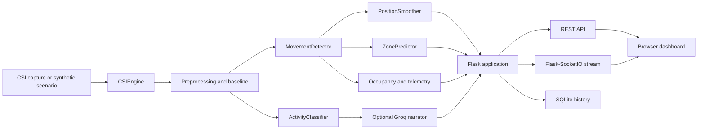

# WIFI-based-human-presence-detection-system

> **A camera-free WiFi CSI dashboard for real-time human presence, occupancy, zone, and activity analysis.**

[](LICENSE)
[](https://www.python.org/)
[](https://flask.palletsprojects.com/)
[](https://flask-socketio.readthedocs.io/)

**Repository:** [vincenzo-afk/WIFI-based-human-presence-detection-system](https://github.com/vincenzo-afk/WIFI-based-human-presence-detection-system)<br>
**License:** [Apache License 2.0](LICENSE)<br>
**Issue tracker:** [GitHub Issues](https://github.com/vincenzo-afk/WIFI-based-human-presence-detection-system/issues)

## <a name="table-of-contents"></a>Table of Contents

- [About the Project](#about-the-project)
- [Tech Stack](#tech-stack)
- [Getting Started](#getting-started)
- [Usage](#usage)
- [API Reference](#api-reference)
- [Project Structure](#project-structure)
- [Features and Limitations](#features-and-limitations)
- [Testing](#testing)
- [Deployment](#deployment)
- [Contributing](#contributing)
- [Security](#security)
- [License](#license)
- [Acknowledgments](#acknowledgments)
- [Footer](#footer)

---

## <a name="about-the-project"></a>About the Project

This repository contains a local web application that analyzes WiFi Channel State Information (CSI) amplitude data to estimate whether movement is present, identify a coarse left/center/right zone, estimate occupancy, classify activity, and stream the resulting telemetry to a browser dashboard. The server can replay synthetic scenarios by default, which makes the interface usable without a CSI capture file or dedicated sensing hardware.

The processing pipeline is implemented in Python. It normalizes CSI frames, maintains an empty-room baseline, calculates movement and zone features, smooths the signal, classifies activity, predicts zone transitions, logs events to SQLite, and optionally uses Groq for label validation and situation reports. The browser receives live frames through Flask-SocketIO and renders the radar-style interface in `frontend/`.

### Key capabilities

- **Presence and movement estimation** from CSI amplitude frames.
- **Coarse zone analysis** across `LEFT`, `CENTER`, and `RIGHT` bands.
- **Occupancy estimates** for empty, single-person, and crowd scenarios.
- **Activity labels** for `WALKING`, `SITTING`, `STANDING`, `PACING`, `EMPTY`, and `CROWD`.
- **Signal smoothing and transition prediction** using a Kalman-style position smoother and a zone transition model.
- **Optional Groq integration** for activity-label validation and situation reports; the application remains usable when no key is configured.
- **SQLite event history**, session statistics, NDJSON recording, health metrics, and a live confidence threshold.
- **Simulation fallback** with six built-in scenarios when CSIKit input is unavailable.

### Architecture overview



### Visuals

The repository currently ships the dashboard source rather than a committed screenshot or hosted demo. Start the server locally and open `http://localhost:5000` to view the interface.

---

## <a name="tech-stack"></a>Tech Stack

| Area | Technologies verified in this repository |
|---|---|
| Backend | Python, Flask `3.0.0`, Flask-CORS `4.0.0`, Flask-SocketIO `5.3.6` |
| Signal and machine learning | NumPy, SciPy, scikit-learn, PyWavelets, CSIKit when enabled |
| Models | Isolation Forest, feature scaling, calibrated classifiers, signal-derived activity features, zone transition model |
| Storage | SQLite with write-ahead logging; generated `.db` files are ignored by Git |
| Frontend | HTML5, CSS3, vanilla JavaScript, Canvas rendering, Socket.IO browser client `4.6.1` loaded from cdnjs |
| Optional AI service | Groq Python client, controlled by `GROQ_API_KEY` and `GROQ_MODEL` |
| Operating mode | Local Flask process with simulation fallback; no Docker, deployment manifest, or CI workflow was present before this polish |

The dependency file leaves several scientific packages unpinned. The versions shown above are exact only where `requirements.txt` pins them; install-time resolution may select newer compatible versions for the unpinned packages.

---

## <a name="getting-started"></a>Getting Started

### Prerequisites

You need Python 3.10 or newer, a Git client, and a modern browser. The default simulation mode does not require WiFi hardware or a CSI capture file. Real CSI replay requires a compatible CSIKit installation and capture data placed in the paths expected by `backend/config.py`.

### Installation

Clone the repository and create an isolated environment:

```bash
git clone https://github.com/vincenzo-afk/WIFI-based-human-presence-detection-system.git
cd WIFI-based-human-presence-detection-system
python3 -m venv .venv
source .venv/bin/activate
python -m pip install --upgrade pip
python -m pip install -r requirements.txt
```

Start the application from the repository root:

```bash
python backend/app.py
```

Then open [http://localhost:5000](http://localhost:5000). The server binds to `0.0.0.0:5000` and serves the static frontend from `frontend/`.

### Configuration

The application loads a `.env` file from the repository root. Copy the following example to `.env` and change only the values required for your environment:

```dotenv
# Optional. Enables Groq label validation, anomaly explanations, and SITREPs.
GROQ_API_KEY=

# Optional. Defaults to llama-3.3-70b-versatile.
GROQ_MODEL=llama-3.3-70b-versatile

# Defaults to true. Set to false when using CSI capture files and CSIKit.
SIMULATION_MODE=true
```

| Variable | Default | Effect |
|---|---|---|
| `GROQ_API_KEY` | Empty | Enables the optional Groq client when set. |
| `GROQ_MODEL` | `llama-3.3-70b-versatile` | Model name sent to the Groq client. |
| `SIMULATION_MODE` | `true` | Parsed by the application configuration; simulation scenarios remain available as the local fallback when CSIKit or capture data is unavailable. |

Do not commit `.env` or API keys. The repository’s `.gitignore` excludes local environment files, databases, capture files, model artifacts, and common Python/editor-generated files.

### Models and data

No capture files or trained model artifacts are committed. On startup, the application can generate synthetic frames for the configured scenarios and train missing detector/classifier models in memory before saving generated artifacts under `models/`. To run the explicit training pipeline:

```bash
python scripts/train_models.py
```

The training script uses the scenarios defined in `backend/config.py`, including `walking`, `sitting`, `standing`, `pacing`, `empty`, and `crowd`. If real capture data is used, review the scenario paths and the optional CSIKit dependency before starting the server.

---

## <a name="usage"></a>Usage

### Browser dashboard

After starting the server, use the scenario controls in the dashboard to switch among the six supported scenarios. The interface displays live movement state, activity, confidence, occupancy, zone energy, predicted zone, transition history, health information, and the optional Groq label or SITREP.

### Health check

Use the health endpoint to confirm that the process is running and inspect measured frame rate, model readiness, simulation mode, recording state, and resource counters:

```bash
curl http://localhost:5000/api/health
```

### Change scenario

```bash
curl http://localhost:5000/api/scenario/walking
curl http://localhost:5000/api/scenario/crowd
```

Supported scenario names are `walking`, `sitting`, `standing`, `pacing`, `empty`, and `crowd`.

### Record a session

Start and stop NDJSON recording with:

```bash
curl -X POST http://localhost:5000/api/record/start
curl -X POST http://localhost:5000/api/record/stop
curl http://localhost:5000/api/record/status
```

Recorded files are written under `recordings/`, which is generated at runtime and is not a source-controlled dataset.

### Adjust the activity confidence threshold

Read the current value:

```bash
curl http://localhost:5000/api/config
```

Update it with a JSON body. The server clamps the value to the range `0.05` through `0.95`:

```bash
curl -X POST http://localhost:5000/api/config \
  -H 'Content-Type: application/json' \
  -d '{"activity_conf_threshold": 0.45}'
```

---

## <a name="api-reference"></a>API Reference

The Flask server exposes the following HTTP endpoints. Responses are JSON unless the endpoint serves a frontend asset.

| Method | Path | Purpose |
|---|---|---|
| `GET` | `/` | Serves `frontend/index.html`. |
| `GET` | `/<path:filename>` | Serves a static frontend asset. |
| `GET` | `/api/scenario/<name>` | Loads a supported simulation or CSI scenario and returns the active scenario. |
| `GET` | `/api/history` | Returns recent SQLite events. |
| `GET` | `/api/stats` | Returns recent session statistics and the zone transition matrix. |
| `GET` | `/api/disagreements` | Returns recent Groq/classifier disagreement entries and a summary. |
| `POST` | `/api/reset` | Clears event history and resets smoothing state. |
| `POST` | `/api/record/start` | Starts writing processed events to an NDJSON file. Returns `400` if recording is already active. |
| `POST` | `/api/record/stop` | Stops active recording. Returns `400` if no recording is active. |
| `GET` | `/api/record/status` | Returns the current recording state and file path. |
| `GET` | `/api/health` | Returns process, model, frame-rate, resource, database, and mode metrics. |
| `GET` | `/api/config` | Returns the current live activity confidence threshold. |
| `POST` | `/api/config` | Updates the live activity confidence threshold. |
| `GET` | `/api/status` | Returns server, scenario, frame, detector, and AI status. |

### Representative response

`GET /api/status` returns a response shaped like:

```json
{
  "running": true,
  "scenario": "walking",
  "frame": 42,
  "trained": true,
  "ai_online": false
}
```

The live dashboard also subscribes to the Socket.IO `frame` event. A frame payload contains movement and anomaly scores, raw and smoothed zones, zone energy, occupancy, position, velocity, activity classification, prediction fields, and narrator fields. The exact payload is assembled in `backend/app.py` and consumed by `frontend/script.js`.

The API has no authentication or rate limiting. Run it on a trusted local network unless you add an authentication and deployment boundary appropriate for your environment.

---

## <a name="project-structure"></a>Project Structure

```text
.
├── backend/
│   ├── ai_narrator.py    # Optional Groq validation, explanations, and SITREPs
│   ├── app.py            # Flask routes, Socket.IO stream, pipeline orchestration
│   ├── classifier.py     # Activity feature extraction, training, and prediction
│   ├── config.py         # Paths, scenarios, thresholds, and environment settings
│   ├── csi_engine.py     # CSI replay, preprocessing, baselines, and simulation fallback
│   ├── db.py             # SQLite schema, event logging, history, and statistics
│   ├── detector.py       # Movement, anomaly, zone, and occupancy analysis
│   ├── predictor.py      # Zone transition tracking and prediction
│   └── smoother.py       # Position and activity smoothing
├── frontend/
│   ├── index.html        # Dashboard markup and Socket.IO CDN include
│   ├── script.js         # WebSocket client, API calls, and Canvas rendering
│   └── style.css         # Dashboard layout and visual styling
├── scripts/
│   └── train_models.py   # Explicit model-training entry point
├── .env.example          # Safe configuration template
├── .github/
│   ├── pull_request_template.md
│   └── workflows/ci.yml  # Syntax and dependency validation
├── CONTRIBUTING.md       # Local development and pull-request guidance
├── LICENSE               # Apache License 2.0
├── requirements.txt      # Python dependencies
└── SECURITY.md           # Vulnerability-reporting guidance
```

Runtime-generated files such as SQLite databases, CSI capture files, model artifacts, recordings, caches, and local environments are intentionally excluded by `.gitignore`.

---

## <a name="features-and-limitations"></a>Features and Limitations

### Implemented

- [x] Browser dashboard served directly by Flask.
- [x] Flask-SocketIO frame streaming with a browser Socket.IO client.
- [x] Synthetic scenario replay for six activity and occupancy cases.
- [x] CSI preprocessing, baseline maintenance, smoothing, and model persistence.
- [x] REST endpoints for scenarios, history, statistics, health, recording, reset, status, and live configuration.
- [x] Optional Groq integration with offline behavior when no key is configured.
- [x] SQLite history with recent-session aggregate statistics.
- [x] Apache-2.0 licensing and contributor/security documentation.

### Known limitations

The repository does not include a hosted deployment, Docker configuration, committed CSI datasets, or committed trained model binaries. The REST API does not implement authentication or rate limiting. The default simulation data is deterministic demonstration data and should not be treated as a validated measurement benchmark. The application reports coarse zones and activity classes; it is not a medical, safety-critical, or identity-recognition system.

### Roadmap

Potential follow-up work includes adding reproducible capture-data documentation, a dedicated test suite with fixture CSI frames, authenticated deployment configuration, and benchmark reporting against real CSI datasets. These items are not implemented in the current repository.

For implementation history, see the [commit log](https://github.com/vincenzo-afk/WIFI-based-human-presence-detection-system/commits/main).

---

## <a name="testing"></a>Testing

No automated test suite was present in the source tree at the time of this documentation update. The repository includes a CI workflow that installs the declared dependencies and runs Python bytecode compilation over `backend/` and `scripts/`, which catches syntax and import-file compilation errors without starting the long-running server.

Run the same local validation with:

```bash
python -m compileall -q backend scripts
```

For an application smoke check, start the server and query:

```bash
python backend/app.py
curl http://localhost:5000/api/status
curl http://localhost:5000/api/health
```

Model training is an operational validation path rather than a unit-test suite:

```bash
python scripts/train_models.py
```

---

## <a name="deployment"></a>Deployment

The repository currently provides a local Flask process and has no Dockerfile, Compose file, Kubernetes manifest, or cloud-specific deployment configuration. For a trusted local deployment, use a virtual environment, configure `.env`, run the server behind an appropriate process manager or reverse proxy, and restrict network access because the API is unauthenticated.

Before exposing the application outside a trusted network, add an authentication layer, configure a production WSGI/Socket.IO deployment appropriate for the selected host, protect the Groq key and generated recordings, and define a retention policy for SQLite history. These are deployment requirements rather than capabilities currently implemented by this repository.

---

## <a name="contributing"></a>Contributing

Contributions are welcome when they improve reproducibility, correctness, documentation, or maintainability. Before opening a pull request, create an isolated branch, keep changes focused, run the compile check, and document any new environment variables, endpoints, model artifacts, or data requirements. Review [CONTRIBUTING.md](CONTRIBUTING.md) for the complete workflow and [`.github/pull_request_template.md`](.github/pull_request_template.md) for the pull-request checklist.

---

## <a name="security"></a>Security

The application processes sensor-derived presence information and may send summarized telemetry to Groq when explicitly configured. Do not commit API keys, private capture data, generated recordings, or databases. See [SECURITY.md](SECURITY.md) for the reporting process and operational precautions.

---

## <a name="license"></a>License

This project is distributed under the [Apache License 2.0](LICENSE). The repository’s license file is the authoritative statement of the applicable copyright and patent terms.

---

## <a name="acknowledgments"></a>Acknowledgments

The project uses Flask, Flask-SocketIO, Flask-CORS, NumPy, SciPy, scikit-learn, PyWavelets, SQLite, and the optional Groq Python client. The browser client loads Socket.IO from cdnjs. These dependencies remain credited to their respective maintainers and are governed by their own licenses.

---

## <a name="footer"></a>Footer

[Back to top](#wifi-based-human-presence-detection-system)

- **Repository:** [GitHub](https://github.com/vincenzo-afk/WIFI-based-human-presence-detection-system)
- **Issues:** [Report a bug or request a feature](https://github.com/vincenzo-afk/WIFI-based-human-presence-detection-system/issues)
- **Author:** [vincenzo-afk](https://github.com/vincenzo-afk)

Built with Python, Flask, and browser-native visualization.

## References

[1]: https://flask.palletsprojects.com/ "Flask documentation"
[2]: https://flask-socketio.readthedocs.io/ "Flask-SocketIO documentation"
[3]: https://scikit-learn.org/stable/ "scikit-learn documentation"
[4]: https://github.com/joeyyap/CSIKit "CSIKit repository"
[5]: https://console.groq.com/docs/quickstart "Groq API documentation"
[6]: https://docs.github.com/en/repositories/managing-your-repositorys-settings-and-features/customizing-your-repository/classifying-your-repository-with-topics "GitHub repository topics guidance"
[7]: https://www.apache.org/licenses/LICENSE-2.0 "Apache License 2.0"
[8]: https://socket.io/docs/v4/ "Socket.IO documentation"
