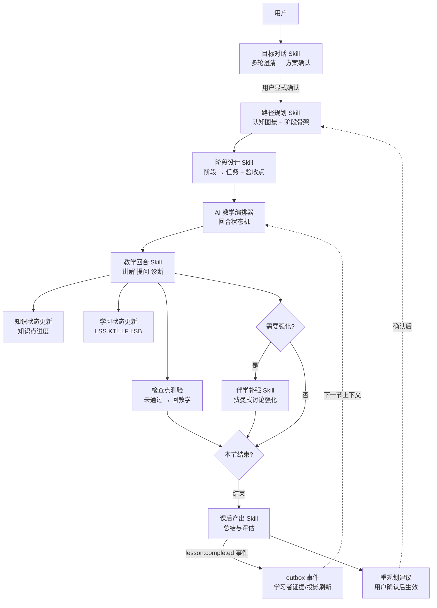

# WenFlow


> ⚠️ **当前主要开发版本**: [develop](https://github.com/wenflow-org/wenflow/tree/develop) 分支 | main 分支为稳定版

**一款从真实问题出发的 AI 学习路径原型**

> 核心理念：学习始于对真实问题的澄清，而非对课程的选择。

[English Version](README_EN.md) | 中文版

🌐 **Demo 站点**: https://wenflow.org

> 仅作 Demo 演示，不提供正式服务。
> ⚠️ **注意**: Demo 站点会定期清理所有账号和数据，请勿用于存放重要信息。

[](LICENSE)
[](https://nodejs.org)
[](https://vuejs.org)

📋 **[更新日志](CHANGELOG.md)** · 按月记录主要功能更新

---

## 为什么存在？

许多学习困境并非源于努力不足，而是目标过于宏大、资料过载、第一步不够清晰。

传统学习产品大多以“内容供给”为起点：课程、资料、题库与预设路径。WenFlow 则从另一端切入——先帮助学习者澄清真正要解决的问题，再由此生成可执行的学习路径，并通过对话、输出与反馈持续调整。

在 AI 能够快速生成大量答案的背景下，更值得训练的能力不再局限于内容记忆，而是：

- **问题定义**：将模糊目标转化为可探索的问题
- **系统思维**：理解知识、场景与行动之间的结构关系
- **判断力**：在信息过载中辨别值得采信的内容
- **AI 协作**：将 AI 作为追问、反馈与推演的伙伴
- **创造力**：在既有知识之间建立新的联结

**答案将日益廉价，问题本身将愈发重要。**

---

## 核心特性

### 产品流程预览

这 6 张图按“从真实问题出发，到进入完整学习闭环”的顺序展示 WenFlow 的核心体验。

| ① 从一个问题开始 |
|:---:|
|  |
| 学习者先陈述问题，而非直接选课 |

| ② 澄清真实目标 | ③ 生成学习路径 |
|:---:|:---:|
|  |  |
| AI 通过多轮追问澄清真实目标 | 将模糊目标拆解为阶段、任务与可立即执行的第一步 |

| ④ 进入回合式学习 | ⑤ 学习闭环总览 |
|:---:|:---:|
|  |  |
| AI 讲解、学习者作答并即时获得反馈，教学过程动态调整 | 课后生成总结与评估，并给出后续学习建议 |

| ⑥ 学习状态追踪 |
|:---:|
|  |
| LSS / KTL / LF / LSB 持续追踪学习状态，并在疲劳时予以提醒 |

### 从问题到路径
- **问题澄清**：通过多轮自然对话澄清学习目标
- **路径生成**：将模糊目标拆解为阶段、任务与可立即执行的第一步
- **回合式学习**：AI 讲解、学习者作答并即时获得反馈，教学过程根据理解情况持续调整

### 学习状态追踪
借鉴运动科学中的负荷与恢复思路，持续追踪学习状态，而不只记录是否完成任务：

| 指标 | 含义 | 用途 |
|------|------|------|
| LSS | 学习压力评分 | 基于任务难度、时长、认知负荷、效率与完成率综合计算 |
| KTL | 知识训练负荷（Knowledge Training Load） | 长期积累，日衰减因子 0.95（半衰期约 13.5 天） |
| LF | 学习疲劳度 | 短期累计，日衰减因子 0.70（半衰期约 2 天） |
| LSB | 学习状态平衡 | KTL - LF，预警过度学习 |

### 平台 Agent / Skill 编排（简版）



- 顶层 Agent 负责编排，真正持有 prompt、直接调用模型的是 Skills。
- 先澄清目标，再拆解路径。路径生成须经用户显式确认后才启动。
- 教学阶段按 opening → teaching ⇄ intervention → ready_to_close 推进；检查点（checkpoint）是**回合内**的测验控制对象（含答案键与代码裁决），不是阶段值；课堂收尾由 ready_to_close 表达；课堂模式固定为 tutor。
- 学习者出现求助信号（求助关键词、连续数轮理解度偏低）时触发伴学，不会放弃当前任务。
- 课后自动生成总结与评估，并附带重规划建议；路径不会自动变更，须经用户确认后才生成新版本。
- 每节课结束后，事件将持久化并更新学习者画像；下一节课开始时，AI 会基于这些信息继续教学。

### 虚拟学习者实验室（Virtual Learner Lab）

通过虚拟学习者账号，以真实用户的方式完整运行产品，用于功能验证：

- **黑盒模拟**：以普通用户的视角完整执行“目标 → 路径 → 学习”全流程，并由裁判与角色保真审计把关
- **Quick Learn**：选取虚拟账号下的任务，自动完成一节课并生成传播报告

### 学习者端（用户端）

用户端与管理员端分离：落地页 `/` 与 `/vision`，登录 `/login`、注册 `/register`，登录后进入 V2 壳（`frontend/src/views/v2/*.vue`）。

顶栏 / 底栏主导航五个入口（`frontend/src/views/v2/V2Nav.vue:117`）：

| 页面 | 路径 | 说明 |
|------|------|------|
| 学习台 | `/dashboard` | 今日行动、路径进度、连续学习天数 |
| 目标规划 | `/goal-conversation` | 多轮对话澄清真实目标 |
| 学习路径 | `/learning-paths` | 路径列表与进度 |
| 知识图谱 | `/knowledge-map` | 全部路径的知识聚合视图（学习页内只看当前路径） |
| 学习状态 | `/learning-state` | LSS / KTL / LF / LSB 与疲劳提醒 |

核心学习流：注册 / 登录 → `/onboarding` 引导 → `/goal-conversation` 澄清目标 → 用户显式确认后生成路径 → `/learning-paths` 列表 → `/learning-path/:id` 路径详情 → `/learn/:taskId` 回合式学习 → `/learn/:taskId/evaluation/:sessionId` 课后评估。

个人中心收在 `/user/*`：账户（`/user/account`）、设置含 API 接入（`/user/settings`）、调用日志（`/user/agent-logs`）、成就（`/user/achievements`）、学习历史（`/user/learning-history`）。旧 `/v2/*` 地址一律重定向到上述正式路径（`frontend/src/router/index.ts:165`）。

### 管理端

管理后台在 `/admin`，共 18 个场景页 / 7 个分组（按侧栏分组），数据来自真实 API（演示模式已移除，恒 live）：

- **总览**：平台总览——当日系统健康度、失败率最高的模型与待排查事项
- **教学**：用户与学习者、学习状态（风险与疲劳度，支持手动重算快照）、教学会话、目标对话、学习路径、记忆与复习
- **虚拟学习者**：虚拟学习者（运行态：并发配额 / 全局限速 / 实例流水 / 批量新建、单步测试）、学习者卡库（角色卡结构化导入导出）
- **Skill**：编排图（阶段泳道 + 字段数据旅程/逻辑图 + 调用用量）、Skill 与提示词（Skill 运行 + 模型路由；Prompt 评估为宿主内页签；Skill 设计二级页含协议编辑、编译、守门检查、发布、回滚、试跑）
- **观测**：执行日志（日志 / Trace 链路双 tab，带重试时间线、自动刷新、导出）、成本分析、审计日志
- **系统**：健康中心、模型与接入（路由 / 连通性 / 网络边界 / 重试超时）、系统工具（运维工具 + 数据导出 + 会话安全）
- **运营**：运营中心（待办工作台 / 反馈 / 成就 / 公告 / 站内通知）

> 说明：字段数据旅程（逻辑图）已并入「编排图」页；「Prompt 评估」已折入「Skill 与提示词」宿主页签（2026-10-04，旧 URL `/admin/prompt-eval` 重定向到 `/admin/skills?tab=prompt-eval`）；成本分析已拆回独立页（2026-09-29）；「批量实验」场景已下线（运行态并入「虚拟学习者」，资产输入归「学习者卡库」，旧 URL 重定向到 `/admin/virtual-learners`）。场景清单以 `frontend/src/views/admin-redesign/manifest.ts` 为准。

### Prompt 工程体系（Prompt Lab v4，File-as-Truth）

- **真源**：`prompts/core/*.yaml`（唯一人工编辑的入口，进 git）
- **编译产物**：`prompts/skill.*.md`（确定性编译生成，模型只读这个文本）
- **发布链路**：编辑 core.yaml → compile（守门检查）→ publish（写回 md + DB ACTIVE）→ 可 rollback
- **数据库**：`agent_prompts` 只是运行时镜像，文件为准、DB 为镜像

---

## 技术栈

| 层级 | 技术 |
|------|------|
| **前端** | Vue 3 + TypeScript + Vite 6 + Element Plus + Pinia |
| **后端** | Node.js + Express + TypeScript + Prisma |
| **数据库（当前）** | SQLite（主库 51 表 + system 库 14 表，双库架构） |
| **AI 接入** | OpenAI 兼容模型网关（默认 chat=deepseek-v4-flash / reasoning=deepseek-v4-pro），支持 SSE 流式、重试预算、thinking mode 控制 |
| **Agent / Skill 编排** | EduClaw Gateway + 5 个顶层 Agent（goal/path/teaching/profile/simulation，无 prompt 编排器）/ Skill 执行层（prompts/core 真源 → 编译产物 → DB 镜像）+ Coordinators + Durable Outbox 事件链 |
| **模型配置分层** | 环境变量 → 平台默认 → Agent/Skill 级 → 用户自定义 API / 模型覆盖 |
| **虚拟实验** | Virtual Learner Lab（黑盒模拟 + Quick Learn） |
| **可观测** | Agent/Skill 调用日志、Trace 瀑布、LLM 执行明细 |
| **安全** | JWT + CSRF + 登录限流 + Secret AES-256-GCM 静态加密 + 敏感存储权限审计 |
| **部署** | 跨平台启动脚本（`npm run dev`：Windows PowerShell / Linux·macOS bash）+ 可选 Nginx（测试部署）+ Docker（Linux/macOS 推荐） |

---

## 项目结构

```text
backend/            Node.js + Express + TypeScript 后端（18 个模块目录）
  src/
    agents/         顶层 Agent（含 learner-model-agent / simulation-agent）
    skills/         Skill 实现（提示词真源在 prompts/，非此处硬编码）
    coordinators/   业务流程编排（goal / path / ai-teaching / learner / simulation / requirement）
    gateway/        模型网关（OpenAI 兼容）
    routes/         HTTP 路由（用户端 / admin）
    services/       领域服务与数据访问
    virtual-lab/    虚拟学习者实验室
    events/         持久化事件与 outbox
    scripts/        正式工具：门禁 / 只读审计 / 探针 / 回填 / 运维
  prisma/           主库 schema 与 migrations；system/ 为 System DB
frontend/           Vue 3 + TypeScript + Vite 6 前端
  src/
    views/v2/       学习者端页面
    views/admin-redesign/  管理端页面与场景清单 manifest.ts
    components/mk/  管理端共享原语（MkKpi / MkRowList / MkDistBand / MkBuckets …）
    styles/         设计令牌与 mk-primitives.css
    api/ · stores/ · router/ · composables/
prompts/            File-as-Truth 提示词：core/*.yaml 真源 → skill.*.md 编译产物
scripts/            仓库根脚本（虚拟学习者跑批 / 巡检 / 演示 / 门禁），索引见 doc/DEV_SCRIPTS.md
virtual-learners/   预制虚拟学习者语料 presets.yaml（File-as-Truth）
doc/                设计文档总索引 doc/README.md（过程材料在 gitignored 的 doc/local/）
.github/workflows/  CI 门禁 quality-check.yml
```

### 数据与存储

当前使用两个 SQLite 库，相对 URL 按各自 Schema 目录解析：

| 库 | Schema | 环境变量 | 默认路径 | 表数 |
|----|--------|----------|----------|------|
| 主库 | `backend/prisma/schema.prisma` | `DATABASE_URL` | `file:./dev.db` | 51 |
| System DB | `backend/prisma/system/schema.prisma` | `SYSTEM_DATABASE_URL` | `file:../system.db` | 14 |

两库各有独立 migrations 目录（`backend/prisma/migrations`、`backend/prisma/system/migrations`），启动脚本与 CI 都会执行迁移部署。

- 迁移与校验：`npm run prisma:migrate:verify-clean`（空库迁移回放）、`npm run prisma:baseline:audit`（只读基线审计）、`npm --prefix backend run prisma:migrate:deploy:all`
- 备份与维护：`npm run database:backup:create` / `database:backup:verify` / `database:vacuum:status` / `database:vacuum`（会自动先构建后端）
- 提示词运行时镜像：数据库 `agent_prompts` 只是 `prompts/core/*.yaml` 的镜像，文件为准

---

## 项目状态

WenFlow 目前仍处于**早期开发阶段**，是一个用于验证教学概念的实验性原型。

项目并非对既有学习流程的简单加速，而是试图验证另一条路径：以真实问题为起点，由 AI 协助澄清目标、生成路径并组织反馈，是否更契合 AI 时代的学习方式。

项目将持续探索 5 类能力的训练方式：**问题定义能力、系统思维、判断力、AI 协作力、创造力**。

---

## 快速开始

### 环境要求
- Node.js >= 20.17.0
- Windows + PowerShell 5.1+ 或 Linux/macOS + bash 均可；`npm run dev` 会按平台自动选择 `start-dev.ps1` / `start-dev.sh`
- Linux/macOS 不想在本机装依赖时，推荐直接走 Docker：`./docker-start.sh`

安全与 Secret 管理见 [`SECURITY.md`](./SECURITY.md)。提交前运行 `npm run security:scan`。

运行状态：`/health` 和 `/livez` 表示进程存活，`/readyz` 才表示双库和核心运行态可接收流量。

自检：环境起不来或行为异常时，先跑 `npm run doctor`（跨平台、只读、秒级），
会逐项给出 Node/依赖/.env/双库/CORS/端口与服务的体检结果和修复指引；`--deep` 追加 prompts 三方对账。

### 推荐顺序（首次使用）

```bash
# 1) 初始化 backend/.env（JWT_SECRET、AI 配置、初始管理员）
npm run env:setup        # Windows PowerShell；Linux/macOS 用 cp backend/.env.example backend/.env 后手工填写

# 2) 跨平台启动（Windows → start-dev.ps1，Linux/macOS → start-dev.sh）
npm run dev
```

说明：建议首次使用先完成环境初始化，再选择启动脚本。若 `backend/.env` 缺失或 `JWT_SECRET` 不合格，启动脚本也会自动拉起初始化流程。
启动后端时会自动把仓库里的核心 prompts 同步进数据库；克隆仓库后即可直接运行，无需手动导入。

### 本机开发

```bash
npm run dev              # 跨平台：Windows 走 start-dev.ps1，Linux/macOS 走 start-dev.sh

# 也可显式指定
npm run dev:win          # Windows PowerShell
npm run dev:unix         # Linux/macOS bash
```

说明：脚本会自动安装依赖、生成双 Prisma Client、给主库和 System DB 分别执行 migrate、必要时引导创建或补全 `backend/.env`，启动前再自动同步一次 core prompts。
如需跳过 Prisma 初始化：PowerShell 用 `./start-dev.ps1 -SkipPrisma`，bash 用 `./start-dev.sh --skip-prisma`。注意：该选项也会跳过启动前的 core prompts 同步，仅适用于数据库和 prompts 已经准备好的环境。

### 局域网开发模式

```bash
# 自动获取局域网 IP 并启动
./start-lan.ps1

# 或使用 npm 脚本
npm run dev:lan

# 手动指定 IP
./start-lan.ps1 -LanIP 192.168.31.26
```

说明：自动将局域网 IP 加入 `CORS_ORIGIN`，适合多设备调试前台页面；不会改变管理员登录的 `ADMIN_ACCESS_MODE` 访问限制。

### 一键测试部署（本机 Nginx，HTTP）

```bash
# 依赖本机已安装 nginx（并已加入 PATH）
./start-dev.ps1 -UseNginx

# 或使用 npm 脚本
npm run dev:nginx

# 指定域名（不填默认 localhost）
./start-dev.ps1 -UseNginx -Domain test.example.com

# nginx 不在 PATH 时，指定可执行文件路径
./start-dev.ps1 -UseNginx -NginxExePath "C:\nginx\nginx.exe"
```

说明：`-UseNginx` 模式会自动执行 `npm run build`（前端）并生成运行时配置到 `runtime/nginx/wenflow.nginx.conf`；启动前会校验 80 端口可用，若系统 nginx 或其他进程已占用 80 端口，需要先手动停止。

### Docker 部署（Linux/macOS）

```bash
# 启动（交互式补齐 backend/.env，也支持环境变量非交互传入）
./docker-start.sh

# 数据库备份（一次性 operations 服务，只读挂载数据卷；需先设置 WENFLOW_BACKUP_HOST_DIR 指定备份输出目录）
docker compose -f docker-compose.operations.yml run --rm backup
```

说明：`docker-compose.yml` 提供 migrate / backend / nginx 三个服务，默认只发布 Nginx（80），不发布后端 `3001`；后端强制 `ADMIN_ACCESS_MODE=private`。详见 [DEPLOYMENT.md](DEPLOYMENT.md)。

### 质量检查（与 CI 一致）

`npm run check` 串起三个阶段，与 CI 的三个并行 job 一一对应，可在本地逐条复现：

```bash
# Quality job：secret 扫描（当前工作区）→ Prisma 双 schema 校验 → 空库迁移回放 → 后端 typecheck →
#   前端 typecheck → LLM 调用契约 → 常量来源 → 双库迁移部署 → 字段路由播种 →
#   prompts 门禁（lint / 快照 / 漂移 / 契约 / core 哈希对账）→ 设计系统守卫 →
#   路由-数据边界 → doc 死链 → lint
npm run check:quality

# Tests job：后端 + 前端测试（含覆盖率）
npm run check:test

# Build job：后端 + 前端构建
npm run check:build

# 三者依次全跑（等价于 CI）
npm run check
```

说明：GitHub Actions（`.github/workflows/quality-check.yml`）在 push main/master/develop 与 PR 时执行上述三阶段，其中 Quality job 另加 Git 历史 secret 扫描。CI 使用 Node 20；本地要求 Node >= 20.17.0。CI 失败时可用 `npm run ci:status` 回看最近 run 的失败 job / 步骤 / 错误行。

### 环境配置辅助命令

```bash
# 交互式初始化 backend/.env
npm run env:setup

# 快速打开 backend/.env 手动编辑
npm run env:edit
```

说明：`env:setup` 不再单独询问域名；Nginx 模式下域名由 `-Domain`（优先）或 `backend/.env` 中的 `FRONTEND_URL` 推断。

### Prompt 初始化与维护（File-as-Truth）

核心 prompts 采用两级模型：**真源**是 `prompts/core/*.yaml`（唯一人工编辑入口，进 git），**编译产物**是 `prompts/skill.*.md`（模型唯一读取文本），数据库 `agent_prompts` 只是运行时镜像。编辑 → 编译 → 发布链路（含守门检查与回滚）见管理端「Prompt 设计台」，机制详见 [`doc/SKILL_PROTOCOL_V4.md`](doc/SKILL_PROTOCOL_V4.md)。

```bash
# 把 prompts/core/*.yaml 全部确定性编译，重新生成 prompts/skill.*.md（不写数据库）
cd backend
npm run prompts:compile-all

# 把编译产物同步到数据库 ACTIVE 版本（启动时也会自动执行）
npm run prompts:sync-core

# 升级后补齐新增的 prompt 节点，不覆盖已有 ACTIVE 配置
npm run prompts:backfill-core

# 校验与对账
npm run prompts:lint
npm run prompts:core:check
```

说明：`prompts:sync-core` 以仓库编译产物为准，把数据库 ACTIVE 版本同步成一致；不一致时自动创建新版本并切换（旧版归档）。`prompts:backfill-core` 只补缺失节点，不覆盖已有 ACTIVE 配置。若直接在 `backend/` 下运行 `npm run dev`，后端启动时也会自动做一次同步。更多说明见 [`prompts/_README.md`](prompts/_README.md)。

### 本地 SQLite 路径约定

当前仓库默认使用两个 SQLite 库：

- `DATABASE_URL=file:./dev.db`
- `SYSTEM_DATABASE_URL=file:../system.db`

相对 URL 按 Schema 目录解析。请勿继续使用旧的 `file:./prisma/*.db`，也不要把 System URL 改为 `file:./system.db`。已有环境升级前先确认真实权威数据库并备份，可运行 `npm run prisma:baseline:audit` 做只读检查。

### 前端 API 环境变量

- 默认情况下，前端通过相对路径 `/api` 访问后端，由 Vite 代理或 Nginx 转发。
- 管理端配置主要读取 `frontend/.env` 中的 `VITE_API_BASE_URL`。
- 普通用户端在开发模式下固定使用 `/api`；非开发模式下 `VITE_API_BASE_URL` 优先，`VITE_API_URL` 仅作历史兼容保留。如果没有特殊部署需求，保持默认 `/api` 即可。

如需更细粒度的部署或非脚本方式启动，可参考 [DEPLOYMENT.md](DEPLOYMENT.md)。

架构设计、Skill 协议、Prompt 管理与虚拟学习者链路等设计文档见 [`doc/README.md`](doc/README.md)（设计文档索引）。

### 访问地址

**Demo 站点**: https://wenflow.org

**本地开发**
- 前端: http://localhost:5173
- 后端: http://localhost:3001
- 管理后台: http://localhost:5173/admin

说明：管理员登录默认 `ADMIN_ACCESS_MODE=private`（仅本机 + 局域网），也可设为 `loopback`（仅本机）或 `any`（不限来源），并支持 `ADMIN_ALLOWED_IPS` 精确放行（不推荐直接暴露公网管理登录）。

---

## 常用脚本与工具索引

日常最常用的 `npm run` 命令（完整明文见根 `package.json` 与 [`doc/DEV_SCRIPTS.md`](doc/DEV_SCRIPTS.md)）：

| 分类 | 命令 | 说明 |
|------|------|------|
| 启动 | `npm run dev` / `dev:win` / `dev:unix` | 跨平台 / Windows / Linux·macOS 启动 |
| 启动 | `npm run dev:lan` / `dev:nginx` | 局域网调试 / 本机 Nginx 测试部署 |
| 自诊 | `npm run doctor` | 只读体检 Node / 依赖 / .env / 双库 / CORS / 端口；`-- --deep` 追加 prompts 对账 |
| 门禁 | `npm run check` | `check:quality` + `check:test` + `check:build`（详见上节） |
| 测试 | `npm run test` / `test:coverage` | 后端 Jest（CI 用 `--runInBand`）/ 含覆盖率；前端测试用 `npm --prefix frontend run test`（或 `npm run check:test` 跑两边） |
| 类型 | `npm run typecheck:backend` / `check:frontend-types` | 前后端 typecheck |
| 代码风格 | `npm run lint` | 后端 + 前端 ESLint |
| 设计系统 | `npm run design:check` | 管理端设计体系守卫（令牌 / 原语用法 / 视觉层） |
| 安全 | `npm run security:scan` / `permissions:audit` / `secrets:audit` | 密钥扫描 / 敏感存储权限审计 / Secret 迁移审计（审计只读，对应的 `permissions:repair`、`secrets:migrate` 才写库） |
| 数据库 | `npm run database:backup:create` / `database:vacuum` | 备份 / 真空整理（先构建后端） |
| Prompt | `cd backend && npm run prompts:compile-all` / `prompts:sync-core` / `prompts:lint` | 编译 / 同步 ACTIVE / 校验（见上「Prompt 初始化与维护」） |
| 运维 | `npm run ci:status` | 回看最近 CI run 的失败 job / 步骤 / 错误行（只读） |

虚拟学习者跑批（造人 / 跑批 / 看结果 / 救场）链路的脚本定位与用法见 [`doc/DEV_SCRIPTS.md`](doc/DEV_SCRIPTS.md) §2。

---

## 管理员账户

首次启动时，系统会读取 `backend/.env` 中的以下字段自动创建初始管理员：

```env
INIT_ADMIN_NAME=admin
INIT_ADMIN_PASSWORD=CHANGE_ME_before_deploy
```

如果数据库里已经存在管理员，系统会自动跳过创建。

建议：首次登录管理端后立即修改密码；对外部署时请使用强密码。

注意：管理员登录默认 `ADMIN_ACCESS_MODE=private`，仅允许本机与局域网（RFC1918）来源访问；可设为 `loopback`（仅本机）或 `any`（不限制来源），并用 `ADMIN_ALLOWED_IPS` 精确放行指定客户端 IP。访问模式策略可在管理端「模型与接入」页面热生效，环境变量仅作默认值。如确有公网远程管理需求，请配合 VPN 或精确 IP 白名单，并自行承担安全加固责任。详见 [admin-guide.md](admin-guide.md)

### 反向代理常见问题

- `CORS_ORIGIN` 建议不要写尾部 `/`（如 `https://demo.example.com`，不要写成 `https://demo.example.com/`）。
- 使用反向代理时，将 `TRUST_PROXY` 配置为直接连接后端的代理 IP/CIDR；生产禁止使用 `true`。
- 不要公开可绕过代理直连的后端端口。Docker Compose 默认只发布 Nginx，不发布后端 `3001`。
- 如果遇到“请求来源不被允许”，先检查浏览器 `Origin` 与 `CORS_ORIGIN` 是否匹配。

---

## 教育理论基础

设计背后的理论，每条都有对应实现（完整 16 条理论、文献 DOI/arXiv 链接与落点索引见 [doc/EDUCATIONAL_THEORY_MAP.md](doc/EDUCATIONAL_THEORY_MAP.md)）：

1. **认知负荷理论** - 单轮知识点上限、回复形态预算，长对话自动压缩
2. **自我导向学习** - 目标由学习者提出、方案由学习者确认，学习节奏由学习者掌控
3. **最近发展区 + 支架** - 难度随理解度自动升降，理解受阻时回补前置基础
4. **形成性评估** - 每轮理解度诊断 + 检查点测验，即时反馈、失败重学
5. **刻意练习 + 检索练习** - 能够独立阐述才算掌握；课后检索式自测，下一节开场承接
6. **间隔效应与复习闭环** - 跨日递增间隔（SM-2 式）+ 自动复习课闭环，巩固长期记忆
7. **费曼技巧（自我解释）** - 以复述讲解检验理解，无法讲清时重新学习
8. **ICAP 框架** - 学习活动按认知参与度分档（交互 > 建构 > 主动 > 被动），阶段任务按 ICAP 等级递进
9. **有效失败（Productive Failure）** - 先独立试错、再对比整合的两阶段教学，以失败作为学习信号
10. **预测校准方法论** - 教学决策置信度可证伪：预测留档、结果回写、命中率统计，数据驱动调优
11. **安德森认知目标分类** - 从"记忆"到"创造"6 级认知目标，贯穿标注、教学与完成判定

---

## 文档与协作

仓库文档总表在 [`doc/README.md`](doc/README.md)——按「活规范 / 设计留痕 / 历史快照」分类型登记，新增文档需同时进 doc 白名单、登记总表、写状态头。常用入口：

- **开发脚本手册**：[`doc/DEV_SCRIPTS.md`](doc/DEV_SCRIPTS.md)（三个脚本目录的定位与命名约定、虚拟学习者跑批链路、可复用工具索引）
- **Agent / Skill**：[`doc/AGENT_SKILL_MANUAL.md`](doc/AGENT_SKILL_MANUAL.md)（why）、[`doc/SKILL_PROTOCOL_V4.md`](doc/SKILL_PROTOCOL_V4.md)（协议 SSOT）、[`doc/SKILL_DEVELOPMENT_GUIDE.md`](doc/SKILL_DEVELOPMENT_GUIDE.md)（新建 / 改造 Skill）
- **架构与模型**：[`doc/MODEL_GATEWAY_DESIGN.md`](doc/MODEL_GATEWAY_DESIGN.md)、[`doc/LEARNER_MODEL_ARCHITECTURE.md`](doc/LEARNER_MODEL_ARCHITECTURE.md)
- **教学理论落点**：[`doc/EDUCATIONAL_THEORY_MAP.md`](doc/EDUCATIONAL_THEORY_MAP.md)
- **部署 / 安全 / 管理**：[`DEPLOYMENT.md`](DEPLOYMENT.md)、[`SECURITY.md`](SECURITY.md)、[`admin-guide.md`](admin-guide.md)
- **参与开发**：[`CONTRIBUTING.md`](CONTRIBUTING.md)（分支模型 `develop` → `main`、门禁与协作）
- **面向 AI 编码会话**：[`CLAUDE.md`](CLAUDE.md)（仓库工作约定：文档治理、共享工作树纪律）
- **更新日志**：[`CHANGELOG.md`](CHANGELOG.md)

> `doc/local/` 存放设计草稿、调查快照等过程材料，已被 gitignore、不进仓库；仓库内只保留现行有效文档。

---

## License

本项目采用 [MIT License](LICENSE) 开源协议。

Copyright (c) 2026 wenflow-org

---

## 致谢

感谢 [Linux.do](https://linux.do/) 社区成员长期以来的支持与分享。

---

*当 AI 能够解答一切标准问题时，提出好问题的个体将定义未来。*
