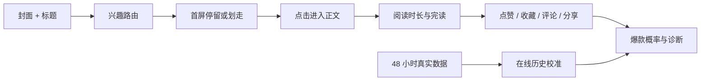

<div align="center">

# ViralSim

### 在发布之前，先让一群 AI 用户刷到你的笔记。

ViralSim 是一个面向小红书图文内容的多 Agent 爆款概率模拟器。它会模拟用户从看到封面、决定停留，到阅读正文和产生互动的完整过程，并用真实发布结果持续校准之后的预测。

[](https://nextjs.org/)
[](https://www.typescriptlang.org/)
[](https://www.sqlite.org/)
[](LICENSE)

</div>


---

## 为什么做 ViralSim？

一篇内容发出去之前，创作者通常只能凭感觉判断：封面能不能让人停下、标题会不会驱动点击、正文能不能留住读者、内容有没有收藏和分享价值。

ViralSim 把这个模糊问题变成一次可以观察的模拟：

> 让不同兴趣、不同阅读习惯的虚拟用户真正经历一次信息流，而不是让模型笼统地评价“这篇内容好不好”。

最终得到的不只是一个分数，还有每一步为什么发生、哪些用户划走、哪些用户读完、为什么收藏，以及最值得修改的地方。

## 它如何工作



每次模拟分成两个阶段：

1. **发现页决策**：Agent 只看到封面和标题，决定划走、停留或点开。
2. **内容消费决策**：只有点开的 Agent 才会看到正文和配图，并产生停留、完读和互动行为。

第二阶段会继承第一阶段看到的标题、首图和判断上下文，让行为链更接近真实阅读过程。

## 你会得到什么

| 能力 | 输出 |
|---|---|
| 多模态理解 | 视觉模型分析封面与正文配图，文本模型独立模拟阅读决策 |
| 兴趣路由 | 相关兴趣、泛相关兴趣与探索流量，再叠加不同 Persona 行为模式 |
| 完整漏斗 | 曝光、停留、点击、平均停留、完读率 |
| 互动预测 | 点赞、收藏、评论、分享及模拟评论 |
| 可解释诊断 | 每个 Agent 的首屏理由、阅读理由、互动选择和降级原因 |
| 异步任务 | 长时间预测显示实时阶段与进度，结果持久化到 SQLite |
| 成本统计 | 汇总视觉、首屏、正文和诊断阶段的 token 消耗 |
| 历史复用 | 保存预测记录，一键重新运行过去的标题、正文与图片 |
| 真实反馈闭环 | 回填发布 48 小时后的数据，自动校准之后的新预测 |

当前专注于**小红书图文笔记**：封面、标题、正文与最多 9 张正文配图。视频暂不在范围内。

## 越用越贴近你的真实结果

ViralSim 不要求积累到 50 条才开始学习。第一条有效的 48 小时真实结果就会参与下一次预测，只是在样本很少时自动降低它的影响，避免偶然数据直接带偏结果。

校准使用五类真实比例信号：

- 阅读 / 曝光：15%
- 点赞 / 曝光：5%
- 收藏 / 曝光：30%
- 评论 / 曝光：20%
- 分享 / 曝光：30%

系统会混合全局历史偏差与同赛道历史偏差，并保留两份结果：

- `rawViralProbability`：本次 Agent 模拟直接得到的原始概率
- `viralProbability`：结合当时历史数据校准后的最终概率

旧预测永远保持原样。新增真实数据只影响未来预测，因此可以持续比较不同算法版本是否真的变准。

## 快速开始

### 环境要求

- Node.js 20+
- npm 10+
- 一个支持 OpenAI SDK 请求格式的视觉模型和文本模型

### 本地运行

```bash
git clone https://github.com/white0dew/ViralSim.git
cd ViralSim
npm install
npm run dev
```

打开 [http://localhost:3000](http://localhost:3000)，在“API 与模拟设置”中分别填写：

- 视觉模型的 API Key、Base URL 和模型名
- 文本模型的 API Key、Base URL 和模型名
- 流量池人数与模型调用并发度

API 配置只保存在当前浏览器的 `localStorage`，不会写入 SQLite。模拟内容、历史结果和上传图片保存在本机 `data/` 目录，该目录默认不会提交到 Git。

### 生产运行

```bash
npm run build
npm start
```

可通过环境变量修改本地数据位置：

```bash
VIRALSIM_DATA_DIR=/path/to/data npm start
# 或只指定数据库文件
VIRALSIM_DB_PATH=/path/to/viral-sim.db npm start
```

## 质量检查

```bash
npm run typecheck
npm run lint
npm test
npm run build
```

## 技术栈

- Next.js 16 + React 19
- TypeScript
- OpenAI SDK，兼容可配置 Base URL
- SQLite + `better-sqlite3`
- Vitest
- Lucide Icons

核心代码：

```text
src/lib/simulation.ts   多阶段 Agent 模拟与评分
src/lib/personas.ts     Persona 与兴趣路由
src/lib/calibration.ts  在线历史偏差校准
src/lib/db.ts           SQLite、异步任务与历史记录
src/app/page.tsx        创作、预览、进度与结果工作台
```

## 重要说明

ViralSim 是模拟与预测工具，不是小红书官方产品，也不声称复刻平台未公开的推荐算法。爆款概率越高，只代表当前虚拟发现页用户产生综合正向反应的倾向越强，不构成真实流量承诺。

模型输出会受到模型能力、提示词、样本量、账号状态、发布时间和真实受众差异影响。最有价值的使用方式，是持续回填真实结果并观察预测误差是否下降。

## License

[MIT](LICENSE)
