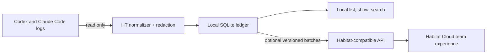

# HT — local observability for coding agents

[](https://github.com/wusterbuilds/habitat-cli/actions/workflows/ci.yml)
[](https://github.com/wusterbuilds/habitat-cli/actions/workflows/codeql.yml)
[](https://github.com/wusterbuilds/habitat-cli/actions/workflows/security.yml)
[](https://scorecard.dev/viewer/?uri=github.com/wusterbuilds/habitat-cli)
[](https://github.com/wusterbuilds/habitat-cli/releases)
[](LICENSE)

HT captures Codex and Claude Code sessions into a private local SQLite ledger
you can inspect and search. Connect Habitat Cloud only when you want shared team
history and hosted intelligence.

## See Habitat in action

A two-minute tour of team activity, semantic summaries, usage analytics, and
shared MCP tools:

https://github.com/user-attachments/assets/39031b71-7e12-4ec3-9834-698ba65db54c

- **Local-first:** capture, inspect, and search without an account or network.
- **Read-only providers:** HT never modifies Codex or Claude Code transcripts.
- **Durable delivery:** optional uploads use deterministic batches, cursors,
  retries, and per-workspace checkpoints.
- **Auditable:** source, fixtures, ingestion contract, installer, and release
  workflows are public under MIT.

> HT is under active development. Expect CLI and protocol changes before 1.0,
> and review the [privacy model](docs/privacy.md) before capturing sensitive
> projects or enabling upload.

## Quick start: stay local

Install the latest checksum-verified macOS or Linux release:

```sh
curl -fsSL https://app.use-habitat.com/install.sh | sh
ht install
ht sync
ht sessions list
```

Search or inspect captured sessions entirely on your machine:

```sh
ht sessions search "migration"
ht sessions show SESSION_ID
ht status
```

The installer is a convenience wrapper around public GitHub release assets. It
verifies the selected binary against the release's `SHA256SUMS` before
activation. You can review [`install.sh`](install.sh) first or download an asset
directly from [GitHub Releases](https://github.com/wusterbuilds/habitat-cli/releases).

## Connect Habitat Cloud

Run the guided setup when you want to share selected project sessions with a
Habitat workspace:

```sh
ht setup
```

Setup logs in, lets you choose projects and a 30-day, 90-day, or all-time
backfill, installs provider hooks, and schedules background capture. It never
launches Codex or Claude Code and explains the Codex hook trust step rather than
bypassing it.

One project routes to one workspace; delivery, retry state, and credentials stay
isolated per workspace. Setup is idempotent and safe to rerun after an
interruption.

For a self-hosted Habitat-compatible endpoint:

```sh
ht setup \
  --api-url http://127.0.0.1:4319 \
  --app-url http://localhost:3000
```

## How it works



A provider stop hook durably records the exact transcript path before waking the
daemon. The first delivery is a baseline; later deliveries contain only ordered
events after the acknowledged byte cursor. Immutable batch IDs make retries
idempotent, while quarantine state prevents a malformed payload from blocking
later work.

The public wire format, JSON Schema, compatibility policy, and synthetic fixtures
live in [`protocol`](protocol/README.md).

## Public project boundary

| Open-source HT | Habitat Cloud |
| --- | --- |
| CLI commands and JSON automation | Workspace authentication and authorization |
| Codex and Claude Code adapters | Hosted ingestion and PostgreSQL operations |
| Normalization and redaction | Web application and team collaboration |
| Local SQLite storage and search | Hosted summaries and search infrastructure |
| Hooks, daemon, diagnostics, recovery | Billing, deployment, and production operations |
| Installer, updater, and ingestion contract | Managed service support |

HT's local workflow does not depend on the private cloud codebase. Read the
[boundary document](docs/open-source-boundary.md) for contribution guidance.

## Supported platforms

| Platform | Architecture | Release binary | CI |
| --- | --- | --- | --- |
| macOS | Apple silicon | `ht-darwin-arm64` | Yes |
| macOS | Intel | `ht-darwin-x64` | Yes |
| Linux | Arm64 | `ht-linux-arm64` | Yes |
| Linux | x64 | `ht-linux-x64` | Yes |

Windows is not currently supported. See [ROADMAP.md](ROADMAP.md) for how platform
support is prioritized.

## Common commands

```sh
ht preflight                # read-only environment inspection
ht install                  # install hooks and local background service
ht setup                    # configure local capture plus Habitat Cloud
ht configure                # change project and workspace routing
ht sync                     # explicitly reconcile provider history
ht backfill                 # inspect or schedule historical capture
ht sessions list            # list local sessions
ht sessions show ID         # inspect one local session
ht sessions search QUERY    # search local content
ht status                   # concise capture and delivery health
ht doctor                   # detailed diagnostics and repair guidance
ht update                   # checksum-verified upgrade
ht logout                   # remove a workspace login
ht uninstall                # remove hooks, launcher, and service
```

Uninstall preserves local SQLite data and credentials so an interrupted or
accidental uninstall is recoverable. Paths and environment overrides are shown
with `ht help` and in the [privacy model](docs/privacy.md).

## Automation

Permissioned tools and managed installers can use the same flow without terminal
prompts:

```sh
printf '%s' "$HABITAT_API_KEY" | ht setup \
  --api-key-stdin \
  --project /path/to/project \
  --backfill 30d \
  --non-interactive \
  --json
```

An assistant should ask before changing hooks, installing a service, opening a
browser, or uploading content. `ht preflight --json` is the read-only starting
point. A real Codex hook must still be reviewed and trusted by the user.

## Build from source

Prerequisite: [Bun 1.3+](https://bun.sh/). A separate Node.js installation is
not required.

```sh
git clone https://github.com/wusterbuilds/habitat-cli.git
cd ht
bun install --frozen-lockfile
bun run check
bun run build
./dist/ht --help
```

The release workflow builds standalone Arm and x64 binaries on native macOS and
Linux runners, produces checksums and an SBOM, and publishes GitHub build
provenance attestations.

## Community and security

- Start with [CONTRIBUTING.md](CONTRIBUTING.md).
- Use the [issue chooser](https://github.com/wusterbuilds/habitat-cli/issues/new/choose)
  for bugs, provider changes, and feature proposals.
- Follow [SECURITY.md](SECURITY.md) for private vulnerability reporting.
- Read [SUPPORT.md](SUPPORT.md), [GOVERNANCE.md](GOVERNANCE.md), and
  [ROADMAP.md](ROADMAP.md) for project expectations.
- Review [CHANGELOG.md](CHANGELOG.md) before upgrading across minor releases.
- Maintainers should complete the [launch checklist](docs/maintainer-launch-checklist.md)
  before an announcement or release.

## License

MIT. See [LICENSE](LICENSE). “Habitat”, “HT”, and associated logos are subject
to the [trademark policy](TRADEMARKS.md).
