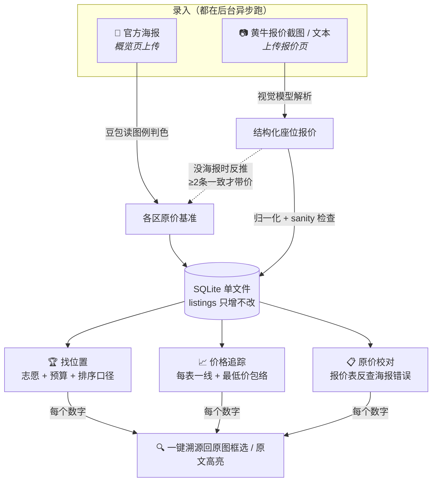
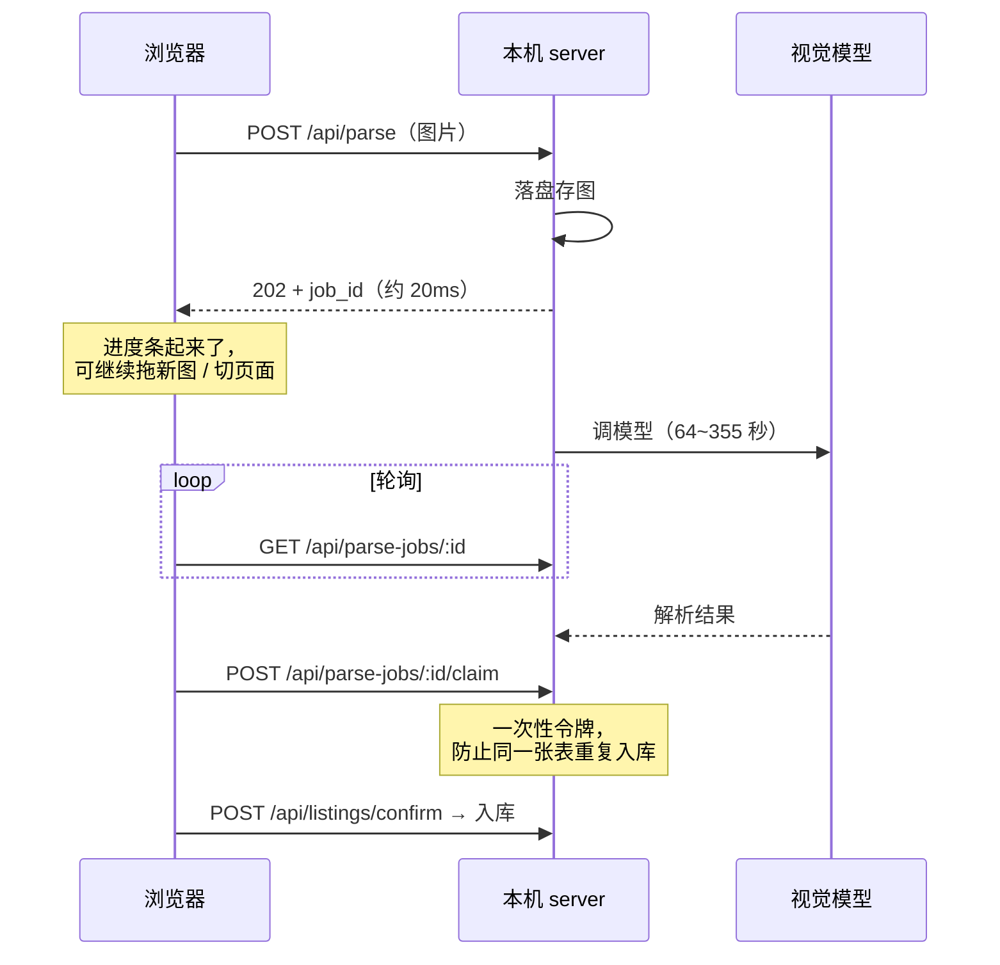

<div align="center">

# 🎫 抢票比价 · 黄牛票性价比助手

**把黄牛发来的一堆座位报价截图扔进来，自动比价、追踪价格波动，每个数字都能点回原图。**

*A self-hosted price-comparison & tracking agent for concert resale tickets: throw in scalpers' quote screenshots, get structured price comparison, cross-batch price tracking with carry-forward semantics, and per-number provenance back to the original image. Vision parsing runs on a vendor-agnostic router (Doubao / Qwen-VL / Kimi / GLM); everything else runs locally on Node 24 + built-in SQLite. Chinese UI — see [Quick Start](#-快速开始三分钟) below.*

[](LICENSE)
[](#-快速开始三分钟)
[](#-验证)


</div>

---

## 这是什么？

追星党都懂的痛：想看的演唱会官方票秒没，只能看黄牛。然后你会同时加三五个票务，每家隔三差五甩来一张**格式各异的报价表截图**——

- 想比价？只能自己拿计算器把几张表来回翻。
- 想知道「这个位置比上周便宜了没」？翻聊天记录翻到眼花。
- 想知道「加价了几倍」？得先找到官方海报上那个区的原价，还得换算汇率。
- 最怕的：转钱之前突然心虚——「这价格我是不是记错了？是哪张表说的来着？」

这个工具把这些全自动化了：**截图扔进来 → 视觉模型解析成结构化数据 → 按你的偏好和预算排出性价比最优 → 跨表追踪价格波动 → 每个数字可一键溯源回原始截图**。

数据全部存在你自己电脑上的单文件 SQLite 里，不经过任何第三方服务器（除了调用大模型解析截图本身）。

## ✨ 核心功能

### ① 截图秒变结构化比价（后台解析，不用干等）

把票务发来的座位报价（截图或文本）扔进上传框，视觉模型自动解析出「日期/分区/排/张数/票面/售价/备注」，直接入库。识别错了？点缩略图进纠错页手改——**涉及钱的数据永远人工可控**。

解析是**后台任务**：提交后立刻返回，页面上有进度条，你可以继续往队列里拖新图、切到别的页面、甚至切到别的演唱会——回来时进行中的解析会接上进度，已完成的会自动补入库。

> 实测耗时：44 行的表约 64 秒，102 行约 191 秒，海报约 355 秒。所以才做成异步——同步会让任何托管平台的请求超时变成硬约束。


### ② 找位置：分层志愿 + 预算 + 三种排序口径

「最想坐 B2，其次 A1，再不行 C1，预算两万」——把偏好按优先级扔进许愿池（显示为**第 1/2/3 志愿**），一键排出最优解。每一行都标注**加价倍数**（售价 ÷ 官方原价×汇率），谁在坑你一目了然。

**志愿优先级永远是第一关键字**——你明确说了想要哪个区，不会因为"别的区位置更好"就被越级。志愿之内怎么排，由你选：

| 模式 | 口径 |
|---|---|
| 💰 **性价比优先**（默认） | 同一志愿里挑最便宜的 |
| 🎯 **前排优先** | 同一志愿里挑排号最靠前的（只看排号，不猜朝向） |
| 🎤 **贴舞台优先** | 优先备注写了皇帝位 / 正对 / 贴台的；此模式认「反贴」 |

备注里的位置线索会被识别并打成标签：`皇帝位` > `正对舞台` > `贴舞台` > `贴小舞台` > `前区`，负面线索也标（`⚠️ 有遮挡` / `偏后` / `侧向`）。

**「反贴」**指该区朝向反了、**排号越大反而离舞台越近**。只有「贴舞台优先」认这个反转（前排优先就是照排号数字排，不猜朝向），但**标签两种模式都照常显示**，让你自己判断。字母排按 A<B<…<Z<AA<AB<…<BA 排序。排号读不出的**沉底**，不会当成第 0 排冲榜首——宁可让你看不到，也不给假的"最优"。

### ③ 价格追踪：每张表一根线，永不误报

不同票务更新频率天差地别。本工具的核心语义：**一张表的报价在被它自己的新报价覆盖之前一直有效**（carry-forward）。粉表 5 天前报的 ¥12500 只要没更新，就依然是「当前可买最低」，不会被蓝表今天更新的 ¥14000 顶掉——每张表一根阶梯线，加粗虚线是「当前可买最低」包络线，还标注每张表**几天没更新了**。


### ④ 原价基准：海报读一次，报价表反推兜底

在**概览页**点「📷 上传海报」，模型读座位图和图例定出各区原价（可多张图，解析同样在后台跑）。判色难免出错，所以有两道人工兜底：

- **✎ 校对档位**：把区拖进正确的价格档，与海报首次确认用的是**同一套编辑器**——你脑子里只有「这个区应该是哪个价」，不该因为数据来路不同就学三种操作。
- **报价截图反查**：黄牛报价表里通常也写了原价、而且表格解析很准，系统会自动比对两边，对不上的区给出「N 张报价截图都说原价是 X」的采纳建议，点一下就修正，依据可点开溯源。


### ⑤ 手机也能用

配合 Cloudflare Tunnel（免费、不要求有域名），笔记本当服务器，手机随时打开看价（带口令网关）。详见 [deploy/README.md](deploy/README.md)。

<div align="center"></div>

## 🧭 数据怎么流动



解析这一步本身是个有生命周期的后台任务，中途切页面/切演唱会都不会丢：



## 🚀 快速开始（三分钟）

**前置要求：Node.js ≥ 24**（用了 Node 内置的 `node:sqlite`，免原生编译、零数据库配置——这也是为什么版本卡得比较新）。

```bash
git clone https://github.com/<你的用户名>/ticket-agent.git
cd ticket-agent
npm install
cp .env.example .env    # 见下方「配置 API Key」
npm run dev             # 后端 8788 + 前端 5174
# 打开 http://localhost:5174
```

### 先玩玩再说（不需要 API Key）

```bash
npm run demo            # 造一场完全虚构的演示演唱会（含报价、追踪、校对建议）
npm run demo:clean      # 玩完删掉
```

刷新页面选中「STARLIT（演示数据）」，五个页面立刻都有内容可看。

### 配置 API Key（解析截图需要）

1. 注册/登录 [阿里云百炼（Model Studio）](https://bailian.console.aliyun.com/)，新用户有免费额度
2. 控制台创建 API Key（`sk-` 开头）
3. 填进 `.env` 的 `BAILIAN_API_KEY`，**重启后端**

海报判色想要最好效果，再去 [火山方舟](https://console.volcengine.com/ark) 创建一个豆包视觉推理接入点，把 `ARK_API_KEY` 和 `POSTER_MODEL=ark/<你的接入点ID>` 填上（依据见下方[模型选型](#-模型选型都是真图量化过的)）。

> **没有 Key 也能用**：截图/海报的 AI 解析不可用，但「粘贴文本/手动录入」照常，比价、追踪、溯源全部功能不受影响。界面会明确提示哪些功能需要 Key。

### 环境变量（`.env`）

| 变量 | 说明 |
|---|---|
| `BAILIAN_API_KEY` | 百炼 API Key（解析报价表；只留服务端，永不下发浏览器） |
| `ARK_API_KEY` | 火山方舟 Key（海报判色用豆包时需要） |
| `KIMI_API_KEY` / `GLM_API_KEY` | 可选，同一套前缀路由支持 |
| `PARSE_MODEL` | 报价表解析模型，推荐 `bailian/qwen3-vl-flash-2026-01-22` |
| `POSTER_MODEL` | 海报解析模型，推荐 `ark/<方舟视觉接入点ID>`；留空则回落 `PARSE_MODEL` |
| `PARSE_MAX_TOKENS` | 默认 16000。**别往回调**——4000 会把 102 行的表悄悄截成 30 来行且仍标成功 |
| `LLM_TIMEOUT_MS` | 单次上游调用总超时，默认 900000（视觉长请求需要，别低于 300000） |
| `PARSE_PROXY_URL` | 可选。填了就把「调模型」外包给托管代理，本机不用自备 Key（见下） |
| `PORT` | 后端端口，默认 8788 |
| `APP_PASSCODE` | 访问口令。本机自用可留空；**要开隧道给手机用必须设置** |

### 可选：托管解析代理（让用户不必自备 Key）

`proxy/index.mjs` 是个**无状态**小服务，唯一职责是持有 Key 代调模型。它**不连数据库、不落盘、不做业务**——归一化、sanity 检查、入库全留在用户本机，所以**用户的报价表数据不经过服务端**，经过的只有那张图和模型返回的 JSON，用完即弃。

```bash
npm run proxy           # 本地 :8790
```

部署、平台选型和踩过的坑见 [deploy/proxy.md](deploy/proxy.md)。

> ⚠️ **选平台先看单请求上限，至少要 ≥600 秒**。Render 免费层实测走不通（长请求活不过 188 秒，心跳保活也救不了），详细数据和排查过程都记在那份文档里。代理自带 `/debug/sleep` 诊断端点，换平台先用它压一次，0 token 就能判死活。

## 🔬 模型选型（都是真图量化过的）

`server/llm.mjs` 是**厂商无关**转发：model 带前缀就路由到对应上游（`bailian/` → 百炼、`ark/` → 火山方舟、`kimi/`、`glm/`），前缀剥掉再转发。所以换模型只改 `.env`，不动代码。

**海报判色**（三张真海报 + 人工 ground truth，口径 = 「区→原价」精确匹配的召回/精确率）：

| 模型 | pondphuwin(86档) | gmm(48档) | txt(115区) | 耗时 |
|---|---|---|---|---|
| **豆包 `ark/ep-*`** | **80.2% / 98.6%** | **93.8% / 97.8%** | **93.9% / 100%** | 399~554s |
| `qwen3-vl-flash` | 31.4% / 64.3% | — | — | 40s |
| `qwen-vl-max` | 30.2% / 60.5% | — | — | 85s |
| `kimi-k2.6` | 31.4% / 84.4% | — | — | 529s |
| `qwen3-vl-plus` | 11.6% / 23.3% | 79.2% / 79.2% | 免费额度耗尽 | 83s |

豆包三张全胜且几乎不幻觉，代价是慢 5~7 倍——海报是建场时的一次性操作且已异步化，这个代价可以接受。

**报价表**用 `qwen3-vl-flash`：102 行的密表 **102/102**、191 秒，够快够准。

**实测 token 用量**（决定限额怎么设）：海报 22,558 / 355s，102 行报价表 18,538 / 191s，44 行 7,834 / 64s。海报用量高是因为豆包是推理模型——`out=19949` 里绝大部分是思维链，最终只吐 7 个档位。

> 离线对比脚本在 `experiments/vision-model-benchmark/`（不调产品 API、不写 SQLite）。
> **像素比色**（让模型出 bbox + 后端按 RGB 匹配图例）已实测失败并回退——根因是视觉模型的 bbox 空间定位不准，不是颜色数学。

## 🧭 使用流程

1. **建演唱会**：填基本信息 + 选票面币种（自动带默认汇率）
2. **传海报**（可选）：在**概览页**点「📷 上传海报」自动读各区原价，确认页可批量拖拽改档
3. **传报价**：黄牛每次发来新表就扔进来，记得选对「报价日期」——价格时间序列靠它
4. **找位置**：设志愿和预算，选排序口径，看结果；心仪的位置点 ★ 关注
5. **追踪**：关注的位置自动长出价格曲线；跳水/售罄一眼看到
6. **下手前**：点任何数字溯源回原始截图，核对无误再转账

## ❓ FAQ

**我的数据存在哪？**
全部在本地 `data/ticket.db`（单文件 SQLite）+ `data/uploads/`（原图）。删掉整个 `data/` 目录 = 抹掉一切。删整场演唱会前会自动 dump 一份 JSON 到 `data/deleted/`。

**为什么必须 Node 24？能不能用 better-sqlite3 兼容老版本？**
项目刻意用 Node 24 内置的 `node:sqlite`：零依赖、零原生编译（better-sqlite3 需要较新的 C++ 工具链，在很多机器上装不上）。装个新 Node 比装编译工具链容易得多。

**AI 解析错了怎么办？**
所有解析结果都可以在纠错页手改（点上传缩略图进入）。海报原价还有「✎ 校对档位」和「报价截图校对」两道兜底。设计原则：**涉钱数据，AI 只做初稿，人工永远可以改**。

**解析到一半我切走了 / 刷新了，会怎样？**
进行中的解析继续在后台跑。回到页面时会自动接上进度条；已经跑完的会补入库；如果结果确实丢了（server 重启、或超过 1 小时保留期），那条上传会被清掉并**明确提示你重传**，而不是在上传历史里留一条空记录冒充数据源。

**报价历史会被覆盖吗？**
不会。`listings` 表只增不改——每次上传都是一份新快照，这是价格时间序列的地基。

**支持哪些币种？**
黄牛售价一律按人民币记；官方票面按当地币种记，建场时选一次、自动带默认汇率（可改），加价倍数自动换算。目前内置人民币 CNY、泰铢 THB、韩元 KRW、港币 HKD、澳门币 MOP、日元 JPY、美元 USD、欧元 EUR，其余可选「其他」手填汇率。

**一定要先传海报才有原价基准吗？**
不用。海报判色本就易错，而黄牛报价截图通常自带原价、表格解析很准，所以传报价时会按三档口径反推：

| 报价表里的原价 | 处理 |
|---|---|
| 同一区 **≥2 条一致** | 连价一起建基准，标「待核对」，概览页一眼确认 |
| 只有**孤证**（1 条） | **不建**——有价但不可信。在概览的校对块显示存疑，你可点「仍采纳」或「✕ 删除」 |
| **压根没有原价列** | 建**空档**（只建区、价格留空）——你只需补价格，省得手敲区号 |

之后再传海报确认，则以海报为权威覆盖。

## 🛠 技术栈

- **前端**：Vite + React 18，图表 recharts
- **后端**：Express（ESM `.mjs`），Node ≥ 24
- **数据库**：Node 内置 `node:sqlite`，单文件，零配置
- **AI 解析**：厂商无关转发（`server/llm.mjs`），豆包 / Qwen-VL / Kimi / GLM 按 model 前缀路由，Key 只留服务端
- **网络**：`undici` 自建 dispatcher 关掉内置 fetch 的 300s headersTimeout——视觉长请求会被它掐断并伪装成「模型解析失败」
- **测试**：vitest（后端纯函数 + 前端组件 **402** 个用例，不打网络）——`npm test`

## ✅ 验证

```bash
npm test          # 402 个用例必须全绿，不打网络
npm run build     # vite 生产构建
npm run dev       # 起后端 8788 + 前端 5174 人工走查
```

> ⚠️ **改了 `server/` 下的任何文件必须重启后端**——`npm run dev` 里 vite 前端热更新，但 Node 后端不会。对着旧后端测会得到看起来像 bug 的假象，这个项目已经栽过两次。

## 🗺 路线图

- [ ] 波动规律（功能③）：攒够跨团历史后给「现在买 / 再等等」建议
- [ ] 公共票档模板库：热门演唱会原价档只读分发，用户不用自己传海报
- [ ] 解析代理迁到阿里云函数计算（Render 免费层实测走不通，见 [deploy/proxy.md](deploy/proxy.md)）
- [ ] 静态站客户端：数据存浏览器、解析走代理，零服务器成本
- [ ] 用户账号 + 多用户数据隔离（当前单库单用户）

## 📄 License

[MIT](LICENSE)
