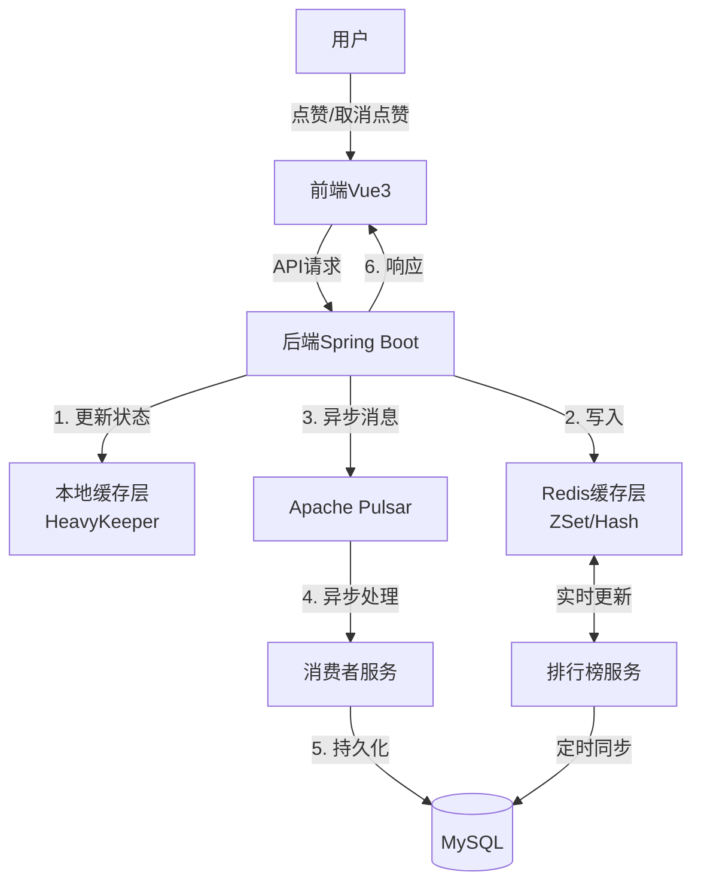
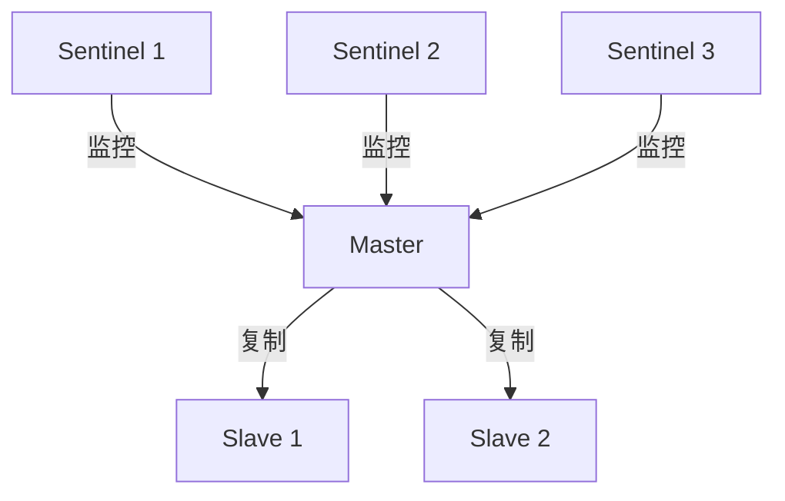
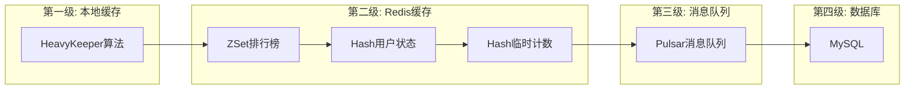
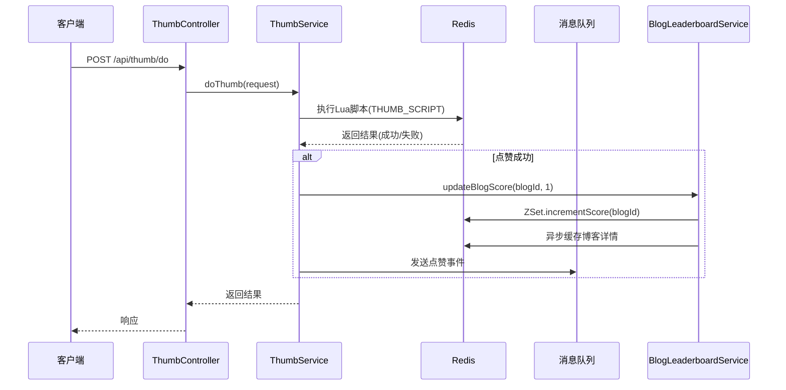

# 超大流量博客点赞系统技术文档

## 一、架构设计

### 1.1 系统架构概述

超大流量博客点赞及排行系统采用前后端分离的微服务架构，结合多级缓存和消息队列以及heavykeeper算法自动识别热key数据，实现高性能、高可用的点赞服务，利用rediszset数据结构实现高效的排行榜展示。同时兼顾多种双写一致性和分布式锁方案。

#### 系统组件：

- **前端**：Vue3 + Vite + Tailwind CSS
- **后端**：Spring Boot + MyBatis-Plus
- **缓存层**：Redis (多级缓存策略)
- **消息队列**：Apache Pulsar
- **数据库**：tidb（分布式数据库）

### 1.2 数据流程图



### 1.3 Redis集群拓扑图

主节点处理写请求，从节点复制数据并提供读服务，Sentinel节点负责监控和故障转移。



### 1.4 多级缓存架构



## 二、操作手册

### 2.1 环境部署步骤

#### 前端部署

```bash

# 进入前端目录
cd thumb-front

# 安装依赖
npm install

# 启动开发服务器
npm run dev

# 构建生产版本
npm run build
```

#### 后端部署

```bash
# 进入后端目录
cd yu-like

# 编译项目
./mvnw clean package -DskipTests

# 运行Spring Boot应用
java -jar target/thumb-backend-1.0.0.jar
```

#### Redis安装配置

```bash
# 安装Redis
apt-get install redis-server

# 配置Redis
vim /etc/redis/redis.conf

# 主要配置项
port 6379
requirepass 111111
maxmemory 2gb
maxmemory-policy allkeys-lru

# 启动Redis服务
systemctl start redis
```

#### Pulsar安装配置

```bash
# 下载Apache Pulsar
wget https://archive.apache.org/dist/pulsar/pulsar-2.10.0/apache-pulsar-2.10.0-bin.tar.gz

# 解压
tar -xvf apache-pulsar-2.10.0-bin.tar.gz

# 启动standalone模式
cd apache-pulsar-2.10.0
./bin/pulsar standalone
```

### 2.2 API调用示例

#### 点赞接口

```http
POST /api/thumb/do
Content-Type: application/json

{
  "blogId": "101"
}
```

响应:

```json
{
  "code": 0,
  "data": true,
  "message": "ok"
}
```

#### 取消点赞接口

```http
POST /api/thumb/undo
Content-Type: application/json

{
  "blogId": "101"
}
```

响应:

```json
{
  "code": 0,
  "data": true,
  "message": "ok"
}
```

#### 获取排行榜接口

```http
GET /api/leaderboard?page=0&size=10
```

响应:

```json
{
  "code": 0,
  "data": [
    {
      "blogId": "101",
      "title": "Java",
      "coverImg": "https://example.com/img1.jpg",
      "summary": "Java编程简介",
      "thumbCount": 156,
      "rank": 1
    },
    // ...更多排行数据
  ],
  "message": "ok"
}
```

## 三、关键代码执行流程分析

### 3.1 点赞流程



### 3.2 Redis ZSet排行榜实现

```java
// 更新博客在排行榜中的分数
public void updateBlogScore(Long blogId, int delta) {
    try {
        // 1. 更新排行榜分数
        redisTemplate.opsForZSet().incrementScore(LEADERBOARD_KEY, blogId.toString(), delta);
  
        // 2. 检查博客详情缓存是否存在，不存在则异步加载
        String blogDetailKey = BLOG_DETAIL_KEY_PREFIX + blogId;
        if (Boolean.FALSE.equals(redisTemplate.hasKey(blogDetailKey))) {
            loadBlogDetailAsync(blogId);
        }
  
        // 3. 更新排行榜更新时间
        stringRedisTemplate.opsForValue().set(LEADERBOARD_TTL_KEY, LocalDateTime.now().toString());
  
        // 设置排行榜过期时间（添加随机值防止缓存雪崩）
        redisTemplate.expire(LEADERBOARD_KEY, getRandomExpireTime(CACHE_DAYS), TimeUnit.SECONDS);
    } catch (Exception e) {
        log.error("更新博客排行榜分数失败", e);
        throw new RuntimeException("更新排行榜失败", e);
    }
}

  /**
     * 刷新排行榜数据
     * 定时执行，每小时刷新一次
     */
    @Scheduled(fixedRate = 3600000) // 每小时刷新一次
    public void refreshLeaderboard() {
        try {
            log.info("开始刷新博客排行榜");
      
            // 1. 从数据库加载所有博客点赞数
            List<Blog> blogs = blogService.list();
      
            // 2. 使用管道批量添加到排行榜
            if (!blogs.isEmpty()) {
                // 清除旧的排行榜数据
                redisTemplate.delete(LEADERBOARD_KEY);
          
                // 批量添加到排行榜
                Set<ZSetOperations.TypedTuple<Object>> tuples = new HashSet<>();
                for (Blog blog : blogs) {
                    tuples.add(new DefaultTypedTuple<>(blog.getId().toString(), 
                            (double) blog.getThumbCount()));
                }
          
                redisTemplate.opsForZSet().add(LEADERBOARD_KEY, tuples);
          
                // 设置过期时间（添加随机值防止缓存雪崩）
                redisTemplate.expire(LEADERBOARD_KEY, getRandomExpireTime(CACHE_DAYS), TimeUnit.SECONDS);
                stringRedisTemplate.opsForValue().set(LEADERBOARD_TTL_KEY, LocalDateTime.now().toString());
            }
      
            log.info("博客排行榜刷新完成，共{}条记录", blogs.size());
        } catch (Exception e) {
            log.error("刷新博客排行榜失败", e);
        }
    }
  
    /**
     * 批量更新排行榜分数（使用管道技术）
     * @param blogScores 博客ID和分数增量的映射
     */
    public void batchUpdateScores(Map<Long, Integer> blogScores) {
        stringRedisTemplate.executePipelined((RedisCallback<Object>) connection -> {
            blogScores.forEach((blogId, delta) -> {
                String key = LEADERBOARD_KEY;
                byte[] rawKey = stringRedisTemplate.getStringSerializer().serialize(key);
                byte[] value = stringRedisTemplate.getStringSerializer().serialize(blogId.toString());
                connection.zIncrBy(rawKey, delta, value);
            });
            return null;
        });
  
        // 更新过期时间
        redisTemplate.expire(LEADERBOARD_KEY, getRandomExpireTime(CACHE_DAYS), TimeUnit.SECONDS);
    }
```

### 3.3 HeavyKeeper算法实现（每次访问的计算key的访问频率，将高热点数据存储到本地缓存）

HeavyKeeper算法用于高效识别热点数据，提供智能缓存机制：

```java
public AddResult add(String key, int increment) {
    byte[] keyBytes = key.getBytes();
    long itemFingerprint = hash(keyBytes);
    int maxCount = 0;

    // 使用多行计数减少冲突
    for (int i = 0; i < depth; i++) {
        int bucketNumber = Math.abs(hash(keyBytes)) % width;
        Bucket bucket = buckets[i][bucketNumber];
  
        synchronized (bucket) {
            // 桶为空则直接添加
            if (bucket.count == 0) {
                bucket.fingerprint = itemFingerprint;
                bucket.count = increment;
                maxCount = Math.max(maxCount, increment);
            } 
            // 找到匹配项则增加计数
            else if (bucket.fingerprint == itemFingerprint) {
                bucket.count += increment;
                maxCount = Math.max(maxCount, bucket.count);
            } 
            // 冲突时使用指数衰减概率替换
            else {
                // 指数衰减替换逻辑
                // ...
            }
        }
    }

    // TopK维护逻辑
    // ...
}
```

### 3.4 Redis Lua脚本实现

使用Lua脚本确保原子性操作：

```lua
-- 点赞Lua脚本
local tempThumbKey = KEYS[1]       -- 临时计数键
local userThumbKey = KEYS[2]       -- 用户点赞状态键
local userId = ARGV[1]             -- 用户ID
local blogId = ARGV[2]             -- 博客ID

-- 1. 检查是否已点赞（避免重复操作）
if redis.call('HEXISTS', userThumbKey, blogId) == 1 then
    return -1  -- 已点赞，返回失败
end

-- 2. 获取旧值
local hashKey = userId .. ':' .. blogId
local oldNumber = tonumber(redis.call('HGET', tempThumbKey, hashKey) or 0)

-- 3. 计算新值
local newNumber = oldNumber + 1

-- 4. 原子性更新：写入临时计数 + 标记用户已点赞
redis.call('HSET', tempThumbKey, hashKey, newNumber)
redis.call('HSET', userThumbKey, blogId, 1)

return 1  -- 返回成功
```

### 3.5redis

**1.哨兵模式**

#### **配置 Redis 主从复制**

1. 主节点配置（redis-master.conf）：

   ```
   port 6379
   daemonize yes
   pidfile /var/run/redis_6379.pid
   logfile /var/log/redis/redis.log
   ```
2. 从节点配置（redis-slave.conf）：

   ```
   port 6379
   daemonize yes
   slaveof 192.168.1.10 6379  # 指向主节点IP和端口
   ```
3. 启动 Redis 实例：

   ```
   redis-server /path/to/redis-master.conf
   redis-server /path/to/redis-slave.conf
   ```

---

🛡️ **三、配置 Sentinel 哨兵节点**

1. **哨兵配置文件**（`sentinel.conf`，三节点配置相同）：

   ```
   port 26379
   daemonize yes
   logfile /var/log/redis/sentinel.log
   sentinel monitor mymaster 192.168.1.10 6379 2  # 主节点IP，2表示需2个哨兵确认故障
   sentinel down-after-milliseconds mymaster 5000   # 5秒无响应视为下线
   sentinel failover-timeout mymaster 60000         # 故障转移超时时间（60秒）
   sentinel parallel-syncs mymaster 1               # 故障转移时同步的从节点数
   ```

   > 📌 **关键参数**：
   >
   > - ```
   >   quorum=2：需至少 2 个哨兵达成共识才触发故障转移。
   >   ```
   > - 若主节点有密码，需添加
   >
   >   ```
   >   sentinel auth-pass mymaster yourpassword。
   >   ```
   >
2. **启动 Sentinel**：

   ```
   redis-sentinel /path/to/sentinel.conf
   ```

**2.集群模式**（使用Docker Compose）

```
# docker-compose.yml
version: '3.8'
services:
  redis-node-1:
    image: redis:7.0
    ports:
      - "7001:6379"  # 服务端口
      - "17001:16379" # 集群总线端口
    command: redis-server --cluster-enabled yes --cluster-node-timeout 5000 --appendonly yes

  redis-node-2:  # 配置类似，端口递增
    image: redis:7.0
    ports:
      - "7002:6379"
      - "17002:16379"
    command: redis-server --cluster-enabled yes --cluster-node-timeout 5000 --appendonly yes

  # 重复配置redis-node-3至redis-node-6（共6个节点）
```

1. **启动容器：**

   ```
   docker-compose up -d
   ```
2. **创建集群：**

   ```
   docker exec -it redis-node-1 redis-cli --cluster create \
     172.18.0.2:6379 172.18.0.3:6379 172.18.0.4:6379 \
     172.18.0.5:6379 172.18.0.6:6379 172.18.0.7:6379 \
     --cluster-replicas 1
   ```

## 四.数据一致性保证

### 4.1 点赞服务实现（多种实现方式）

**基本实现方式**

```java
 /** 
 * 通过加锁和事务管理，确保点赞操作在多线程环境下的原子性和一致性，避免数据冲突和重复操作。
 * 如果不加锁，可能会导致重复点赞的原因在于多线程环境下的并发问题。以下是具体原因：
 * 检查和插入之间的竞态条件：
 * 在代码中，点赞操作首先检查数据库中是否已经存在点赞记录（exists 方法）。
 * 如果多个线程同时执行这段代码，它们可能会同时通过检查（即都认为记录不存在）。
 * 然后，这些线程会同时尝试插入点赞记录，导致重复点赞。
  **/
@Service
@RequiredArgsConstructor
public class ThumbServiceImpl extends ServiceImpl<ThumbMapper, Thumb> implements ThumbService {

    private final UserService userService;

    private final BlogService blogService;

    private final TransactionTemplate transactionTemplate;

    @Override
    public Boolean doThumb(DoThumbRequest doThumbRequest, HttpServletRequest request) {
        if (doThumbRequest == null || doThumbRequest.getBlogId() == null) {
            throw new RuntimeException("参数错误");
        }
        User loginUser = userService.getLoginUser(request);
        // 加锁
        synchronized (loginUser.getId().toString().intern()) {

            // 编程式事务
            return transactionTemplate.execute(status -> {
                Long blogId = doThumbRequest.getBlogId();
                boolean exists = this.lambdaQuery()
                        .eq(Thumb::getUserId, loginUser.getId())
                        .eq(Thumb::getBlogId, blogId)
                        .exists();
                if (exists) {
                    throw new RuntimeException("用户已点赞");
                }
                boolean update = blogService.lambdaUpdate()
                        .eq(Blog::getId, blogId)
                        .setSql("thumbCount = thumbCount + 1")
                        .update();

                Thumb thumb = new Thumb();
                thumb.setUserId(loginUser.getId());
                thumb.setBlogId(blogId);
                // 更新成功才执行
                return update && this.save(thumb);
            });
        }
    }
}
```

**ThumbServiceRedisImpl - Redis实现**

1. 用户发起点赞请求
2. 获取登录用户信息
3. 计算时间片值（用于Redis键分片）
4. 执行Lua脚本在Redis中原子性完成：

   - 检查用户是否已点赞
   - 若已点赞则返回失败
   - 在临时计数键中增加点赞计数
   - 标记用户已点赞状态
5. 更新博客排行榜分数
6. 返回操作结果

```java
@Service("thumbServiceRedis")
public class ThumbServiceRedisImpl implements ThumbService {
    // 使用Redis Lua脚本进行点赞操作
    public Boolean doThumb(DoThumbRequest request, HttpServletRequest httpRequest) {
        // 执行Lua脚本，将点赞信息存入Redis
        // Redis键：临时点赞键(timeSlice)和用户点赞键(userThumbKey)
        long result = redisTemplate.execute(
                RedisLuaScriptConstant.THUMB_SCRIPT,
                Arrays.asList(tempThumbKey, userThumbKey),
                loginUser.getId(), blogId
        );
  
        // 更新排行榜
        blogLeaderboardService.updateBlogScore(blogId, 1);
  
        return LuaStatusEnum.SUCCESS.getValue() == result;
    }
}
```

**ThumbServiceMQImpl - 消息队列实现**

处理流程：

1. 用户发起点赞请求
2. 获取登录用户信息
3. 执行Lua脚本在Redis中原子性完成：

   - 检查用户是否已点赞
   - 若已点赞则返回失败
   - 标记用户已点赞状态
4. 创建点赞事件对象(ThumbEvent)
5. 异步发送点赞事件到Pulsar消息队列
6. 立即返回成功结果给用户
7. 消息队列消费者(ThumbConsumer)批量处理点赞事件：

   - 合并同一用户对同一博客的多次操作
   - 批量更新博客点赞计数
   - 批量插入点赞记录到数据库

```java
@Service("thumbServiceMQ")
public class ThumbServiceMQImpl implements ThumbService {
    // 将点赞操作异步化处理
    public Boolean doThumb(DoThumbRequest request, HttpServletRequest httpRequest) {
        // 1. 先在Redis中记录点赞状态
        redisTemplate.execute(RedisLuaScriptConstant.THUMB_SCRIPT_MQ, List.of(userThumbKey), blogId);
  
        // 2. 发送消息到Pulsar消息队列进行异步处理
        ThumbEvent thumbEvent = ThumbEvent.builder()
                .blogId(blogId)
                .userId(loginUserId)
                .type(ThumbEvent.EventType.INCR)
                .build();
        pulsarTemplate.sendAsync("thumb-topic", thumbEvent);
  
        return true;
    }
}
```

**ThumbServiceImpl - 本地缓存实现**

处理流程：

1. 用户发起点赞请求
2. 获取登录用户信息并加锁（基于用户ID的字符串锁）
3. 使用事务处理以下操作：

   - 检查用户是否已点赞该博客
   - 若已点赞则抛异常
   - 更新博客点赞计数 (+1)
   - 创建点赞记录并保存到数据库
4. 在Redis中缓存点赞记录
5. 在本地缓存中同步点赞记录
6. 返回操作结果

```java
@Service("thumbServiceLocalCache")
public class ThumbServiceImpl implements ThumbService {
    // 使用事务直接更新数据库，并同步到Redis
    public Boolean doThumb(DoThumbRequest request, HttpServletRequest httpRequest) {
        // 使用编程式事务
        return transactionTemplate.execute(status -> {
            // 1. 更新数据库中的点赞计数
            boolean update = blogService.lambdaUpdate()
                    .eq(Blog::getId, blogId)
                    .setSql("thumbCount = thumbCount + 1")
                    .update();
      
            // 2. 插入点赞记录
            Thumb thumb = new Thumb();
            thumb.setUserId(loginUser.getId());
            thumb.setBlogId(blogId);
            boolean success = update && this.save(thumb);
      
            // 3. 同步到Redis
            if (success) {
                String hashKey = ThumbConstant.USER_THUMB_KEY_PREFIX + loginUser.getId();
                String fieldKey = blogId.toString();
                redisTemplate.opsForHash().put(hashKey, fieldKey, thumb.getId());
                // 更新本地缓存
                cacheManager.putIfPresent(hashKey, fieldKey, thumb.getId());
            }
      
            return success;
        });
    }
}
```

### 4.2 排行榜服务

```java
@Service
public class BlogLeaderboardService {
    // 获取排行榜数据
    public List<BlogLeaderboardDTO> getLeaderboard(int start, int end) {
        // 1. 从Redis ZSet中获取排名数据
        Set<ZSetOperations.TypedTuple<Object>> rangeWithScores = 
            redisTemplate.opsForZSet().reverseRangeWithScores(LEADERBOARD_KEY, start, end);
  
        // 如果Redis中没有数据，则从数据库刷新
        if (rangeWithScores == null || rangeWithScores.isEmpty()) {
            refreshLeaderboard();
            // 再次从Redis获取
            rangeWithScores = redisTemplate.opsForZSet().reverseRangeWithScores(LEADERBOARD_KEY, start, end);
        }
  
        // 2. 获取博客详情：优先从Redis获取，未命中则从数据库获取并异步加载到Redis
        for (ZSetOperations.TypedTuple<Object> tuple : rangeWithScores) {
            String blogDetailKey = BLOG_DETAIL_KEY_PREFIX + blogId;
            Map<Object, Object> blogDetailMap = redisTemplate.opsForHash().entries(blogDetailKey);
      
            if (blogDetailMap.isEmpty()) {
                // 缓存未命中，异步加载
                loadBlogDetailAsync(Long.valueOf(blogId));
          
                // 暂时从数据库获取
                Blog blog = blogService.getById(Long.valueOf(blogId));
                // ...
            }
        }
    }
  
    // 定时刷新排行榜数据（每小时一次）
    @Scheduled(fixedRate = 3600000)
    public void refreshLeaderboard() {
        // 1. 从数据库加载所有博客点赞数
        List<Blog> blogs = blogService.list();
  
        // 2. 清除旧的排行榜数据
        redisTemplate.delete(LEADERBOARD_KEY);
  
        // 3. 批量添加到Redis ZSet
        Set<ZSetOperations.TypedTuple<Object>> tuples = new HashSet<>();
        for (Blog blog : blogs) {
            tuples.add(new DefaultTypedTuple<>(blog.getId().toString(), 
                    (double) blog.getThumbCount()));
        }
  
        redisTemplate.opsForZSet().add(LEADERBOARD_KEY, tuples);
  
        // 4. 设置过期时间（添加随机值防止缓存雪崩）
        redisTemplate.expire(LEADERBOARD_KEY, getRandomExpireTime(CACHE_DAYS), TimeUnit.SECONDS);
    }
}
```

### 4.3 数据同步任务

### SyncThumb2DBJob - Redis到MySQL的同步

```java
public class SyncThumb2DBJob {
    // 每10秒执行一次同步
    @Scheduled(fixedRate = 10000)
    @Transactional(rollbackFor = Exception.class)
    public void run() {
        // 1. 获取临时点赞数据
        String tempThumbKey = RedisKeyUtil.getTempThumbKey(date);
        Map<Object, Object> allTempThumbMap = redisTemplate.opsForHash().entries(tempThumbKey);
  
        // 2. 根据临时数据构建数据库操作
        for (Object userIdBlogIdObj : allTempThumbMap.keySet()) {
            // 解析用户ID和博客ID
            String[] userIdAndBlogId = userIdBlogId.split(StrPool.COLON);
            Long userId = Long.valueOf(userIdAndBlogId[0]);
            Long blogId = Long.valueOf(userIdAndBlogId[1]);
            Integer thumbType = Integer.valueOf(allTempThumbMap.get(userIdBlogId).toString());
      
            if (thumbType == ThumbTypeEnum.INCR.getValue()) {
                // 增加点赞
                Thumb thumb = new Thumb();
                thumb.setUserId(userId);
                thumb.setBlogId(blogId);
                thumbList.add(thumb);
            } else if (thumbType == ThumbTypeEnum.DECR.getValue()) {
                // 取消点赞，拼接查询条件，批量删除
                needRemove = true;
                wrapper.or().eq(Thumb::getUserId, userId).eq(Thumb::getBlogId, blogId);
            }
      
            // 计算点赞增量
            blogThumbCountMap.put(blogId, blogThumbCountMap.getOrDefault(blogId, 0L) + thumbType);
        }
  
        // 3. 批量执行数据库操作
        thumbService.saveBatch(thumbList);  // 批量插入点赞记录
        if (needRemove) thumbService.remove(wrapper);  // 批量删除点赞记录
        blogMapper.batchUpdateThumbCount(blogThumbCountMap);  // 批量更新博客点赞数
  
        // 4. 删除临时数据
        redisTemplate.delete(tempThumbKey);
    }
}
```

### ThumbReconcileJob - 数据对账任务

```java
@Component
public class ThumbReconcileJob {
    // 每天凌晨2点执行对账任务
    @Scheduled(cron = "0 0 2 * * ?")
    public void run() {
        // 1. 获取所有用户ID
        Set<Long> userIds = new HashSet<>();
        String pattern = ThumbConstant.USER_THUMB_KEY_PREFIX + "*";
        try (Cursor<String> cursor = redisTemplate.scan(ScanOptions.scanOptions().match(pattern).count(1000).build())) {
            while (cursor.hasNext()) {
                String key = cursor.next();
                Long userId = Long.valueOf(key.replace(ThumbConstant.USER_THUMB_KEY_PREFIX, ""));
                userIds.add(userId);
            }
        }

        // 2. 逐用户比对Redis和MySQL中的点赞数据
        userIds.forEach(userId -> {
            // Redis中的点赞记录
            Set<Long> redisBlogIds = redisTemplate.opsForHash().keys(ThumbConstant.USER_THUMB_KEY_PREFIX + userId)
                .stream().map(obj -> Long.valueOf(obj.toString())).collect(Collectors.toSet());
      
            // MySQL中的点赞记录
            Set<Long> mysqlBlogIds = thumbService.lambdaQuery()
                .eq(Thumb::getUserId, userId)
                .list()
                .stream()
                .map(Thumb::getBlogId)
                .collect(Collectors.toSet());

            // 3. 计算差异（Redis有但MySQL无）
            Set<Long> diffBlogIds = Sets.difference(redisBlogIds, mysqlBlogIds);

            // 4. 发送补偿事件使数据同步
            sendCompensationEvents(userId, diffBlogIds);
        });
    }
}
```

### ThumbConsumer - 消息队列消费者

```java
@Service
public class ThumbConsumer {
    @PulsarListener(topics = "thumb-topic")
    @Transactional(rollbackFor = Exception.class)
    public void processBatch(List<Message<ThumbEvent>> messages) {
        // 处理接收到的点赞/取消点赞事件
        Map<Long, Long> countMap = new ConcurrentHashMap<>();
        List<Thumb> thumbs = new ArrayList<>();

        // 提取事件并按(userId, blogId)分组获取最新事件
        Map<Pair<Long, Long>, ThumbEvent> latestEvents = events.stream()
                .collect(Collectors.groupingBy(
                        e -> Pair.of(e.getUserId(), e.getBlogId()),
                        Collectors.collectingAndThen(
                                Collectors.toList(),
                                list -> {
                                    // 按时间排序，取最后一个
                                    list.sort(Comparator.comparing(ThumbEvent::getEventTime));
                                    return list.get(list.size() - 1);
                                }
                        )
                ));

        // 处理每个事件，构建数据库操作
        latestEvents.forEach((userBlogPair, event) -> {
            if (event.getType() == ThumbEvent.EventType.INCR) {
                // 处理点赞
                countMap.merge(event.getBlogId(), 1L, Long::sum);
                Thumb thumb = new Thumb();
                thumb.setBlogId(event.getBlogId());
                thumb.setUserId(event.getUserId());
                thumbs.add(thumb);
            } else {
                // 处理取消点赞
                wrapper.or().eq(Thumb::getUserId, event.getUserId()).eq(Thumb::getBlogId, event.getBlogId());
                countMap.merge(event.getBlogId(), -1L, Long::sum);
            }
        });

        // 批量更新数据库
        if (needRemove.get()) thumbService.remove(wrapper);
        batchUpdateBlogs(countMap);       // 更新博客点赞数
        batchInsertThumbs(thumbs);        // 插入点赞记录
    }
}
```

### 4. 4 多级缓存管理

```java
@Component
public class CacheManager {
    private Cache<String, Object> localCache;    // 本地缓存(Caffeine)
    private TopK hotKeyDetector;                 // 热点键检测器
    private RedisTemplate<String, Object> redisTemplate;  // Redis缓存

    public Object get(String hashKey, String key) {
        String compositeKey = buildCacheKey(hashKey, key);

        // 1. 先查本地缓存
        Object value = localCache.getIfPresent(compositeKey);
        if (value != null) {
            // 记录访问次数
            hotKeyDetector.add(key, 1);
            return value;
        }


        // 2. 本地缓存未命中，查询Redis
        Object redisValue = redisTemplate.opsForHash().get(hashKey, key);
        if (redisValue == null) {
            return null;
        }

        // 3. 记录访问并检测是否是热点键
        AddResult addResult = hotKeyDetector.add(key, 1);

        // 4. 如果是热点键，则加入本地缓存
        if (addResult.isHotKey()) {
            localCache.put(compositeKey, redisValue);
        }

        return redisValue;
    }
  
    // 清理热点键检测数据
    @Scheduled(fixedRate = 20, timeUnit = TimeUnit.SECONDS)
    public void cleanHotKeys() {
        hotKeyDetector.fading();
    }
}
```

Redis和MySQL交互逻辑的核心设计：

1. **多级缓存策略**：

   - 本地缓存(Caffeine) → Redis缓存 → MySQL数据库
   - 热点键检测，只将热点数据加载到本地缓存
2. **数据写入策略**：

   - Redis优先写入，通过定时任务或消息队列异步写入MySQL
   - 点赞/取消点赞先写入Redis，定时同步到MySQL
3. **数据一致性保证**：

   - 定时对账任务检测Redis和MySQL数据差异
   - 发送补偿事件修复不一致数据
   - 使用事务确保批量操作的原子性
4. **排行榜数据更新**：

   - 使用Redis ZSet存储排行榜
   - 定时从MySQL全量刷新到Redis
   - 实时点赞操作增量更新Redis排行榜分数

系统通过这种设计实现了高性能的点赞功能，同时保证了Redis和MySQL数据的最终一致性。

## 五，redis监控实现方案

该项目通过Spring Boot与Prometheus/Grafana集成实现了Redis数据监控，具体实现方式如下：

### 1. 基于Spring Boot Actuator暴露指标

项目在application.yml中配置了Actuator端点暴露：

```yaml
management:
  endpoints:
    web:
      exposure:
        include: health, prometheus
  metrics:
    distribution:
      percentiles:
        http:
          server:
            requests: 0.5, 0.75, 0.9, 0.95, 0.99
```

这使得Redis连接池指标和操作统计自动通过/actuator/prometheus端点暴露。

### 2. Micrometer定制化指标收集

项目使用Micrometer库创建并注册自定义监控指标，特别是针对点赞操作：

```java
public ThumbController(MeterRegistry registry) {
    this.successCounter = Counter.builder("thumb.success.count")
            .description("Total successful thumb")
            .register(registry);
    this.failureCounter = Counter.builder("thumb.failure.count")
            .description("Total failed thumb")
            .register(registry);
}
```

这些计数器会跟踪点赞操作的成功和失败次数，并通过Prometheus端点暴露出去。

### 3. Redis操作的可观测性

系统在执行关键Redis操作时，会更新相应的计数器：

```java
if (success) {
    successCounter.increment();
    log.info("点赞成功: userId={}, blogId={}", userId, blogId);
} else {
    failureCounter.increment();
    log.warn("点赞失败: userId={}, blogId={}", userId, blogId);
}
```

### 4. 监控数据可视化

1. **Prometheus采集**：定期抓取/actuator/prometheus端点的指标数据
2. **Grafana仪表板**：将采集的指标在仪表板中可视化，包括：
   - Redis连接池使用情况
   - Redis命令执行次数和延迟
   - 点赞成功/失败率
   - 缓存命中率

### 5. 自动告警配置

基于采集的指标数据，可以配置告警规则，例如：

- Redis连接池耗尽告警
- Redis响应时间过长告警
- 点赞失败率过高告警

### 6. 完整监控闭环

1. **采集** - 通过Micrometer和Spring Boot Actuator自动采集Redis相关指标
2. **存储** - 数据存储在Prometheus时序数据库中
3. **可视化** - 使用Grafana创建直观的仪表板
4. **告警** - 配置异常情况的自动告警
5. **响应** - 根据告警进行排障和优化

这种监控方案不仅可以监控Redis本身的健康状况，还能监控业务层面的Redis使用情况，为系统性能优化和问题排查提供了有力支持。

## 六，压力测试

### 1. 概述

点赞系统压力测试功能用于模拟高并发环境下的用户点赞行为，评估系统性能，识别潜在瓶颈，为系统优化提供数据支持。本功能采用前后端分离架构，通过模拟服务避免数据库压力，提供直观的测试结果可视化界面。

### 2. 技术实现

### 2.1 后端实现

#### TestController

```java
/**
 * 压力测试控制器
 */
@RestController
@RequestMapping("/test")
@Slf4j
public class TestController {

    @Resource
    private ThumbService thumbService;
  
    @Resource
    private TestService testService;

    private final Timer thumbStressTestTimer;
    private final AtomicInteger concurrentRequests = new AtomicInteger(0);

    public TestController(MeterRegistry registry) {
        this.thumbStressTestTimer = Timer.builder("thumb.stress.test.timer")
                .description("Thumb stress test response time")
                .register(registry);
    }

    /**
     * 压力测试接口
     * @param requestCount 请求总数
     * @param concurrency 并发数
     * @return 测试结果
     */
    @GetMapping("/stress")
    public BaseResponse<Map<String, Object>> stressTest(
            @RequestParam(defaultValue = "1000") int requestCount,
            @RequestParam(defaultValue = "100") int concurrency,
            HttpServletRequest request) {
  
        log.info("开始压力测试: 总请求数={}, 并发数={}", requestCount, concurrency);
  
        // 限制请求数量和并发数，防止系统过载
        requestCount = Math.min(requestCount, 10000);
        concurrency = Math.min(concurrency, 500);
  
        // 创建final副本以在lambda中使用
        final int finalConcurrency = concurrency;
        final HttpServletRequest finalRequest = request;
  
        long startTime = System.currentTimeMillis();
        AtomicInteger successCount = new AtomicInteger(0);
        AtomicInteger failCount = new AtomicInteger(0);
        List<Long> responseTimes = new ArrayList<>();
  
        // 使用CompletableFuture进行并发请求
        List<CompletableFuture<Void>> futures = new ArrayList<>();
  
        for (int i = 0; i < requestCount; i++) {
            CompletableFuture<Void> future = CompletableFuture.runAsync(() -> {
                // 限制并发数
                while (concurrentRequests.get() >= finalConcurrency) {
                    try {
                        TimeUnit.MILLISECONDS.sleep(10);
                    } catch (InterruptedException e) {
                        Thread.currentThread().interrupt();
                    }
                }
          
                concurrentRequests.incrementAndGet();
                try {
                    long reqStartTime = System.currentTimeMillis();
              
                    // 随机选择点赞或取消点赞操作
                    final Long blogId = ThreadLocalRandom.current().nextLong(1, 101); // 假设有100篇博客
              
                    boolean success = false;
                    try {
                        // 使用mock服务替代实际服务，跳过数据库操作
                        Boolean result = thumbStressTestTimer.record((Supplier<Boolean>) () -> {
                            try {
                                return testService.mockThumb(blogId, finalRequest);
                            } catch (Exception e) {
                                return false;
                            }
                        });
                  
                        success = result != null && result;
                  
                        if (success) {
                            successCount.incrementAndGet();
                        } else {
                            failCount.incrementAndGet();
                        }
                    } catch (Exception e) {
                        failCount.incrementAndGet();
                        log.error("压力测试请求异常", e);
                    }
              
                    long reqEndTime = System.currentTimeMillis();
                    synchronized (responseTimes) {
                        responseTimes.add(reqEndTime - reqStartTime);
                    }
              
                } finally {
                    concurrentRequests.decrementAndGet();
                }
            });
      
            futures.add(future);
        }
  
        // 等待所有请求完成
        CompletableFuture.allOf(futures.toArray(new CompletableFuture[0])).join();
  
        long endTime = System.currentTimeMillis();
        long totalTime = endTime - startTime;
  
        // 计算结果指标
        long totalRequests = successCount.get() + failCount.get();
        double tps = totalRequests * 1000.0 / totalTime;
  
        // 计算响应时间统计
        double avgResponseTime = responseTimes.stream().mapToLong(Long::valueOf).average().orElse(0);
        long maxResponseTime = responseTimes.stream().mapToLong(Long::valueOf).max().orElse(0);
        long minResponseTime = responseTimes.stream().mapToLong(Long::valueOf).min().orElse(0);
  
        // 构建结果
        Map<String, Object> result = new HashMap<>();
        result.put("totalRequests", totalRequests);
        result.put("successCount", successCount.get());
        result.put("failCount", failCount.get());
        result.put("totalTimeMillis", totalTime);
        result.put("tps", String.format("%.2f", tps));
        result.put("avgResponseTime", String.format("%.2f", avgResponseTime));
        result.put("maxResponseTime", maxResponseTime);
        result.put("minResponseTime", minResponseTime);
  
        log.info("压力测试完成: 总请求数={}, 成功={}, 失败={}, TPS={}, 总耗时={}ms",
                totalRequests, successCount.get(), failCount.get(), String.format("%.2f", tps), totalTime);
  
        return ResultUtils.success(result);
    }
} 
```

**核心功能**:

- 接收并解析测试参数
- 控制并发请求数量
- 通过虚拟线程高效处理并发请求
- 收集和计算测试结果数据
- 提供RESTful API返回测试结果

#### TestService

```java
@Service
@Slf4j
public class TestServiceImpl implements TestService {

    private final Map<String, Boolean> mockData = new ConcurrentHashMap<>();
    private final Random random = new Random();
    private final Counter mockThumbCounter;

    public TestServiceImpl(MeterRegistry registry) {
        this.mockThumbCounter = Counter.builder("mock.thumb.count")
                .description("Mock thumb operation count")
                .register(registry);
    }

    @Override
    public Boolean mockThumb(Long blogId, HttpServletRequest request) {
        // 模拟处理延迟(0-10ms)
        simulateProcessingTime(0, 10);
  
        // 获取用户ID，如果请求中没有，就随机生成一个
        Long userId = request.getAttribute("userId") != null 
                ? (Long) request.getAttribute("userId") 
                : Math.abs(random.nextLong() % 1000) + 1;
  
        // 构建唯一键
        String key = userId + ":" + blogId;
  
        // 记录操作并增加计数器
        boolean success = true;
        mockData.put(key, true);
        mockThumbCounter.increment();
  
        // 随机产生一些日志，模拟真实场景
        if (random.nextInt(100) < 5) {
            log.debug("模拟点赞操作: userId={}, blogId={}", userId, blogId);
        }
  
        return success;
    }
  
    /**
     * 模拟处理时间
     * @param minMs 最小毫秒数
     * @param maxMs 最大毫秒数
     */
    private void simulateProcessingTime(int minMs, int maxMs) {
        int processingTime = minMs + random.nextInt(maxMs - minMs + 1);
        try {
            if (processingTime > 0) {
                Thread.sleep(processingTime);
            }
        } catch (InterruptedException e) {
            Thread.currentThread().interrupt();
        }
    }
} @Service
public class TestServiceImpl implements TestService {
    // 使用ConcurrentHashMap模拟数据存储
    // 模拟0-10ms随机处理延迟
    // 集成Micrometer计数器统计操作
}
```

**核心功能**:

- 模拟点赞业务逻辑，避免数据库操作
- 提供可控的处理延迟
- 记录操作统计数据
- 线程安全的并发处理

### 4. 性能指标说明

### 4.1 测试结果指标


| 指标         | 说明                       | 重要性 |
| ------------ | -------------------------- | ------ |
| TPS          | 每秒事务数，衡量系统吞吐量 | 高     |
| 平均响应时间 | 请求平均处理时间(ms)       | 高     |
| 最大响应时间 | 最长请求处理时间(ms)       | 中     |
| 最小响应时间 | 最短请求处理时间(ms)       | 低     |
| 成功率       | 成功请求数/总请求数        | 高     |
| 总处理时间   | 所有请求处理完成的总时间   | 中     |

### 4.2 监控集成

- 使用Micrometer收集操作统计
- Timer记录请求耗时
- Counter记录成功/失败计数
- 与Prometheus/Grafana集成，提供长期监控

## 七、项目特色优点

### 5.1 多级缓存架构

1. **HeavyKeeper本地缓存**

   - 自适应识别热点数据
   - 基于概率替换的高效空间利用
   - O(1)时间复杂度访问
2. **Redis分布式缓存**

   - ZSet实现实时排行榜，O(log(N))复杂度
   - Hash存储用户点赞状态和博客详情
   - Lua脚本保证操作原子性
3. **消息队列异步处理**

   - 削峰填谷，提高系统吞吐量
   - 保证数据最终一致性
   - 降低数据库压力

### 5.2 技术亮点

1. **Redis高级特性应用**

   - 管道(Pipeline)技术批量处理
   - 分布式锁保证并发安全
   - TTL随机过期防止缓存雪崩
   - Lua脚本实现原子操作
2. **灵活的策略模式设计**

   - 多种点赞实现无缝切换
   - 适应不同场景的性能需求
   - 基于Spring IOC的依赖注入
3. **前端现代化技术栈**

   - Vue3 Composition API
   - Tailwind CSS响应式设计
   - Pinia状态管理

### 5.3 性能优化

1. **点赞操作优化**

   - 毫秒级响应时间
   - 防抖处理减少请求次数
   - 本地缓存减少网络开销
2. **排行榜优化**

   - ZSet实现高效排序
   - 异步加载博客详情
   - 定时刷新机制保证数据一致性
3. **系统可扩展性**

   - Redis集群支持水平扩展
   - 支持主从复制和哨兵模式
   - 微服务架构易于扩展

### 5.4 安全性考虑

1. **防止重复点赞**

   - Redis HEXISTS原子检查
   - 分布式锁防止并发问题
2. **异常处理**

   - 全面的错误日志记录
   - 自动重试机制
   - 消息队列保障数据不丢失

---

本技术文档详细描述了大流量博客点赞系统的架构设计、部署流程、核心代码实现和技术亮点，为系统的开发、维护和扩展提供了全面的参考。

-------贵州大学软件工程徐贵强享有对该文档的所有版权
