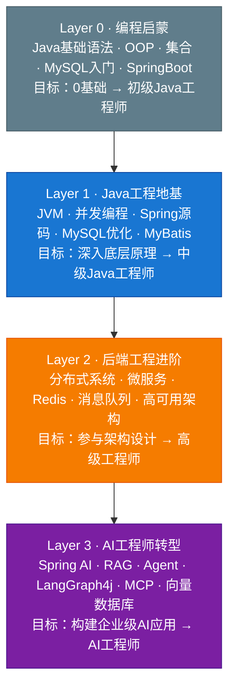
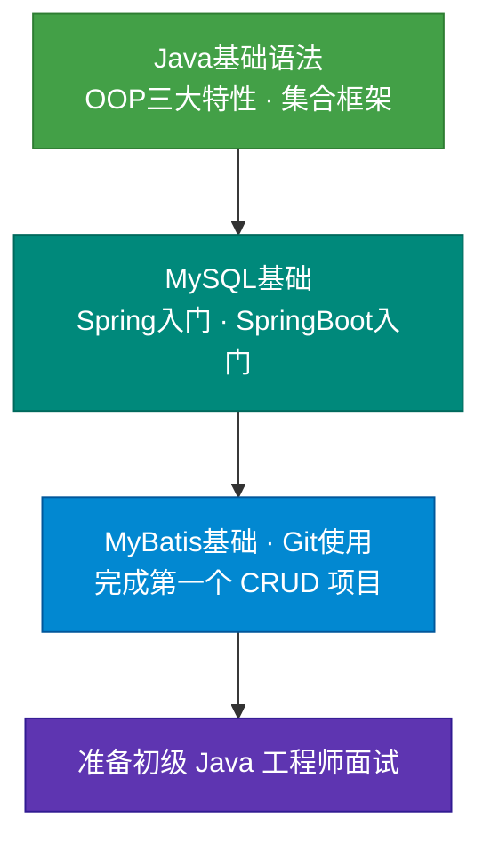
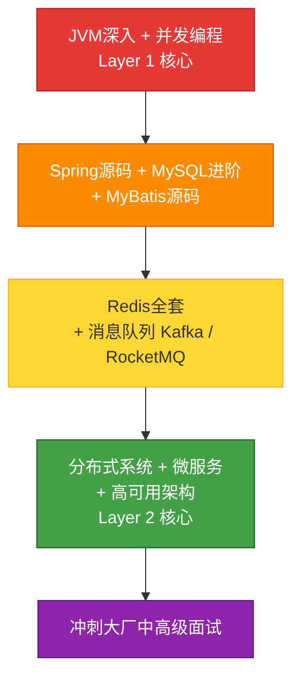
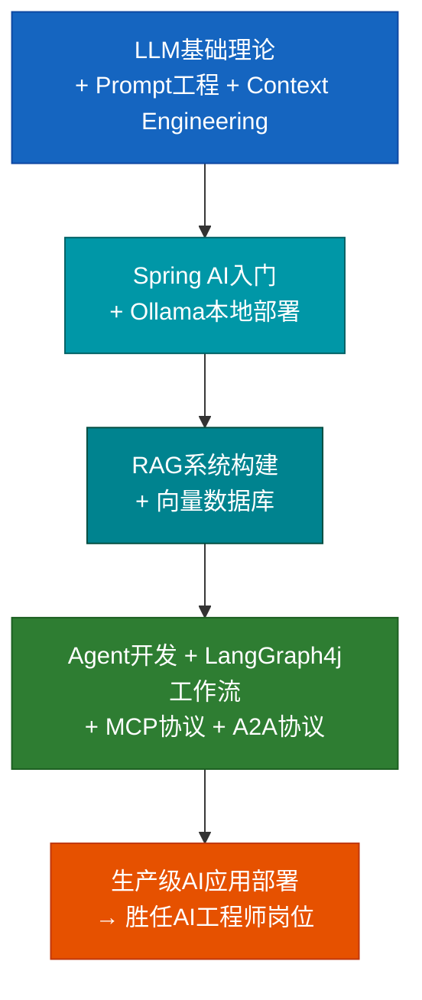

# Java AI 工程师加速路径

> 从 Java 入门到 AI 工程师的完整成长手册

[](.)
[](.)
[](.)
[](.)
[](.)
[](.)
[](.)

---

## 加入知识星球，加速成长

> **扫码加入「AI 工程师加速社区」知识星球，获取深度内容、源码解析、实战项目、1对1答疑**

<p align="center">
  <a href="https://wx.zsxq.com/group/88882121514552" target="_blank"></a>
</p>

**加入后你将获得：**

- 大厂一线面经实录（字节、阿里、腾讯、美团、京东、滴滴）
- 每周高频面试题精讲 + 答题模板
- 简历 1v1 修改服务（帮你写亮点，不做模板堆砌）
- AI Agent 开发从 0 到 1：RAG 知识库 / 多 Agent 工作流 / MCP 实战
- 企业级 Spring AI 项目完整源码
- 学员就业案例 & 转型经验分享

---

## 这个项目能帮你做什么？

与市面上「背八股文」的面试指南不同，本项目有三个核心定位：

1. **系统成长，而非碎片刷题**：从编程零基础到 AI 工程师，四层体系循序渐进，每一步都有清晰的目标和路径。
2. **每个知识点标注 AI 时代价值**：2026年哪些技术仍然核心，哪些即将被 AI 替代，哪些需要新增——文档里有明确说明。
3. **Java 工程师专属 AI 转型路径**：不是通用 AI 教程，而是专为有 Java 基础的工程师设计的最短转型路径，以 Spring AI / LangGraph4j / MCP 为核心，而非 Python 生态。

---

## 四层成长体系



| 层级 | 阶段名称 | 核心内容 | 周期参考 | 目标岗位 |
|------|----------|----------|----------|----------|
| Layer 0 | 编程启蒙 | Java语法、OOP、集合、MySQL入门、SpringBoot基础 | 3～6个月 | 初级Java工程师 |
| Layer 1 | Java工程地基 | JVM、并发编程、Spring源码、MySQL优化 | 4～6个月 | 中级Java工程师 |
| Layer 2 | 后端工程进阶 | 分布式、微服务、Redis、消息队列、高可用架构 | 4～6个月 | 高级/架构师 |
| Layer 3 | AI工程师转型 | LLM基础、Spring AI、RAG、Agent、MCP | 3～6个月 | AI工程师 |

---

## 三条快速导航路径

### 路径一：入门程序员（0基础 → 初级工程师）

适合人群：编程小白、转行人员、在校学生



详细路径文档：[从零开始：入门程序员成长路径](./docs/learning-path/01-beginner-to-junior.md)

---

### 路径二：Java 工程师晋升（初级 → 中高级）

适合人群：1～3年Java开发经验，想突破天花板的工程师



详细路径文档：[进阶之路：中高级Java工程师成长路径](./docs/learning-path/02-junior-to-senior.md)

---

### 路径三：AI 工程师转型（Java工程师 → AI工程师）

适合人群：有Java后端基础，想向AI方向转型的工程师



详细路径文档：[转型路径：Java工程师 → AI工程师](./docs/learning-path/03-senior-to-ai-engineer.md)

---

## 与 JavaGuide 的核心差异

| 对比维度 | JavaGuide | 本项目 |
|----------|-----------|--------|
| 定位 | 面试八股文备战 | 系统成长路径 + AI转型 |
| 受众 | 准备跳槽的Java工程师 | 从入门到AI工程师的全阶段 |
| AI内容 | 无 | Spring AI / RAG / Agent / MCP 完整体系 |
| 学习路径 | 以知识点为主 | 以成长目标为主，路径清晰 |
| AI时代价值标注 | 无 | 每个模块明确标注AI时代的核心价值 |
| 代码示例 | 较少 | 完整可运行的Spring AI Demo |
| 转型支撑 | 无 | Java工程师专属AI转型路径 |

---

## 完整目录导航

### Layer 0：编程启蒙

| 文档 | 内容 | AI时代价值 | 进度 |
|------|------|-----------|------|
| [Java 基础核心](./docs/java-basics/01-java-basics-core.md) | 数据类型、OOP、异常、泛型、反射 | 反射/泛型在AI框架中大量使用，长期核心 | ✅ |
| [Java 集合框架源码](./docs/java-basics/02-collections-source.md) | ArrayList/LinkedList/HashMap/ConcurrentHashMap 源码 | 向量数据库客户端、AI流式处理均依赖集合框架 | ✅ |
| [Java 常用数据结构](./docs/data-structures-algorithms/01-data-structures.md) | 数组、链表、栈、队列、树、堆、图 | 图结构是理解Agent工作流的基础 | ✅ |
| [算法精讲](./docs/data-structures-algorithms/02-algorithms.md) | 排序/查找/动态规划/回溯/图算法 | AI辅助编程时代，算法理解比手写更重要 | ✅ |

### Layer 1：Java 工程地基

#### 并发编程与锁机制

| 文档 | 内容 | AI时代价值 | 进度 |
|------|------|-----------|------|
| [并发编程基础](./docs/concurrent-locks/01-concurrent-basics.md) | 线程生命周期、线程池、volatile、synchronized | AI推理服务高并发场景的核心能力 | ✅ |
| [Java 锁机制深度剖析](./docs/concurrent-locks/02-lock-mechanism.md) | 偏向锁/轻量锁/重量锁/自旋锁、锁升级全流程 | 理解并发本质，写出线程安全的AI应用 | ✅ |
| [JUC 并发工具包](./docs/concurrent-locks/03-juc.md) | AQS源码、ReentrantLock、CountDownLatch、Semaphore | 流式输出（SSE）、异步Agent调度必备 | ✅ |
| [JDK 新特性（9~21）](./docs/concurrent-locks/04-jdk-new-features.md) | VirtualThread、Record、Sealed Class | 虚拟线程是AI高并发服务的性能利器 | ✅ |

#### Spring 全家桶

| 文档 | 内容 | AI时代价值 | 进度 |
|------|------|-----------|------|
| [Spring IoC/DI 源码](./docs/spring/01-spring-ioc-source.md) | BeanFactory/ApplicationContext/Bean生命周期 | Spring AI的ChatClient底层依赖IoC容器 | ✅ |
| [Spring AOP 源码](./docs/spring/02-spring-aop-source.md) | 动态代理/JDK代理/CGLIB/切面执行链 | AI应用的可观测性（Tracing/Logging）依赖AOP | ✅ |
| [Spring 事务机制](./docs/spring/03-spring-transaction.md) | 事务传播/隔离级别/@Transactional失效场景 | AI写入向量数据库的一致性保障 | ✅ |
| [Spring 启动机制](./docs/spring/04-spring-startup.md) | refresh() 12步骤源码全解析 | 理解Spring AI AutoConfiguration的加载原理 | ✅ |
| [SpringBoot 自动装配](./docs/springboot/01-auto-configuration.md) | @SpringBootApplication/SPI/AutoConfigurationImportSelector | Spring AI所有组件均通过AutoConfig注入 | ✅ |
| [SpringBoot 单例与循环依赖](./docs/springboot/02-singleton-pattern.md) | 单例Bean原理、三级缓存解循环依赖 | AI应用多Bean协作时循环依赖排查必备 | ✅ |

#### MySQL 数据库

| 文档 | 内容 | AI时代价值 | 进度 |
|------|------|-----------|------|
| [MySQL 基础与 SQL](./docs/mysql/01-mysql-basics.md) | DDL/DML/DCL、SQL执行顺序 | RAG系统的元数据管理依赖MySQL | ✅ |
| [索引原理：聚簇与非聚簇](./docs/mysql/02-index-clustered.md) | B+树结构、聚簇索引、覆盖索引 | 向量+关系型混合检索需深入理解索引 | ✅ |
| [MySQL 事务与锁](./docs/mysql/03-transaction-lock.md) | MVCC/ACID/行锁/间隙锁/死锁 | 长期核心，AI不会替代数据一致性需求 | ✅ |
| [SQL 优化与执行计划](./docs/mysql/04-sql-optimization.md) | EXPLAIN解析、慢查询、索引失效 | AI应用性能瓶颈往往在数据库层 | ✅ |

#### MyBatis

| 文档 | 内容 | AI时代价值 | 进度 |
|------|------|-----------|------|
| [MyBatis 核心原理](./docs/mybatis/01-mybatis-core.md) | SqlSession/Executor/缓存机制 | AI生成SQL的正确性验证需要理解底层机制 | ✅ |
| [MyBatis 源码剖析](./docs/mybatis/02-mybatis-source.md) | 配置加载/SQL解析/结果映射/插件 | 了解插件机制可扩展AI增强的持久化能力 | ✅ |

### Layer 2：后端工程进阶

#### 消息队列

| 文档 | 内容 | AI时代价值 | 进度 |
|------|------|-----------|------|
| [消息队列选型与对比](./docs/message-queue/01-mq-comparison.md) | Kafka/RabbitMQ/RocketMQ 核心对比 | AI任务异步化（文档处理/Embedding计算）必备 | ✅ |
| [Kafka 深度解析](./docs/message-queue/02-kafka.md) | Partition/Replica/消费者组/零拷贝 | AI数据流水线的核心基础设施 | ✅ |
| [RabbitMQ 深度解析](./docs/message-queue/03-rabbitmq.md) | Exchange/Queue/消息确认/死信队列 | AI任务调度与异步回调的常用方案 | ✅ |
| [RocketMQ 深度解析](./docs/message-queue/04-rocketmq.md) | 顺序消息/事务消息/延迟消息 | 国内AI应用生产环境高频选型 | ✅ |

#### Redis · 分布式 · 微服务 · 高可用（规划中）

| 文档 | 内容 | AI时代价值 | 进度 |
|------|------|-----------|------|
| Redis全套（数据结构/持久化/集群） | 缓存击穿、分布式锁、发布订阅 | AI应用的会话缓存、向量缓存层 | 规划中 |
| 分布式系统（CAP/分布式锁/事务） | Raft协议、Seata、分布式ID | 多Agent系统的分布式协调基础 | 规划中 |
| 微服务（Spring Cloud Alibaba） | Nacos/Sentinel/Gateway | AI微服务网关鉴权、限流 | 规划中 |
| 高可用设计（限流/熔断/缓存） | Resilience4j、多级缓存 | AI推理服务容错设计 | 规划中 |

### Layer 3：AI 工程师转型

| 文档 | 内容 | AI时代价值 | 进度 |
|------|------|-----------|------|
| [Ollama 本地大模型部署](./docs/ai-engineering/01-ollama-setup.md) | 安装、模型管理、API调用、Docker部署 | 本地化部署是企业AI落地的核心需求 | ✅ |
| [Spring AI + Ollama 整合](./docs/ai-engineering/02-spring-ai-integration.md) | ChatClient、多轮对话、RAG、Function Calling | Java工程师构建AI应用的首选框架 | ✅ |
| [Spring AI Alibaba + LangGraph](./docs/ai-engineering/03-spring-ai-alibaba-langgraph.md) | 通义千问接入、LangGraph4j 状态机、多智能体 | 国内大厂落地首选，岗位需求量大 | ✅ |
| [LangChain4j 实战](./docs/ai-engineering/04-langchain4j.md) | AI Service接口、@Tool工具调用、RAG管道 | Java生态AI开发的重要备选方案 | ✅ |

### 学习路径导航文档

| 文档 | 适合人群 |
|------|----------|
| [从零开始：入门程序员成长路径](./docs/learning-path/01-beginner-to-junior.md) | 编程零基础 / 转行人员 |
| [进阶之路：中高级Java工程师成长路径](./docs/learning-path/02-junior-to-senior.md) | 1～3年经验Java开发 |
| [转型路径：Java工程师 → AI工程师](./docs/learning-path/03-senior-to-ai-engineer.md) | 有Java基础想转AI方向 |

### 实战代码 Demo

| 目录 | 内容 |
|------|------|
| [code/algorithms/](./code/algorithms/) | 快排、归并、堆排、动态规划、二分、回溯 + N皇后 |
| [code/concurrent-demo/](./code/concurrent-demo/) | ThreadPoolExecutor、ReentrantLock、ReadWriteLock、CAS |
| [code/data-structures/](./code/data-structures/) | 链表（LRU/反转/回文）、二叉树（DFS/BFS/LCA） |
| [code/spring-demo/](./code/spring-demo/) | Spring AI + Ollama 完整 Demo（含 RAG 问答接口） |

### 面试经验

| 章节 | 内容 |
|------|------|
| [高频面试题合集](./docs/interview-experience/01-high-frequency.md) | 100道高频八股文 + 标准答案模板 |
| [大厂面经实录](./docs/interview-experience/02-interview-records.md) | 字节/阿里/腾讯/美团真实面经 |

---

## 快速启动 Spring AI Demo

```bash
# 1. 安装并启动 Ollama
brew install ollama && ollama serve

# 2. 拉取模型
ollama pull qwen2.5
ollama pull nomic-embed-text

# 3. 启动 Spring Boot 应用
cd code/spring-demo && mvn spring-boot:run

# 4. 加载示例知识库
curl -X POST http://localhost:8080/api/rag/load-sample

# 5. 进行 RAG 问答
curl -X POST http://localhost:8080/api/rag/ask \
  -H "Content-Type: application/json" \
  -d '{"question": "HashMap和ConcurrentHashMap有什么区别？"}'
```

---

## 贡献说明

欢迎提 Issue / PR！贡献方式：

1. **补充文档**：按现有格式在对应目录新建或完善 `.md` 文件
2. **提交代码示例**：在 `code/` 目录下提交可运行的示例代码
3. **纠错修订**：发现错误或表述不清，直接提 PR
4. **学习路径反馈**：用过这份指南有收获或建议，欢迎开 Issue 分享

**贡献规范：**
- 文档以中文为主，代码注释中英文均可
- 每个知识点请标注「AI时代价值」，说明该技术在 AI 时代的重要性
- 代码示例需可独立运行，附上运行说明

如果这份指南对你有帮助，请给个 Star，让更多 Java 工程师看到这条转型路径！

> 更深度的内容、面经分享、简历修改、AI实战项目源码 → 扫码加入上方知识星球
