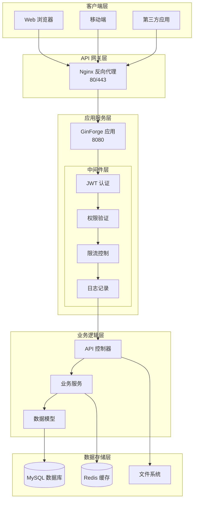

# 🚀 GinForge - Go Gin Web Framework

<div align="center">


**🔥 基于 Gin 框架的企业级 Web 开发脚手架**

[快速开始](#-快速开始) • [项目架构](#🏗️-项目架构) • [核心功能](#⚡-核心功能) • [API 文档](#📚-api-文档) • [部署指南](#🚀-部署指南)

</div>

---

## 📖 项目简介

GinForge 是一个基于 Go 语言 Gin 框架构建的企业级 Web 开发脚手架，集成了现代 Web 应用开发所需的核心组件和最佳实践。

### 🎯 核心特性

- **🏗️ 分层架构** - 清晰的 MVC 架构，易于维护和扩展
- **🔐 JWT 认证** - 基于 JSON Web Token 的用户认证系统
- **🛡️ 中间件系统** - 权限验证、限流、日志等中间件支持
- **🗄️ 数据库集成** - GORM ORM 支持 MySQL、PostgreSQL、SQLite
- **🔥 缓存系统** - Redis 缓存集成，提升应用性能
- **📁 文件上传** - 支持图片等多种文件类型上传
- **🎨 图片验证码** - 内置验证码生成和验证功能
- **⚙️ 配置管理** - YAML 配置文件，支持多环境配置
- **📊 日志系统** - 基于 Logrus 的结构化日志记录
- **🖥️ CLI 工具** - 内置命令行工具，支持用户管理等操作

---

## 🏗️ 项目架构

### 📁 目录结构

```
GinForge/
├── api/                    # API 控制器层
│   ├── user_api/          # 用户相关 API
│   ├── image_api/         # 图片相关 API
│   └── captcha_api/       # 验证码相关 API
├── config/                # 配置文件结构定义
├── core/                  # 核心初始化模块
├── flags/                 # 命令行工具
├── global/                # 全局变量
├── middleware/            # 中间件
├── models/                # 数据模型
├── routers/               # 路由配置
├── service/               # 业务逻辑层
├── utils/                 # 工具函数
├── init/                  # Docker Compose 部署配置
├── uploads/               # 文件上传目录
├── logs/                  # 日志文件目录
├── settings.yaml          # 主配置文件
├── main.go                # 应用入口
└── Dockerfile             # Docker 构建文件
```

### 🔄 架构图



---

## 🚀 快速开始

### 🔧 环境要求

- **Go**: 1.18+
- **MySQL**: 8.0+
- **Redis**: 5.0+
- **Docker**: 20.10+ (可选)

### 📦 安装步骤

#### 1. 🛠️ 克隆项目
```bash
git clone <your-repo-url>
cd GinForge
```

#### 2. ⚙️ 配置数据库
```bash
# 创建数据库
mysql -u root -p -e "CREATE DATABASE forge_db CHARACTER SET utf8mb4 COLLATE utf8mb4_unicode_ci;"

# 修改配置文件
cp settings.yaml settings_dev.yaml
# 编辑 settings_dev.yaml 中的数据库连接信息
```

#### 3. 🔨 编译运行
```bash
# 下载依赖
go mod tidy

# 编译项目
go build -o main .

# 运行应用
./main -h          # 查看帮助
./main migrate     # 数据库迁移
./main user create # 创建用户
./main run         # 启动服务
```

#### 4. 🐳 Docker 部署 (推荐)
```bash
# 进入部署目录
cd init

# 一键启动所有服务
docker-compose up -d

# 查看服务状态
docker-compose ps
```

### 🌐 访问地址

- **Web 应用**: `http://localhost`
- **API 服务**: `http://localhost/api`
- **API 文档**: `http://localhost/api/docs` (如果启用 Swagger)

---

## ⚡ 核心功能

### 🔐 JWT 认证系统

#### 📋 功能特性
- 基于 HS256 算法的 JWT 令牌生成和验证
- 支持令牌过期时间和签发人配置
- Redis 黑名单机制，支持令牌注销
- 角色权限控制（管理员/普通用户）

#### 🔧 使用示例

```go
// 生成 JWT 令牌
token, err := jwts.GenerateToken(jwts.Claims{
    UserID:   user.ID,
    Username: user.Username,
    Role:     user.RoleID,
})

// 解析 JWT 令牌
claims, err := jwts.ParseToken(token)
```

#### 📝 API 调用

```bash
# 用户登录
curl -X POST http://localhost/api/user/login \
  -H "Content-Type: application/json" \
  -d '{"username":"admin","password":"123456"}'

# 使用 Token 访问受保护接口
curl -X GET http://localhost/api/users \
  -H "token: your-jwt-token"
```

### 🛡️ 中间件系统

#### 🔧 内置中间件

| 中间件 | 功能 | 用途 |
|--------|------|------|
| `AuthMiddleware` | JWT 认证 | 验证用户登录状态 |
| `AdminMiddleware` | 管理员权限 | 验证管理员权限 |
| `LimitMiddleware` | 请求限流 | 防止接口滥用 |
| `BindJsonMiddleware` | JSON 绑定 | 绑定 JSON 请求体 |
| `BindQueryMiddleware` | 查询参数绑定 | 绑定 URL 查询参数 |

#### 📝 使用示例

```go
// 路由中使用中间件
router.GET("/users", 
    middleware.LimitMiddleware(10),        // 限流：10次/秒
    middleware.AuthMiddleware,             // JWT 认证
    middleware.AdminMiddleware,            // 管理员权限
    app.UserList)
```

### 🎨 图片验证码

#### 🔧 功能特性
- 基于 Base64 编码的图片验证码
- 支持自定义验证码长度和复杂度
- 验证码有效期控制
- 防机器人验证机制

#### 📝 API 接口

```bash
# 生成验证码
curl -X GET http://localhost/api/captcha/generate

# 验证码验证（登录时）
curl -X POST http://localhost/api/user/login \
  -H "Content-Type: application/json" \
  -d '{"username":"admin","password":"123456","captcha":"ABCD"}'
```

### 📁 文件上传

#### 🔧 功能特性
- 支持图片等多种文件类型
- 文件大小限制（默认 2MB）
- 文件类型验证
- 自动生成唯一文件名
- 支持本地存储和云存储

#### 📝 API 接口

```bash
# 上传图片
curl -X POST http://localhost/api/image/upload \
  -H "token: your-jwt-token" \
  -F "file=@/path/to/image.jpg"

# 访问上传的文件
http://localhost/uploads/images/unique-filename.jpg
```

### 🖥️ CLI 工具

#### 🔧 内置命令

| 命令 | 功能 | 示例 |
|------|------|------|
| `run` | 启动 Web 服务 | `./main run` |
| `migrate` | 数据库迁移 | `./main migrate` |
| `user create` | 创建用户 | `./main user create` |
| `user list` | 列出用户 | `./main user list` |
| `db create` | 创建数据库 | `./main db create` |

#### 📝 使用示例

```bash
# 查看帮助
./main -h

# 创建管理员用户
./main user create
# 选择角色: 1
# 输入用户名: admin
# 输入密码: ******
# 确认密码: ******

# 启动服务
./main run
```

---

## 📚 API 文档

### 🔐 用户认证

#### 登录
```http
POST /api/user/login
Content-Type: application/json

{
  "username": "admin",
  "password": "123456",
  "captcha": "ABCD"
}
```

#### 登出
```http
POST /api/user/logout
token: your-jwt-token
```

### 👥 用户管理

#### 获取用户列表
```http
GET /api/users?page=1&limit=10&key=admin&order=id desc
token: your-jwt-token
```

#### 响应格式
```json
{
  "code": 0,
  "data": {
    "list": [
      {
        "id": 1,
        "username": "admin",
        "nickname": "管理员",
        "roleID": 1,
        "createAt": "2024-01-01T00:00:00Z",
        "updateAt": "2024-01-01T00:00:00Z"
      }
    ],
    "count": 1
  },
  "msg": "success"
}
```

### 📷 图片验证码

#### 生成验证码
```http
GET /api/captcha/generate
```

#### 响应格式
```json
{
  "code": 0,
  "data": {
    "captchaId": "uuid-string",
    "captchaImage": "base64-image-data",
    "expireTime": 300
  },
  "msg": "success"
}
```

### 📁 文件上传

#### 上传图片
```http
POST /api/image/upload
token: your-jwt-token
Content-Type: multipart/form-data

file: [binary file data]
```

#### 响应格式
```json
{
  "code": 0,
  "data": {
    "fileName": "unique-filename.jpg",
    "fileUrl": "/uploads/images/unique-filename.jpg",
    "fileSize": 1024000
  },
  "msg": "上传成功"
}
```

---

## ⚙️ 配置说明

### 📄 主配置文件 (settings.yaml)

```yaml
# 数据库配置
db:
  mode: mysql              # 数据库类型
  db_name: "forge_db"      # 数据库名称
  host: 127.0.0.1         # 数据库地址
  port: 3306              # 数据库端口
  user: "root"            # 数据库用户
  password: ""            # 数据库密码

# Redis 配置
redis:
  addr: "127.0.0.1:6379"  # Redis 地址
  password: ""            # Redis 密码
  db: 1                   # Redis 数据库

# 系统配置
system:
  mode: release           # 运行模式: debug/release
  ip: "127.0.0.1"         # 服务地址
  port: 8080              # 服务端口

# JWT 配置
jwt:
  secret: "123456"        # JWT 密钥
  expires: 24             # 过期时间(小时)
  issuer: "forge"         # 签发人

# 文件上传配置
upload:
  size: 2                 # 文件大小限制(MB)
  dir: images             # 上传目录

# 站点配置
site:
  login:
    captcha: true         # 是否启用登录验证码
```

### 🌍 多环境配置

```bash
# 开发环境
cp settings.yaml settings_dev.yaml
# 修改 settings_dev.yaml 中的配置

# 生产环境
cp settings.yaml settings_prod.yaml
# 修改 settings_prod.yaml 中的配置
```

---

## 🚀 部署指南

### 🐳 Docker 部署

#### 🔧 准备工作
```bash
# 安装 Docker 和 Docker Compose
# 确保 Docker 服务正在运行

# 进入部署目录
cd init
```

#### 🚀 快速部署
```bash
# 启动所有服务
docker-compose up -d

# 查看服务状态
docker-compose ps

# 查看服务日志
docker-compose logs -f
```

#### 🛠️ 管理命令
```bash
# 停止服务
docker-compose down

# 重启服务
docker-compose restart

# 重新构建并启动
docker-compose up -d --build

# 进入容器调试
docker exec -it init-server-1 bash
```

### 📦 二进制部署

#### 🔨 编译发布
```bash
# 构建二进制文件
go build -o ginforge .

# 创建部署目录
mkdir -p /opt/ginforge/{logs,uploads,config}

# 复制文件
cp ginforge /opt/ginforge/
cp settings.yaml /opt/ginforge/config/
chmod +x /opt/ginforge/ginforge
```

#### 🚀 启动服务
```bash
# 创建系统服务 (Linux)
sudo tee /etc/systemd/system/ginforge.service > /dev/null <<EOF
[Unit]
Description=GinForge Web Service
After=network.target

[Service]
Type=simple
User=root
WorkingDirectory=/opt/ginforge
ExecStart=/opt/ginforge/ginforge run
Restart=always
RestartSec=5

[Install]
WantedBy=multi-user.target
EOF

# 启动服务
sudo systemctl daemon-reload
sudo systemctl enable ginforge
sudo systemctl start ginforge
```

### 🔒 Nginx 反向代理

#### 📋 Nginx 配置
```nginx
server {
    listen 80;
    server_name your-domain.com;
    
    # 重定向到 HTTPS
    return 301 https://$server_name$request_uri;
}

server {
    listen 443 ssl;
    server_name your-domain.com;
    
    # SSL 证书配置
    ssl_certificate /path/to/cert.pem;
    ssl_certificate_key /path/to/cert.key;
    
    # 静态文件
    location / {
        root /path/to/frontend/dist;
        try_files $uri $uri/ /index.html;
    }
    
    # API 反向代理
    location /api/ {
        proxy_pass http://127.0.0.1:8080;
        proxy_set_header Host $host;
        proxy_set_header X-Real-IP $remote_addr;
        proxy_set_header X-Forwarded-For $proxy_add_x_forwarded_for;
    }
    
    # 文件上传目录
    location /uploads {
        alias /opt/ginforge/uploads;
    }
}
```

---

## 🔍 开发指南

### 🛠️ 开发环境搭建

#### 1. 📦 安装依赖
```bash
# 克隆项目
git clone <repository-url>
cd GinForge

# 下载 Go 依赖
go mod tidy

# 安装开发工具
go install github.com/swaggo/swag/cmd/swag@latest
```

#### 2. ⚙️ 配置开发环境
```bash
# 创建开发配置文件
cp settings.yaml settings_dev.yaml

# 修改数据库连接
vim settings_dev.yaml
```

#### 3. 🚀 启动开发服务器
```bash
# 启动开发服务器
go run main.go run

# 或者使用 air 实时重载
go install github.com/cosmtrek/air@latest
air
```

### 📝 代码规范

#### 🏗️ 项目结构规范
```
api/          # API 控制器层 - 处理 HTTP 请求
service/      # 业务逻辑层 - 处理业务逻辑
models/       # 数据模型层 - 数据库模型定义
middleware/   # 中间件层 - 请求处理中间件
utils/        # 工具函数层 - 通用工具函数
config/       # 配置层 - 配置结构定义
core/         # 核心层 - 核心初始化逻辑
global/       # 全局变量 - 全局变量定义
```

#### 🔧 命名规范
- **文件名**: 下划线命名法 (user_model.go)
- **函数名**: 驼峰命名法 (GetUserList)
- **变量名**: 驼峰命名法 (userName)
- **常量名**: 下划线命名法 (MAX_SIZE)
- **结构体名**: 驼峰命名法 (UserModel)

### 🧪 单元测试

#### 📝 编写测试
```go
// user_api_test.go
package user_api

import (
    "testing"
    "github.com/stretchr/testify/assert"
)

func TestUserLogin(t *testing.T) {
    // 测试用户登录逻辑
    assert.True(t, true, "This is a test")
}
```

#### 🚀 运行测试
```bash
# 运行所有测试
go test ./...

# 运行特定包的测试
go test ./api/user_api

# 生成测试覆盖率报告
go test -cover ./...
```

---

## 🔧 故障排除

### ❌ 常见问题

#### 问题 1: 数据库连接失败
```
Error 1045: Access denied for user 'root'@'localhost'
```
**解决方案**:
```bash
# 检查数据库服务状态
systemctl status mysql

# 验证数据库连接
mysql -u root -p

# 检查配置文件中的数据库信息
cat settings.yaml | grep db
```

#### 问题 2: JWT 令牌验证失败
```
token is expired or not valid yet
```
**解决方案**:
```bash
# 检查系统时间
date

# 检查 JWT 配置
cat settings.yaml | grep jwt

# 重新生成令牌
curl -X POST http://localhost/api/user/login \
  -H "Content-Type: application/json" \
  -d '{"username":"admin","password":"123456"}'
```

#### 问题 3: 文件上传失败
```
the request entity too large
```
**解决方案**:
```bash
# 检查文件大小限制
cat settings.yaml | grep upload

# 检查 Nginx 配置
client_max_body_size 10M;
```

#### 问题 4: Redis 连接失败
```
dial tcp 127.0.0.1:6379: connect: connection refused
```
**解决方案**:
```bash
# 检查 Redis 服务状态
systemctl status redis

# 启动 Redis 服务
systemctl start redis

# 测试 Redis 连接
redis-cli ping
```

### 📊 性能优化

#### 🚀 应用性能优化
```go
// 启用 Gzip 压缩
r.Use(gzip.Gzip(gzip.DefaultCompression))

// 启用缓存
r.Use(middleware.CacheMiddleware())

// 数据库查询优化
db.Where("name = ?", name).First(&user)
db.Preload("Orders").Find(&users)
```

#### 🔧 数据库优化
```sql
-- 创建索引
CREATE INDEX idx_username ON user_models(username);
CREATE INDEX idx_create_time ON user_models(create_time);

-- 查询优化
EXPLAIN SELECT * FROM user_models WHERE username = 'admin';
```

---

## 🤝 贡献指南

### 📝 提交规范

#### 🔖 Commit 格式
```
<type>(<scope>): <subject>

<body>

<footer>
```

#### 🏷️ 类型说明
- `feat`: 新功能
- `fix`: 修复问题
- `docs`: 文档修改
- `style`: 代码格式修改
- `refactor`: 代码重构
- `test`: 测试用例修改
- `chore`: 其他修改

#### 📝 示例
```
feat(user): add user registration feature
fix(auth): fix jwt token validation issue
docs(readme): update installation guide
```

### 🚀 开发流程

1. **Fork** 项目
2. **Clone** 到本地
3. **创建** 功能分支
4. **开发** 新功能
5. **测试** 功能完整性
6. **提交** 代码更改
7. **推送** 到远程仓库
8. **创建** Pull Request

---

## 📄 许可证

本项目采用 **MIT 许可证** - 查看 [LICENSE](LICENSE) 文件了解详情。

---

## 🙏 致谢

感谢以下开源项目的贡献：

- [Gin](https://github.com/gin-gonic/gin) - Go Web 框架
- [GORM](https://github.com/go-gorm/gorm) - Go ORM 库
- [Redis](https://redis.io/) - 内存数据库
- [JWT](https://jwt.io/) - JSON Web Token
- [Logrus](https://github.com/sirupsen/logrus) - 结构化日志库

---

<div align="center">

**🎉 感谢使用 GinForge！**

如有问题或建议，请提交 [Issue](https://github.com/your-repo/issues) 或 [Pull Request](https://github.com/your-repo/pulls)


</div>