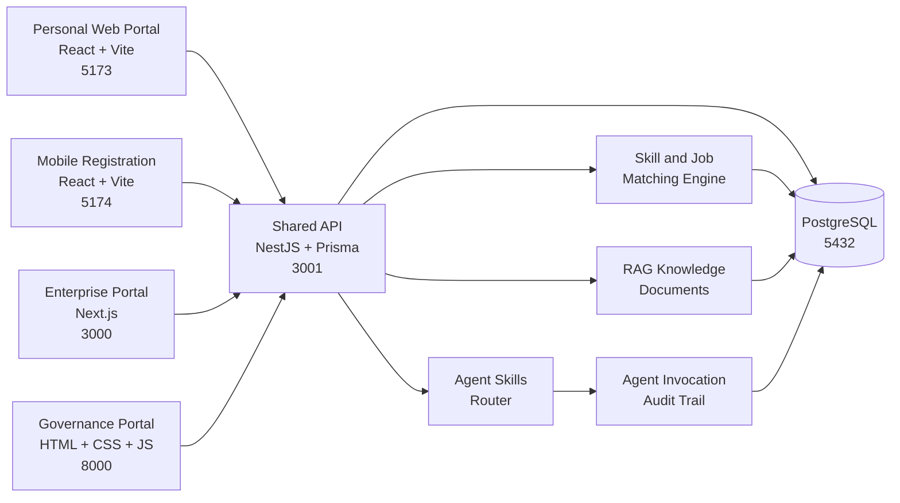
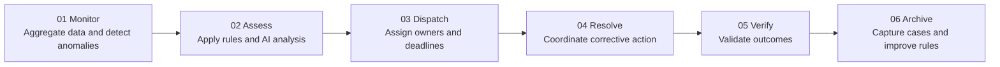
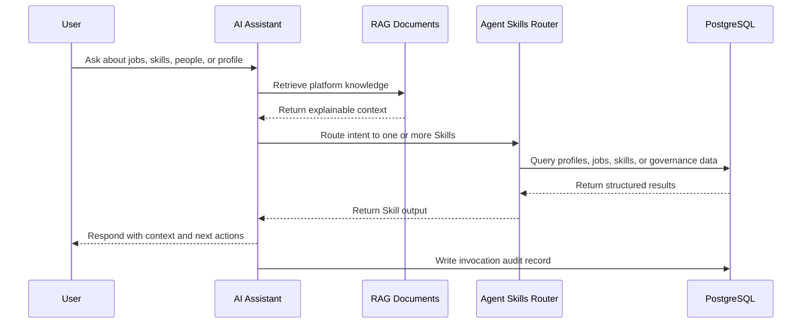
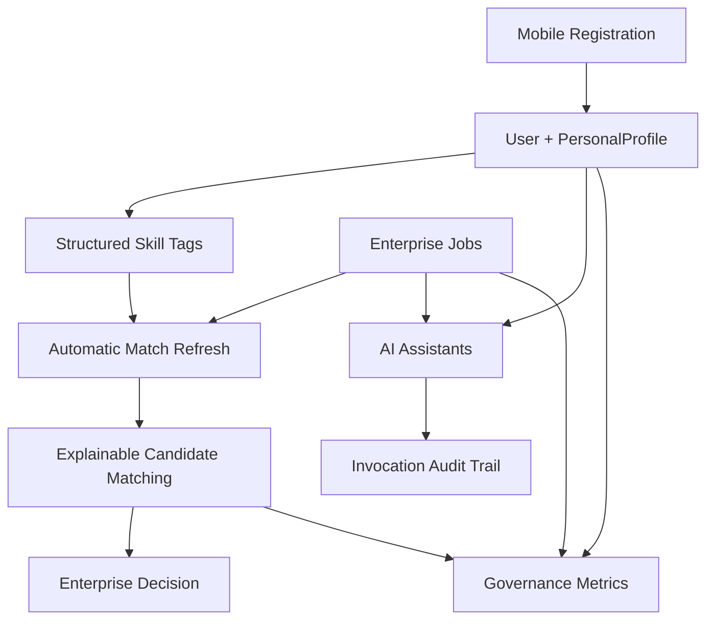

# WorkMesh

**English** | [简体中文](README.zh.md)

> Make every capability visible. Help every person affected by the AI transition find the next meaningful opportunity faster.

WorkMesh, also referred to as the Future Work Platform, is an open-source prototype for future employment and workforce collaboration.

It explores how people, skills, jobs, enterprise demand, service fulfillment, governance operations, and AI-assisted decision support can be connected through one shared data loop. The goal is not to build another job board. The goal is to explore a more efficient, transparent, and explainable coordination network that offers more dignified support to people navigating unemployment, career transitions, flexible work, and continuous learning.


---

## A Note from the Initiator

I am an ordinary humanities graduate, not a professional software engineer. Most of the code in this repository was completed with the help of AI. I was surprised by what AI could do, and I also felt the shared power behind `Hello World`. That led me to explore a skill-sharing system built around the idea of "open-source skills." As more people face unemployment or career disruption during the AI transition, perhaps a system like this can become useful.

For the system to work in the real world, it would need backing from a government body or a large organization with strong public credibility. It aims to respond to several challenges: supporting people who lose their jobs, reducing resource imbalances between enterprises of different sizes, and improving oversight of capital flows.

This is as far as I can take the system with my current abilities. If you would like to contribute to the future, you can improve it through technology or share it so more people can prepare earlier.

---

## Why This Exists

Traditional employment systems often split the same person into disconnected records: a resume on a recruitment website, training history on another platform, job-seeking status scattered across different systems, and delayed statistical reports on the governance side.

WorkMesh explores a different model:

1. A person registers once and receives a unique identity reference through a trusted government body or large organization, allowing a durable personal profile to grow over time. Future exploration may include Web3 technologies to make identity more trustworthy, unique, and resistant to tampering.
2. An enterprise registers once and receives a unique identity reference through a trusted government body or large organization, allowing enterprise information to accumulate over time.
3. A government body or trusted organization can use monitoring, governance, and allocation mechanisms to understand employment operations and encourage a more balanced flow of resources.
4. The platform can turn skill gaps into learning paths and next actions.
5. AI assistants can retrieve platform knowledge and invoke role-aware business capabilities.
6. Governance teams can understand employment operations through shared metrics, risks, tasks, and audit trails.

The intended result is a living employment collaboration network: when one profile changes, the rest of the system can respond.

---

## Platform Overview

This repository contains a locally runnable multi-portal system:

- A **Personal Web Portal** for workers, job seekers, and flexible talent.
- An **Enterprise Portal** for recruitment, supply-demand collaboration, fulfillment, assets, and finance.
- A **Governance Portal** for employment analysis, risk monitoring, and closed-loop resolution.
- A **Mobile Registration Portal** that creates an account and a uniquely linked personal profile in one flow.
- A **Shared API** for authentication, matching, RAG retrieval, Agent Skills, and cross-portal data access.

### Portal Map

| Service | Port | Entry URL | Primary Users | AI Surface |
| --- | ---: | --- | --- | --- |
| Enterprise Portal | `3000` | [http://localhost:3000/enterprise/dashboard](http://localhost:3000/enterprise/dashboard) | Recruiters, operators, enterprise admins | [Enterprise AI Assistant](http://localhost:3000/enterprise/ai) |
| Personal Web Portal | `5173` | [http://127.0.0.1:5173/#/ai-assistant](http://127.0.0.1:5173/#/ai-assistant) | Workers, job seekers, flexible talent | Opens in the Personal AI Workspace |
| Governance Portal | `8000` | [http://127.0.0.1:8000/#/en/cockpit](http://127.0.0.1:8000/#/en/cockpit) | Employment service and governance teams | [Bodao AI](http://127.0.0.1:8000/#/en/ai) |
| Mobile Registration Portal | `5174` | [http://127.0.0.1:5174/#/register](http://127.0.0.1:5174/#/register) | New users | Hands off to the Personal AI Workspace |
| Shared API and Swagger | `3001` | [http://localhost:3001/api/docs](http://localhost:3001/api/docs) | Developers and integration partners | RAG and Agent Skills endpoints |
| PostgreSQL | `5432` | `localhost:5432` | Shared infrastructure | Stores profiles, matching, RAG, and invocation audit records |

> In the table above, `localhost` and `127.0.0.1` refer to the visitor's own computer. Publishing the repository does not automatically create a public website. After downloading the repository and running `./deploy.sh` or `./start-local-demo.sh`, users can access the system locally through these URLs.
>
> When deploying WorkMesh to a cloud server, replace `localhost` with the server IP address or your own domain, for example `http://203.0.113.10:3000/enterprise/dashboard`. For production deployments, configure HTTPS and reverse proxy routing through Nginx, Caddy, or a cloud gateway. Separate subdomains such as `enterprise.example.com`, `personal.example.com`, `governance.example.com`, and `api.example.com` are recommended.

### Architecture



### Design Principles

- **One profile, many opportunities.** Registration creates a uniquely linked `User` and `PersonalProfile`.
- **Structured capability first.** Standardized skill tags provide the basis for explainable matching.
- **Cross-portal collaboration by default.** Personal profiles, enterprise jobs, and governance metrics share one database.
- **AI is more than a chat window.** Assistants can retrieve knowledge and route requests to business Skills.
- **Traceability matters.** Agent calls and governance workflows can leave audit records.
- **Prototype honesty.** The repository presents the product direction while making production hardening work explicit.

---

## Core Product Concept

The following mechanisms describe the long-term direction of WorkMesh. The current repository already implements some of them. Features that are not yet complete are marked clearly later in this document.

### Personal Profiles and Open-Source Skills

- **Skills become recognizable tags.** Whether someone works freelance or full time, they can continue adding their skills. When demand appears, the system can identify more suitable people.
- **Learning continues when skills are missing.** Users can study a target skill or publish a learning request so someone with that skill can teach them. After assessment, the learner can also receive the corresponding skill tag.
- **Everyone can share skills.** People can open-source what they know, teach others, and receive compensation. Knowledge and experience can keep moving between people. From `Hello World` to `Hello Skill`.
- **AI works through platform capabilities.** The assistant can call platform APIs instead of behaving like an isolated chatbot. Recommendations can take a person's current state into account, such as busy, available, or temporarily not working.

Example: if someone has an "electrical circuit repair" skill, and an enterprise or individual publishes a matching request, a future version of the system could combine skill tags with a nearby `30km` distance search.

### Enterprise Profiles and Supply-Demand Collaboration

- **Enterprises become recognizable tags.** Business scope, qualifications, and capabilities can become detailed tags. Professional and trusted tags should take effect only after governance-side review.
- **Enterprise scale is linked to fulfillment capacity.** The amount of orders an enterprise can accept through the platform can be connected to factors such as office space, staffing, and fulfillment capability. To increase its revenue limit, an enterprise should add the corresponding talent and production capacity.
- **Skill-based recruitment connects to the Personal Portal.** When an enterprise publishes a job, the platform can match suitable talent and help fill capability gaps quickly. Future versions may introduce recruitment deposits or similar trust mechanisms to reduce false job listings.
- **AI connects supply and demand.** Enterprises can publish collaboration offers and demand requests. AI can assist matching based on qualification tags and enterprise tags.

Example: if an enterprise has a "lawn mower manufacturing" tag, and another enterprise or individual needs a product, a large order, or production support, a future version of the system could prioritize qualified enterprises in the same city and encourage regional collaboration.

### Governance and Public Services

- **Trusted identity.** Provide unique identity references for people and enterprises to reduce duplicate entities and false information.
- **Tag governance.** Manage the recognition and review of skill tags and enterprise tags.
- **Entity governance.** Manage registered people, verified enterprises, active jobs, employment conversions, risk events, and pending tasks.
- **Layered governance.** Support national, provincial, municipal, and district perspectives.
- **Closed-loop resolution.** Move from monitoring and assessment to dispatch, coordinated resolution, verification, and archival review.

### Current Implementation and Future Direction

| Capability | Current Repository Status | Future Direction |
| --- | --- | --- |
| Unique personal profile | Implemented: `User` and `PersonalProfile` are uniquely linked | Integrate authoritative identity verification |
| Unique identity references for people and enterprises | Database entity IDs and integration tokens exist | Explore trusted organization backing, tamper-resistant credentials, and Web3 approaches |
| Skill and job matching | Implemented scoring based on skill tags, region, and experience | Add geospatial coordinates and `30km` radius search |
| Enterprise capability tag review | Product direction is defined | Build a tag review workflow |
| Enterprise scale and fulfillment quota | Employment quota and quota review prototype implemented | Improve operating metrics, order limits, and deposit rules |
| AI assistants | Keyword RAG, Skills routing, and invocation audits implemented | Add model orchestration, vector retrieval, and human confirmation boundaries |
| Governance loop | Cockpit, risk, and task views exist | Improve real dispatch, resolution, and verification workflows |

---

## Personal Web Portal

**Entry:** [http://127.0.0.1:5173/#/ai-assistant](http://127.0.0.1:5173/#/ai-assistant)

The Personal Portal is designed for people who genuinely need work opportunities. It gives users one place to understand their capabilities, discover opportunities, manage work, track income and credit, and decide what to learn next.

### Personal AI Workspace


The Personal Portal opens with an AI workspace so users can begin with a real question instead of learning a complex menu structure.

Core capabilities:

- Ask about today's tasks, recommended opportunities, orders, income, credit, and learning suggestions.
- Review AI recommendations based on the current profile and market demand.
- Use quick commands to move directly into the next action.
- Expand into detailed pages for jobs, skills, learning, exams, certificates, wallet, credit, and work status.
- Update skills and availability so recommendations can continue to improve.

### Personal Dashboard


The dashboard turns the same profile into an operational view: current availability, identity verification, credit, certificates, tasks, recommended jobs, income, and skill growth can all be reviewed in one place.

Technical notes:

- Framework: React 18, TypeScript, Vite, Tailwind CSS, Zustand.
- Router: `HashRouter`, with the AI workspace as the default route.
- Shared data access: local demo `X-Integration-Token`.
- AI search endpoint: `GET /api/v1/matching/ai/search?q=...`.

---

## Enterprise Portal

**Entry:** [http://localhost:3000/enterprise/dashboard](http://localhost:3000/enterprise/dashboard)

The Enterprise Portal is a complete enterprise workspace, not a single recruitment page. It organizes recruitment, supply-demand collaboration, fulfillment management, enterprise assets, finance, and compliance in one system.

### Enterprise Dashboard


Core capabilities:

- Review enterprise KPIs, activity, revenue, costs, profit, personnel, and operational summaries.
- Navigate recruitment, supply-demand collaboration, orders, fulfillment, assets, finance, compliance, tasks, and notifications.
- Use responsive desktop and mobile workspaces.
- Open the Enterprise AI Assistant directly from the primary navigation.

### Explainable Candidate Matching


Recruitment is connected to the shared skill graph:

- Browse candidates recommended for published roles.
- Compare match scores, skill tags, regions, recommendation state, and data source.
- See candidate lists refresh when personal profiles add relevant skills.
- Use structured matching evidence to support human judgment.
- Preserve access boundaries with enterprise-specific tokens.

### Enterprise AI Assistant


The Enterprise AI Assistant is a business collaboration assistant for real operational scenarios. Its quick commands show how enterprises can describe outcomes directly instead of navigating through every module:

- Hire an electrician.
- Request more employment quota.
- Review delivery risk.
- Generate a finance snapshot.

Technical notes:

- Framework: Next.js 16, React 19, TypeScript, Tailwind CSS, TanStack Query, Zustand.
- Desktop AI route: `/enterprise/ai`.
- Enterprise modules: dashboard, recruitment, supply-demand collaboration, orders and fulfillment, assets, finance, and compliance.
- Shared data client: `workmesh-business/src/lib/shared-api.ts`.

---

## Governance Portal

**Entry:** [http://127.0.0.1:8000/#/en/cockpit](http://127.0.0.1:8000/#/en/cockpit)

The Governance Portal turns cross-portal activity into an operational picture that employment service and public governance teams can understand. Its goal is not only to display data, but to move issues into a traceable resolution loop.

### National Governance Cockpit


Core capabilities:

- Manage registered people, verified enterprises, active jobs, employment conversions, risk events, and pending tasks.
- Support the recognition, review, and governance of skill tags and enterprise tags.
- Navigate entity governance, business supervision, risk and compliance, and platform governance.
- Switch between national, provincial, municipal, and district perspectives.
- Move from monitoring and assessment to archival review.

### Bodao AI Governance Assistant


Bodao AI demonstrates a governance assistant connected to six capability centers and thematic scenarios:

- Query national high-risk events and resolution progress.
- Analyze regions with the largest employment gaps.
- Generate governance operations reports.
- Identify tasks approaching SLA deadlines.

The assistant is explicitly positioned as a decision-support tool. Human review is still required before execution.

### Governance Loop



Technical notes:

- Framework: static HTML, CSS, and JavaScript.
- Core routes: `#/en/cockpit`, `#/en/ai`, `#/en/centers`, and `#/en/gis`.
- Governance metrics can be read from the Shared API with a governance integration token.

---

## Mobile Registration Portal

**Entry:** [http://127.0.0.1:5174/#/register](http://127.0.0.1:5174/#/register)


Registration is a critical part of the product loop. New users should not become disconnected accounts that cannot participate in matching.

Core capabilities:

- Register with a phone number, verification code, and password.
- Validate password strength and agreement confirmation.
- Write the new account to the `users` table.
- Create a uniquely linked `personal_profiles` record.
- Return `personalProfileId` after login for skills, demands, matching, and Agent Skills access.

The mobile registration route handles onboarding. Its current mobile AI panel file is still a placeholder and is not exposed as a formal route. After registration, the implemented AI experience is available in the Personal AI Workspace:

[http://127.0.0.1:5173/#/ai-assistant](http://127.0.0.1:5173/#/ai-assistant)

> Local demo verification code: `123456`. Replace it with a real SMS provider before deployment.

Technical notes:

- Framework: React 18, TypeScript, Vite, Tailwind CSS, Zustand.
- Mobile route: `#/register`.
- Account-profile invariant: each registered user is created together with a matching-ready personal profile.

---

## Shared API

**Swagger:** [http://localhost:3001/api/docs](http://localhost:3001/api/docs)


The Shared API is the collaboration layer behind all portals. It is built with NestJS, Prisma, PostgreSQL, and Swagger.

### Core Responsibilities

- User registration, login, logout, and refresh token management.
- Personal profile, skill tag, and personal demand management.
- Enterprise job publication and candidate matching.
- Enterprise employment quota requests and governance review.
- Cross-portal dashboard metrics.
- RAG knowledge retrieval.
- Agent Skills registration, routing, and invocation auditing.

### Key Endpoints

```text
POST /api/v1/auth/mobile/register
POST /api/v1/auth/mobile/login

GET  /api/v1/matching/skills
POST /api/v1/matching/personal-profiles/:id/skills
POST /api/v1/matching/personal-profiles/:id/demands
POST /api/v1/matching/enterprises/:id/jobs
GET  /api/v1/matching/jobs/:id/matches

GET  /api/v1/matching/governance/dashboard
GET  /api/v1/matching/governance/people
GET  /api/v1/matching/governance/enterprises
GET  /api/v1/matching/governance/quota-applications
PUT  /api/v1/matching/governance/quota-applications/:id/review

GET  /api/v1/agent/skills
GET  /api/v1/agent/rag/search?q=registration
POST /api/v1/agent/query
```

For the complete API surface, use Swagger or read the [shared database documentation](SHARED_DATABASE.md).

### RAG and Agent Skills

When the service starts, it registers platform knowledge documents and a small set of callable Agent Skills:

| Skill | Purpose |
| --- | --- |
| `search_knowledge` | Retrieve product logic and platform knowledge from RAG documents |
| `search_jobs` | Search published jobs |
| `search_people` | Search personal profiles and skilled talent |
| `list_skills` | Query standardized skill tags |
| `get_my_profile` | Read the current user's linked personal profile |



---

## Shared Data Loop

The current prototype implements a runnable cross-portal matching flow:

1. A new user registers through the Mobile Registration Portal.
2. The API creates a `User` and a uniquely linked `PersonalProfile`.
3. The user adds standardized skill tags such as `React`, `PLC Programming`, or `Nursing Services`.
4. The API automatically refreshes matching results.
5. The Enterprise Portal receives updated candidate recommendations and matching evidence.
6. AI assistants can retrieve RAG context and invoke job, people, skill, or personal profile capabilities.
7. The Governance Portal receives aggregated operational metrics.



### Seeded Demo Data

Running the seed command creates:

- `6` enterprises across information technology, smart manufacturing, healthcare, construction, e-commerce, and logistics.
- `36` personal profiles, including `25` generated with a fixed random seed.
- `34` standardized skill tags.
- `14` published jobs.
- `7` enterprise procurement demands.
- `3` personal demands.
- `6` enterprise recruitment contacts.
- Candidate matching, enterprise quota applications, and governance summary data.

### Data Model

The Prisma schema is located at `workmesh-business/server/prisma/schema.prisma`.

| Domain | Representative Models |
| --- | --- |
| Identity | `User`, `RefreshToken`, `IntegrationAccessToken` |
| Personal Profile | `PersonalProfile`, `PersonalSkill`, `PersonalDemand`, `PersonalDemandMatch` |
| Enterprise | `Enterprise`, `EnterpriseMember`, `EmploymentQuota`, `QuotaApplication` |
| Recruitment | `Job`, `JobSkillTag`, `JobTalentMatch`, `Candidate`, `Interview` |
| Fulfillment | `Order`, `OrderMilestone`, `OrderPayment` |
| Assets and Finance | `Asset`, `AssetTransfer`, `MaintenanceOrder`, `FinanceAccount`, `Expense`, `Budget` |
| Governance | `RiskRecord`, `ComplianceTask`, `Notification`, `TodoItem` |
| Intelligence | `RagDocument`, `AgentSkill`, `AgentInvocation` |

---

## Quick Start

### Option 1: One-Command Docker Deployment

For the shortest path from a fresh clone to a runnable deployment:

```bash
./deploy.sh
```

The script builds and starts PostgreSQL, the Shared API, and all four portals through Docker Compose. It then waits for services to become ready and runs smoke checks automatically.

Before exposing a deployment publicly, override the demo credentials:

```bash
cp .env.deploy.example .env.deploy
```

Edit `.env.deploy`, then run `./deploy.sh`. To stop the deployment:

```bash
docker compose down
```

### Option 2: Local Development Mode

Requirements:

- macOS or Linux
- Node.js and npm
- Docker with Docker Compose, or a local PostgreSQL 16 installation
- Python 3

From the repository root:

```bash
./start-local-demo.sh
```

The script:

1. Creates missing local `.env` files from committed `.env.example` templates.
2. Installs missing dependencies with `npm ci`.
3. Checks and starts PostgreSQL through Docker Compose or Homebrew.
4. Generates the Prisma Client, pushes the Prisma schema, and seeds demo data.
5. Starts the API, Enterprise Portal, Personal Web Portal, Mobile Registration Portal, and Governance Portal.

Verify and stop:

```bash
./verify-local-demo.sh
./stop-local-demo.sh
```

To stop the Docker database container as well:

```bash
./stop-local-demo.sh --database
```

Before publishing a release, validate lockfiles, scripts, and all production builds:

```bash
./verify-open-source.sh
```

### Local Demo Tokens

```text
Personal Portal:   personal-demo-token-2026
Enterprise Portal: enterprise-demo-token-2026
Governance Portal: governance-demo-token-2026
```

These tokens are for local development only. Replace them and move secrets into a proper secret manager before any public deployment.

Verify the Shared API:

```bash
curl http://localhost:3001/api/v1/agent/skills \
  -H 'X-Integration-Token: personal-demo-token-2026'
```

```bash
curl http://localhost:3001/api/v1/matching/governance/dashboard \
  -H 'X-Integration-Token: governance-demo-token-2026'
```

---

## Repository Structure

```text
.
├── workmesh-business/                # Enterprise Portal: Next.js
│   └── server/                       # Shared API: NestJS + Prisma + PostgreSQL
├── workmesh-app/
│   ├── portal/                       # Personal Web Portal: React + Vite
│   └── app/                          # Mobile registration and personal mobile prototype
├── workmesh-governance/              # Governance Portal: static web application
├── docs/screenshots/open-source/     # README screenshots
├── scripts/                          # Documentation automation
├── SHARED_DATABASE.md                # Shared database and integration notes
├── start-local-demo.sh               # One-command local demo startup
├── verify-local-demo.sh              # Portal and API smoke checks
├── verify-open-source.sh             # Lockfile and production build checks
└── stop-local-demo.sh                # Local service shutdown
```

### Technology Stack

| Layer | Technology |
| --- | --- |
| Enterprise Portal | Next.js 16, React 19, TypeScript, Tailwind CSS, TanStack Query, Zustand |
| Personal Web Portal | React 18, TypeScript, Vite, Tailwind CSS, Zustand |
| Mobile Registration Portal | React 18, TypeScript, Vite, Tailwind CSS, Zustand |
| Governance Portal | HTML, CSS, JavaScript |
| Shared API | NestJS 11, Prisma 7, Swagger |
| Database | PostgreSQL 16 |
| Intelligence | RAG document retrieval, Agent Skills routing, invocation audit records |

---

## Current Status and Engineering Boundaries

This repository is a runnable open-source prototype. It demonstrates the product architecture and the first cross-portal data loops.

Implemented:

- Multi-portal shared database access.
- Registration and uniquely linked personal profiles.
- Structured skills and automatic job-candidate matching.
- Enterprise jobs, personal demands, and governance aggregation.
- Personal, enterprise, and governance AI assistant surfaces.
- RAG knowledge documents, Agent Skills routing, and invocation auditing.
- Swagger API documentation.
- Reproducible local startup, Docker deployment, and screenshot generation scripts.

Next engineering priorities:

- Replace local SMS and authentication shortcuts with production-grade services.
- Introduce authoritative identity verification and evaluate trusted credentials or Web3 approaches.
- Upgrade region matching to geospatial coordinates and nearby `30km` radius searches.
- Upgrade keyword retrieval to embedding-based vector retrieval.
- Add model-driven tool orchestration with clear safety and approval boundaries.
- Introduce resource-level authorization and a complete RBAC policy.
- Build enterprise tag review, recruitment deposit, and order quota rules.
- Add automated unit, integration, and end-to-end tests, plus observability.

---

## Refresh README Screenshots

Start the local demo first, then run:

```bash
node scripts/capture-readme-screenshots.mjs
```

The script regenerates the README screenshots under `docs/screenshots/open-source/`.

---

## Public Release Checklist

Before publishing the repository:

- Confirm that the included MIT `LICENSE` matches your organization's release policy.
- Remove or rotate all development tokens before deploying outside a local environment.
- Review `.env` files and generated artifacts before the first public commit.
- Keep `DEMO_ALLOW_ALL_ORIGINS=true` limited to local demonstrations.
- Keep committed `.env.example` templates free of production secrets.
- Keep the included GitHub Actions build verification green.

---

## Community and Legal

- [Contributing Guide](CONTRIBUTING.md)
- [Security Policy](SECURITY.md)
- [Code of Conduct](CODE_OF_CONDUCT.md)
- [Shared Database Documentation](SHARED_DATABASE.md)
- [Third-Party Notices](THIRD_PARTY_NOTICES.md)
- [Distribution Notice](NOTICE)
- [Trademark Notice](TRADEMARKS.md)
- [MIT License](LICENSE)

---

## Vision

The future of work should be more than a larger pile of job listings.

When someone loses a job, the system should help them understand what they can already do, identify realistic opportunities, see the gap between today and the next role, and find a path forward. When an enterprise needs talent, the system should help it discover people with genuine capabilities instead of forcing both sides through repetitive information searches. When a governance team needs to act, the system should provide timely, explainable, and traceable evidence.

WorkMesh is an exploration of the future and a starting point for building it together.
