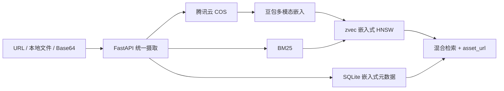

# Material Retrieval

<p align="center">
  
</p>

<p align="center">
  <strong>本地嵌入式多模态混合检索：zvec 与 SQLite 随应用运行，无需单独部署数据库；URL、本地文件和 Base64 统一托管到腾讯云 COS。</strong>
</p>

<p align="center">
  <a href="README_EN.md">English</a> ·
  <a href="docs/guide.md">快速开始</a> ·
  <a href="docs/api.md">API</a> ·
  <a href="docs/architecture.md">架构</a> ·
  <a href="docs/testing.md">测试</a>
</p>

<p align="center">
  
  
  
  
  
  
</p>

## 为什么做这个项目

一个可用的素材检索系统，不应让三种输入维护三套数据。Material Retrieval 在获取原始字节后立即合流：每个可检索结果都对应一个受管 COS 对象，不再依赖调用方的本地路径、临时 URL 或 Base64 字符串。

这个开源版本保留了原系统的 FastAPI + SQLite + zvec + Vue 框架，将内部服务替换为可由公网用户自行申请和配置的腾讯云 COS 与火山方舟豆包接口。

其中 zvec collection 与 SQLite 元数据文件都由后端进程直接打开：克隆项目、安装依赖即可启动，不需要再安装或维护 Milvus、Qdrant、Elasticsearch、PostgreSQL 等数据库服务。需要配置的外部依赖只有腾讯云 COS 和豆包多模态嵌入 API。

## 能力一览

- **无需单独部署数据库**：zvec HNSW/BM25 索引与 SQLite 元数据均为本地嵌入式存储，随 FastAPI 一起启动。
- **三种输入，一条管道**：支持公网 URL、multipart 本地文件和 Base64/data URI。
- **真实 COS 托管**：按上海时区分日生成不可变版本键，检索统一返回 `asset_url`。
- **素材级稠密建索**：图片/视频只编码媒体内容，文档只编码抽取文本；`description` 仅进入 BM25，不混入 1024 维稠密向量。
- **多模态查询**：查询端支持文字、图片、视频以及图文/视文混合输入，并与素材稠密向量跨模态匹配。
- **多格式文档**：TXT、MD、CSV、JSON、HTML、YAML、XML、JSONL、PDF、DOCX、XLSX。
- **混合检索**：Dense、BM25 Sparse 和 RRF/加权融合，支持 zvec 标量过滤。
- **有界批处理**：默认每个顶层请求最多 50 个 URL 条目、Base64 条目或 multipart 文件。
- **可审计来源**：URL 保留原地址，本地文件保留客户端引用，Base64 不持久化原载荷。
- **安全替换与删除**：先写新版本再切换；旧对象默认归档到 `_trash`，支持跨 COS/SQLite/zvec 补偿。
- **可恢复嵌入式索引**：可从 SQLite 元数据与现有 COS 对象重建缺失 zvec 文档，无需重新访问原始 URL，也不会改写来源字段。
- **秘密不落盘**：外部服务凭据只从环境变量读取，不通过设置 API 暴露。
- **私有链接失败关闭**：签名生成失败时返回 `asset_url=null`，绝不降级为无签名 URL。
- **可复现测试集**：30 项 URL/本地/Base64 素材，含 13 个明确授权线上来源和确定性衍生文件。

## 架构




## 实际界面与操作演示

下面的动画和截图来自本机真实运行实例：30 条 URL/本地文件/Base64 素材已进入 COS、SQLite 与 zvec；演示查询“多模态素材检索产品简介”由 Dense + BM25 通过 RRF 融合，目标产品简介排在首位。


| 页面 | 真实验收画面 |
|---|---|
| §01 概览 | 30 条素材、30 条可检索、0 失败，以及 1024 维 zvec collection。<br> |
| §02 素材入库 | 真实网络 URL 入库成功，展示分日 COS 对象键与 `ready` 状态。<br> |
| §03 混合检索 | 中文语义查询实际返回 20 条结果，产品简介位列第一。<br> |
| §04 素材管理 | COS 图片预览、来源、对象键、标签及 1024 维 dense / BM25 sparse 信息。<br> |
| §05 嵌入测试 | 豆包真实返回 1024 维向量；两段相近中文描述的余弦相似度为 0.8097。<br> |
| §06 设置 | 只展示公开参数；Ark Key 与 COS SecretId/SecretKey 明确只读环境变量且不回显。<br> |
| §07 文档 | 在应用内直接阅读总览、架构、API、存储、安全与测试文档。<br> |

详细设计、时序与补偿策略见 [docs/architecture.md](docs/architecture.md)。

## 快速开始

### 1. 安装

```bash
git clone https://github.com/yanhanqi22225116/material_retrieval.git
cd material_retrieval

conda activate llm
python -m pip install -r backend/requirements.txt

cd frontend
npm ci
cd ..
```

需要 Python 3.10+、Node.js 22.12+。非 MP4 视频转码需要 `ffmpeg`。

### 2. 配置

```bash
cp .env.example .env
chmod 600 .env
```

```dotenv
ARK_API_KEY=your-ark-api-key

TENCENT_COS_SECRET_ID=your-subuser-secret-id
TENCENT_COS_SECRET_KEY=your-subuser-secret-key
TENCENT_COS_BUCKET=your-bucket-appid
TENCENT_COS_REGION=your-region
TENCENT_COS_ROOT_PREFIX=material_retrieval
TENCENT_COS_URL_MODE=signed
```

推荐使用私有读写 Bucket 和只能访问 `material_retrieval/*` 的 CAM 子用户。完整创建教程、最小权限策略模板和官方文档链接见 [docs/storage.md](docs/storage.md)。

若公网 URL 下载需要显式代理，可选配置 `INGEST_HTTP_PROXY` 与 `INGEST_PROXY_BYPASS_HOSTS`；代理仅作用于 URL 摄取，详见 [启动指南](docs/guide.md#网络-url)。

### 3. 启动

```bash
./dev.sh up
./dev.sh status
```

- 前端：<http://127.0.0.1:8522/>
- 后端：<http://127.0.0.1:8521/>
- OpenAPI：<http://127.0.0.1:8521/docs>

```bash
./dev.sh logs
./dev.sh restart
./dev.sh down
```

更完整的 Conda、单端启动、三种摄取和检索示例见 [docs/guide.md](docs/guide.md)。

## API 示例

### URL 入库

```bash
curl -fsS http://127.0.0.1:8521/api/ingest/url \
  -H 'Content-Type: application/json' \
  -d '{
    "items": [{
      "url": "https://example.com/flower.jpg",
      "filename": "flower.jpg",
      "tag": "botany",
      "description": "一朵风中的花"
    }]
  }'
```

### 本地文件入库

```bash
curl -fsS http://127.0.0.1:8521/api/ingest/upload \
  -F 'files=@sample.pdf' \
  -F 'tag=report' \
  -F 'description=检索质量报告'
```

### 混合检索

```bash
curl -fsS http://127.0.0.1:8521/api/search \
  -H 'Content-Type: application/json' \
  -d '{
    "mode": "hybrid",
    "text": "山顶的日出",
    "topk": 20,
    "topn": 10,
    "filter": "status = \"ready\"",
    "reranker": "rrf"
  }'
```

全部路由、字段、替换/删除语义和错误码见 [docs/api.md](docs/api.md)。

## 测试

### 静态与单元测试

```bash
PYTHONPATH=backend conda run -n llm pytest -q backend/tests/unit tests/test_asset_fixtures.py
```

### 准备 30 项授权素材

```bash
conda run -n llm python scripts/prepare_test_assets.py
conda run -n llm pytest -q tests/test_asset_fixtures.py
```

清单严格分为 URL/本地/Base64 各 10 项。脚本校验许可元数据、下载大小、超时、重定向和哈希，生成 lock 与归属文件。

测试素材二进制位于被 Git 忽略的 `tests/fixtures/generated/`，不会提交到仓库；仓库只保留 30 项清单、开放许可归属、生成脚本与哈希校验代码。全新克隆后先运行准备脚本即可复现。

### 外部服务合约

```bash
conda run -n llm python backend/tests/live/test_doubao_contract.py
conda run -n llm python backend/tests/live/test_cos_contract.py
conda run -n llm python backend/tests/live/test_zvec_doubao_contract.py
```

### 30 项 API E2E

```bash
conda run -n llm python scripts/live_api_e2e.py \
  --base-url http://127.0.0.1:8521 \
  --timeout 600
```

E2E 会保留 30 项素材和本地 zvec 数据，只删除自己创建的额外 CRUD 探针。测试分层、安全边界和已验证基线见 [docs/testing.md](docs/testing.md)。

## 项目结构

```text
material_retrieval/
├── backend/                 FastAPI、COS、豆包、SQLite、zvec
├── frontend/                Vue 3 + Vite + Element Plus
├── assets/                  GitHub 封面、真实界面截图与 SVG 架构图
├── docs/                    中文架构、API、存储、嵌入、安全和测试文档
├── scripts/                 测试素材、线上合约和 E2E 运行器
├── tests/                   30 项清单、lock、许可归属与校验代码
├── .env.example             不含秘密的配置模板
├── dev.sh                   前后端统一启停
├── SECURITY.md              GitHub 安全摘要
└── LICENSE                  MIT
```

## 文档

| 文档 | 内容 |
|---|---|
| [项目总览](docs/overview.md) | 目标、与原逻辑的关系、数据契约、格式支持 |
| [系统架构](docs/architecture.md) | 分层、时序、COS 键、zvec 索引与补偿 |
| [启动指南](docs/guide.md) | 环境、配置、启停、摄取、搜索和 CRUD |
| [API 参考](docs/api.md) | 全部公开路由和请求/响应契约 |
| [豆包嵌入](docs/embedding.md) | 模型、输入映射、格式转换、维度迁移 |
| [COS 存储](docs/storage.md) | 建桶、CAM 子用户、最小权限、CRUD 语义 |
| [测试指南](docs/testing.md) | 30 项素材、合约测试、E2E 与验收标准 |
| [安全说明](docs/security.md) | 威胁边界、SSRF、秘密、COS 权限和上线检查表 |

## 安全

- 默认只绑定 `127.0.0.1`，CORS 只允许本地前端。
- 公网上线前必须增加 TLS、身份认证、授权、限流和明确 CORS 白名单。
- 不要在 Issue、日志、截图或 Git 历史中提交密钥、签名 URL 或私有对象内容。
- 发现密钥可能泄露后应立即禁用并轮换。

请在使用前阅读 [SECURITY.md](SECURITY.md) 和 [docs/security.md](docs/security.md)。

## License

[MIT](LICENSE)
