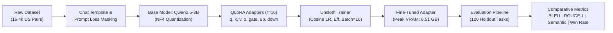

# Qwen2.5-3B Data Science Fine-tuning

> Domain-adapting `Qwen2.5-3B-Instruct` for Python data science workflows via 4-bit QLoRA, delivering a **+109.5% BLEU increase** and an **86% win rate** under single-T4 GPU constraints.

[](https://www.python.org/)
[](https://pytorch.org/)
[](https://github.com/unslothai/unsloth)
[](https://huggingface.co/)
[](LICENSE)

---

## Problem Statement

General-purpose Small Language Models (SLMs) frequently hallucinate data library APIs, generate slow row-by-row Python loops, and produce brittle `pandas`, `numpy`, and `scikit-learn` syntax. While massive frontier models (e.g., GPT-4o) handle these tasks well, deploying them in production introduces recurring API fees, vendor lock-in, latency overhead, and data privacy risks when processing proprietary enterprise datasets.

Engineering high-quality code generation within a lightweight (<4B parameter) footprint enables teams to run private, low-latency, and cost-effective data analytics assistants on commodity edge instances or single-GPU workstations.

---

## Solution Overview

This project implements an end-to-end Parameter-Efficient Fine-Tuning (PEFT) pipeline adapting **Qwen2.5-3B-Instruct** into a specialized Data Science coding assistant:
- **Domain Specialization:** Fine-tuned on ~16.4k curated instruction-response pairs from [`ed001/ds-coder-instruct-v1`](https://huggingface.co/datasets/ed001/ds-coder-instruct-v1), covering dataframe manipulation, statistical analysis, and machine learning pipelines.
- **Resource-Constrained Optimization:** Implemented 4-bit QLoRA (`r=16`, `alpha=16`) via Unsloth across all 7 linear projection layers, capping peak VRAM at **6.51 GB** on a single Tesla T4 GPU.
- **Objective Integrity:** Applied prompt-token loss masking so gradient backpropagation updates solely on the assistant's generated code solutions.
- **Rigorous Offline Evaluation:** Benchmarked outputs against the base model across 100 held-out tasks using lexical exactness (BLEU), structural alignment (ROUGE-L), and embedding-based semantic similarity.

---

## Architecture



---

## Key Features

- **Parameter-Efficient Adaptation:** Updates under 1% of total model parameters using 4-bit NormalFloat (NF4) quantization and double quantization.
- **Prompt Token Loss Masking:** Masks user query tokens during cross-entropy loss computation to avoid fitting to prompt phrasing.
- **Single-GPU Reproducibility:** Completes a full 3-epoch run in ~7.38 hours on a standard 16 GB Tesla T4 GPU (687 steps) without memory overflow.
- **Inference Acceleration:** Integrates Unsloth's optimized Triton kernels for 2x faster inference generation than standard Hugging Face PEFT loading.
- **Automated Diagnostic Suite:** Generates pairwise comparison matrices, metric distributions, and error heatmaps (`results/charts/`).

---

## Tech Stack

| Component | Technology |
|---|---|
| **Core & Runtime** | Python 3.12, PyTorch 2.1.0, CUDA |
| **Model & Fine-Tuning** | Unsloth, Hugging Face `transformers`, `peft`, `bitsandbytes`, `trl` |
| **Evaluation & Metrics** | Hugging Face `evaluate`, `rouge-score`, `nltk` (BLEU), `sentence-transformers` |
| **Data & Visualization** | Pandas, NumPy, Matplotlib, Seaborn |
| **Hardware Constraint** | 1x NVIDIA Tesla T4 (16 GB VRAM) |

---

## Results / Metrics

Evaluated across **100 held-out data science coding prompts** directly against the unadapted base model (`Qwen/Qwen2.5-3B-Instruct`):

| Metric | Base Model | Fine-Tuned Model | Absolute Gain | Relative Improvement |
|:---|:---:|:---:|:---:|:---:|
| **BLEU** (Exact Token Matching) | 0.0855 | **0.1791** | +0.0936 | **+109.49%** |
| **ROUGE-L** (Longest Common Subsequence) | 0.2535 | **0.4231** | +0.1695 | **+66.89%** |
| **Semantic Similarity** (Embedding Cosine) | 0.7001 | **0.7883** | +0.0881 | **+12.59%** |
| **Composite Score** (Weighted Multi-Metric) | 0.4432 | **0.5569** | +0.1136 | **+25.65%** |
| **Pairwise Win Rate** | 14.0% | **86.0%** | +72.00% | **86% Dominance** |

<p align="center">
  
</p>

> **Evaluation Insight:** The substantial increase in BLEU (+109.5%) and ROUGE-L (+66.9%) demonstrates that the model learned to produce canonical, vectorized data science idioms rather than generic conversational code snippets.

---

## How to Run

### 1. Prerequisites
- Linux or Windows with an NVIDIA GPU (>= 8 GB VRAM recommended).
- CUDA 11.8 or 12.1+ installed.

### 2. Setup Environment
```bash
# Clone the repository
git clone https://github.com/yashvasudeva1/qwen-data-science-instruct.git
cd qwen-data-science-instruct

# Create and activate virtual environment
python -m venv venv
source venv/bin/activate  # On Windows: .\venv\Scripts\activate

# Install Unsloth and core dependencies
pip install --upgrade pip
pip install "unsloth[colab-new] @ git+https://github.com/unslothai/unsloth.git"
pip install torch torchvision torchaudio --index-url https://download.pytorch.org/whl/cu121
pip install transformers datasets evaluate rouge-score sentence-transformers matplotlib seaborn
```

### 3. Quickstart Inference
```python
import torch
from unsloth import FastLanguageModel

# Load 4-bit base model and trained LoRA adapter
model, tokenizer = FastLanguageModel.from_pretrained(
    model_name="unsloth/Qwen2.5-3B-Instruct-bnb-4bit",
    max_seq_length=2048,
    load_in_4bit=True,
)
model.load_adapter("model/")  # Path to saved LoRA adapter
FastLanguageModel.for_inference(model)

# Prepare prompt
prompt = "Write an optimized pandas function to detect outliers via IQR and impute with group medians."
messages = [{"role": "user", "content": prompt}]
inputs = tokenizer.apply_chat_template(messages, tokenize=True, add_generation_prompt=True, return_tensors="pt").to("cuda")

# Generate response
outputs = model.generate(input_ids=inputs, max_new_tokens=400, temperature=0.7, top_p=0.9, do_sample=True)
print(tokenizer.decode(outputs[0][inputs.shape[1]:], skip_special_tokens=True))
```

### 4. Reproduce Training & Evaluation
- Training pipeline: `scripts/training.ipynb`
- Benchmarking & visual analysis: `scripts/evaluation.ipynb`

---

## What I Owned / My Contributions

- **Pipeline Architecture & Hyperparameter Design:** Configured QLoRA across all 7 linear projection layers (`q, k, v, o, gate, up, down`). Engineered training dynamics (effective batch size of 16 via gradient accumulation, cosine scheduler with 20 warmup steps, `2e-4` LR) for convergence within 687 steps.
- **Loss Masking Implementation:** Handled chat template preprocessing to ensure prompt tokens were masked during loss calculation, preventing cross-entropy contamination.
- **Benchmarking Suite:** Designed an automated offline evaluation script assessing lexical precision (BLEU), structural coherence (ROUGE-L), and semantic similarity across 100 holdout tasks.
- **Hardware Budgeting:** Profiled and capped peak VRAM at 6.51 GB on a Tesla T4 GPU, ensuring the pipeline runs stably within free/low-cost cloud tiers.
- **Visual Analytics:** Programmed the generation of 14 diagnostic charts (`results/charts/`) for distribution analysis and model win-rate tracking.

---

## Limitations & Future Work

- **Proxy Metrics vs. Execution Validation:** BLEU and ROUGE-L measure stylistic and lexical alignment against references, but do not guarantee runtime executability or algorithmic correctness.
- **In-Distribution Evaluation:** The holdout split comes from the same data collection process (`ds-coder-instruct-v1`). Real-world performance on complex external repos remains to be validated.
- **Future Milestone 1 (Sandboxed Execution):** Integrate a Dockerized sandbox to evaluate functional pass rate (Pass@k) on real-world benchmarks like DS-1000 and HumanEval.
- **Future Milestone 2 (Ablation Experiments):** Benchmark LoRA rank scaling (`r=32` vs. `r=64`) to measure capacity vs. latency tradeoffs.
- **Future Milestone 3 (GGUF Deployment):** Merge adapter weights and export 4-bit/5-bit GGUF binaries for local, CPU/edge execution via `llama.cpp` and Ollama.

---

## Demo

<p align="center">
  
</p>

<p align="center">
  <em>Overview of training dynamics, response-only loss masking, and benchmark evaluation for Qwen2.5-3B-DS.</em><br/>
  <a href="qwen-data-science-instruct.mp4">▶ <strong>Watch High-Definition 1080p Video (qwen-data-science-instruct.mp4)</strong></a>
</p>

```text
[User Prompt] -> "Group transaction DataFrame by user_id and compute rolling 7-day spend sum."
[Base Model]  -> Verbose generic loops with manual date parsing and unhandled edge cases.
[Fine-Tuned]  -> Clean, vectorized df.set_index('date').groupby('user_id')['amount'].rolling('7D').sum() in < 1.5s.
```
