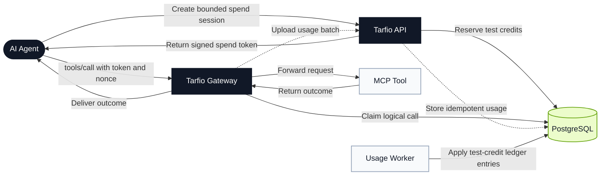

<p align="center">
  
</p>

<h1 align="center">Tarfio</h1>

<p align="center">
  <strong>Give AI agents a budget, not your credit card.</strong><br>
  Hard spending limits for MCP tools and test-credit pricing for successful tool calls.
</p>

<p align="center">
  <strong>Private beta with test credits. Live payments and creator payouts are not enabled.</strong>
</p>

<p align="center">
  <a href="https://github.com/yiaany/Tarfio/actions/workflows/ci.yml"></a>
  
  
  
  
  <a href="https://github.com/yiaany/Tarfio/releases/tag/v0.1.0-beta.1"></a>
  <a href="#license"></a>
</p>

## What Tarfio Does

Tarfio gives AI-agent teams bounded access to MCP tools. A spend session can limit the total test-credit budget, maximum price per call, allowed tools, expiry, and revocation.

MCP creators can set a test-credit price for each successful tool action without putting billing logic inside every tool handler. Tarfio records outcomes and receipts and protects covered paths from duplicate processing.

## For MCP Creators

- Set a test-credit price per successful tool call.
- Keep your MCP at its own URL and behind its own gateway.
- Give agent teams a clear outcome and receipt for each logical call.
- Prepare monthly plans for selected tools before the hosted beta opens.

## For Agent Teams

- Set a total test-credit budget for an agent session.
- Limit the maximum price of one tool call.
- Choose which tools the agent may use.
- Set an expiry and revoke access when needed.
- Review outcomes and receipts without counting covered retries twice.

## Current Beta

**Status as of September 8, 2026: private beta with test credits. Live payments, cards, and creator payouts are not enabled.**

Tarfio currently covers:

- test-credit pricing per successful tool call;
- creator-defined tool prices;
- signed bounded spend sessions;
- total budgets and maximum price per call;
- allowed-tool restrictions, expiry, and revocation;
- outcomes and receipts;
- replay protection and idempotent processing for covered paths;
- catalog and discovery;
- a Go API, gateway, worker, PostgreSQL migrations, dashboard, and local SDK source.

Hosted access is not open yet. The current beta does not accept, hold, transfer, or pay out real funds.

## Monthly Subscriptions

**Status: In development for the hosted beta.**

The planned monthly mode lets an MCP creator publish a versioned plan for one MCP server and selected tools. A plan has a monthly price in test credits and an included number of successful calls.

The subscription design uses UTC billing periods, reserves allowance before a tool call, consumes allowance only for eligible successful outcomes, and stops calls when the included allowance reaches zero. Overage billing and silent fallback to per-call billing are not planned for this beta.

## Request Path



The gateway records dispatch before contacting the upstream tool. If a process or network failure happens after dispatch, the tool may have executed even if the caller receives an error. For eligible successful outcomes, durable usage preparation happens before response delivery. Tarfio does not claim exactly-once tool delivery or exactly-once charging.

The beta rejects metered `2xx text/event-stream` responses before forwarding upstream success headers or body bytes and records no usage for them. Unmetered MCP traffic can still stream through the gateway.

## Security Model

Spend tokens contain readable claims protected by Ed25519 signatures. They are not encrypted. The API holds the active signing private key; gateways receive a public verification keyring and select keys by the protected JWT `kid` header.

The beta also uses:

- `HttpOnly`, `SameSite=Strict` browser cookies;
- bcrypt password hashes;
- hashed invite and session tokens in PostgreSQL;
- server-scoped, versioned gateway credentials;
- HTTPS outside explicit local-development mode;
- integer minor units and database transactions;
- redirect blocking, header stripping, and request size and time limits in the gateway.

Database rows are not encrypted by the application. Protect PostgreSQL storage, backups, signing keys, gateway secrets, and deployment environment files with operator-controlled encryption and access controls.

Read [Security Policy](SECURITY.md) and [Threat Model](docs/threat-model.md) before exposing a deployment.

## Run Locally

Requirements: Docker Engine with Compose v2, Go 1.25+, and 4 GB of available memory.

```bash
cp deploy/.env.beta.example deploy/.env.beta
go run ./cmd/mcpay-keygen --key-id beta-2026-08
```

Put the generated keys in `deploy/.env.beta`, replace every `replace-*` value, and start the stack:

```bash
docker compose --env-file deploy/.env.beta -f deploy/compose.beta.yml config
docker compose --env-file deploy/.env.beta -f deploy/compose.beta.yml build
docker compose --env-file deploy/.env.beta -f deploy/compose.beta.yml up -d
docker compose --env-file deploy/.env.beta -f deploy/compose.beta.yml ps
```

Open `http://localhost:8080`. Any top-up is a test credit with no cash value.

Verify the stack:

```bash
MCPAY_BETA_URL=http://localhost:8080 ./scripts/verify-central-beta.sh
```

```powershell
./scripts/verify-central-beta.ps1 -BaseUrl http://localhost:8080
```

See [Central Beta Runbook](docs/central-beta-runbook.md), [Deployment](docs/beta-deployment.md), and [Backup/Restore Drill](docs/backup-restore-drill.md).

## Connect A Gateway

Create a server and action in the dashboard, issue a server-scoped gateway credential, and run the gateway beside the MCP server. Use persistent local storage for `--state-file` and do not share one state file between processes.

```bash
go run ./cmd/mcpay-gateway \
  --target https://your-mcp-server.example \
  --mcp-path /mcp \
  --server-id srv_example \
  --environment beta \
  --token-issuer mcpay.beta \
  --control-plane-api https://api.example/v1/gateway/servers/srv_example \
  --nonce-claim-api https://api.example/v1/gateway/nonces/claim \
  --usage-api https://api.example/v1/usage-records \
  --usage-api-token "$MCPAY_GATEWAY_API_TOKEN" \
  --state-file ./mcpay-gateway.db
```

Metered requests in the test-credit beta carry `Authorization: Bearer <spend-token>` and `X-MCPay-Nonce: <nonce>`. The gateway removes both headers before forwarding upstream.

The control-plane gateway configuration supplies `verification_keys`. For a standalone gateway without `--control-plane-api`, pass `--verification-keys "$MCPAY_VERIFICATION_KEYS"`.

## SDKs

The JavaScript and Python SDKs are **not published to npm or PyPI as of September 8, 2026**. Install them from this repository only.

```bash
npm install
npm run build --workspace=@mcpay/sdk-js
```

Workspace code can then import `@mcpay/sdk-js`. For use from another local Node project, install the repository path after building:

```bash
npm install ../Tarfio/packages/sdk-js
```

Install the Python SDK in editable mode from the repository root:

```bash
python -m pip install -e ./packages/sdk-python
```

See [JavaScript SDK](packages/sdk-js/README.md) and [Python SDK](packages/sdk-python/README.md). Direct SDK wrappers use volatile process state in development; the persistent gateway is the supported beta path for crash recovery.

## Verification

```bash
go test ./...
go test -race ./...
go vet ./...
go build ./cmd/...
npm ci
npm run build
npm run test
python -m pip install build
python -m build packages/sdk-python
python -m unittest discover -s packages/sdk-python/tests
```

PostgreSQL tests require a disposable migrated database in `MCPAY_TEST_DATABASE_URL`. They truncate application tables; never point them at retained data.

## Repository Map

| Path | Purpose |
|---|---|
| `apps/api` | HTTP control-plane handlers and authentication |
| `apps/dashboard` | Private-beta dashboard |
| `cmd/mcpay-api` | API process |
| `cmd/mcpay-gateway` | MCP and HTTP authorization proxy |
| `cmd/mcpay-worker` | Usage, retry, reconciliation, and expiry loop |
| `internal/controlplane` | PostgreSQL ledger and usage transactions |
| `internal/gateway` | Authorization proxy and persistent gateway state |
| `internal/sessions` | Spend claims and Ed25519 token code |
| `packages/sdk-js` | JavaScript SDK source |
| `packages/sdk-python` | Python SDK source |
| `migrations` | Ordered PostgreSQL schema migrations |

## License

Tarfio is source-available under the Business Source License 1.1. BSL 1.1 is not an OSI-approved open-source license. The Additional Use Grant and change date are defined in [LICENSE](LICENSE). The dashboard has a separate MIT license and upstream attribution in [apps/dashboard/LICENSE](apps/dashboard/LICENSE).
