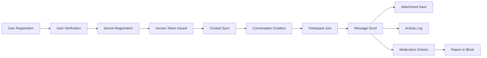
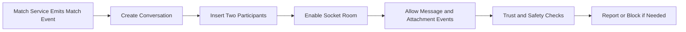

# Messenger

Messenger is a relational database design for modern messaging applications. It provides a practical schema to build both one-to-one and group chat systems with support for common messaging workflows.

If you use this project in production or for learning, feel free to share your implementation.

## What This Repository Includes

- `messenger.sql`: SQL schema for a messaging platform.
- `Messenger.mwb`: MySQL Workbench model file for visual schema design.
- `Messenger.png`: ER-style diagram preview of the schema.

## Documentation

- `ARCHITECTURE.md`: Table domains, relationships, and design notes.
- `AGENTS.md`: Cross-agent development rules for this repository.
- `CLAUDE.md`: Claude-specific implementation guidance.
- `.github/copilot-instructions.md`: Copilot-specific coding guidance.
- `docs/AGENTIC_DEVELOPMENT.md`: AI-assisted development workflow.
- `docs/NODE_EXPRESS_TYPESCRIPT_POSTGRES_SOCKET.md`: Node.js + Express + TypeScript + PostgreSQL + Socket.IO implementation guide.
- `docs/GO_POSTGRES_SOCKET.md`: Go + PostgreSQL + WebSocket implementation guide.
- `CONTRIBUTING.md`: Contribution and pull request expectations.

## Prompt Pack

- `.github/prompts/node-express-typescript-postgres-socket.prompt.md`: Generate a full Node.js backend scaffold.
- `.github/prompts/go-postgres-socket.prompt.md`: Generate a full Go backend scaffold.
- `.github/prompts/dual-backend-roadmap.prompt.md`: Generate a phased delivery roadmap for both stacks.

## Core Capabilities

- One-to-one conversation support.
- Group chat support.
- Message persistence and relational integrity.
- Attachment/gallery table support for media messages.
- Device access modeling improvements from previous versions.

## Platform Flow

## Quick Start

1. Import `messenger.sql` into your MySQL-compatible database.
2. Open `Messenger.mwb` in MySQL Workbench if you want to inspect or extend the model visually.
3. Connect your API/service layer to this schema and implement your messaging logic.

## Suggested Use Cases

- Mobile chat backend foundations.
- SaaS communication modules.
- Prototyping chat APIs.
- Learning relational modeling for messaging apps.
- Dating app real-time chat and trust/safety messaging.

## Use Case Library

### Core Messaging Use Cases

- One-to-one direct messaging.
- Group conversation messaging.
- Message history retrieval by conversation.
- Multi-media messaging using attachments.
- Soft delete behavior for user-visible message cleanup.
- Conversation hide/delete per user.

### Identity and Access Use Cases

- Phone and email based account registration.
- User verification with temporary verification codes.
- Multi-device registration per user.
- Token issuance and token revocation modeling.
- Device-level session tracking.

### Contact and Network Use Cases

- Contact import and synchronization.
- User-to-contact linking for personalized contact books.
- Contact-based conversation bootstrapping.

### Moderation and Safety Use Cases

- Blocking a user in a conversation context.
- Reporting users or conversation participants.
- Tracking moderation status from pending to resolved.

### Product and Engagement Use Cases

- Activity feed generation for app events.
- Auditing major messaging actions.
- Push-ready architecture through device token storage.

### SaaS Collaboration Use Cases

- Team workspace channels for project or department communication.
- Tenant-style customer support chat between users and account teams.
- Internal incident and operations communication rooms.
- Secure conversation audit trails for compliance review.
- Multi-device employee messaging with controlled token access.

### Dating App Integration Use Cases

- Match-to-chat activation after a successful match event.
- One-to-one private messaging between matched users.
- Media sharing inside match conversations.
- User report and block flows for trust and safety.
- Soft-delete and hide-conversation behavior for privacy expectations.
- Activity logging for abuse detection and moderation analytics.

### Engineering and Learning Use Cases

- API-first chat backend prototyping.
- Database design interviews and exercises.
- Proof-of-concept schema for startup MVPs.
- Foundation schema for a larger microservice split.

## Use Case to Table Mapping

```mermaid
graph TD
	U1[Account Signup] --> T1[users]
	U1 --> T2[user_verification]
	U2[Contact Sync] --> T3[contacts]
	U2 --> T4[user_contact]
	U3[Create Conversation] --> T5[conversation]
	U3 --> T6[participants]
	U4[Send Message] --> T7[messages]
	U4 --> T8[attachments]
	U5[Delete Message for User] --> T9[deleted_messages]
	U6[Hide Conversation for User] --> T10[deleted_conversations]
	U7[Block or Report User] --> T11[block_list]
	U7 --> T12[reports]
	U8[Session Access] --> T13[devices]
	U8 --> T14[access]
	U9[Track User Event] --> T15[activities]
	U10[SaaS Workspace Channel Chat] --> T5
	U10 --> T6
	U10 --> T7
	U11[Dating Match Chat] --> T5
	U11 --> T6
	U11 --> T7
	U11 --> T11
	U11 --> T12
```

## Dating App Integration Blueprint

## Need Help Building an App or API?

For implementation support, contact hi@crew.lk or visit [Crew](https://crew.lk "Crew").
Crew is an open innovation house based in Sri Lanka.

## Version History

Based on git commit history:

### 1.0.4 (2020-09-14)
Added a unique index on `participants(conversation_id, user_id)`.
Commit: `d41bb71`

### 1.0.3 (2020-01-11)
Added attachment table support for message galleries.
Commit: `4f83420`

### 1.0.2 (2018-02-03)
Fix for issue #4.
Commit: `f45a282`

### 1.0.1 (2015-11-25)
Updated access-to-device relationship to one-to-one.
Commits: `ffea804`, `936038e`

### 1.0.0 (2015-05-28)
Initial release.
Commit: `2c2b89f`

