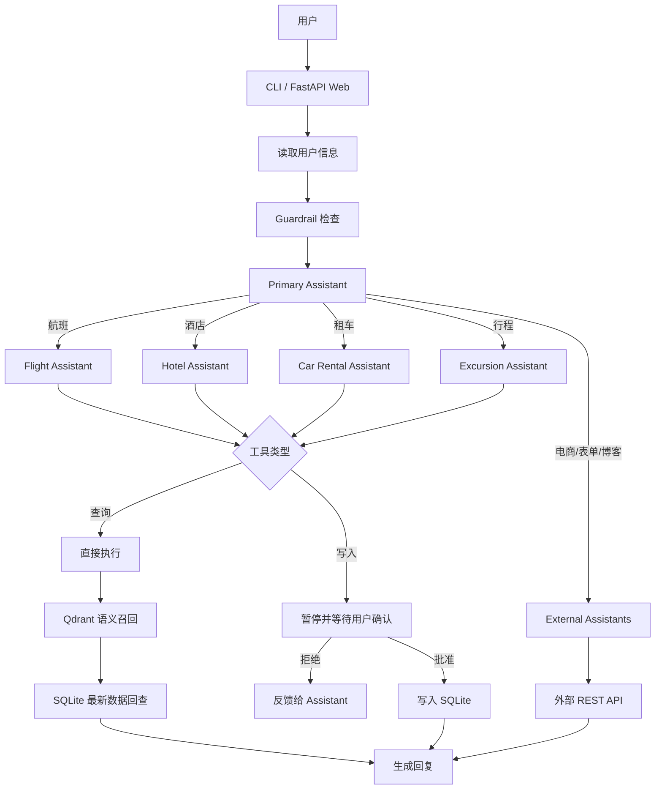

# LangGraph Multi-Agent Travel Assistant

基于 **LangChain、LangGraph、Qdrant 与 SQLite** 构建的多智能体 RAG 客服系统。项目以旅行服务为主要场景，由主助手理解用户需求并将任务委派给航班、酒店、租车、行程等专业助手，同时支持 WooCommerce 商品/订单查询、表单提交与博客检索。

系统不仅能够回答问题，还能调用真实工具完成查询、预订、改期和取消。对于会修改业务数据的敏感操作，LangGraph 会在执行前暂停工作流，等待用户明确批准。


## 1. 项目简介

传统客服机器人常把问答、业务判断与数据操作交给同一个 Agent，容易出现工具选择混乱、复杂任务不稳定以及敏感操作缺少控制等问题。本项目将客服流程拆分为一个负责统筹的主助手和多个职责单一的专业助手，并使用 LangGraph 将它们组织成可路由、可暂停、可恢复的有状态工作流。

系统覆盖以下场景：

- 航班信息查询、改签与取消；
- 酒店搜索、预订、修改、取消和库存查询；
- 租车搜索、预订、修改与取消；
- 目的地行程推荐、预订、修改与取消；
- 基于 FAQ 知识库的政策问答；
- WooCommerce 商品与订单查询；
- 联系表单提交与 WordPress 博客检索；
- CLI 与 Web 两种交互方式，以及 Web 操作日志和审批弹窗。

### 功能展示

<p align="center">
  
  
</p>

## 2. 项目创新与功能

### 2.1 主助手编排领域专家

主助手负责理解意图、完成通用查询，并通过结构化 tool call 将专业任务交给对应助手。每个专业助手拥有独立 Prompt、工具集合和路由规则，可以按同一模式继续扩展新业务。

| 助手 | 主要能力 | 写操作确认 |
| --- | --- | --- |
| Primary Assistant | 通用问答、航班搜索、政策查询、任务委派 | 不直接执行旅行写操作 |
| Flight Assistant | 航班查询、改签、取消 | 需要 |
| Hotel Assistant | 酒店搜索、预订、修改、取消、库存查询 | 需要 |
| Car Rental Assistant | 租车搜索、预订、修改、取消 | 需要 |
| Excursion Assistant | 行程推荐、预订、修改、取消 | 需要 |
| WooCommerce Assistant | 商品和订单查询 | 不需要 |
| Form Assistant | 收集并提交联系表单 | 不需要 |
| Blog Assistant | 搜索博客文章 | 不需要 |

### 2.2 Qdrant 召回与 SQLite 实时回查

酒店、航班、租车和行程等数据会被业务工具持续修改。如果直接把 Qdrant payload 当作最终结果，预订或取消后可能仍读到旧状态。本项目将检索流程改为：

```text
自然语言查询
  -> Qdrant 召回候选 ID 与相似度
  -> 按 ID 回查 SQLite
  -> 使用最新库存、日期、状态和详情重建结果
  -> Assistant 基于最新事实生成回复
```

Qdrant 保存适合语义检索的稳定字段，SQLite 是动态业务状态的唯一事实来源。因此，修改预订状态、库存或日期后无需重新生成向量；只有稳定检索字段变化或 collection 被重建时才需要重新向量化。

### 2.3 敏感工具执行前中断

查询工具可以直接执行，预订、改期和取消等写工具则被放入敏感 ToolNode。工作流通过 `interrupt_before` 在执行前保存检查点并暂停：用户批准后从原位置恢复，拒绝时写入对应 `ToolMessage`，让助手根据反馈继续处理。

### 2.4 输入护栏与可观察性

- 每轮业务处理前执行越狱检测和业务相关性检查；
- 可选接入 LangSmith，观察模型调用、工具调用、路由与异常；
- Web 界面展示对话、工具操作日志和敏感动作审批状态；
- 工具异常通过 fallback 转换成 `ToolMessage`，方便模型修正参数。

> 当前边界：旅行写操作的用户确认已由 LangGraph 中断机制生效；越狱与相关性检测仍属于 LLM 软护栏，其中相关性检查只记录告警；GoHumanLoop 管理员二次审批是可选预留能力，当前没有包裹实际写工具。生产部署前还应增加身份认证、权限校验、强制输入阻断和持久化检查点。

### 2.5 本地 RAG 知识库

向量化模块会为 FAQ、航班、酒店、租车和行程建立独立 Qdrant collection。FAQ 索引直接读取 `faq_documents/*.md`，无需在线下载远程文档；业务扩展则可以通过环境变量对接 WooCommerce、表单和博客 API。

## 3. 架构概览



| 层级 | 技术/模块 | 职责 |
| --- | --- | --- |
| 交互层 | CLI、FastAPI、Jinja2 | 接收消息、展示回复、处理用户审批 |
| Agent 层 | LangChain、OpenAI-compatible Model | Prompt 编排、结构化工具调用、回答生成 |
| 工作流层 | LangGraph、MemorySaver | 状态管理、路由、检查点、中断与恢复 |
| 检索层 | Qdrant、Embedding Model | FAQ 与业务数据的语义召回 |
| 事实层 | SQLite | 航班、库存、日期和预订状态的最终来源 |
| 集成层 | WooCommerce / WordPress / Form API | 电商与内容业务扩展 |

```text
.
├── customer_support_chat/   # LangGraph 主图、Assistants、Tools、CLI
├── vectorizer/              # 文档切块、Embedding、Qdrant 索引
├── web_app/                 # FastAPI Web 界面与用户审批
├── faq_documents/           # 本地 Markdown RAG 知识库
├── tests/                   # 图拓扑、数据一致性和交互契约测试
├── images/                  # README 功能展示图片
├── docker-compose.yml       # 本地 Qdrant 服务
└── pyproject.toml           # Python 依赖与项目配置
```

## 4. 复现指令

### 4.1 环境要求

- Python 3.12
- Poetry
- Docker 与 Docker Compose
- 支持 Tool Calling 和结构化输出的 OpenAI-compatible Chat API
- 支持 `text-embedding-3-small` 的 Embedding API

### 4.2 克隆并安装

```bash
git clone https://github.com/yukui9222/langgraph-multi-agent-travel-assistant.git
cd langgraph-multi-agent-travel-assistant
poetry install
```

### 4.3 配置环境变量

在项目根目录创建不会提交到 Git 的 `.env`：

```dotenv
# 对话模型
OPENAI_API_KEY=your_chat_api_key
OPENAI_BASE_URL=https://api.openai.com/v1
OPENAI_MODEL=gpt-4o-mini
MAX_TOKENS=1000

# Embedding；未设置 EMBEDDING_API_KEY 时会使用 OPENAI_API_KEY
EMBEDDING_API_KEY=your_embedding_api_key
EMBEDDING_BASE_URL=https://api.openai.com/v1

# 本地 Qdrant
QDRANT_URL=http://localhost:6333
QDRANT_KEY=

# 数据与索引
SQLITE_DB_PATH=./customer_support_chat/data/travel2.sqlite
RECREATE_COLLECTIONS=False
```

可选外部集成：

```dotenv
WOOCOMMERCE_API_URL=https://your-store.example.com
WOOCOMMERCE_CONSUMER_KEY=your_consumer_key
WOOCOMMERCE_CONSUMER_SECRET=your_consumer_secret
BLOG_SEARCH_API_URL=https://your-store.example.com/wp-json/wp/v2/posts
FORM_SUBMISSION_API_URL=https://your-service.example.com/form

# 可选管理员审批适配器
GOHUMANLOOP_API_KEY=your_gohumanloop_api_key
GOHUMANLOOP_API_URL=http://127.0.0.1:9800/api

# 可选 LangSmith 可观察性
LANGCHAIN_TRACING_V2=true
LANGCHAIN_API_KEY=your_langsmith_api_key
LANGCHAIN_PROJECT=langgraph-multi-agent-travel-assistant
```

`.env` 已被 `.gitignore` 忽略，请勿提交任何真实密钥。第三方兼容接口需要支持 Tool Calling、结构化输出和所选模型；当前 Guardrail 固定使用 `gpt-4o-mini`。

### 4.4 启动 Qdrant 并构建索引

```bash
docker compose up -d qdrant
poetry run python -m vectorizer.app.main
```

Qdrant Dashboard：<http://localhost:6333/dashboard>

### 4.5 启动命令行版本

```bash
poetry run python -m customer_support_chat.app.main
```

默认演示乘客 ID 为 `5102 899977`。输入 `q`、`quit` 或 `exit` 退出；遇到敏感操作时输入 `y` 批准，输入其他内容则拒绝并反馈给助手。

### 4.6 启动 Web 版本

```bash
mkdir -p web_app/app/static
cd web_app
poetry install
poetry run pip install -e ..
poetry run uvicorn app.main:app --reload --host 0.0.0.0 --port 8000
```

浏览器访问 <http://localhost:8000>。

### 4.7 运行测试

回到项目根目录：

```bash
poetry run python -m unittest discover -s tests -v
```

### 4.8 停止本地服务

```bash
docker compose down
```

> 本项目在 [liangdabiao/langgraph_multi-agent-rag-customer-support](https://github.com/liangdabiao/langgraph_multi-agent-rag-customer-support) 基础上进行二次开发，其上游基础框架来自 [ro-anderson/multi-agent-rag-customer-support](https://github.com/ro-anderson/multi-agent-rag-customer-support)。
