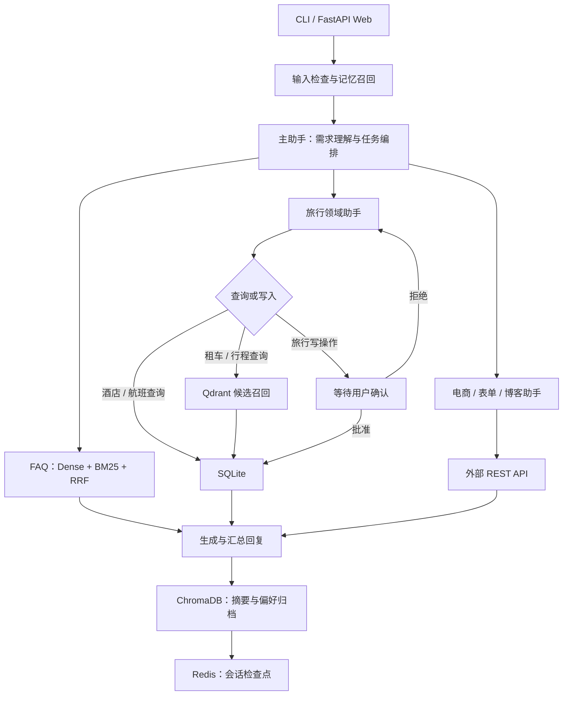

# MORA

**Multi-agent Orchestration & Retrieval Assistant**

多智能体协作的智能服务助手，基于 **LangChain、LangGraph、Redis、ChromaDB、Qdrant 与 SQLite** 构建。

项目以旅行服务为主要场景，支持航班查询与改签、酒店与租车预订、行程推荐及政策问答，并可对接 WooCommerce、联系表单与博客。主助手负责理解需求和分配任务，专业助手通过工具完成业务操作；预订、修改、取消等旅行写操作须经用户确认。

## 功能展示

<p align="center">
  
  
</p>

## 核心功能

- **多智能体编排**：主助手委派航班、酒店、租车、行程、电商、表单和博客任务，专业助手完成后返回结果，支持跨业务请求。
- **结构化业务查询**：酒店与航班直接查询 SQLite，常规搜索使用参数化 SQL，复杂统计使用受限只读 text-to-SQL；个人预订按会话乘客 ID 查询。
- **按日期计算酒店库存**：按入住期间的有效预订计算每晚剩余房量，库存检查与预订写入在同一事务中执行，避免并发超订。
- **FAQ 混合检索**：Markdown 知识库按标题构建父子文档，结合 Dense、BM25 与 RRF 排名融合，再回溯父文档生成回答。租车与行程采用 Qdrant 召回后回查 SQLite。
- **动态任务 Skill**：专业助手按领域与关键词加载 `skills/*/SKILL.md`，支持文件更新；进行中的任务保留原版本。详见 [Skill 使用说明](skills/README.md)。
- **敏感操作审批**：LangGraph 在旅行写工具执行前暂停并保存检查点，批准后恢复，拒绝则跳过写入。
- **分层记忆**：Redis 保存会话与审批状态，默认保留 24 小时；ChromaDB 保存跨会话摘要与用户偏好。消息达到阈值后压缩，并保留工具调用与结果的完整配对。
- **CLI 与 Web 交互**：支持命令行对话、Web 操作日志和审批弹窗，可选接入 LangSmith 追踪模型与工具调用。

## 架构



| 模块 | 技术 | 职责 |
| --- | --- | --- |
| 交互 | FastAPI、Jinja2、CLI | 对话、操作日志与用户审批 |
| 智能体 | LangChain、兼容 OpenAI 的模型 API | 任务委派、Skill 注入与工具调用 |
| 工作流 | LangGraph、Redis | 路由、状态持久化、中断与恢复 |
| 长期记忆 | ChromaDB | 会话摘要、用户画像与记忆召回 |
| 检索 | Qdrant、Dense、BM25、RRF | FAQ 混合检索、租车与行程召回 |
| 业务数据 | SQLite | 实时查询、预订管理与酒店库存 |

### 项目结构

```text
.
├── customer_support_chat/   # 主工作流、专业助手、工具与 CLI
├── vectorizer/              # 文档切块与 Qdrant 索引
├── web_app/                 # Web 界面与审批交互
├── faq_documents/           # Markdown 知识库
├── skills/                  # 任务流程与使用说明
├── evaluation/              # 评测用例、单 Agent 基线与报告
├── scripts/                 # 数据迁移与演示日期调整
├── tests/                   # 工作流、检索与数据一致性测试
├── images/                  # 功能截图
├── .env.example             # 环境变量示例
├── docker-compose.yml       # Qdrant 与 Redis 服务
└── pyproject.toml           # Python 依赖
```

## 快速开始

### 1. 环境要求

- Python 3.12、Poetry、Docker 与 Docker Compose。
- 支持 Tool Calling 和结构化输出的兼容 OpenAI 的对话 API。
- 支持 `text-embedding-3-small` 的 Embedding API。

### 2. 安装

```bash
git clone https://github.com/yukui9222/mora.git
cd mora
poetry install
cp .env.example .env
```

### 3. 配置

编辑项目根目录的 `.env`，填写 API 配置：

```dotenv
OPENAI_API_KEY=your_chat_api_key
OPENAI_BASE_URL=https://api.openai.com/v1
OPENAI_MODEL=gpt-4o-mini

# 留空时沿用对话 API 的密钥与地址
EMBEDDING_API_KEY=
EMBEDDING_BASE_URL=

QDRANT_URL=http://localhost:6333
REDIS_URL=redis://localhost:6379/0
SQLITE_DB_PATH=./customer_support_chat/data/travel2.sqlite
CHROMA_MEMORY_PATH=./customer_support_chat/data/chroma_memory
```

记忆阈值、TTL 等配置见 [.env.example](.env.example)。当前输入护栏固定使用 `gpt-4o-mini`，所选 API 需支持该模型。`.env` 已被 Git 忽略，请勿提交真实密钥。

### 4. 启动服务与构建索引

在项目根目录执行：

```bash
docker compose up -d qdrant redis
poetry run python -m vectorizer.app.main
```

Qdrant 控制台：[localhost:6333/dashboard](http://localhost:6333/dashboard)。Redis 使用 AOF 与独立 volume 持久化，ChromaDB 使用本地目录存储。

从旧版 FAQ 索引升级时，首次构建需设置 `RECREATE_COLLECTIONS=True`；完成后恢复为 `False`。

### 5. 启动 CLI

```bash
poetry run python -m customer_support_chat.app.main
```

默认演示乘客 ID 为 `5102 899977`。输入 `q`、`quit` 或 `exit` 退出；敏感操作输入 `y` 批准，其他输入视为拒绝。

### 6. 启动 Web

以下命令从项目根目录执行，Web 使用独立的 Poetry 环境：

```bash
mkdir -p web_app/app/static
cd web_app
poetry install --no-root
poetry run pip install -e ..

SQLITE_DB_PATH=../customer_support_chat/data/travel2.sqlite \
CHROMA_MEMORY_PATH=../customer_support_chat/data/chroma_memory \
poetry run uvicorn app.main:app --reload --host 127.0.0.1 --port 8012
```

访问 [localhost:8012](http://localhost:8012)。停止 Web 后执行 `cd ..` 返回项目根目录。

### 7. 停止服务

在项目根目录执行：

```bash
docker compose down
```

### 可选配置

<details>
<summary>外部业务接口与 LangSmith</summary>

在根目录 `.env` 中按需添加：

```dotenv
WOOCOMMERCE_API_URL=https://your-store.example.com
WOOCOMMERCE_CONSUMER_KEY=your_consumer_key
WOOCOMMERCE_CONSUMER_SECRET=your_consumer_secret
BLOG_SEARCH_API_URL=https://your-store.example.com/wp-json/wp/v2/posts
FORM_SUBMISSION_API_URL=https://your-service.example.com/form

LANGCHAIN_TRACING_V2=true
LANGCHAIN_API_KEY=your_langsmith_api_key
LANGCHAIN_PROJECT=mora
```

</details>

<details>
<summary>演示日期调整与旧数据库迁移</summary>

在项目根目录执行。演示日期过期时，可将基准日期调整到当天，该命令会更新数据库中的日期：

```bash
poetry run python scripts/update_business_dates.py --base-date "$(date +%F)"
```

旧酒店数据库可通过以下命令迁移，脚本会自动备份并保留其他业务数据：

```bash
poetry run python scripts/migrate_hotel_bookings.py
```

旧预订缺少乘客信息时，迁移后需人工补充归属；缺失日期或库存不合理时，脚本会停止迁移。

</details>

## 测试与评测

在项目根目录执行测试：

```bash
poetry run python -m unittest discover -s tests -v
```

评测需已配置模型 API 并构建索引：

```bash
# FAQ：BM25 / Dense / Hybrid RRF 检索对比
poetry run python -m evaluation rag

# 业务查询结果与 SQLite 动态状态的一致性
poetry run python -m evaluation dynamic

# 汇总端到端任务成功率、FAQ Recall@K 与动态状态一致率
poetry run python -m evaluation all --k 2 --repeats 3
```

报告输出到 `evaluation/reports/`，动态状态与端到端写操作使用临时数据库副本。单 Agent 对照组与报告比较方法见 [评测说明](evaluation/README.md)。


## 致谢

MORA 在 [liangdabiao/langgraph_multi-agent-rag-customer-support](https://github.com/liangdabiao/langgraph_multi-agent-rag-customer-support) 基础上进行二次开发，上游基础框架来自 [ro-anderson/multi-agent-rag-customer-support](https://github.com/ro-anderson/multi-agent-rag-customer-support)。
