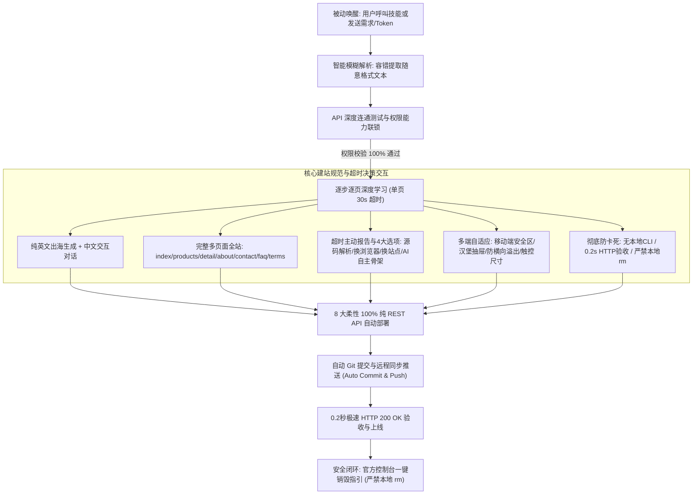

# 关陈 API 梭哈建站：全自动化无服务器自适应多页面建站全景指南

> **技能标识**：`guanchen-api-suoha`  
> **母仓与发布站**：[github.com/z-dm826/skills-dm826](https://github.com/z-dm826/skills-dm826) · [skills.dm826.com](https://skills.dm826.com)  
> **核心定位**：100% 纯 API 驱动、100% 零服务器（Serverless / Edge / Pages）、免购买 VPS、高安全、全自动化的多端自适应**完整多页面英文出海独立站**交付全流程。

---

## 目录
1. [架构概述与核心设计铁律](#1-架构概述与核心设计铁律)
2. [目标网站分步抓取与超时主动交互闭环](#2-目标网站分步抓取与超时主动交互闭环)
3. [⚠️ 部署平台商用合规必读：Vercel 免费版禁商用与替代方案](#3-️-部署平台商用合规必读vercel-免费版禁商用与替代方案)
4. [完整多页面架构标准清单 (严禁单落地页)](#4-完整多页面架构标准清单-严禁单落地页)
5. [启动与唤醒机制 (被动调用，杜绝静默自启)](#5-启动与唤醒机制-被动调用杜绝静默自启)
6. [API 凭证准备与自适应模糊容错解析](#6-api-凭证准备与自适应模糊容错解析)
7. [连通性与权限联锁测试规范](#7-连通性与权限联锁测试规范)
8. [多端响应式与纯英文重构标准](#8-多端响应式与纯英文重构标准)
9. [柔性部署路径全景 (8 种纯 API 模式)](#9-柔性部署路径全景-8-种纯-api-模式)
10. [极速 HTTP 验证与自动提交推送](#10-极速-http-验证与自动提交推送)
11. [⚠️ 安全必做：API 凭证官方后台销毁方案](#11-️-安全必做api-凭证官方后台销毁方案)

---

## 1. 架构概述与核心设计铁律

* **双语严格隔离**：
  - **对话交互**：与用户的所有提示、提问、进度汇报**强制使用简体中文**；
  - **输出物语言**：生成的网站所有前台页面与元数据**默认强制使用地道纯英文（English）**，专为出海独立站设计。
* **逐步逐页深度学习流水线 (30s 宽容超时)**：单页设置 30 秒宽容超时，充分适应跨国网络与复杂 SPA 渲染；采样完毕后显式释放并退出进程（`process.exit(0)`）。
* **超时主动报告与启发式方案推荐**：遇到超时严禁死等或暗中崩溃，必须立即向用户报告详情，并提供 **[A] 快速源码解析、[B] 换浏览器驱动、[C] 更换参考网址、[D] AI 自主骨架生成** 4 大选项由用户决策。
* **100% 纯 REST API 自动化（彻底摒弃本地 CLI）**：全流程严禁调用 `vercel` 等任何 CLI 命令，通过纯 Python `urllib` / Node.js `fetch` 自动完成代码仓库创建、静态资源打包直传、自定义域名绑定、SSL 证书签发与 DNS 智能路由。
* **100% 零服务器（Serverless & Edge）**：摒弃传统 CVM / Lighthouse 云服务器与 Nginx 运维，直接利用腾讯云 EdgeOne Pages、Vercel、Cloudflare Pages 全球 3000+ 边缘节点进行分发。
* **极速构建与轻量化资产**：严禁向海外逐张下载耗时大图，采用高质量 SVG 与现代 CSS 渐变质感，秒级生成完整站点。
* **极速 0.2 秒 HTTP 状态验收**：彻底取消浏览器端截图渲染与 CDP 设备模拟，以 HTTPS GET 请求返回 200 OK 作为唯一验收标准。
* **个性化定制与自动同步闭环**：全面满足用户的自定义要求，构建完成后自动执行更新保存、Git 提交与远程同步推送。

---

## 2. 目标网站分步抓取与超时主动交互闭环

针对学习目标网站（例如 `https://snugglepet.co/`）：

1. **第 1 步：首页探路与全站路由发现（30s 宽容等待）**：
   - 提取 Header 导航分类树、核心品类链接、代表性单品链接与 Footer 站点地图；
2. **第 2 步：精准采样代表性子页面（单页 30s 超时）**：
   - 依次访问 1 个代表性分类列表页、1 个单品详情页和 1 个关于页；
   - 每一页优先等待主体 DOM 渲染（`domcontentloaded`），不等无关追踪代码；
3. **⚠️ 超时主动报告与多路径选择交互（严禁无限挂起）**：
   - 若某页面因跨国网络极慢、反爬盾阻断超过 30 秒未响应，**立即向用户汇报，并给出 4 项决策**：
     * **[选项 A] 切换轻量解析**：使用 Python 直接抓取静态 HTML 源码或 Reader 文本继续建站；
     * **[选项 B] 切换备用浏览器工具**：尝试调用备用浏览器驱动重试；
     * **[选项 C] 更换目标参考站**：由用户提供另一个访问顺畅的参考站点 URL；
     * **[选项 D] 自动骨架生成**：直接根据行业品类（如“宠物用品”），由 AI 自主生成一套高品质的标准多页面独立站架构。

---

## 3. ⚠️ 部署平台商用合规必读：Vercel 免费版禁商用与替代方案

> 🚨 **Vercel 官方服务条款严正提示**：  
> Vercel 官方条款（Fair Use Policy）明确规定 **Hobby（免费个人版）仅限非商业性质的个人业余项目使用，明确禁止用于任何商业营利性网站（包括企业官网、外贸独立站、电商网店、付费获客等）**，一旦被检测到商用流量可能面临封禁或强制账单。

### 商业出海独立站的零成本合规推荐方案：

| 托管方案 | 商业用途支持 | 费用成本 | 带宽流量限制 | 推荐指数 |
| :--- | :--- | :--- | :--- | :--- |
| **Cloudflare Pages (路径七)** | **✅ 官方完全允许商用** | **$0 完全免费** | **无限免费请求与带宽** | 🌟🌟🌟🌟🌟 (出海商业首选) |
| **腾讯云 EdgeOne Pages (路径一/二)** | **✅ 官方完全允许商用** | 基础免费额度 | 全球 3200+ 边缘高速节点 | 🌟🌟🌟🌟 (国内+海外极速) |
| **Vercel Pro (商业升级版)** | **✅ 允许商用** | $20/月/席位 | 1TB+ 高级带宽 | 🌟🌟🌟 (需额外付费预算) |
| **Vercel Hobby (免费个人版)** | **❌ 明确禁止商用** | $0 | 仅限个人非营利测试 | ⚠️ (仅限个人学习) |

> 💡 **最佳实践**：如果是做商业出海站、外贸独立站或企业出海获客，**强烈推荐使用「路径七：GitHub + Cloudflare Pages」**，创建 Token 时直接选择 Cloudflare 官方预设的 **Cloudflare Pages** 模板即可一键拥有账户与 DNS 权限！

---

## 4. 完整多页面架构标准清单 (严禁单落地页)

建站输出物**必须是一个结构完整、导航互通的多页面独立站点（Multi-Page Full Website Architecture）**，严禁仅建单一落地页了事：

1. **`index.html` (Home 首页)**：Hero Banner 核心标语、精选推荐产品（Featured Products）、核心价值主张、买家真实评价（Testimonials）、品牌故事引流与全站导航。
2. **`products.html` (Products Catalog 产品目录页)**：分类过滤筛选 Tab、排序组件、多品类商品网格卡片（配图、标题、价格、评分、单品跳转链接）。
3. **`product-detail.html` (Product Detail 单品详情页)**：多图画廊切换、规格选型（颜色/尺寸）、数量选择器、立即询盘/加购交互、产品参数规格表（Specs）、物流质保说明。
4. **`about.html` (About Us 品牌故事与关于我们)**：品牌起源使命（Mission & Story）、工厂制造与研发实力（Craftsmanship）、核心价值观（Values）与团队展示。
5. **`contact.html` (Contact Us 联系我们与在线询盘)**：多渠道联络方式（邮箱/电话/地址）、带校验的在线留言表单（自动打通飞书 Webhook 或 Serverless API）。
6. **`faq.html` (FAQ 常见问题中心)**：分类手风琴式折叠问答（Shipping, Payment, Returns, Warranty, Product Care）。
7. **`privacy.html` & `terms.html` (Legal Terms 法律合规条款)**：出海合规的标准英文隐私政策与服务条款。

---

## 5. 启动与唤醒机制 (被动调用，杜绝静默自启)

* **严禁静默自启**：技能被克隆/安装后，**必须保持静默就绪状态**，严禁在无用户指令时在后台循环执行或扫描网络，坚决杜绝无谓消耗上下文与 Token。
* **显式激活场景**：
  1. 用户在对话中显式呼叫技能（如：“调用 关陈 API 梭哈建站”、“使用 guanchen-api-suoha 帮我建站”）；
  2. 用户明确表达建站意图，并直接在对话中粘贴了 API 凭证或建站需求；
  3. 本地存在 `api_keys.txt` / `.env` 且用户下发了建站指令。

---

## 6. API 凭证准备与自适应模糊容错解析

> 📄 **配置文件样例**：你可以直接查看并复制 [`api-sample.txt`](https://skills.dm826.com/api-sample.txt) 快速填充凭证与需求。

### 凭证自适应容错提取规则（无需严格固定格式）
用户无论以何种随意格式（如聊天文字、带序号列表、中文冒号、乱序粘贴）提交凭证，AI 均会自动通过特征启发式正则表达式提取：
* **GitHub Token**：匹配 `ghp_[A-Za-z0-9_]{30,}` 或 `github_pat_[A-Za-z0-9_]{40,}`
* **Vercel Token**：匹配 `vcp_[A-Za-z0-9_]{40,}`（或从 `v1:...` 中自动提取有效子串）
* **Cloudflare Token**：匹配 `cfut_[A-Za-z0-9_]{35,}` 或 40 位标准 Token
* **腾讯云 EdgeOne**：自动提取 `AKID...` 开头的 SecretId 与对应的 32 位 SecretKey
* **飞书 Webhook**：自动提取包含 `https://open.feishu.cn/open-apis/bot/v2/hook/...` 的 URL

| 平台 | 凭证类型 | 作用与权限要求 | 官方申请链接 | 销毁直达链接 |
| :--- | :--- | :--- | :--- | :--- |
| **腾讯云** | `SecretId` / `SecretKey` | 必须关联 `QcloudEOFullAccess`（EdgeOne 全权读写） | [腾讯云 CAM 密钥](https://console.cloud.tencent.com/cam/capi) | [销毁腾讯云密钥](https://console.cloud.tencent.com/cam/capi) |
| **GitHub** | `Personal Access Token` | 包含 `repo` 作用域（代码托管与 CI/CD 触发） | [GitHub Tokens](https://github.com/settings/tokens) | [销毁 GitHub Token](https://github.com/settings/tokens) |
| **Vercel** | `API Token` | 项目创建、直传部署与域名绑定权限 | [Vercel Tokens](https://vercel.com/account/settings/tokens) | [销毁 Vercel Token](https://vercel.com/account/settings/tokens) |
| **Cloudflare** | `API Token` | 1. `Zone.DNS: Edit`（解析） 2. `Account.Cloudflare Pages: Edit`（Pages） | [Cloudflare Tokens](https://dash.cloudflare.com/profile/api-tokens) | [销毁 CF Token](https://dash.cloudflare.com/profile/api-tokens) |
| **飞书** | `Webhook URL` | 构建进度与部署上线富文本卡片实时推送 | 飞书客户端内群设置 | 飞书客户端内群设置 |

---

## 7. 连通性与权限联锁测试规范

在执行任何建站与设计逻辑前，系统必须通过只读 API 发起权限深度探测：

1. **防重复校验缓存机制**：
   - 凭证状态与探测结果记录在本地 `work/.api_status.json`，24 小时内哈希未变则跳过实际网络探测。
2. **腾讯云 EdgeOne 探测**：
   - 调用 `teo.tencentcloudapi.com` 的 `DescribeZones`。若返回 `UnauthorizedOperation` 则阻断并提示在 CAM 中绑定 `QcloudEOFullAccess`。
3. **Cloudflare 细分能力联锁 (Capability Interlock)**：
   - **`cf_zone_dns` 探测**：校验 `Zone.DNS: edit` 及目标域名匹配，打标 `cf_zone_dns: true`。
   - **`cf_pages` 探测**：调用 `GET /client/v4/accounts` 及 Pages API：
     - 若返回 200，打标 `cf_pages: true`（解锁 Cloudflare Pages 部署路径）；
     - 若返回 403 / 10000 报错，打标 `cf_pages: false`（降级/锁定 Pages 路径，提示追加账户级权限）。
4. **严格前置红线**：步骤 1 和步骤 2 未通过前，**严禁生成任何原型代码**。

---

## 8. 多端响应式与纯英文重构标准

所有生成的页面强制遵循现代 Web 响应式设计：

1. **纯英文生成标准**：
   - 页面内的所有文本（Hero 标语、产品特性、客户评价、FAQ、表单输入提示 `placeholder`、提交按钮、页脚声明）均以地道英文呈现。
2. **视口与触控规范**：
   - `<meta name="viewport" content="width=device-width, initial-scale=1.0, viewport-fit=cover">`；
   - 适配移动端底部手势条（`padding-bottom: env(safe-area-inset-bottom)`）；
   - 触控目标最小 $\ge 44 \times 44\text{px}$。
3. **响应式断点与布局**：
   - 移动端（`<768px`）自动折叠为可交互的汉堡抽屉导航栏（Drawer）；
   - 复杂表格外包 `overflow-x-auto` 容器或折叠为卡片流；
   - 根节点强制 `overflow-x: hidden`，杜绝横向滚动白边。
4. **动态能力无服务器适配**：
   - **表单提交**：静态站直连 Serverless Function / Cloudflare Worker / 飞书自定义机器人 Webhook 即时推送富文本卡片；
   - **站内搜索**：自动提取文章标题与正文构建本地索引，集成 `Pagefind` / `Fuse.js` 实现零后端客户端即时搜索。
5. **地域网络与资产本地化**：
   - 国内网络环境强制将 Google Fonts、海外公共 CDN JS 库下载并本地化保存到 `work/assets/` 相对路径引用，杜绝白屏超时。

---

## 9. 柔性部署路径全景 (8 种纯 API 模式)

* **[1] 路径一：仅有腾讯云 EdgeOne (纯边缘零服务器直传 · 允许商用)**
  - 调用 EdgeOne Pages REST API 将本地多页面代码直传全球边缘，自动分配域名与 SSL。
* **[2] 路径二：有 GitHub + 腾讯云 EdgeOne Pages (允许商用)**
  - GitHub 托管代码，EdgeOne Pages 关联仓库实现提交自动构建与边缘分发。
* **[3] 路径三：有 GitHub + Vercel (⚠️ Hobby 仅限非商用)**
  - GitHub 托管，Vercel 自动构建并分配 `.vercel.app` 免费临时域名。
* **[4] 路径四：有 GitHub + Vercel + 腾讯云 EdgeOne (国内极致加速)**
  - GitHub 托管，Vercel 构建部署，EdgeOne 负责国内/全球智能 DNS 调度与边缘缓存。
* **[5] 路径五：有 GitHub + Vercel + CF (⚠️ Vercel Hobby 仅限非商用)**
  - 经典 Serverless 架构：GitHub 托管，Vercel 构建，Cloudflare 提供 DNS 代理与网络加速。
* **[6] 路径六：有 Vercel + CF (免 Git 极速直传)**
  - 本地多页面静态资源通过 Vercel Direct Upload API 部署，Cloudflare 配置 CNAME 绑定。
* **[7] 路径七：有 GitHub + Cloudflare Pages (🌟 商业出海首选 · 纯免费无限流量)**
  - 纯 CF 边缘 Pages 托管（强联锁：必须具备 `Account.Cloudflare Pages: Edit` 权限），官方允许商业站点部署。
* **[8] 路径八：有 腾讯云 EdgeOne + CF (多云边缘混合托管)**
  - 页面直传 EdgeOne Pages，Cloudflare 提供 DNS 路由与前置多云安全防护。

---

## 10. 极速 HTTP 验证与自动提交推送

1. **飞书即时通知**：在“开始构建”、“部署成功”、“发生异常”阶段，向飞书群推送格式化状态卡片。
2. **极速 0.2 秒 HTTP 状态验收**：
   - 彻底禁用在部署验收环节调用浏览器工具进行多视口截图渲染或 CDP 模拟；
   - 通过 HTTPS GET 请求探测最终上线的 URL，**返回 `200 OK` 且内容长度正常即宣告验收通过**。
3. **交付闭环**：部署成功后，系统自动弹出默认浏览器打开最终上线的网站首页。
4. **自动 Git 提交与同步推送**：构建与修改完成后，自动执行 `git add . && git commit && git push` 触发部署平台自动热重载。

---

## 11. ⚠️ 安全必做：API 凭证官方后台销毁方案

> **安全核心铁律**：网站部署成功并完成验证后，用于建站的 API Token / Secret 已完成历史使命，**必须立即前往官方控制台销毁或吊销**，防止密钥泄露引发资产被盗用或被恶意篡改！
> 
> **⚠️ 安全红线**：严禁 AI 擅自执行任何 `rm` / `rm -rf` 等本地删除命令。凭证安全销毁完全通过点击官方链接在平台端吊销。

### 各平台官方 API 凭证销毁路径与直达链接

| 平台 | 销毁操作路径 | 官方销毁直达链接 |
| :--- | :--- | :--- |
| **腾讯云** | 控制台 $\rightarrow$ 访问管理 (CAM) $\rightarrow$ 访问密钥 $\rightarrow$ **API 密钥管理** $\rightarrow$ 找到对应的 SecretId 点击「禁用」或「删除」 | [腾讯云 API 密钥销毁](https://console.cloud.tencent.com/cam/capi) |
| **GitHub** | Settings $\rightarrow$ Developer settings $\rightarrow$ Personal access tokens $\rightarrow$ 找到建站 Token 点击「Delete」或「Revoke」 | [GitHub Token 销毁](https://github.com/settings/tokens) |
| **Vercel** | Vercel Dashboard $\rightarrow$ 右上角头像 $\rightarrow$ Account Settings $\rightarrow$ **Tokens** $\rightarrow$ 找到建站 Token 点击「Delete」 | [Vercel Token 销毁](https://vercel.com/account/settings/tokens) |
| **Cloudflare** | Cloudflare Dashboard $\rightarrow$ 右上角个人资料 (My Profile) $\rightarrow$ **API Tokens** $\rightarrow$ 点击右侧 `...` $\rightarrow$ 选择「Delete」永久删除（或「Roll」重新生成使其立即失效） | [Cloudflare Token 销毁](https://dash.cloudflare.com/profile/api-tokens) |
| **飞书** | 飞书群聊 $\rightarrow$ 群设置 $\rightarrow$ **群机器人** $\rightarrow$ 点击进入建站助手机器人 $\rightarrow$ 点击「删除机器人」 | 飞书客户端内群设置 |

---

## 📊 访问统计与仓库状态

  
  
  
  

  © 2026 DM826 Ecosystem · <a href="https://skills.dm826.com">skills.dm826.com</a> · Powered by EdgeOne, Vercel & Cloudflare

